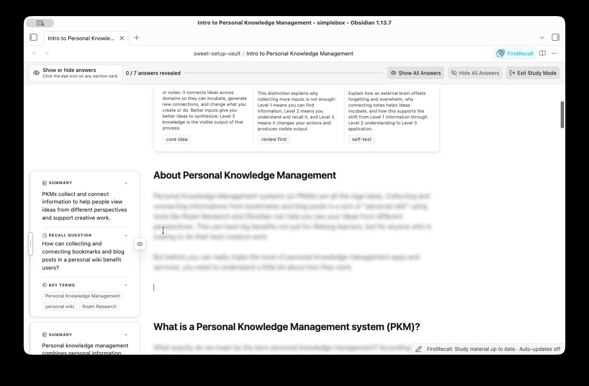
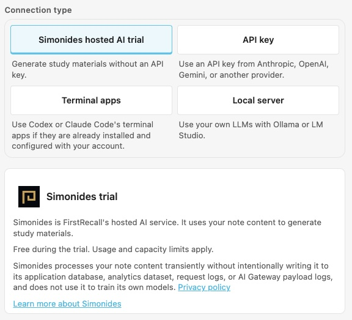
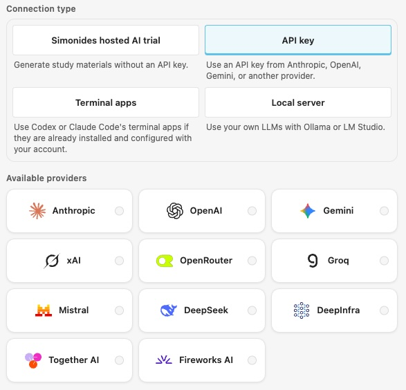
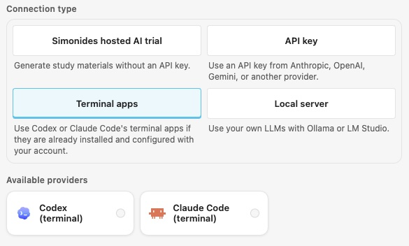
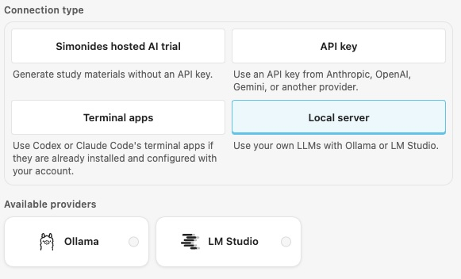
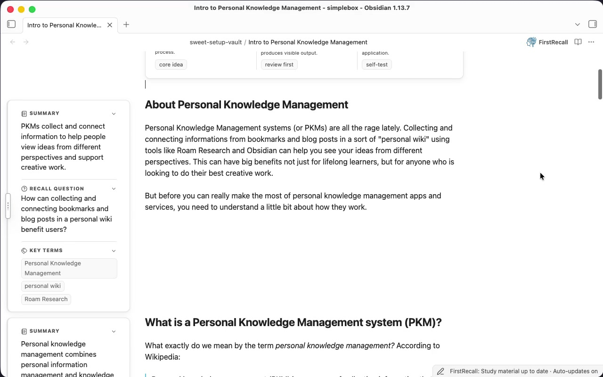
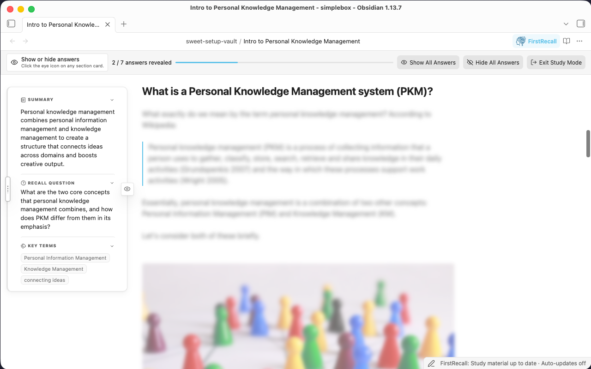
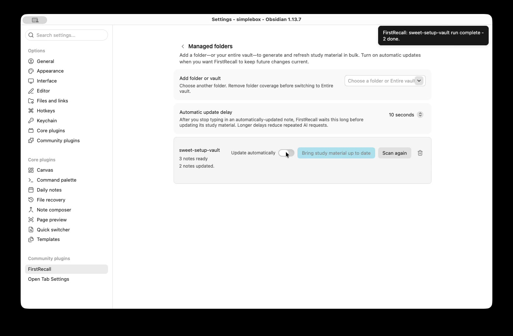

<picture>
  <source media="(prefers-color-scheme: dark)" srcset="https://raw.githubusercontent.com/swartzrock/obsidian-firstrecall-plugin/main/docs/media/fr-logo-dark.png">
  
</picture>

**You highlighted it. You reread it. You still can't recall it.**

Re-reading text feels like learning, but it often just makes a note look familiar.

The FirstRecall plugin turns any Obsidian note into active-recall practice by generating a summary **Note Brief** plus a **section study card** for each section. Turn on **Study Mode** to test your recall with each section's summary, recall question, and key terms, so you can figure out what you actually know (or don't know) ahead of time.

Your Markdown files are never touched. FirstRecall uses your selected AI / LLM provider to generate the **Note Brief** and **section study cards** and caches them inside your Obsidian vault.

[Watch or download: Generate study material and enter Study Mode (MP4, 18 seconds)](docs/media/generate-and-study.mp4)

## Table of Contents

- [Why FirstRecall](#why-firstrecall)
- [Installation](#installation)
- [Quick start](#quick-start)
- [What FirstRecall Adds](#what-firstrecall-adds)
- [More Features](#more-features)
- [How FirstRecall is different](#how-firstrecall-is-different)

## Why FirstRecall

- **Built for recall** While a summary tells you what each section *says*, the recall question actually makes you *retrieve* it. 

  > "Retrieval practice—recalling facts or concepts or events from memory—is a more effective learning strategy than review by rereading."
  >
  > — **Peter C. Brown**, *Make It Stick: The Science of Successful Learning*

  

- **Syncs with your changes**  Avoid stale summaries by turning on automatic updates for your managed folder(s). FirstRecall will update any changed sections after you finish editing.

- **Start with the included trial or run on your LLM** Try FirstRecall without an
  API key, use Anthropic, OpenAI, Gemini, xAI, or another cloud provider with your
  preferred model, or keep generation private with Ollama or LM Studio. The Codex
  and Claude Code terminal tools are also supported.

  - **Simonides hosted AI trial** Generate study materials with Simonides' free, secure hosted AI. Usage limits apply.

    

  - **API key** Use an API key from Anthropic, OpenAI, Gemini, xAI, OpenRouter, Groq, Mistral, DeepSeek, DeepInfra, Together AI, or Fireworks AI.

    

  - **Terminal apps** Use Codex or Claude Code's terminal apps if they are already installed and configured with your account.

    

  - **Local server** Use your own LLMs with Ollama or LM Studio.

    

## Installation

The FirstRecall plugin is designed for Obsidian Desktop v1.11.4 or later (to use Obsidian's   [Secret Storage](https://docs.obsidian.md/plugins/guides/secret-storage) for securely storing API keys)

1. Visit [FirstRecall on the Obsidian community page](https://community.obsidian.md/plugins/first-recall).
2. Click **Add to Obsidian** to open the plugin listing in Obsidian.
3. Click **Install**, then **Enable**.

Open **Settings → FirstRecall** to configure the plugin. On Obsidian 1.13 or later,
use settings search to find a section by its controls—for example, “API key,”
“Parallel requests,” “Show summary,” or “Study text size.” Earlier Obsidian versions
continue to use the existing settings pages.

## Quick start

1. Open **Settings → FirstRecall → AI model**.
2. Choose the included **Simonides hosted AI trial**, or select another provider,
   complete its setup, choose a model, and run **Test connection**.
3. Open a note with headings and select **Generate study material for this
   note** from the FirstRecall dropdown menu. 
4. Select **Study this note** from the FirstRecall dropdown to practice recalling each section before revealing its answer.

## What FirstRecall Adds

Every generated note carries a **Note Brief** — a whole-note overview and review
guidance — plus one **section study card** per eligible heading with a Summary,
Recall Question, and Key Terms. Provider usage and capacity limits may restrict how
many cards are generated in one operation.

### The Note Brief

- A summary of the entire note.
- **Core Idea** the main takeaway from this note.
- **Review First** a recommendation on how to approach studying your note.
- **Self Test** a short question and answer to test your recall for this note.

### Section Study Cards

- **Summary** a concise statement of what the section actually says
- **Recall question** a prompt whose answer lives in that section (the question style is configurable in the **Generate** settings page). Test yourself by selecting **Study this note** from the FirstRecall dropdown.
- **Key Terms** review this evidence and anchor them in your memory for better recall.

[Watch or download: Notes and study cards (MP4, 19 seconds)](docs/media/notes-and-cards.mp4)

## More Features

### Study Mode: Built for Recall

Study Mode hides each recall question's answer until you've attempted it yourself.
It's a temporary practice view — using it never changes what's saved, hidden, or
covered by automatic updates. Select **Study this note** from the FirstRecall dropdown and work through a note's cards revealing them one at a time when you are ready.

### Managed folders: Syncs with your Changes

Add a folder (or your **Entire vault**) as a **managed folder** to make FirstRecall useful past the first week. This enables FirstRecall to:

- **Scan first, generate second.** Adding a folder only scans it — read-only, no
  provider calls — and reports what's missing, outdated, ready, or failed. Nothing
  generates until you choose **Bring study material up to date**.
- **Track freshness per note.** Every note's material is **Current**, **Outdated**,
  **Updating**, or **Failed**, so you always know what's safe to trust.
- **Update itself, if you let it.** Turn on **Update automatically** and FirstRecall
  waits until you stop editing, then regenerates only the Note Brief and the section
  cards actually affected by your change — not the whole note, and never the folders
  you didn't enable.
- **Fail safely.** If an update fails, FirstRecall keeps the last successful material
  visible, marks it outdated, and offers **Retry update** — you're never left with a
  broken card mid-study-session.

[Watch or download: Add a managed folder and update its study material (MP4, 13 seconds)](docs/media/managed-folders.mp4)

### Recall Question & Key Term Exports

Export generated recall questions and key terms to a **Markdown** study sheet or
**Anki-compatible TSV** beside your source note. Anki rows use the question as the
front and key terms as the back, falling back to the section heading when terms
are absent. Exports do not include the Note Brief, summaries, or full source
answers. Existing files are preserved: if the export filename is already taken,
FirstRecall adds ` (1)`, ` (2)`, and so on before the extension until it finds an
unused filename.

### LLM Providers & Models

FirstRecall supports:

- **Included trial:** A Simonides-hosted model with no API key or model setup;
  usage and capacity limits apply
- **Local servers:** Ollama and LM Studio — generation can stay on your machine
  when the server and model run locally; a remote endpoint receives your content
- **Cloud APIs:** Anthropic, OpenAI, Google, xAI, OpenRouter, Groq, Mistral,
  DeepSeek, DeepInfra, Together AI, and Fireworks AI
- **Terminal tools:** Codex and Claude Code

Cloud API keys are stored with Obsidian's Secret Storage API. When using the hosted
trial, a cloud API, or a terminal tool backed by an online account, the selected
service receives the note content needed for generation. Ollama and LM Studio can
keep generation entirely local when connected to a local server.

Copyright (c) 2026 Jason Swartz. FirstRecall is free and open source under the
[GNU General Public License, version 3 only (GPLv3)](license.md). Personal,
workplace, and commercial use are allowed. Distributed copies and modified
versions must comply with GPLv3, including its source-code sharing requirements.

The hosted trial requires no account or API
key; usage and capacity limits apply. Cloud APIs require the provider's account
and API key and may incur usage charges. Terminal tools require their own setup
and authentication; subscription, billing, and usage limits depend on that service.

**Terminal tools and files outside the vault:** FirstRecall launches your installed
Codex or Claude Code executable and passes generation prompts through standard
input. It uses the operating system's temporary directory as the working directory
and may launch your login shell to discover executables on your PATH. These tools
use their own configuration and authentication files outside the vault so they can
run with your existing account. Their file access and network behavior depend on
the tool and its configuration; running a terminal tool does not guarantee offline
generation.

Community review tools report **Direct Filesystem Access** and **Shell Execution**
because the bundled BYOK runtime uses Node's filesystem APIs to locate installed
executables and `child_process` to run the optional terminal providers. These
capabilities are required for Codex CLI and Claude CLI support. Select a cloud API,
the included trial, or a local model server if you do not want to run a terminal
provider.

> 
> **Data Privacy & Third-Party LLM Usage**
>
> The included trial sends the note title, note context, and eligible section content
> to `https://api.simonides.ai` for generation. Requests also include randomly
> generated installation, session, and operation identifiers used to apply usage
> limits and coordinate requests. The installation ID is saved in plugin data and
> reused across sessions. The session ID lasts until the plugin reloads, and each
> request attempt gets a new operation ID. The trial requires no API key, and usage
> and capacity limits apply.
>
> Simonides also processes operational metadata such as request status, token usage,
> latency, and quota information for service operation, abuse prevention, and
> reliability monitoring. Its [privacy policy](https://simonides.ai/privacy)
> explains processing, retention, and third-party services, including Cloudflare.
>
> When using another online provider, your note content is sent to that provider's
> API. You must supply any API key that provider requires. Review the provider's
> privacy policy for its data-retention and model-training practices before enabling
> it.

### Visibility Customization

Click the toggle icon on each **section study card** area to hide it for that section, or hide it for all notes in the **Display** settings.

## How FirstRecall is different

There's no shortage of Obsidian AI plugins. Most fall into two camps, and FirstRecall
deliberately isn't either:

| | Generic AI summarizers  | Flashcard / spaced-repetition  | **FirstRecall** |
| --- | --- | --- | --- |
| What it produces | Free-form summary text | Cards from text *you* select | A Note Brief + section cards, derived automatically from your note's own headings |
| Keeps material current | Manual re-run | Manual re-tag | Managed folders refresh only what changed, automatically |
| Practice mode | None — it's just text to read | Full spaced-repetition scheduling | Study Mode (recall-before-reveal), plus export to a dedicated SRS tool |
| Provider choice | Usually one vendor | Usually one aggregator, or a paid hosted tier | 11 cloud APIs, local models, or a CLI you already use |
| Touches your source note | Often inserts text inline | Stores separately | Never modifies source Markdown — full stop |

Terminology and product language are defined in the
[FirstRecall glossary](./docs/FirstRecall-Glossary.md).
