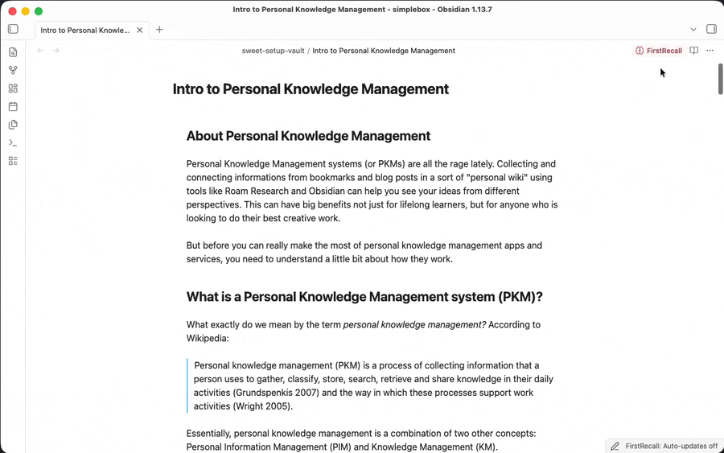
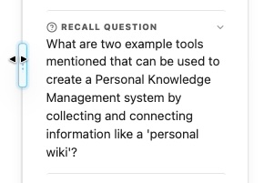
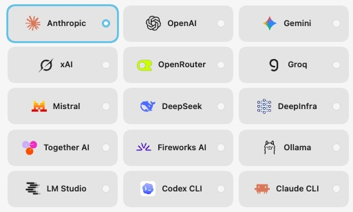
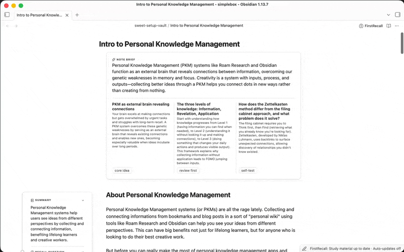
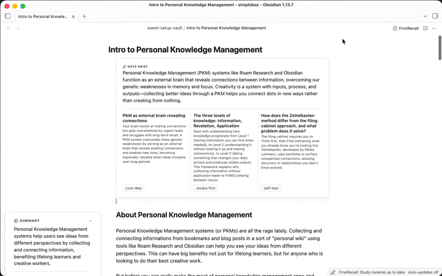

<picture>
  <source media="(prefers-color-scheme: dark)" srcset="docs/media/logo-dark.svg">
  
</picture>


[](https://obsidian.md)
[](#compatibility-notes)
[](https://www.typescriptlang.org/)
[](https://bun.sh/)
[](https://github.com/swartzrock/obsidian-firstrecall-plugin/releases)
[](https://github.com/swartzrock/obsidian-firstrecall-plugin/releases)
[](https://github.com/swartzrock/obsidian-firstrecall-plugin/commits/main)
[](LICENSE)


**You highlighted it. You reread it. You still can't recall it.**

Re-reading text feels like learning, but it often just makes a note look familiar.

The FirstRecall plugin turns any Obsidian note into active-recall practice by generating a summary **Note Brief** plus a **section study card** for each section. Turn on **Study Mode** to test your recall with each section's summary, recall question, and key terms, so you can figure out what you actually know (or don't know) ahead of time.

Your Markdown files are never touched. FirstRecall uses your selected AI / LLM provider to generate the **Note Brief** and **section study cards** and caches them inside your Obsidian vault.



## Table of Contents

- [Why FirstRecall](#why-firstrecall)
- [Installation](#installation)
- [Quick start](#quick-start)
- [What FirstRecall Adds](#what-firstrecall-adds)
- [More Features](#more-features)
- [How FirstRecall is different](#how-firstrecall-is-different)
- [License](#license)

## Why FirstRecall

- **Built for recall** While a summary tells you what each section *says*, the recall question actually makes you *retrieve* it. 

  > "Retrieval practice—recalling facts or concepts or events from memory—is a more effective learning strategy than review by rereading."
  >
  > — **Peter C. Brown**, *Make It Stick: The Science of Successful Learning*

  

- **Syncs with your changes**  Avoid stale summaries by turning on automatic updates for your managed folder(s). FirstRecall will update any changed sections after you finish editing.

- **Runs on Your LLM** Use your Anthropic, OpenAI, Gemini, xAI, or other LLM providers with your preferred model, or even your private LLM using Ollama and LMStudio for maximum privacy (Codex and Claude CLI's are also supported!)

  


## Installation

BRAT is the easiest way to try pre-release Obsidian plugins and keep them updated from GitHub.

1. In Obsidian, install and enable [BRAT](https://github.com/TfTHacker/obsidian42-brat) from Community plugins.
2. Open BRAT settings and choose `Add Beta plugin`.
3. Paste this repository URL:

   ```text
   https://github.com/swartzrock/obsidian-firstrecall-plugin
   ```

## Quick start

1. Open **Settings → FirstRecall → AI model**.
2. Choose a provider, complete its setup, select a model, and run **Test connection**.
3. Open a note with headings and select **Generate study material for this
   note** from the FirstRecall dropdown menu. 
4. Select **Study this note** from the FirstRecall dropdown to practice recalling each section before revealing its answer.


## What FirstRecall Adds

Every generated note carries a **Note Brief** — a whole-note overview and review
guidance — plus one **section study card** per heading with a Summary, Recall Question, and Key Terms. 

### The Note Brief

- A summary of the entire note.
- **Core Idea** the main takeaway from this note.
- **Review First** a recommendation on how to approach studying your note.
- **Self Test** a short question and answer to test your recall for this note.

### Section Study Cards

- **Summary** a concise statement of what the section actually says
- **Recall question** a prompt whose answer lives in that section (the question style is configurable in the **Generate** settings page). Test yourself by selecting **Study this note** from the FirstRecall dropdown.
- **Key Terms** review this evidence and anchor them in your memory for better recall.




## More Features

### Study Mode: Built for Recall

Study Mode hides each recall question's answer until you've attempted it yourself.
It's a temporary practice view — using it never changes what's saved, hidden, or
covered by automatic updates. Select **Study this note** from the FirstRecall dropdown and work through a note's cards revealing them one at a time when you are ready.

### Managed folders: Syncs with your Changes

Add a folder (or your **Entire vault**) as a **managed folder** to make FirstRecall useful past the first week. This enables FirstRecall to:

- **Scan first, generate second.** Adding a folder only scans it — read-only, no
  provider calls — and reports what's missing, outdated, ready, or failed. Nothing
  generates until you choose **Bring study material up to date**.
- **Track freshness per note.** Every note's material is **Current**, **Outdated**,
  **Updating**, or **Failed**, so you always know what's safe to trust.
- **Update itself, if you let it.** Turn on **Update automatically** and FirstRecall
  waits until you stop editing, then regenerates only the Note Brief and the section
  cards actually affected by your change — not the whole note, and never the folders
  you didn't enable.
- **Fail safely.** If an update fails, FirstRecall keeps the last successful material
  visible, marks it outdated, and offers **Retry update** — you're never left with a
  broken card mid-study-session.



### Note Brief & Section Study Card Exports

Helpful if you're using another study tool. FirstRecall can export your generated Note Brief & Section Study Card into **Markdown** or **Anki-compatible TSV** into your Obsidian vault.

### LLM Providers & Models

FirstRecall supports:

- **Local servers:** Ollama and LM Studio — fully offline generation, nothing leaves
  your machine
- **Cloud APIs:** Anthropic, OpenAI, Google, xAI, OpenRouter, Groq, Mistral,
  DeepSeek, DeepInfra, Together AI, and Fireworks AI
- **Desktop CLIs:** Codex CLI and Claude CLI

Cloud API keys are stored with Obsidian's Secret Storage API. When using a cloud API
or a desktop CLI backed by an online account, the selected provider receives the note
content needed for generation. Ollama and LM Studio can keep generation entirely
local when connected to a local server.

### Visibility Customization

Click the toggle icon on each **section study card** area to hide it for that section, or hide it for all notes in the **Display** settings.

## How FirstRecall is different

There's no shortage of Obsidian AI plugins. Most fall into two camps, and FirstRecall
deliberately isn't either:

| | Generic AI summarizers  | Flashcard / spaced-repetition  | **FirstRecall** |
| --- | --- | --- | --- |
| What it produces | Free-form summary text | Cards from text *you* select | A Note Brief + section cards, derived automatically from your note's own headings |
| Keeps material current | Manual re-run | Manual re-tag | Managed folders refresh only what changed, automatically |
| Practice mode | None — it's just text to read | Full spaced-repetition scheduling | Study Mode (recall-before-reveal), plus export to a dedicated SRS tool |
| Provider choice | Usually one vendor | Usually one aggregator, or a paid hosted tier | 11 cloud APIs, local models, or a CLI you already use |
| Touches your source note | Often inserts text inline | Stores separately | Never modifies source Markdown — full stop |


Terminology and product language are defined in the
[FirstRecall glossary](./docs/FirstRecall-Glossary.md).

## License

MIT
