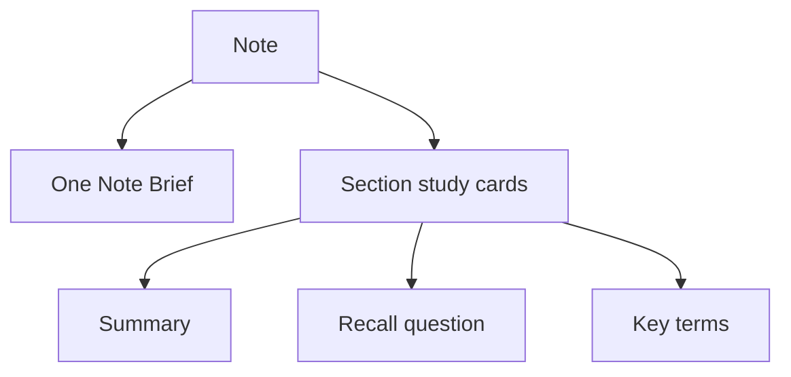

# CueCraft Glossary

CueCraft turns a note into active-recall study material while leaving the source Markdown
unchanged.

## Study material

| Term | Meaning |
| --- | --- |
| **Note** | The Markdown document CueCraft reads as source material. |
| **Note Brief** | The whole-note overview and review guidance shown near the top of a note. CueCraft creates one for the note. |
| **Section study card** | The complete study card for one eligible headed section. |
| **Summary** | A concise statement of what the section says or establishes. |
| **Recall question** | An active-recall prompt whose answer can be recovered from the section. |
| **Key terms** | Short words or phrases that anchor the section's important evidence or vocabulary. |
| **Study Mode** | A temporary practice view that hides answers until they are revealed. It does not change saved visibility or automatic-update settings. |

## Coverage and automatic updates

**Managed folders** defines which notes are available for bulk generation and optional
automatic updates. Select one or more non-overlapping folders, or select **Entire vault**.

Adding a scope only scans it. The scan is read-only, makes no provider requests, and reports
missing, outdated, ready, and failed work. **Bring study material up to date** is
the explicit action that generates missing material and refreshes outdated material.

**Update automatically** is off for every new scope. When enabled, CueCraft waits until
editing pauses and then maintains new or changed study material. It creates cards for new
sections, refreshes changed section cards and the Note Brief, removes cards for deleted
sections, and preserves unchanged cards.

| Term | Meaning |
| --- | --- |
| **Automatic coverage** | The note belongs to an enabled, unpaused scope. CueCraft keeps its study material current after edits. |
| **Manual coverage** | CueCraft updates the note only after an explicit update, retry, or command. |
| **Current** | Generated material reflects the latest source note. |
| **Outdated** | The source changed after the affected study material was generated. |
| **Updating** | CueCraft is generating the work needed for the latest source. |
| **Failed** | The latest update attempt did not finish successfully. CueCraft preserves the last successful material and offers **Retry update**. |

Freshness appears when generated material exists or automatic work is pending. A manual note
with no generated material has manual coverage but no freshness state.

Coverage is independent from presentation. Hiding generated material, hiding a component,
collapsing a section card, or entering Study Mode never disables automatic updates. Scans,
catch-up, automatic maintenance, retries, rendering, and export never modify source Markdown.

## Generation and providers

**Generation** asks the configured model to create study material from the note. The
**provider** is the local runtime, desktop CLI, or cloud service through which CueCraft
accesses that model. With an online provider, the provider receives the note content needed
for generation; adding or scanning a scope does not send note content to a provider.
