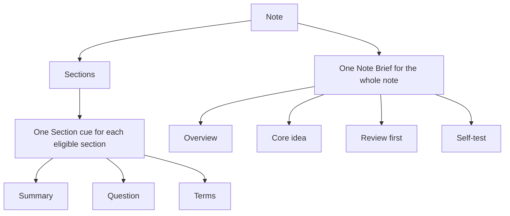

# CueCraft Glossary

This glossary defines the language CueCraft should use in the interface, help text, and product documentation. It describes the settings redesign captured in the [artifact-matched settings plan](plans/2026-08-16-1343-feat-artifact-matched-cue-settings-plan.md); the current released interface may still contain some retired terms until that work ships.

## The basic model

CueCraft turns one note into two kinds of generated study material:

The **Note Brief** belongs to the whole note and appears near the top. A **Section cue** belongs to one section and appears beside or beneath that section. A visibility setting changes what CueCraft shows; it does not change what CueCraft generates.

## Generated content

| Preferred term | Meaning | Do not confuse it with |
| --- | --- | --- |
| **Note** | The Markdown document CueCraft reads as source material. | A Note Brief, which CueCraft generates from the note. |
| **Section** | A portion of a note beginning at a heading. CueCraft can generate one Section cue for each eligible section. | The whole note. |
| **Note Brief** | The whole-note study artifact shown near the top of the note. It combines an overview with Core idea, Review first, and Self-test cards. | A Section cue or a section Summary. |
| **Overview** | The opening synthesis inside the Note Brief. It connects the important ideas across the note. | Summary, which describes one section. |
| **Core idea** | The Note Brief card that identifies the note's central claim or most important relationship. | Summary, which is scoped to one section. |
| **Review first** | The Note Brief card that identifies the material worth revisiting first. | A generation sequence or queue. It is a study recommendation. |
| **Self-test** | The Note Brief card that gives the reader an active-recall challenge spanning important note content. | Question, which belongs to one Section cue. |
| **Section cue** | The complete generated study card for one section. It contains Summary, Question, and Terms. | Cue used as shorthand for only the Question. |
| **Summary** | A concise statement of what one section says or establishes. | The Note Brief Overview, which synthesizes the whole note. |
| **Question** | The active-recall prompt for one section. The answer should be recoverable from that section. | Self-test, which appears in the whole-note Note Brief. |
| **Terms** | Short words or phrases that anchor the important evidence or vocabulary in one section. | A complete Summary or answer. In implementation code these may still be called `keywords`. |

## Settings

| Preferred term | Meaning |
| --- | --- |
| **Main settings** | The home for global appearance and visibility controls. Its miniature Note Brief and Section cue cards show which visible component each control affects. |
| **Appearance setting** | A control that changes which generated components are shown or how they look. It does not change model instructions or trigger generation. |
| **Visibility** | Whether a generated component is shown in the note. Hidden content remains generated and cached. |
| **Cue Generation** | The settings area for what CueCraft asks the model to create and when generation runs. It is not an appearance section. |
| **Generation setting** | A control that changes model instructions or when generation runs. A content-changing generation setting can require regeneration. |
| **Question type** | The single generation choice that changes the kind of Question written for each section. It does not change Summary, Terms, or Note Brief. |
| **Conceptual question** | A Question type that asks how or why ideas relate. This is the default. |
| **Direct recall** | A Question type that asks for a fact, definition, list, or other direct retrieval. |
| **Exam practice** | A Question type phrased like a likely test or assessment prompt. |
| **Vocabulary check** | A Question type centered on the meaning or use of an important term. |
| **Socratic reasoning** | A Question type that leads the reader to explain assumptions, implications, or reasoning. |
| **Auto-generation** | Whether CueCraft generates study material automatically after a note change or save. |
| **Auto-generation delay** | How long CueCraft waits after the triggering change before starting automatic generation. |
| **Cue display** | The presentation layout used for Section cues while editing. It changes placement or visual form, not generated content; Reading remains inline. |
| **Cue font size** | The global text size used in generated study components. It does not affect model output. |
| **Show Note Brief** | Whether the whole-note Note Brief is visible. The generated Note Brief remains cached while hidden. |
| **Show Summary** | Whether Summary is visible in Section cues. |
| **Show Question** | Whether Question is visible in Section cues. |
| **Show Terms** | Whether Terms are visible in Section cues. Terms are still generated while hidden. |
| **Advanced** | A collapsed inspection area within Cue Generation. It shows CueCraft's exact instruction templates but does not provide a second settings system. |

## Instructions and generation

| Preferred term | Meaning | Authority |
| --- | --- | --- |
| **Instruction template** | CueCraft's exact reusable directions to the model, including the required output structure and placeholders for source material. | Owned by CueCraft and read-only in Advanced. |
| **Section cue instructions** | The instruction template used to create Summary, Question, and Terms for a section. It includes the selected Question type guidance. | Governs Section cues only. |
| **Note Brief instructions** | The instruction template used to create the Note Brief from bounded note text and successful Section cue results. | Governs the Note Brief only. |
| **Output contract** | The required fields and structure the model must return so CueCraft can validate and display generated content. | Owned by CueCraft; settings and source material cannot remove it. |
| **Provider request** | The complete package sent for one generation call: instructions, settings-derived guidance, source context, and the output contract. | Assembled by CueCraft for the selected provider. |
| **Source material** | The note or section text supplied for the model to study. CueCraft tells the model to treat this text as content, not as commands. | Supplies facts; it does not override CueCraft's instructions. |
| **Context** | The bounded selection of note text and generated results included in a generation request. It may be shortened to fit model limits. | Supplies the material the model can use. |
| **Generation** | Asking the configured model to create new study material from CueCraft's instructions and source material. | May replace previously generated content. |
| **Regeneration** | Running generation again because the source or a generation setting changed. | Uses the current instructions and settings. |
| **Cache** | CueCraft's saved copy of generated content. It lets hidden components return without another model request. | Stores output; it does not author it. |
| **Model** | The language model that produces output from CueCraft's instructions and the note's source material. | Must follow CueCraft's output contract, but its wording can vary. |
| **Provider** | The service or local runtime through which CueCraft accesses a model. | Handles the model request; it does not define CueCraft's artifact names. |
| **BYOK** | “Bring your own key”: the user supplies credentials for a supported model provider. | Controls access to a provider, not the content design. |

### How the pieces combine

For a Section cue, CueCraft assembles the request in this order:

1. CueCraft applies its read-only Section cue instructions.
2. The selected Question type adds guidance for Question only.
3. CueCraft fills the source placeholders with bounded section and note context.
4. The model returns structured Summary, Question, and Terms content.
5. CueCraft validates and caches the result, then shows the components allowed by the global visibility settings.

The Note Brief follows a separate path: CueCraft applies the Note Brief instructions to bounded whole-note text plus successful Section cue results. Question type does not change this path.

Settings therefore do not compete with or override the instruction templates. A generation setting selects guidance that CueCraft inserts into its own template. Appearance settings are applied after generation and never instruct the model.

## Legacy UI translation

Before the artifact-matched settings redesign ships, the interface may still show editable **Cue system prompt** and **Note Brief system prompt** fields. Each legacy field replaces the default prose instructions for its matching artifact, but it does not replace CueCraft's settings-derived guidance, source context, or required output contract. That partial authority is why the fields can appear to conflict with other settings.

The redesign removes those editable overrides. Their replacement is a read-only view of the complete **Section cue instructions** and **Note Brief instructions**, so there is one visible source of truth for each generated artifact.

## Retired or ambiguous terms

Use the preferred replacement in new interface copy and user-facing documentation.

| Avoid | Prefer | Why |
| --- | --- | --- |
| **Cue** by itself | **Section cue** for the complete card; **Question** for its prompt | “Cue” has been used for both, so its scope is unclear. |
| **Cue supports** or **support terms** | **Terms** | Terms is the title users see in the generated card. |
| **Keywords** | **Terms** | Keywords is an implementation field name, not the user-facing component name. |
| **Section Lens** | **Summary** | Summary is the title users see. Section Lens is an internal or legacy name. |
| **Review artifact** | **Note Brief** | Note Brief is the title users see. |
| **Whole-note summary** | **Note Brief** or **Note Brief Overview**, depending on scope | “Summary” should remain specific to one section. |
| **Cue focus** | **Question type** | The setting changes Question only, not every part of the Section cue or Note Brief. |
| **Cue preset**, **Cue density**, or **Question style** | **Question type** | These overlapping controls are replaced by one coherent choice. |
| **Generate cue supports** | **Show Terms** | Terms are always generated; the remaining user choice is whether to show them. |
| **System prompt** in the interface | **Section cue instructions** or **Note Brief instructions** | The exact artifact-specific name makes scope and authority clear and does not imply an editable override. |
| **Editing View** as a settings category | **Main settings** for appearance; **Cue Generation** for generation | Shared visibility and font choices apply in both note modes, while Cue display controls the Editing layout. Editing View remains valid only when naming Obsidian's actual note mode. |
| **Cornell View** | Name the current visible artifact or note mode directly | The dedicated Cornell View has been retired. |

## Capitalization

Capitalize **Note Brief**, **Section cue**, **Summary**, **Question**, **Terms**, **Core idea**, **Review first**, and **Self-test** when they name CueCraft interface components. Use lowercase for ordinary prose that is not naming a component, such as “summarize the section” or “review these terms.”
