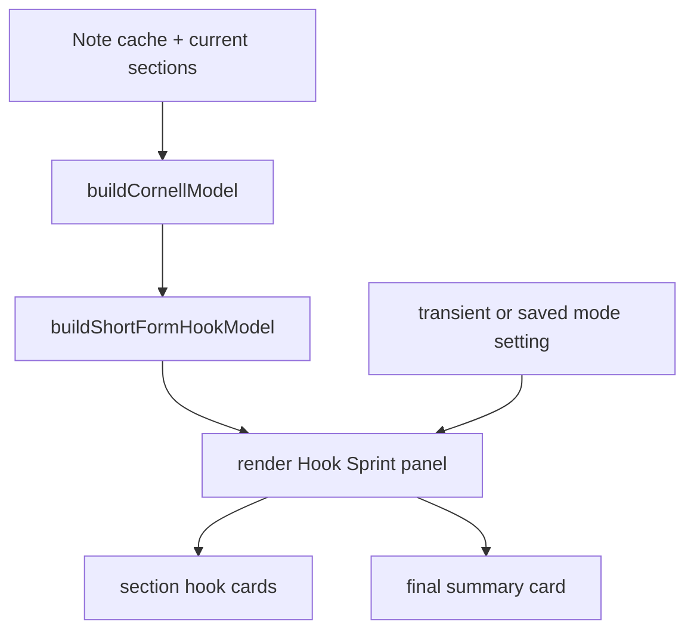

# Short-Form Hook Mode Implementation Plan

## Summary

Implement Short-Form Hook Mode as an opt-in, high-energy Study Mode surface that turns cached CueCraft questions into compact left-margin recall prompts with a bottom-of-page summary card. The rollout should start with display-only transformations over existing cache fields, then add interaction, persistence, and evaluation instrumentation only after the prototype proves useful.

## Problem Frame

The origin brainstorm frames Short-Form Hook Mode as a sprint mode, not a replacement for calm Cornell reading. The mode should make active-recall questions more memorable while preserving answer intent, keep default cards focused on the recall prompt, and convert the note summary into a bottom synthesis card. It must preserve CueCraft's non-destructive promise, keep text as selectable HTML, and use existing generated fields before changing provider contracts.

## Requirements

- R1. The mode must be opt-in from Study Mode or a display control and must not change the default Cornell reading surface.
- R2. The first implementation must render from existing cached `question`, `keywords`, `summary`, `learningObjective`, `confidence`, and section identity fields without changing cached Markdown or requiring a new provider response shape.
- R3. Each hook card must preserve the original question's answer intent even when the displayed phrasing is shortened or intensified.
- R4. Keyword supports must stay out of the default compact card; any hint behavior should be secondary so the rail remains small enough to align with sections.
- R5. The note summary must render as a final title-card-style synthesis after section cards.
- R6. The surface must keep primary question, keyword, and summary text as readable, selectable HTML text with theme-safe contrast.
- R7. The mode must degrade gracefully for sections with missing cues, failed cues, too few keywords, or missing summaries.
- R8. Success must be evaluated phase by phase against recall, comprehension, retention, theme safety, and carrying-cost signals from the origin document.

## Scope Boundaries

### In scope

- A new Short-Form Hook Mode inside the existing Cornell/Study Mode experience.
- Display-only hook phrasing derived from current cue text in the initial phases.
- Optional secondary hint behavior, not visible support beats in the default card.
- A final summary card using the current cached summary and learning objective.
- Unit tests for pure presentation helpers and DOM-oriented rendering tests where the repo already supports them.

### Deferred for later

- Provider prompt/schema changes for model-generated hook variants.
- Spaced-repetition scheduling, scoring, or durable learner performance analytics.
- CodeMirror inline placement for the hook sprint surface.
- Replacing Cornell Classic or calm Study Mode.

### Out of scope

- Mutating note Markdown to store hook cards.
- Rendering question or summary text only inside raster images or non-selectable SVG text.
- Making high-energy styling the default reading experience.

## Key Technical Decisions

- KTD1. Build a separate presentation model before rendering: add pure helpers near `src/cornell.ts` so hook-card wording, compact-card sizing, empty-state behavior, and summary-card placement can be tested without Obsidian DOM.
- KTD2. Treat hook phrasing as a deterministic display transform in phases 1-2: use lightweight normalization and punctuation rules over the original question, not an AI rewrite, so the first build keeps carrying cost low and preserves answer intent.
- KTD3. Mount the sprint as a mode inside `CornellView`: reuse the existing target-note resolution, cache join, Study Mode state, reveal-all behavior, and display-control patterns rather than creating a second Obsidian view type.
- KTD4. Store mode preference only after the prototype is validated: begin with transient in-view state, then promote to settings if users need persistence across sessions.
- KTD5. Keep CSS responsible for energy, not semantics: DOM should expose question/support/summary elements plainly, while `styles.css` supplies vertical cards, motion-safe emphasis, contrast tokens, and responsive behavior.
- KTD6. Evaluate with both automated and human signals: automated tests prove non-destructive rendering and state behavior; manual/UX checks prove recall usefulness, theme safety, and whether the high-energy mode is worth carrying forward.

## High-Level Technical Design

The design keeps data flow one-way. Current cache data joins to live sections through the existing Cornell model, then a new hook presentation model adapts that data for the sprint surface. Rendering remains a non-destructive Obsidian layer.

## Visual Design Specification

The design direction is documented as a self-contained HTML mockup at `docs/designs/short-form-hook-mode.html`, with a screenshot-style SVG artifact at `docs/screenshots/short-form-hook-mode-design.svg`. The visual thesis is warm, safe learning energy inside Obsidian constraints: a left-margin cue rail, one compact hook card per note section, no default support beats, a bottom-of-page summary card, and a single explainer graph that defines alignment and quiet status icons.

- **Entry surface:** Hook Mode appears in the editor left margin as an opt-in Study Mode cue rail, not as the default Cornell view and not as a standalone phone sprint. The toolbar should describe it as a review sprint so learners understand they are switching energy levels.
- **Card anatomy:** Each note section gets a small card vertically aligned beside the Markdown body. The card contains the transformed hook title and a quiet status icon only; it should not show section indexes, support beats, or loud status words by default. The original question remains in the presentation model for fidelity checks and accessibility metadata.
- **Hint treatment:** Keyword hints are removed from the default card design to reduce clutter. If later interaction needs hints, they should appear in a secondary detail/reveal state rather than the always-visible rail card.
- **Final summary card:** The note summary appears at the bottom of the page after the note content, not in the left rail. It should feel like synthesis, not another hint.
- **Theme translation:** Production CSS should express this through Obsidian variables first (`--background-*`, `--text-*`, `--interactive-accent`) and only use custom fallbacks for the demo page. The default Hook Mode palette should stay warm and learning-safe: parchment backgrounds, amber/honey section cards, calm teal synthesis cards, readable mid-weight hook typography, and high-contrast text.
- **Label explanation:** The design mockup includes a single graph card explaining that vertical alignment maps cards to Markdown sections, small icons mark current versus upcoming sections, support beats are intentionally omitted, and the summary appears below the note.
- **Motion:** Use one subtle card entrance or focus-icon transition, gated by `prefers-reduced-motion`. Do not animate text in a way that prevents selection or reading.

## Implementation Phases and Success Evaluation

### Phase 1. Display-only hook prototype

**Goal:** Prove the visual sprint can render useful hook cards from existing cue data without changing cache shape or provider contracts.

**Implementation units**

- U1. Add pure hook presentation helpers.
  - **Files:** `src/short-form-hook.ts`, `src/short-form-hook.test.ts`, possibly `src/cornell.ts` if shared types belong there.
  - **Patterns:** Follow the pure-model style used by `buildCornellModel`, `buildCornellSupportPresentation`, and `buildCornellTakeawayPresentation`.
  - **Test scenarios:**
    - A normal cue question becomes a hook title while the original question remains available for accessibility/title metadata.
    - Empty, whitespace-only, or missing questions do not create normal hook cards.
    - Keywords remain available to future secondary hint behavior but are not rendered in the default compact card.
    - Missing summary produces no final card or a clearly labeled empty state.
    - Confidence and section ids pass through for styling and reveal state.
- U2. Render a read-only Hook Sprint surface in `CornellView` behind a temporary in-view toggle.
  - **Files:** `src/cornell-view.ts`, `styles.css`, `src/short-form-hook.test.ts` or existing view tests if available.
  - **Patterns:** Reuse current toolbar/display-row controls and `createEl` DOM construction.
  - **Test scenarios:**
    - Existing Cornell rendering remains unchanged when Hook Mode is off.
    - Hook Mode renders one card per usable cue plus a summary card when summary exists.
    - Failed cues render a compact unavailable/regen state instead of disappearing silently.
    - DOM text content is selectable HTML text, not canvas or image text.

**Success evaluation**

- **Recall signal:** In a small manual pass over 3-5 notes, the user can attempt each question from the hook card before reading the note body.
- **Comprehension signal:** The card still points to the same answer as the original cached question; no more than one reviewed card per test note feels misleading.
- **Theme safety signal:** Light theme, dark theme, and one community theme keep hook, support, and summary text readable.
- **Carrying-cost signal:** No cache migration, provider schema change, or Markdown mutation is required.
- **Automated gate:** `bun run test`, `bun run typecheck`, and `bun run lint` pass.

### Phase 2. Recall interaction and optional hints

**Goal:** Turn the prototype from a visual skin into an active recall rail by coordinating card focus with Study Mode reveal behavior while keeping hints out of the default compact card.

**Implementation units**

- U3. Add per-card focus and optional hint state.
  - **Files:** `src/cornell-view.ts`, `src/short-form-hook.ts`, `src/short-form-hook.test.ts`.
  - **Patterns:** Mirror existing `revealed`, `revealAll`, and `buildCornellAnswerPresentation` behavior.
  - **Test scenarios:**
    - In Study Mode, compact cards show only the hook title and state by default.
    - Tapping a card focuses or scrolls to the matching note section without revealing the note body.
    - Reveal-all exposes note-side answers consistently without adding clutter to the compact rail cards.
    - Leaving Study Mode resets transient reveal state.
- U4. Add keyboard and accessibility behavior for hook cards.
  - **Files:** `src/cornell-view.ts`, `styles.css`.
  - **Patterns:** Use native buttons where interaction exists; avoid div-only click targets.
  - **Test scenarios:**
    - Keyboard users can move between cards and reveal answers.
    - Buttons or links have labels that distinguish focus-section from reveal-answer behavior.
    - Reduced-motion preferences disable or soften animation.

**Success evaluation**

- **Recall signal:** During a timed sprint, the learner can answer from the compact hook card before revealing the note body.
- **Comprehension signal:** After reviewing the section, the learner can explain how the section content answers the compact hook.
- **Usability signal:** The user can complete a sprint with mouse only and keyboard only.
- **Theme/accessibility signal:** Focus rings, contrast, and reduced-motion behavior remain visible across tested themes.
- **Automated gate:** Existing tests plus interaction-oriented tests pass, with no regression in Cornell Study Mode tests.

### Phase 3. Productized mode selection and persistence

**Goal:** Make Hook Mode discoverable without making the default experience louder.

**Implementation units**

- U5. Add a stable mode selector to settings and/or the Cornell display row.
  - **Files:** `src/settings.ts`, `src/main.ts`, `src/cornell-view.ts`, `src/settings.test.ts` if present, `styles.css`.
  - **Patterns:** Follow current display settings for Cornell style, cue column width, font size, and cue accent.
  - **Test scenarios:**
    - Existing users default to calm Cornell/Study Mode.
    - Changing the mode in the display row updates the open view immediately.
    - Saved settings load a persisted Hook Mode preference if the product decision is to persist it.
    - Settings copy identifies Hook Mode as a review sprint, not a reading default.
- U6. Add polished responsive styling.
  - **Files:** `styles.css`.
  - **Patterns:** Reuse `cuecraft-cornell-*` naming or add `cuecraft-hook-*` classes under the same view root.
  - **Test scenarios:**
    - Narrow panes render vertical cards without horizontal overflow.
    - Long questions wrap within the compact card without breaking vertical section alignment.
    - Compact chips and keyword-off settings degrade predictably.

**Success evaluation**

- **Discoverability signal:** A tester can find and enter Hook Mode from the Cornell view without reading documentation.
- **Default-safety signal:** A tester opening Cornell normally still sees the calm surface unless they opt in.
- **Retention signal:** After leaving and returning to a note later, the user can use the hook sprint to reconstruct the note's major sections.
- **Regression signal:** Existing reading-mode cue widgets and Cornell display controls still behave as before.
- **Automated gate:** Settings default/normalization tests, view-render tests, `bun run test`, `bun run typecheck`, and `bun run lint` pass.

### Phase 4. Evaluation loop and optional generated hook copy

**Goal:** Decide whether deterministic hooks are good enough or whether CueCraft should ask providers for explicit short-form hook variants.

**Implementation units**

- U7. Add a lightweight evaluation fixture or internal dogfood checklist.
  - **Files:** `docs/evaluation/short-form-hook-mode.md`, possibly `src/short-form-hook.fixtures.ts` if reusable test fixtures help.
  - **Test scenarios:**
    - Checklist covers recall before reveal, compact-card alignment, summary-card synthesis, theme safety, and misleading-hook incidents.
    - Evaluation can be repeated on multiple notes without changing production code.
- U8. If needed, plan a provider-contract extension for generated hook variants.
  - **Files:** future plan only; likely `src/schema.ts`, provider prompt files, cache migration/compatibility tests.
  - **Gate:** Do not implement until deterministic display transforms fail the phase-4 success threshold.

**Success evaluation**

- **Recall threshold:** On a representative set of personal notes, Hook Mode improves attempted-answer rate over the plain cue card in observed sessions.
- **Comprehension threshold:** Users can explain how the section content answers most sampled hook cards.
- **Misleading-copy threshold:** Fewer than 10% of sampled hook titles distort the original question's answer intent; if higher, generated hook variants or stricter transforms need a separate plan.
- **Carrying-cost threshold:** Maintenance burden stays localized to presentation helpers, Cornell rendering, styles, and optional settings.

## Acceptance Examples

- AE1. Given cached section cues, when Hook Mode is off, then the Cornell view renders as it does today and does not show hook cards.
- AE2. Given cached section cues and Hook Mode is on, when a learner opens a note, then the hook sprint renders from cache without modifying Markdown content.
- AE3. Given Study Mode is active, when the learner scans the left rail, then each compact hook card remains small enough to align with its section and does not show support beats by default.
- AE4. Given a failed cue section, when Hook Mode renders, then the sprint shows a compact failed/regenerate state and keeps the rest of the sprint usable.
- AE5. Given a cached summary, when the learner reaches the end of the sprint, then a final title card displays the study takeaway as selectable HTML text.
- AE6. Given a theme change, when Hook Mode renders, then hook, keyword, and summary text remain readable in light theme, dark theme, and one community theme.

## System-Wide Impact

The work should remain mostly inside the Cornell presentation layer. It touches cache data only as a read-only input and should not change parser behavior, provider construction, cue generation, or note Markdown. If later phases introduce generated hook copy, that becomes a separate provider-contract and cache-compatibility project rather than a continuation of the display-only rollout.

## Risks and Dependencies

| Risk | Mitigation |
| --- | --- |
| Hook phrasing changes answer intent | Keep original question available in the model, test deterministic transforms, and sample manually before productizing. |
| High-energy styling harms calm reading | Keep Hook Mode opt-in and off by default. |
| Hint content clutters the rail | Keep support beats out of the default card and reserve hints for a secondary detail state if needed. |
| Obsidian themes break contrast | Use CSS variables, readable fallback colors, and manual theme checks as phase gates. |
| Settings surface becomes cluttered | Start with transient toggle; persist only if validation shows repeated use. |

## Sources / Research

- `docs/brainstorms/2026-06-18-graphical-study-surfaces-requirements.html` defines Short-Form Hook Mode, acceptance examples, key decisions, scope, and success criteria.
- `src/cornell.ts` provides the pure Cornell model and presentation-helper patterns this plan extends.
- `src/cornell-view.ts` owns the existing Cornell view, Study Mode state, display row, reveal behavior, and summary rendering.
- `src/cue-extension.ts` shows the current non-destructive CodeMirror widget approach for cue display.
- `src/settings.ts` owns current display and appearance settings patterns.
- `styles.css` carries the current Cornell visual system and should carry Hook Mode layout/styling.
- `docs/plans/2026-06-12-001-feat-cornell-view-polish-plan.md` records recent Cornell display-control and visual-polish direction.
