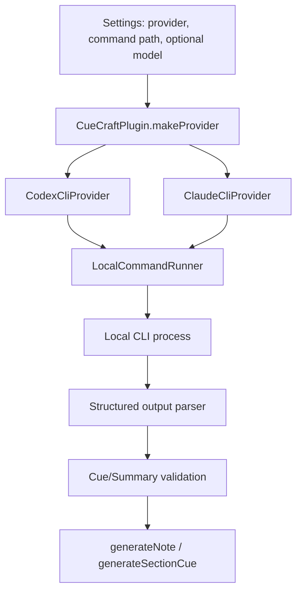
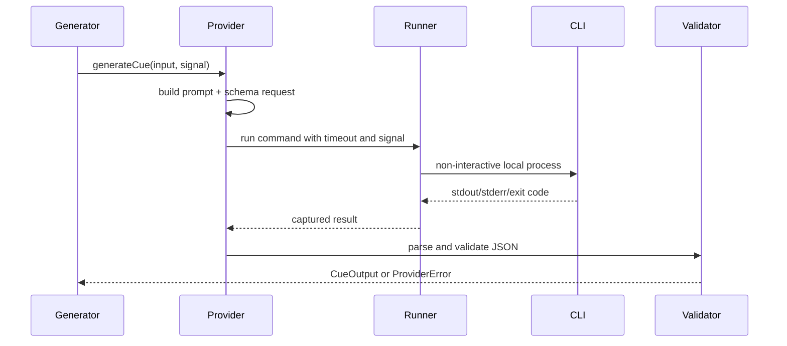

# feat: Add local Codex and Claude CLI providers

## Summary

Add Codex CLI and Claude CLI as desktop-only CueCraft providers that generate the same validated cue and summary objects as Ollama and cloud providers. The first slice calls the user's installed CLIs non-interactively, detects local setup/auth readiness, and keeps richer interactive agent sessions out of scope.

---

## Problem Frame

CueCraft already supports API-key providers and Ollama, but the roadmap explicitly calls out "hard providers" such as Claude Code after the provider abstraction has matured. The current provider seam is mature enough: generation goes through `AiProvider`, output validation is centralized in provider implementations, setup status is provider-specific, and the settings UI already handles local and cloud provider differences.

The user wants support for local Codex and Claude CLIs in addition to API-key providers. That means CueCraft should use the user's local CLI authentication and installed binaries, not ask for another API key or silently fall back to direct vendor APIs.

---

## Requirements

- R1. CueCraft offers Codex CLI and Claude CLI as selectable AI providers without changing existing provider behavior.
- R2. Each CLI provider can generate section cues and note summaries that pass the existing `CueOutput` and `SummaryOutput` schemas.
- R3. CLI setup detects whether the configured command exists and whether the CLI is authenticated enough to run a non-interactive request.
- R4. CLI generation is cancellable, bounded, and reports user-readable failures instead of raw process output.
- R5. CLI providers do not modify vault notes, read arbitrary vault files, or open interactive approval prompts during CueCraft generation.
- R6. Settings copy makes clear that local CLI providers use the user's local CLI account/session and may still send note text to the vendor service behind that CLI.
- R7. Existing API-key providers, OpenRouter, and Ollama keep their current settings, connection checks, model refresh behavior, and tests.

---

## Key Technical Decisions

- KTD1. Use direct CLI adapters for the first implementation: the feature is scoped to calling the user's installed `codex` and `claude` commands, so the plan should not add SDK dependencies that bundle or abstract away the local CLI/auth surface.
- KTD2. Add a shared local process runner: both CLI providers need the same timeout, cancellation, stdout/stderr capture, JSON extraction, and error mapping behavior. The runner should execute a command with an argv array and stdin, never through shell interpolation.
- KTD3. Run CLI generation in a restricted provider mode: pass note content through prompts/stdin, run from a minimal working directory, disable or deny tool use where the CLI supports it, and request structured output rather than letting the agent inspect files.
- KTD4. Clamp CLI provider concurrency to one request at a time: spawning several coding-agent CLI processes in parallel would be expensive, hard to cancel cleanly, and more likely to hit local/session limits.
- KTD5. Keep model selection optional for CLI providers: users may rely on their CLI defaults, while advanced users can set a model override when the CLI supports it. Setup status should treat an empty CLI model override as a valid "CLI default" model choice, not as a missing model.
- KTD6. Treat official SDKs as researched alternatives, not first-pass dependencies: `@openai/codex-sdk` and `@anthropic-ai/claude-agent-sdk` exist, but the Codex SDK wraps its CLI package and the Claude Agent SDK is positioned around API-key based SDK usage rather than the local Claude Code login flow.

---

## High-Level Technical Design

The design keeps CLI process handling below the provider layer. `generator.ts` should only learn about an optional provider concurrency cap; it should not know which provider is backed by HTTP, SDK calls, Ollama, or a local process.

---

## Scope Boundaries

### In Scope

- Add Codex CLI and Claude CLI provider IDs, settings fields, provider factory branches, and setup status support.
- Add local command execution infrastructure with test doubles.
- Add non-interactive cue and summary generation for both CLIs.
- Add setup/test connection behavior that detects missing commands, unauthenticated CLIs, and generation probe failures.
- Update docs to describe CLI provider setup, privacy posture, and limitations.

### Deferred to Follow-Up Work

- Interactive coding-agent sessions, TTY handoff, long-lived session resume, and streaming progress beyond CueCraft's existing generation progress.
- Bundling either official SDK package into the plugin.
- CLI-managed installation, login, token creation, or account setup.
- Mobile support.
- Local VM / Transformers.js provider work from the older roadmap.

---

## Implementation Units

### U1. Extend Provider Identity and Setup Status

- **Goal:** Add stable settings and setup-state support for `codex-cli` and `claude-cli`.
- **Requirements:** R1, R3, R7.
- **Dependencies:** None.
- **Files:** `src/settings.ts`, `src/provider-setup-status.ts`, `tests/settings.test.ts`, `tests/provider-setup-status.test.ts`.
- **Approach:** Extend `ProviderId`, setup status unions/maps, provider display names, selected model labels, and defaults with command path fields plus optional model fields. CLI providers should use command path as the credential fingerprint. For model snapshots, use the configured override when present and a stable CLI-default sentinel when blank so "use my CLI default" does not look like incomplete setup.
- **Patterns to follow:** Existing Ollama local-provider setup, cloud provider model/key status derivation, and provider-specific display labels in `settings.ts`.
- **Test scenarios:**
  - Given `provider: "codex-cli"` with a command path and no model override, `deriveProviderSetupStatus` reports `keySaved: true`, `modelSelected: true`, and untested connection using the CLI-default sentinel.
  - Given a verified Codex CLI setup, changing the command path marks the connection stale.
  - Given a verified Claude CLI setup, changing the optional model marks the connection stale.
  - Existing Ollama and cloud-provider setup status tests still pass unchanged.
- **Verification:** Provider status derives independently for CLI and existing providers, and no existing provider ID behavior regresses.

### U2. Add a Local Command Runner

- **Goal:** Provide a small injectable process runner for local CLI providers.
- **Requirements:** R4, R5.
- **Dependencies:** U1.
- **Files:** `src/providers/local-command-runner.ts`, `tests/local-command-runner.test.ts`.
- **Approach:** Wrap child-process execution behind an interface that accepts command, arguments, stdin/prompt text, working directory, timeout, and abort signal. Use `spawn`/`execFile`-style argv execution instead of shell commands. Capture stdout/stderr separately, normalize nonzero exits and timeouts into `ProviderError`, and make tests use fake process behavior rather than launching real CLIs.
- **Execution note:** Implement this unit test-first because process cancellation and timeout behavior are the riskiest local edge cases.
- **Patterns to follow:** Existing injectable `HttpClient` and `ObjectGenerator` test seams in provider tests.
- **Test scenarios:**
  - Given a fake successful process with JSON stdout, the runner returns stdout, stderr, and exit status.
  - Given a nonzero exit with stderr, the runner returns a user-readable error that includes a short stderr excerpt.
  - Given an abort signal before completion, the runner stops the process and reports cancellation without hanging.
  - Given a timeout, the runner terminates the process and reports a timeout message.
  - Given a missing command error, the runner maps it to setup guidance instead of an uncaught exception.
  - Given prompt text or model values containing shell metacharacters, the runner passes them as stdin/argv data rather than expanding them through a shell.
- **Verification:** Provider tests can exercise CLI behavior without shelling out to real `codex` or `claude`.

### U3. Implement Codex CLI Provider

- **Goal:** Add an `AiProvider` implementation for Codex CLI.
- **Requirements:** R2, R3, R4, R5, R6.
- **Dependencies:** U1, U2.
- **Files:** `src/providers/codex-cli-provider.ts`, `tests/codex-cli-provider.test.ts`.
- **Approach:** Build cue and summary prompts from the same guidance used by Ollama and AI SDK providers, request a schema-constrained final response through Codex's non-interactive execution path, parse the final structured response, and validate with the existing schemas. Connection checks should detect command availability and use Codex login/doctor status or a tiny structured generation probe when needed.
- **Technical design:** Directional contract only: Codex provider should prefer `codex exec` with JSON/event output and output-schema support, plus read-only/no-persistence style safeguards when available.
- **Patterns to follow:** `OllamaProvider` repair/validation flow, `AiSdkProvider` prompt guidance, and local help findings from `codex exec --help`.
- **Test scenarios:**
  - Given valid Codex structured output for a cue, `generateCue` returns a validated `CueOutput`.
  - Given malformed structured output, `generateCue` performs the same one-repair behavior as other providers or surfaces a validation error if repair fails.
  - Given valid summary output, `generateSummary` returns a validated `SummaryOutput`.
  - Given command-not-found from the runner, `testConnection` reports that Codex CLI is not available and names the configured command.
  - Given unauthenticated status output or a failing probe, `testConnection` reports setup guidance without marking the provider verified.
  - Given a configured model, the command arguments include the model override; given no model, CLI defaults are used.
- **Verification:** Codex CLI can be selected through provider factory tests and produces schema-valid outputs through mocked runner responses.

### U4. Implement Claude CLI Provider

- **Goal:** Add an `AiProvider` implementation for Claude CLI.
- **Requirements:** R2, R3, R4, R5, R6.
- **Dependencies:** U1, U2.
- **Files:** `src/providers/claude-cli-provider.ts`, `tests/claude-cli-provider.test.ts`.
- **Approach:** Build cue and summary prompts from existing shared guidance, request non-interactive JSON or schema-backed output from Claude CLI, parse the result payload, and validate with existing schemas. Connection checks should use `claude auth status` where possible and fall back to a small structured generation probe when status is insufficient.
- **Technical design:** Directional contract only: Claude provider should prefer print/non-interactive mode, JSON output, JSON schema, no session persistence, no tool access, and non-interactive permission behavior.
- **Patterns to follow:** `AnthropicProvider` model-label handling where useful, `AiSdkProvider` prompt guidance, and local help findings from `claude --help` and `claude auth status --help`.
- **Test scenarios:**
  - Given valid Claude structured output for a cue, `generateCue` returns a validated `CueOutput`.
  - Given Claude JSON output that wraps the result in a result envelope, the provider extracts the structured payload correctly.
  - Given malformed output, the provider retries/repairs once or reports a validation error without affecting other sections.
  - Given unauthenticated auth status, `testConnection` reports that the user should log in through Claude CLI.
  - Given a configured model, the command arguments include the model override; given no model, CLI defaults are used.
  - Given a runner timeout or cancellation, errors map to existing provider failure semantics.
- **Verification:** Claude CLI provider behavior is covered with runner fakes and does not depend on a live Anthropic account in tests.

### U5. Wire Providers into Runtime, Settings, and Concurrency

- **Goal:** Make the CLI providers selectable and safe during normal cue generation.
- **Requirements:** R1, R4, R6, R7.
- **Dependencies:** U1, U2, U3, U4.
- **Files:** `src/main.ts`, `src/settings.ts`, `src/providers/types.ts`, `src/generator.ts`, `src/parallel-requests-guidance.ts`, `tests/main.test.ts`, `tests/generator.test.ts`, `tests/parallel-requests-guidance.test.ts`.
- **Approach:** Add provider factory branches, render CLI-specific credential/model settings, and clamp CLI-backed generation to one section request at a time through an optional provider concurrency cap. Settings should explain command path, optional model override, local-account usage, and generated text privacy.
- **Patterns to follow:** Existing provider dropdown, `renderProviderCredentialSettings`, `renderProviderModelSettings`, `formatParallelRequestsDescription`, and `generateNote` bounded batching.
- **Test scenarios:**
  - Selecting Codex CLI creates a `CodexCliProvider` with command path and optional model from settings.
  - Selecting Claude CLI creates a `ClaudeCliProvider` with command path and optional model from settings.
  - Existing providers still create their prior provider classes.
  - Given `sectionConcurrency: 5` and a CLI provider concurrency cap of one, `generateNote` runs section generation sequentially.
  - Given a non-CLI provider, the existing configured concurrency behavior is preserved.
  - Settings copy/status tests cover the CLI provider labels and setup summary.
- **Verification:** The settings UI can switch among all providers, and generation does not spawn multiple local CLI processes for a single note.

### U6. Document CLI Provider Setup and Limitations

- **Goal:** Update user-facing docs so the new providers are understandable and supportable.
- **Requirements:** R6, R7.
- **Dependencies:** U3, U4, U5.
- **Files:** `README.md`, `docs/CueCraft-Progress.md`.
- **Approach:** Describe CLI providers as desktop-only local process integrations that use the user's installed/authenticated CLI. Document that CueCraft does not install or log in to Codex/Claude, that note text is still sent through the selected CLI's vendor/service path, and that interactive agent sessions are not part of this feature.
- **Patterns to follow:** README's current provider overview and progress doc's completed/remaining work style.
- **Test scenarios:** Test expectation: none -- documentation-only update.
- **Verification:** Documentation names setup steps, privacy expectations, and deferred limitations without contradicting existing API-key provider docs.

---

## System-Wide Impact

- Provider setup now has three categories: local server (`ollama`), cloud API key providers, and local CLI process providers.
- Generation orchestration gets one new cross-provider concept: a provider may cap effective concurrency below the user's global slider.
- Desktop-only remains unchanged and becomes more important because CLI execution depends on Node/Electron local process access.
- The privacy story needs sharper copy: "local CLI" does not mean "local model"; Codex and Claude CLIs may call remote services with the user's account.

---

## Risks & Dependencies

- **CLI output contracts may drift:** Codex and Claude CLI flags are active surfaces. Mitigate with provider tests around runner inputs and parser behavior, plus docs that name supported CLI versions observed during planning.
- **Obsidian-launched PATH may differ from shell PATH:** Mitigate with configurable command path fields and clear command-not-found setup guidance.
- **CLI processes may hang or prompt interactively:** Mitigate with non-interactive flags, no-tool/read-only posture where available, timeout, cancellation, and sequential CLI concurrency.
- **SDK packages could look tempting but shift the auth model:** Keep first pass direct-to-local-CLI and revisit SDKs only if later work needs streaming, sessions, or richer event handling.
- **Generated note content leaves the vault through the CLI account:** Mitigate with explicit settings and README copy.

---

## Sources & Research

- `src/providers/types.ts` defines the `AiProvider` contract used by every generation path.
- `src/providers/ollama-provider.ts` shows local-provider validation, repair, and connection-test patterns.
- `src/providers/ai-sdk-provider.ts` centralizes cloud-provider prompt guidance, schema validation, retry, and user-readable errors.
- `src/main.ts` builds providers through `makeProvider` and wraps Obsidian `requestUrl` for HTTP/fetch providers.
- `src/settings.ts` owns provider selection, setup status, model refresh, and connection testing UI.
- `docs/CueCraft-MVP-Scope.md` already defers Claude Code-style hard providers until after the main provider abstraction is proven.
- Local CLI checks found `codex-cli 0.142.0-alpha.6` and `Claude Code 2.1.170` installed, with non-interactive and structured-output oriented flags available.
- OpenAI's Codex repository documents `@openai/codex-sdk`, a TypeScript SDK that wraps the `codex` CLI and exchanges JSONL events over stdin/stdout: <https://raw.githubusercontent.com/openai/codex/main/sdk/typescript/README.md>.
- npm metadata confirmed `@openai/codex-sdk@0.141.0`, `@openai/codex@0.141.0`, `@anthropic-ai/claude-agent-sdk@0.3.185`, and `@anthropic-ai/claude-code@2.1.185` are published packages.
- Anthropic's Agent SDK docs describe `@anthropic-ai/claude-agent-sdk`, TypeScript support, structured outputs, and the API-key authentication posture: <https://code.claude.com/docs/en/agent-sdk/overview> and <https://code.claude.com/docs/en/agent-sdk/structured-outputs>.
- Anthropic's CLI reference documents `claude auth status --json` and non-interactive CLI options relevant to setup checks and generation: <https://code.claude.com/docs/en/cli-reference>.

---

## Open Questions

- Whether to record observed minimum CLI versions as hard compatibility checks or only as documentation. The implementation can start permissive and tighten only if tests or manual checks reveal incompatible output shapes.
- Whether Codex CLI can fully disable tool/file access in the current installed version. If not, run it from an empty isolated working directory and rely on prompt/schema constraints plus read-only sandboxing where available.
