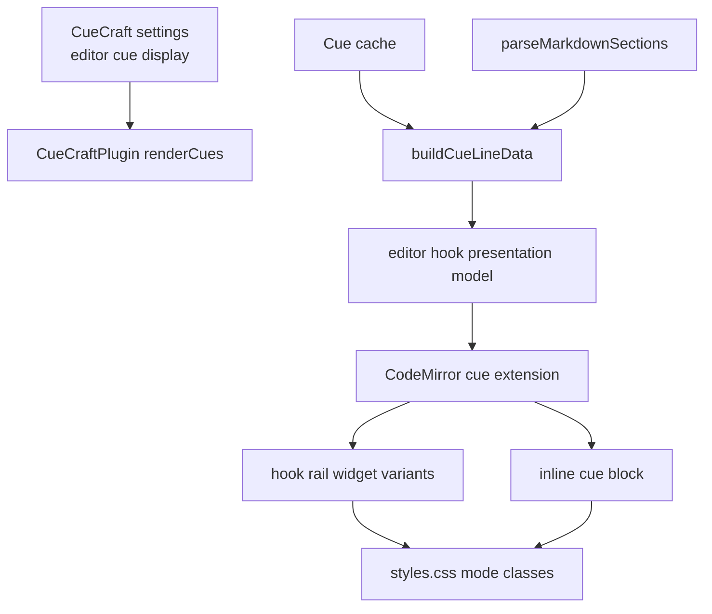
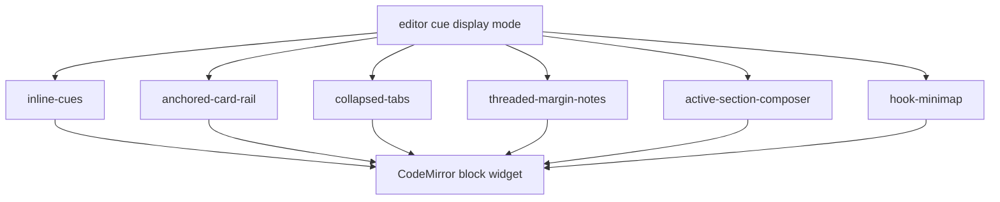

# feat: Add inline editor hook rail styles

## Summary

Add a normal-editor cue display setting that lets users choose between today's inline cue blocks and five hook rail styles from `docs/ideation/2026-06-24-inline-hook-rail-editor-designs.html`. The work keeps Cornell and Reading views intact while making the colorful hook rail available where users already write: the Obsidian CodeMirror editor.

---

## Problem Frame

The Cornell and Hook Rail views are memorable, but they ask users to leave the editing surface. The normal edit view already has section-anchored inline cues through CodeMirror decorations, so the lowest-friction path is to turn that existing editor layer into a configurable cue surface without changing Markdown, cue generation, cache shape, or provider behavior.

The upstream brainstorm requires graphical study surfaces to be non-destructive, readable as selectable HTML, theme-safe, and powered by existing generated fields first. This plan narrows that broad surface work to editor-integrated hook rails with a settings dropdown.

---

## Requirements

**Editor display behavior**

- R1. The normal editor offers a persisted dropdown for editor cue display with options for existing inline cues and the five hook rail styles.
- R2. Existing inline cue blocks remain the default display so current users keep the same editing experience after upgrade.
- R3. Every editor cue display renders from existing section and cache data without provider, schema, or cache migrations.
- R4. Changing the editor cue display refreshes the active editor immediately when a Markdown view is open.
- R5. Cornell display mode, Reading mode display, cue generation, regeneration, clear, and study behavior remain unchanged.

**Hook rail variants**

- R6. Anchored card rail shows colorful section-aligned hook cards in the editor's left-side visual rail.
- R7. Collapsed color tabs shows compact left tabs by default and exposes one readable peek for the active or focused cue.
- R8. Threaded margin notes shows calmer connected margin notes that preserve scanability while reducing visual weight.
- R9. Active-section composer emphasizes the section being edited or reviewed and treats other hooks as supporting context.
- R10. Hook minimap shows a compact section overview with a focused popout for the active hook.

**Compatibility and quality**

- R11. Hook rail text remains selectable/readable HTML and does not rely on canvas, rasterized text, or Markdown mutation.
- R12. Hook rail widgets preserve current section anchoring behavior when headings move, sections are empty, cue errors exist, or keywords are hidden.
- R13. All styles remain usable in light and dark themes, narrow panes, long questions, and reduced-motion environments.
- R14. Tests cover settings validation, display-mode model behavior, CodeMirror widget output, and existing inline cue regressions.

---

## Scope Boundaries

### In Scope

- A new editor cue display setting that is separate from the Cornell display mode setting.
- CodeMirror decoration/widget rendering for five editor hook rail styles plus the existing inline style.
- CSS for light Obsidian editor pages, theme variables, narrow editor panes, and reduced-motion behavior.
- Evaluation documentation for comparing all five styles inside normal edit mode.

### Deferred to Follow-Up Work

- Automatic cue generation while the user types. This plan can show stale, missing, or failed cue states, but it does not add live provider calls.
- New generated cue fields, cache migrations, confidence recalculation, or prompt changes.
- Native GitHub sub-issue relationships beyond issue-body backlinks and parent checklists.
- Reading view hook rail parity beyond preserving existing behavior.

### Outside This Product's Identity

- Replacing Obsidian's editor with a custom note canvas.
- Moving study surfaces away from local-first Obsidian workflows.

---

## Key Technical Decisions

- KTD1. Separate editor display mode from Cornell display mode: Cornell's `classic` versus `hook` setting names review-view layout, while the new setting names the normal editor's CodeMirror cue surface.
- KTD2. Keep inline cues as the default: the upgrade remains conservative, and users opt into stronger visual energy through settings.
- KTD3. Share one editor hook presentation model: the five styles are render policies over the same section-anchored cue data, avoiding five independent feature engines.
- KTD4. Use CodeMirror decorations and widgets: the existing editor cue layer already updates from cache and document state without mutating Markdown.
- KTD5. Reuse short-form hook concepts, not Cornell layout machinery: `src/short-form-hook.ts` carries useful title density and hook-card vocabulary, but editor placement should stay owned by the editor cue extension.
- KTD6. Treat Active-section composer as display-only: it can highlight current, stale, missing, or failed cues but must not imply automatic provider generation while typing.
- KTD7. Refresh editor cues through plugin-level orchestration: settings changes should trigger the same active-editor cue refresh path used after generation and active-file changes.

---

## High-Level Technical Design

---

## Implementation Units

### U1. Add editor cue display setting contract

- **Goal:** Introduce a typed setting and option list for normal-editor cue displays.
- **Requirements:** R1, R2, R3.
- **Dependencies:** None.
- **Files:** `src/settings.ts`, `src/cornell-display.ts`, `tests/settings.test.ts`, `tests/cornell-display.test.ts` if display option tests are split.
- **Approach:** Add a new editor-specific display union and option metadata. Keep `cornellDisplayMode` unchanged and add a default of existing inline cues. Validate loaded settings so unknown values fall back to the default.
- **Patterns to follow:** `src/cornell-display.ts` for small option metadata; `src/reading-cues.ts` for display setting validation; `src/settings.ts` for dropdown persistence.
- **Test scenarios:**
  - Loading settings without the new key uses inline cues.
  - Loading an invalid editor display value falls back to inline cues.
  - The option list exposes exactly six values: inline plus the five hook rail styles.
  - Cornell display values still validate independently from editor display values.
- **Verification:** The settings model is type-safe, default-preserving, and independent from Cornell display mode.

### U2. Build shared editor hook rail presentation model

- **Goal:** Convert existing cue line data into a reusable model that all editor hook variants can render.
- **Requirements:** R3, R6, R7, R8, R9, R10, R12.
- **Dependencies:** U1.
- **Files:** `src/editor-hook-rail.ts`, `src/cue-extension.ts`, `src/short-form-hook.ts`, `tests/editor-hook-rail.test.ts`, `tests/short-form-hook.test.ts`.
- **Approach:** Keep `buildCueLineData` as the source of section anchoring, then add a pure model layer that derives hook title, tone, density, keyword visibility, status, and active/focus metadata. Reuse short-form hook helpers where they fit, and keep editor-specific placement state out of Cornell models.
- **Patterns to follow:** `src/cue-extension.ts` for line-resolved cue data; `src/short-form-hook.ts` for hook title and density behavior; `tests/cue-extension.test.ts` for cache-to-section edge cases.
- **Test scenarios:**
  - Cue rows with questions and keywords produce model cards with stable section identity and line numbers.
  - Long questions receive density metadata without truncating the source text in the model.
  - Failed cues remain visible as failed hook states.
  - Empty-body and never-generated sections follow existing skip behavior.
  - Hidden keyword settings remove keywords from the model.
- **Verification:** A pure model test suite proves all five variants can read one shared representation.

### U3. Render editor cue styles through CodeMirror widgets

- **Goal:** Extend the cue extension so the selected editor display controls widget DOM shape and mode classes.
- **Requirements:** R1, R4, R6, R7, R8, R9, R10, R11, R12.
- **Dependencies:** U1, U2.
- **Files:** `src/cue-extension.ts`, `src/main.ts`, `tests/cue-extension.test.ts`, `tests/editor-hook-rail.test.ts`.
- **Approach:** Expand the cue extension payload to include display mode and model metadata. Keep the existing inline widget path as the default. Add variant-specific DOM builders that emit semantic classes and readable text, with `data-*` attributes only for styling and tests.
- **Patterns to follow:** Existing `CueWidget` block-widget rendering; `setCuesEffect` refresh behavior; `renderCues(file)` orchestration in `src/main.ts`.
- **Test scenarios:**
  - Inline mode produces the same cue DOM as today.
  - Each hook rail style produces a distinct root class and readable question text.
  - Keyword-hidden settings suppress keyword nodes in every display style.
  - Error cue data renders an accessible failed state instead of dropping the section.
  - Re-resolving shifted headings keeps widgets attached to current heading lines.
- **Verification:** Existing cue-extension tests still pass, and new widget-output tests distinguish all six display modes.

### U4. Add hook rail editor styling

- **Goal:** Style the five hook rail variants so they work inside a light Obsidian CodeMirror editor while remaining theme-safe.
- **Requirements:** R6, R7, R8, R9, R10, R11, R13.
- **Dependencies:** U2, U3.
- **Files:** `styles.css`, `docs/evaluation/inline-editor-hook-rails.md`.
- **Approach:** Add editor-scoped classes for rail width, card colors, active/focused states, narrow-pane fallbacks, reduced-motion behavior, and dark-theme contrast. Use Obsidian CSS variables for text, borders, backgrounds, and accent handling.
- **Patterns to follow:** Existing `.cuecraft-cue` editor styling; `.cuecraft-hook-mode` and `.cuecraft-hook-card` styling for hook visual language; Obsidian theme variables already used in `styles.css`.
- **Test scenarios:** Test expectation: none -- this unit is visual CSS. Verification is covered by manual evaluation and widget class tests in U3.
- **Verification:** Manual review confirms no editor text overlap, readable long questions, dark/light contrast, and useful behavior below narrow pane widths.

### U5. Wire settings UI and editor refresh lifecycle

- **Goal:** Expose the new dropdown in settings and refresh the active editor when it changes.
- **Requirements:** R1, R4, R5.
- **Dependencies:** U1, U3.
- **Files:** `src/settings.ts`, `src/main.ts`, `tests/settings.test.ts`, `tests/cue-extension.test.ts`.
- **Approach:** Add an "Editor cue display" dropdown near existing cue appearance settings. Save the selected value, then call a plugin method that refreshes active editor cues without refreshing Cornell views unless Cornell settings changed.
- **Patterns to follow:** Existing Cornell display dropdown and `refreshCornellViews()` call site; existing `renderCues(file)` refresh path after generation and active-file changes.
- **Test scenarios:**
  - The settings tab renders the new dropdown with all six labels.
  - Changing the editor cue display saves settings.
  - Changing the editor cue display requests an active-editor cue refresh.
  - Changing Cornell display still refreshes Cornell views and does not depend on the editor display setting.
- **Verification:** The dropdown is persisted and immediately affects the open Markdown editor.

### U6. Document evaluation and rollout checks

- **Goal:** Give implementers and reviewers a repeatable way to compare the five editor hook styles.
- **Requirements:** R13, R14.
- **Dependencies:** U3, U4, U5.
- **Files:** `docs/evaluation/inline-editor-hook-rails.md`, `docs/CueCraft-Progress.md` if progress notes are already being updated for this feature.
- **Approach:** Add a concise evaluation checklist covering the same note content across all display modes, with light/dark theme checks, long question checks, hidden keyword checks, and narrow-pane checks.
- **Patterns to follow:** Existing evaluation docs and progress notes, if present.
- **Test scenarios:** Test expectation: none -- this unit creates reviewer documentation and manual verification criteria.
- **Verification:** A reviewer can use the document to compare all six editor cue displays without reading the implementation.

---

## Acceptance Examples

- AE1. Given an existing note with cached cues, when the user opens the normal editor with default settings, then the existing inline cues appear as they do today.
- AE2. Given the user selects "Anchored card rail", when the same note is open in edit mode, then colorful left-side hook cards align with their sections without changing the Markdown source.
- AE3. Given the user selects "Collapsed color tabs", when the cursor moves between sections, then the active section exposes a readable hook peek while other sections remain compact.
- AE4. Given a cached cue failed to generate, when any hook rail style is active, then that section shows a failed cue state rather than disappearing.
- AE5. Given keywords are hidden in settings, when any editor cue display is active, then questions remain visible and keywords are not rendered.
- AE6. Given a narrow editor pane or dark theme, when any hook rail style is selected, then note text and hook text remain readable and non-overlapping.

---

## System-Wide Impact

This change affects the editor cue surface, settings persistence, and shared styling. It intentionally avoids cue generation, provider selection, cache shape, Cornell review rendering, Reading view rendering, and Markdown file content. The main cross-interface risk is naming confusion between Cornell's display mode and the new editor cue display, so the settings labels and type names should stay distinct.

---

## Risks & Dependencies

- **CodeMirror layout constraints:** Left-side visual rails can collide with editor content, gutters, folding affordances, or narrow panes. Mitigate with editor-scoped widths, fallbacks, and manual viewport checks.
- **Over-visualizing the editor:** Colorful hooks could distract during normal writing. Mitigate by keeping inline cues as default and making high-energy styles opt-in.
- **Mode semantics drift:** Active-section composer could be mistaken for live generation. Mitigate with display-only stale/missing states and no provider calls.
- **Theme variance:** Community themes may redefine editor colors. Mitigate with Obsidian variables and contrast-oriented manual checks.

---

## Sources / Research

- `docs/brainstorms/2026-06-18-graphical-study-surfaces-requirements.html` defines non-destructive graphical surfaces, existing-field-first scope, selectable text, and theme readability.
- `docs/ideation/2026-06-24-inline-hook-rail-editor-designs.html` supplies the five editor-integrated design variants.
- `docs/plans/2026-06-19-001-feat-short-form-hook-mode-plan.md` frames Hook Rail as an opt-in review surface and defers CodeMirror placement to later work.
- `src/cue-extension.ts` contains the existing CodeMirror cue decoration model and widget path.
- `src/main.ts` owns active-file editor cue refresh orchestration.
- `src/settings.ts`, `src/cornell-display.ts`, and `src/reading-cues.ts` show existing display-setting patterns.
- `src/short-form-hook.ts` contains reusable hook-card title, density, and focus concepts.
- `styles.css` contains existing inline cue and hook-mode styling to extend.
