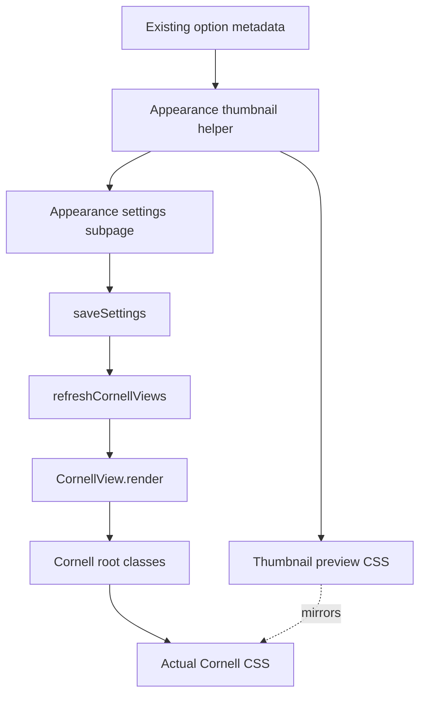

# feat: Add Appearance thumbnail controls

## Summary

Replace the Appearance settings dropdowns and color dots with thumbnail buttons that show faithful miniatures of the Cornell display choices. The work should preserve the existing generated data and Cornell rendering contracts while making visual settings understandable before the user selects them.

---

## Problem Frame

The current Appearance subpage asks users to choose visual options from text labels, then inspect the Cornell view to understand the difference. This is especially weak for style choices such as Handwritten, Legal Pad, and Hook rail because their value is visual. The ideation deck proved the interaction shape, but the thumbnails need to look like the real options rather than generic abstract bars.

The existing binary settings also need attention before they become visual controls: `showCueBorder` and `compactChips` persist values, but they do not live-refresh open Cornell views and the compact-supports effect is too subtle because supports are rendered as one joined span.

---

## Requirements

### Visual Picker Behavior

- R1. Appearance settings use thumbnail button groups for Cornell display mode, Cornell view style, cue column width, cue font size, and cue accent color.
- R2. Each thumbnail shows a faithful miniature of the actual option, including Cornell cue-card shape, Hook rail card shape, style preset details, width changes, font-size changes, and accent tint.
- R3. Handwritten is visible as a first-class thumbnail option instead of being hidden inside a dropdown.
- R4. Selected options are visually obvious and expose accessible selected state through native button semantics and `aria-pressed`.

### Settings Behavior

- R5. Changing any Appearance option persists the setting, updates the setting description or selection state, and refreshes open Cornell views immediately.
- R6. `showCueBorder` and `compactChips` either have visible effects worth previewing or are demoted out of the main thumbnail grid before the redesign ships.
- R7. The redesign reuses existing option sources of truth for display mode, style, layout, and accent values.

### Quality

- R8. The thumbnail grid remains usable in narrow Obsidian settings panes, light and dark themes, long labels, keyboard navigation, and high-contrast focus states.
- R9. Tests cover setting contracts, thumbnail DOM behavior, preview metadata, and regressions around the existing Cornell rendering classes.

---

## Key Technical Decisions

- KTD1. Build thumbnail buttons as Obsidian settings DOM, not a new framework component: `src/settings.ts` already owns settings rendering, and native buttons fit accessibility and keyboard behavior.
- KTD2. Use CSS/DOM miniatures instead of screenshot assets: previews stay theme-aware, scale cleanly, and can be tested as structured DOM.
- KTD3. Keep option lists authoritative in the existing modules: `src/cornell-display.ts`, `src/cornell-style.ts`, `src/cornell-layout.ts`, and `src/cornell-accent.ts` remain the value sources.
- KTD4. Add one small Appearance-thumbnail helper when implementation starts: preview rendering is large enough to keep out of the main settings method, and a helper can be tested with JSDOM.
- KTD5. Fix low-signal toggles before previewing them: a thumbnail button that previews a no-op or barely visible option would repeat the current problem in a prettier shape.

---

## High-Level Technical Design

The helper should render a group from a typed option list, current value, preview recipe, and `onSelect` callback. Production Cornell rendering remains class-driven; thumbnail CSS mirrors the visible outcomes without becoming the source of truth for Cornell layout.

---

## Implementation Units

### U1. Make existing Appearance effects honest

- **Goal:** Characterize and fix the current low-signal Appearance settings before replacing the controls.
- **Requirements:** R5, R6, R9.
- **Dependencies:** None.
- **Files:** `src/settings.ts`, `src/cornell-view.ts`, `styles.css`, `tests/cornell.test.ts`, `tests/settings.test.ts`.
- **Approach:** Add live refresh for `showCueBorder` and `compactChips`. Make compact supports visually meaningful by rendering supports as separate terms or by demoting the setting if separate support rendering creates more UI noise than value. Keep `showCueBorder` scoped to the Cornell cue-column divider, not hook cards.
- **Patterns to follow:** `renderAccentSwatches` in `src/settings.ts` for save-and-refresh behavior; `CornellView.render` class toggles in `src/cornell-view.ts`; support text styles in `styles.css`.
- **Test scenarios:**
  - Toggling `showCueBorder` persists the value and open Cornell views receive the refresh path used by other Appearance controls.
  - Toggling `compactChips` persists the value and open Cornell views receive the refresh path used by other Appearance controls.
  - Support rendering exposes separate terms when compact support styling depends on per-term spacing.
  - Cornell root classes still include `cuecraft-cornell-no-border` and `cuecraft-cornell-compact-chips` only for the matching settings.
- **Verification:** The two binary controls either produce visible, refreshable Cornell changes or are explicitly removed from the main thumbnail-button scope.

### U2. Add an Appearance thumbnail button primitive

- **Goal:** Introduce a focused DOM helper for rendering selectable thumbnail groups in the settings UI.
- **Requirements:** R1, R4, R7, R8, R9.
- **Dependencies:** U1.
- **Files:** `src/appearance-thumbnail-controls.ts`, `src/settings.ts`, `styles.css`, `tests/appearance-thumbnail-controls.test.ts`.
- **Approach:** Create a small helper that renders a labeled group of native buttons with preview slots, labels, optional descriptions, selected state, and a callback. Keep the helper generic over string option IDs but local to Appearance needs.
- **Patterns to follow:** `renderAccentSwatches` for custom settings controls; `model-combobox.test.ts` and `short-form-hook.test.ts` for JSDOM-based DOM assertions.
- **Test scenarios:**
  - Rendering a group marks exactly the current option as selected with class state and `aria-pressed="true"`.
  - Clicking a non-selected option invokes `onSelect` with that option ID and does not invoke callbacks for disabled or repeated state paths.
  - Long labels such as "Cornell Classic" and "Handwritten" remain text content, not `title`-only labels.
  - The helper emits stable classes that CSS can target without depending on translated text.
- **Verification:** Settings can render thumbnail groups without duplicating click, selected-state, and accessibility code per setting.

### U3. Build faithful thumbnail preview recipes

- **Goal:** Encode real miniatures for each current Appearance option.
- **Requirements:** R2, R3, R7, R8, R9.
- **Dependencies:** U2.
- **Files:** `src/appearance-thumbnail-controls.ts`, `styles.css`, `tests/appearance-thumbnail-controls.test.ts`, `docs/ideation/2026-06-24-appearance-thumbnail-buttons-redesign.html`.
- **Approach:** Add preview recipe types for display mode, style, width, font size, and accent. Use a shared sample cue question and support terms so only the option's visual treatment changes. Mirror the screenshots from this thread: Cornell as a pale card with a left accent rail and support text; Hook rail as a rounded teal card; style presets as their actual card treatments; width and font size as measured layout changes; accent as rail and support tint changes.
- **Patterns to follow:** Existing CSS classes under `.cuecraft-style-*`, `.cuecraft-cuewidth-*`, `.cuecraft-cuefont-*`, and `.cuecraft-accent-*` in `styles.css`; the ideation deck for layout intent, not as production code.
- **Test scenarios:**
  - Every option from `CORNELL_DISPLAY_MODES`, `CORNELL_STYLES`, `CUE_COLUMN_WIDTHS`, `CUE_FONT_SIZES`, and `CUE_ACCENTS` has a preview recipe.
  - Handwritten preview uses handwriting-specific styling and is reachable as a button in the rendered group.
  - Accent previews apply the chosen accent to both the rail and support text.
  - Width previews render three distinct cue-card widths from the same sample content.
  - Font-size previews render three distinct question text sizes from the same sample content.
- **Verification:** No Appearance option falls back to generic bars, and adding a new option fails tests until a preview is added.

### U4. Replace the Appearance controls with thumbnail groups

- **Goal:** Swap the current dropdowns and accent swatches for the thumbnail button groups.
- **Requirements:** R1, R3, R4, R5, R7, R8.
- **Dependencies:** U1, U2, U3.
- **Files:** `src/settings.ts`, `styles.css`, `tests/appearance-thumbnail-controls.test.ts`, `tests/settings.test.ts`.
- **Approach:** Replace the five visual Appearance controls with thumbnail groups. On selection, update the same settings keys, call `saveSettings`, call `refreshCornellViews`, and repaint only the affected group or subpage. Preserve `appearanceSummary()` output so the settings home card remains accurate.
- **Patterns to follow:** Current Appearance dropdown handlers in `src/settings.ts`; `renderAccentSwatches` repaint loop; Obsidian `Setting` containers for name and description layout.
- **Test scenarios:**
  - Selecting Hook rail updates `cornellDisplayMode` to `hook`, saves settings, refreshes Cornell views, and marks Hook rail selected.
  - Selecting Handwritten updates `cornellStyle` to `handwritten`, saves settings, refreshes Cornell views, and marks Handwritten selected.
  - Selecting each width, font size, and accent updates only its matching setting.
  - Re-rendering the Appearance subpage from persisted settings selects the matching thumbnails.
  - Existing default settings still render Cornell, Cornell Classic, Medium width, Medium font, and Violet accent as selected.
- **Verification:** The Appearance subpage no longer uses dropdowns or color-only swatches for visual choices, and all values still map to the same persisted settings.

### U5. Polish responsive behavior and visual QA

- **Goal:** Make the production UI feel as good as the deck while staying stable in Obsidian panes.
- **Requirements:** R2, R4, R8, R9.
- **Dependencies:** U4.
- **Files:** `styles.css`, `docs/ideation/2026-06-24-appearance-thumbnail-buttons-redesign.html`, `tests/appearance-thumbnail-controls.test.ts`, `docs/evaluations/appearance-thumbnail-controls.md`.
- **Approach:** Tune grid sizing, focus rings, selected badges, wrapping, dark-theme variables, reduced-motion behavior, and narrow-pane layout. Update the ideation deck only if it remains useful as a comparison artifact; production CSS is the source for shipped behavior.
- **Patterns to follow:** Existing settings card styles near `.cuecraft-settings-flow`; existing swatch focus and selected styling; Obsidian theme variables instead of fixed app colors where possible.
- **Test scenarios:**
  - Thumbnail buttons retain stable dimensions when labels wrap.
  - The selected state remains detectable without relying only on color.
  - A narrow settings pane stacks groups without clipped text or overlapping previews.
  - Dark theme keeps card borders, text, and accent previews legible.
- **Verification:** Manual screenshots cover display mode, style, width, font size, and accent groups in light and dark themes, with at least one narrow-pane pass.

---

## Scope Boundaries

### In Scope

- Appearance subpage controls for existing Cornell display, style, layout, and accent settings.
- Fixing or demoting the two binary Appearance controls so the UI does not preview misleading no-ops.
- CSS/DOM thumbnail miniatures that use existing generated sample text and theme variables.
- Focused unit and DOM tests for contracts that can be verified outside Obsidian.

### Deferred to Follow-Up Work

- Redesigning the in-view Cornell display controls row.
- Adding new Cornell styles, new accent colors, or new generated cue fields.
- Replacing Obsidian Reading mode or normal editor cue surfaces.
- Native GitHub sub-issue relationships beyond issue links and epic checklists.

### Outside This Product's Identity

- Using raster screenshots as the production picker UI.
- Making Appearance settings mutate cached cue content or provider prompts.

---

## Acceptance Examples

- AE1. Given the Appearance subpage is open with default settings, when the user scans Cornell view style options, then Classic, Exam Prep, Legal Pad, Minimal, and Handwritten each appear as distinct thumbnail buttons.
- AE2. Given the user selects Handwritten, when the Cornell view refreshes, then the open view uses the handwritten preset and the settings thumbnail shows Handwritten as selected.
- AE3. Given the user compares Cornell display mode options, when they look at the thumbnails, then Cornell resembles the pale left-rail cue card and Hook rail resembles the teal rounded hook card from the real rendered screenshots.
- AE4. Given the user selects a new accent color, when the settings page repaints, then the selected preview and the open Cornell view both show the new accent on the rail/support text.
- AE5. Given the settings pane is narrow, when the thumbnail grid wraps, then labels, selected badges, previews, and focus rings remain inside their buttons without overlap.

---

## Risks & Dependencies

- Preview drift is the main risk: thumbnail CSS can diverge from Cornell CSS over time. Tests should enforce option coverage, and the helper should use shared class names or tokens where practical.
- `src/settings.ts` is already large. The helper module should keep the redesign surgical without creating a broad design-system abstraction.
- Obsidian settings layout can be narrow. The CSS must use fixed preview aspect ratios and responsive grid tracks so selected badges and labels do not resize controls unpredictably.
- The compact-supports setting may not deserve a thumbnail if making it visible creates noisy cue cards. U1 resolves that before U4 ships the final control set.

---

## Sources & Research

- `docs/ideation/2026-06-24-appearance-thumbnail-buttons-redesign.html` contains the current deck and the latest display-mode direction.
- `src/settings.ts` owns the Appearance subpage and current save/refresh handlers.
- `src/cornell-display.ts`, `src/cornell-style.ts`, `src/cornell-layout.ts`, and `src/cornell-accent.ts` define the existing option contracts.
- `src/cornell-view.ts` applies the class-driven Cornell rendering state that the thumbnails must preview.
- `styles.css` contains the actual preset, width, font-size, accent, settings-card, and swatch styles to mirror.
