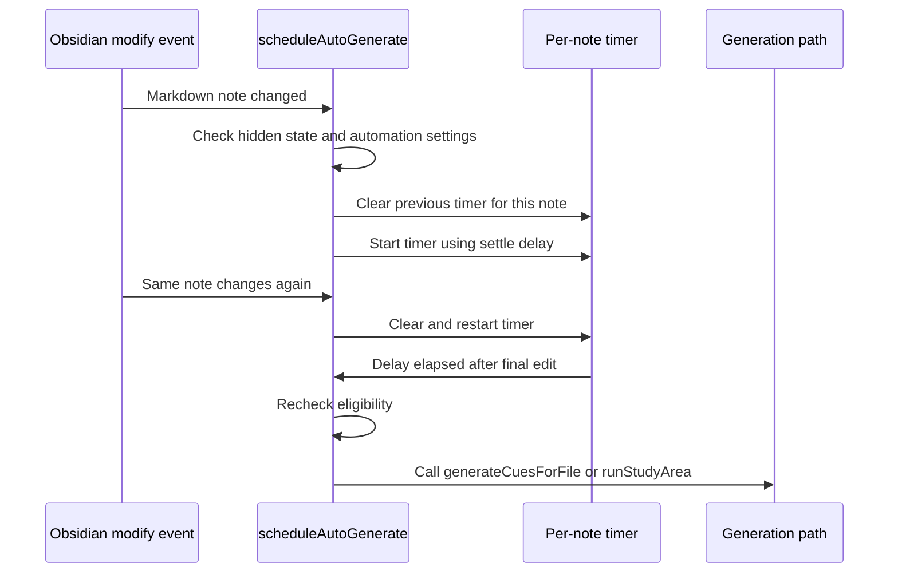

# feat: Add auto-generation settle delay

## Summary

CueCraft should wait until a note has stopped changing before background automation calls the configured AI provider. Add one global "settle delay" setting for automatic generation, defaulting to 10 seconds, with preset choices of 1, 5, 10, 25, and 60 seconds.

This keeps active-note auto-generation and study-area maintenance useful while protecting users from repeated provider calls as they type.

## Problem Frame

`src/main.ts` currently listens for Obsidian vault `modify` events and schedules automatic work with a fixed `1200ms` delay in `scheduleAutoGenerate`. That is short enough to fire while a user is still writing, especially in normal editor workflows where every pause can look like a save.

The origin requirements already say automation should avoid surprise provider calls, make API cost and rate-limit risk visible, and keep ongoing study-area maintenance scoped to eligible notes (see origin: `docs/brainstorms/2026-06-21-automatic-generation-requirements.html`). This plan turns those requirements into an explicit user-configurable debounce.

## Requirements

R1. Background automatic generation waits until the edited note has been unchanged for the configured settle delay before calling an AI provider.

R2. The default settle delay is 10 seconds.

R3. The setting offers preset values: 1, 5, 10, 25, and 60 seconds.

R4. New modify events reset the pending timer for the same note, so continuous typing produces at most one automatic generation after the final edit settles.

R5. Active-note auto-generation (`autoGenerateOnSave`) and study-area ongoing maintenance both use the same settle delay.

R6. Manual commands remain immediate. Generate, refresh, regenerate, retry, and explicit study-area runs should not wait for the settle delay.

R7. Existing gates remain intact: Markdown-only files, hidden notes, excluded study-area paths, provider setup, current-run cancellation behavior, and study-area maintenance mode.

R8. Timer cleanup on plugin unload continues to prevent pending automatic work from firing after unload.

R9. Settings copy explains that the delay applies after the user stops typing and helps avoid repeated API calls.

## Key Technical Decisions

1. Use a global setting, not per-study-area configuration.

   Rationale: the user problem is provider-call churn during typing. A single global delay is easier to understand and matches the existing global `autoGenerateOnSave` control.

2. Store the delay in seconds and convert to milliseconds only at scheduling boundaries.

   Rationale: settings UI, saved data, and tests remain human-readable, while timer code receives milliseconds.

3. Use preset values rather than arbitrary numeric input.

   Rationale: 1, 5, 10, 25, and 60 seconds cover responsive, normal, cautious, and high-cost workflows without inviting awkward invalid values.

4. Keep manual generation outside the debounce.

   Rationale: manual commands express current intent and already have provider setup/current-run guards. Delaying them would make the app feel broken.

5. Recheck eligibility at timer fire time where practical.

   Rationale: settings, visibility, and study-area membership can change during the delay. The scheduled work should still respect the latest user choices before it calls the provider.

## Existing Patterns To Follow

- `src/settings.ts` owns `CueCraftSettings`, `DEFAULT_SETTINGS`, and the settings tab UI.
- `src/main.ts` loads settings with `Object.assign({}, DEFAULT_SETTINGS, rawSettings)` and normalizes persisted values that need validation.
- `src/main.ts` already clears `autoGenerateTimers` and `studyAreaMaintenanceTimers` on unload.
- `src/study-area.ts` already centralizes study-area eligibility through helpers like `findMaintainedStudyAreaForPath`.
- `tests/settings.test.ts` covers settings defaults and persisted-value validation.
- `tests/study-area.test.ts` covers study-area maintenance matching, hidden notes, and exclusions.

## Technical Design

Add a small settings helper for automatic generation delay values:

- Presets: `1`, `5`, `10`, `25`, `60`
- Default: `10`
- Persisted setting name: `autoGenerationSettleDelaySeconds`
- Invalid persisted values fall back to `10`

Scheduling flow:

The helper should be usable by both active-note auto-generation and study-area maintenance so the two paths cannot drift back to different hardcoded delays.

## Implementation Units

### Unit 1: Add the persisted settle-delay setting

Files:

- `src/settings.ts`
- `src/main.ts`
- `tests/settings.test.ts`

Plan:

- Add `autoGenerationSettleDelaySeconds` to `CueCraftSettings`.
- Add the default value of `10` to `DEFAULT_SETTINGS`.
- Add exported preset/default constants or a small validation helper in `src/settings.ts`, unless the implementation naturally belongs in a dedicated tiny module.
- Normalize invalid persisted values during `loadPluginData` in `src/main.ts`.

Tests:

- `tests/settings.test.ts` verifies the default is `10`.
- `tests/settings.test.ts` verifies the preset list is exactly `[1, 5, 10, 25, 60]`.
- `tests/settings.test.ts` verifies invalid persisted values fall back to `10`.
- `tests/settings.test.ts` verifies valid persisted preset values are preserved.

### Unit 2: Expose preset control in settings

Files:

- `src/settings.ts`
- `tests/settings.test.ts`

Plan:

- Add a control near "Auto-generate on save" in the cue generation settings section.
- Use a preset slider or dropdown. A slider mapped to preset indexes is preferred if it stays clear and accessible in Obsidian's settings UI; otherwise use a dropdown.
- Label: "Auto-generation delay"
- Description: "Wait this long after you stop typing before CueCraft auto-generates cues. Longer delays reduce repeated API calls."
- Save changes immediately with `this.plugin.saveSettings()`.

Tests:

- If the preset-label formatter is extracted, test labels for `1 second`, `5 seconds`, `10 seconds`, `25 seconds`, and `60 seconds`.
- If the slider mapping is extracted, test index-to-delay and delay-to-index mapping.
- If no helper is extracted, rely on Unit 1 setting tests and verify the UI manually.

### Unit 3: Apply delay to active-note auto-generation

Files:

- `src/main.ts`
- `tests/auto-generation-delay.test.ts` or the closest existing plugin scheduling test file

Plan:

- Replace the hardcoded `1200` in `scheduleAutoGenerate` with the validated setting converted to milliseconds.
- Keep non-Markdown and hidden-note skips before scheduling.
- Clear and restart the per-file timer on every qualifying modify event.
- Before the timer calls `generateCuesForFile`, recheck the current setting and hidden state enough to avoid stale automatic calls after the user disables automation or hides the note during the delay.

Tests:

- With `autoGenerateOnSave` enabled and a `10` second delay, provider generation is not invoked at 9.999 seconds.
- If the same note changes again before 10 seconds, only one generation fires 10 seconds after the final change.
- If `autoGenerateOnSave` is disabled before the timer fires, no generation call happens.
- Hidden notes and non-Markdown files do not schedule generation.
- Manual generation still calls the generation path immediately.

### Unit 4: Apply delay to study-area maintenance

Files:

- `src/main.ts`
- `tests/auto-generation-delay.test.ts`
- `tests/study-area.test.ts` if eligibility helpers need additional coverage

Plan:

- Replace the hardcoded `1200` in `scheduleStudyAreaMaintenance` with the same settle-delay helper.
- Continue to use `findMaintainedStudyAreaForPath` so only enabled study areas queue maintenance.
- Re-resolve the maintained study area when the timer fires so paused areas, removed areas, hidden notes, and newly excluded paths do not call the provider.
- Keep explicit study-area runs immediate.

Tests:

- A note in a `maintain-on-save` study area schedules maintenance after the configured delay.
- Repeated changes to the same note reset the study-area maintenance timer.
- Pausing or removing the study area before the timer fires prevents the provider call.
- Hidden or excluded notes do not schedule or fire maintenance.
- Explicit study-area backfill/retry commands do not use the settle delay.

## Acceptance Examples

AE1. Given `autoGenerateOnSave` is enabled with the default 10 second delay, when a user types, pauses for 5 seconds, types again, and then stops, then CueCraft makes no provider call until 10 seconds after the final edit.

AE2. Given a note is inside a study area with `maintain-on-save`, when the note changes repeatedly, then CueCraft runs at most one maintenance job after the final edit settles.

AE3. Given a user sets the delay to 60 seconds, when background automation schedules work, then it waits 60 seconds before calling the provider.

AE4. Given a user presses a manual Generate or study-area Run button, then CueCraft starts generation immediately without applying the settle delay.

AE5. Given a user disables auto-generation, pauses a study area, hides a note, or excludes a path while a timer is pending, then the pending timer does not call the provider.

## Scope Boundaries

In scope:

- One global background automation delay setting.
- Preset values of 1, 5, 10, 25, and 60 seconds.
- Active-note auto-generation and study-area ongoing maintenance.
- Provider-call prevention while a note is still changing.

Out of scope:

- Per-section semantic "completion" detection.
- Per-study-area delay overrides.
- Full-vault automation changes.
- Provider cost estimation beyond clear settings copy.
- New status UI for queued automatic generation.

## Dependencies And Risks

- The cleanest tests may require extracting a small scheduling helper because `scheduleAutoGenerate` is currently private on the plugin class.
- Fake-timer tests need to avoid depending on real Obsidian runtime behavior.
- The 1 second preset is intentionally aggressive and should be framed as a user choice, not the default.
- Rechecking eligibility at fire time may require a small duplication of the initial scheduling gates; keep it narrow and local.

## Suggested Issue Breakdown

1. Add and validate `autoGenerationSettleDelaySeconds`.
2. Add the settings UI preset control.
3. Debounce active-note auto-generation.
4. Debounce study-area maintenance and cover timer cleanup/eligibility.

## Verification Plan

Automated:

- `bun test tests/settings.test.ts`
- `bun test tests/study-area.test.ts`
- `bun test tests/auto-generation-delay.test.ts`
- `bun run typecheck`

Manual:

- Enable auto-generation on save, set the delay to 10 seconds, type in a note, and confirm no cues are generated until 10 seconds after typing stops.
- Change the delay to 1 second and confirm automation feels responsive.
- Change the delay to 60 seconds and confirm provider calls wait.
- Put a note in a maintained study area, edit it repeatedly, and confirm only one maintenance run occurs after the final edit settles.
- Press manual Generate and confirm it starts immediately.
