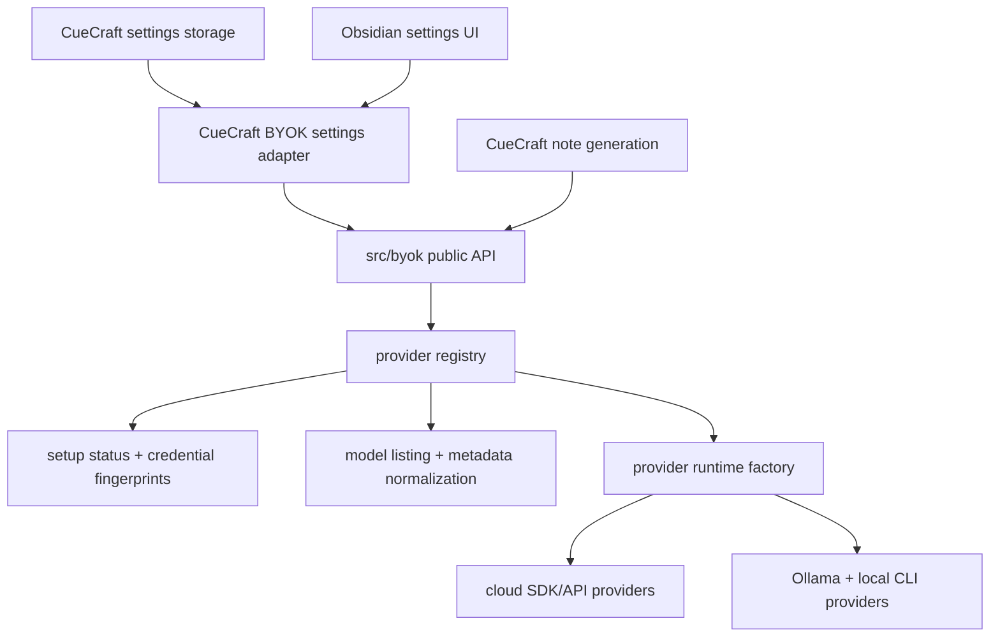

# refactor: Extract BYOK provider module

## Summary

Create an in-repo TypeScript module for BYOK provider work: API-key handling inputs, provider setup status, model listing, model metadata normalization, and provider calls. CueCraft should keep owning vault settings, Obsidian UI, and note parsing, while the new module exposes a package-shaped interface that can later move to a standalone Node package with minimal churn.

---

## Problem Frame

Provider logic is already partly isolated in `src/providers`, but it is still coupled to CueCraft settings and spread across helpers such as `src/provider-setup-status.ts`, `src/model-options.ts`, `src/model-compatibility.ts`, `src/anthropic-models.ts`, and settings-page refresh/test code. A future BYOK package needs a clearer boundary: caller-supplied credentials and provider config go in; normalized setup status, model options, and generation results come out.

The first objective is not to publish a package. The objective is to make the internal module feel package-ready, prove the public interface inside CueCraft, and leave a documented path for extraction.

---

## Issue Tracking

- Epic: #134
- U1: #135
- U2: #137
- U3: #139
- U4: #140
- U5: #142
- U6: #143

---

## Requirements

- R1. BYOK exports provider-neutral contracts for provider IDs, credentials/config, setup status, model options, model-list refresh results, generation requests, generation results, and provider errors.
- R2. BYOK owns provider callers and adapters for Ollama, Anthropic, OpenAI, Google, xAI, OpenRouter, Codex CLI, and Claude CLI.
- R3. BYOK does not import Obsidian APIs, DOM UI helpers, `CueCraftSettings`, or CueCraft plugin classes.
- R4. CueCraft settings remain the persisted storage layer; adapters map persisted settings into BYOK config and write BYOK results back to settings.
- R5. Current provider behavior is preserved, including exact-model connection testing, stale connection detection, custom model IDs, OpenRouter metadata warnings, Anthropic account-specific models, and local CLI command behavior.
- R6. Settings and generation call BYOK through the public module surface rather than provider-specific branches where a registry can express the same behavior.
- R7. Tests cover BYOK behavior without requiring Obsidian runtime, live provider accounts, or real CLI binaries.
- R8. Documentation names the public interface and the remaining work needed to extract BYOK to a separate npm package.

---

## Key Technical Decisions

- KTD1. Use an internal package-shaped module first. Create `src/byok/` with a public barrel, internal submodules, and import-boundary tests instead of adding workspace packaging or publishing setup now.
- KTD2. Keep credential persistence outside BYOK. BYOK receives credentials, host URLs, command names, selected model IDs, and saved verification snapshots as plain data; CueCraft decides how to store them.
- KTD3. Keep CueCraft prompt/schema semantics explicit in the BYOK interface. BYOK should continue generating CueCraft cues and summaries in this repo, but the request/response contracts should not depend on Obsidian or settings classes.
- KTD4. Replace setting-specific provider branches with a provider registry over time. Registry metadata should cover labels, credential kind, model behavior, refresh support, and setup checks; the settings UI can render from registry-backed adapters.
- KTD5. Move behavior by characterization first. Existing tests around providers, model options, compatibility, setup status, model refresh, and generator behavior should be moved or wrapped before large rewires.
- KTD6. Preserve local CLI safety rules. Codex and Claude CLI providers remain non-interactive local process integrations with explicit command configuration, timeout/cancellation handling, and no assumption that "CLI provider" means "local model."

---

## High-Level Technical Design

The exact file names can change during implementation, but the intended boundary is:

```text
src/byok/
  index.ts
  types.ts
  registry.ts
  credentials.ts
  setup-status.ts
  models/
    model-options.ts
    model-compatibility.ts
    anthropic-models.ts
    refresh-results.ts
  generation/
    prompts.ts
    schemas.ts
  providers/
    ai-sdk-provider.ts
    anthropic-provider.ts
    openai-provider.ts
    google-provider.ts
    xai-provider.ts
    openrouter-provider.ts
    ollama-provider.ts
    codex-cli-provider.ts
    claude-cli-provider.ts
    local-command-runner.ts
    provider-factory.ts
```



The public surface should be directional rather than a one-off wrapper around today’s files:

- `ByokProviderId` and `ByokProviderDefinition`
- `ByokProviderConfig` with provider-specific credential/config variants
- `ByokVerificationSnapshot` and `ByokSetupStatus`
- `ByokModelOption`, `ByokModelRefreshResult`, and compatibility helpers
- `ByokProviderRuntime` with `testConnection`, `listModels`, `generateCue`, `generateCues`, and `generateSummary`
- `createByokProvider(config, deps)` and registry lookup helpers

---

## Scope Boundaries

### In Scope

- Introduce a BYOK module inside this repo.
- Define and enforce the public TypeScript interface.
- Move provider callers, model-list logic, model metadata normalization, setup-status derivation, and provider factory logic behind that interface.
- Rewire CueCraft settings and generation to consume BYOK through adapters.
- Add documentation and tests that make later npm extraction obvious.

### Deferred to Follow-Up Work

- Publishing an npm package.
- Splitting the repo into a monorepo or workspace.
- Adding new providers.
- Encrypting or moving persisted API keys.
- Redesigning the settings UI beyond the adapter rewiring needed for this refactor.
- Making BYOK a generic chat-completions library unrelated to CueCraft cue/summary generation.

---

## Implementation Units

### U1. Define BYOK Public Contracts and Boundary Tests

- **Goal:** Create the package-shaped public interface before moving behavior.
- **Requirements:** R1, R3, R7, R8.
- **Dependencies:** None.
- **Files:** `src/byok/index.ts`, `src/byok/types.ts`, `src/byok/registry.ts`, `tests/byok/public-contract.test.ts`, `tests/byok/import-boundary.test.ts`, `docs/byok-extraction.md`.
- **Approach:** Add public type definitions and registry skeletons that mirror current provider IDs and runtime capabilities without importing `CueCraftSettings` or Obsidian. Add an import-boundary test that fails if `src/byok/**` imports `obsidian`, `src/settings.ts`, `src/main.ts`, or DOM UI modules.
- **Execution note:** Keep this unit mostly type/interface focused; behavior moves in later units.
- **Test scenarios:**
  - A provider config can represent API-key providers, Ollama host/model, and CLI command/model variants.
  - The public barrel exports only package-facing contracts and constructors.
  - The import-boundary test fails for a simulated forbidden import and passes for current BYOK files.
  - The registry exposes all current provider IDs with stable labels and capability metadata.
- **Verification:** BYOK has a compilable public surface that can be used by later units without changing CueCraft behavior.

### U2. Move Model Metadata and Setup Status into BYOK

- **Goal:** Put normalized model and setup-state behavior behind the new module.
- **Requirements:** R1, R3, R5, R7.
- **Dependencies:** U1.
- **Files:** `src/model-options.ts`, `src/model-compatibility.ts`, `src/anthropic-models.ts`, `src/provider-setup-status.ts`, `src/byok/models/*`, `src/byok/setup-status.ts`, `tests/model-options.test.ts`, `tests/model-compatibility.test.ts`, `tests/settings.test.ts`, `tests/provider-setup-status.test.ts`, `tests/byok/*`.
- **Approach:** Move or re-export model normalization, OpenRouter compatibility helpers, Anthropic model option helpers, credential fingerprints, verification snapshots, and setup-status derivation from BYOK. Keep compatibility shims at old paths only as temporary imports if that makes the stack easier to review.
- **Test scenarios:**
  - OpenRouter model metadata still normalizes context length, pricing, provider prefix, and supported parameters.
  - Structured-output badges and warnings match existing behavior.
  - Anthropic fetched models, custom model selection, and unavailable-model messaging match existing behavior.
  - Changing a credential, host, command, or selected model marks saved verification stale.
  - CLI default model selection still records and compares the sentinel value.
- **Verification:** Existing model/status tests pass through BYOK-owned logic, and old import paths are either removed or reduced to compatibility wrappers.

### U3. Extract Provider Runtime Factory and Model Listing

- **Goal:** Move provider construction and model listing behind BYOK while preserving injected transport seams.
- **Requirements:** R2, R3, R5, R6, R7.
- **Dependencies:** U1, U2.
- **Files:** `src/providers/provider-factory.ts`, `src/providers/openai-provider.ts`, `src/providers/google-provider.ts`, `src/providers/xai-provider.ts`, `src/providers/openrouter-provider.ts`, `src/providers/anthropic-provider.ts`, `src/providers/ollama-provider.ts`, `src/byok/providers/*`, `tests/provider-factory.test.ts`, `tests/ai-sdk-providers.test.ts`, `tests/anthropic-provider.test.ts`, `tests/ollama-provider.test.ts`.
- **Approach:** Introduce `createByokProvider(config, deps)` and move provider constructors into `src/byok/providers`. Preserve `fetchImpl`, `HttpClient`, `ObjectGenerator`, and list-model injection seams so tests remain account-free. Return normalized model refresh data from BYOK where possible instead of raw string/model arrays.
- **Test scenarios:**
  - Each current provider ID creates a runtime with the same id, label, and network/download flags.
  - OpenAI, Google, xAI, OpenRouter, Anthropic, and Ollama model listing preserve current success and error behavior through injected fetch/http clients.
  - OpenRouter still returns rich `ModelOption` metadata.
  - Provider factory tests no longer need `CueCraftSettings`.
  - CueCraft adapter tests prove settings map into equivalent BYOK configs.
- **Verification:** Provider creation and model listing are callable through BYOK without importing CueCraft settings.

### U4. Extract Generation Adapters and Local CLI Process Support

- **Goal:** Move cue/summary provider calls, repair behavior, rate-limit mapping, and CLI command execution into BYOK.
- **Requirements:** R2, R3, R5, R7.
- **Dependencies:** U1, U3.
- **Files:** `src/providers/ai-sdk-provider.ts`, `src/providers/codex-cli-provider.ts`, `src/providers/claude-cli-provider.ts`, `src/providers/local-command-runner.ts`, `src/providers/local-cli-cue-batch.ts`, `src/providers/types.ts`, `src/byok/generation/*`, `src/byok/providers/*`, `tests/ai-sdk-providers.test.ts`, `tests/codex-cli-provider.test.ts`, `tests/claude-cli-provider.test.ts`, `tests/local-command-runner.test.ts`, `tests/generator.test.ts`.
- **Approach:** Move `AiProvider` runtime behavior into BYOK, including structured-output generation, prompt guidance, validation repair, provider errors, rate-limit retry metadata, batch generation, and local CLI extraction/parsing. `src/generator.ts` can still orchestrate parsed note sections, but it should depend on BYOK runtime types.
- **Test scenarios:**
  - Cloud providers still generate validated cue and summary outputs through injected object generators.
  - Rate-limit retry and `ProviderRateLimitError` behavior is unchanged.
  - Ollama still repairs malformed JSON once and surfaces validation failures.
  - Codex CLI and Claude CLI still parse current stdout envelope shapes and preserve timeout/cancellation behavior.
  - Batch cue generation still returns per-section cue/error results.
- **Verification:** Generation tests depend on BYOK runtime contracts, and provider-specific tests continue to run without live vendors or real CLIs.

### U5. Rewire CueCraft Settings and Runtime Through BYOK Adapters

- **Goal:** Make CueCraft consume the BYOK public API while keeping settings storage and UI behavior stable.
- **Requirements:** R4, R5, R6, R7.
- **Dependencies:** U2, U3, U4.
- **Files:** `src/settings.ts`, `src/main.ts`, `src/generator.ts`, `src/model-combobox.ts`, `src/provider-id.ts`, `tests/settings.test.ts`, `tests/provider-factory.test.ts`, `tests/cloud-model-settings.test.ts`, `tests/generator.test.ts`.
- **Approach:** Add a small CueCraft-owned adapter that maps `CueCraftSettings` to BYOK configs and maps BYOK refresh/setup results back to settings. Replace duplicated provider-specific credential/model/test branches with registry-backed helpers where that reduces code without changing the settings UI.
- **Test scenarios:**
  - `CueCraftPlugin.makeProvider` returns a BYOK runtime for every provider using existing settings values.
  - The settings page still resets fetched model caches when credentials change.
  - Cloud and Ollama refresh buttons still persist model IDs, model options, fetched flags, and refresh messages.
  - Connection tests still record verification snapshots and show provider-specific notices.
  - Existing generation works through BYOK runtime types.
- **Verification:** CueCraft behavior is unchanged from the user’s perspective, but provider creation, model refresh, and setup status go through BYOK interfaces.

### U6. Add Package-Readiness Documentation and Extraction Guardrails

- **Goal:** Make the future npm extraction path explicit and mechanically protected.
- **Requirements:** R3, R7, R8.
- **Dependencies:** U5.
- **Files:** `docs/byok-extraction.md`, `tests/byok/import-boundary.test.ts`, `package.json`, `tsconfig.json`, `README.md`.
- **Approach:** Document the BYOK public API, dependency expectations, adapter responsibilities, package extraction steps, and non-goals. Add or strengthen static tests that BYOK does not import Obsidian/UI/settings code. If useful, add a `package.json` script or test helper that checks only `src/byok/**` boundaries without changing build output.
- **Test scenarios:**
  - Boundary tests prevent Obsidian, DOM UI, and CueCraft settings imports from entering BYOK.
  - Documentation examples reference public BYOK exports, not internal files.
  - The main build/test commands still pass after any package-readiness script additions.
- **Verification:** A future project can inspect `docs/byok-extraction.md` and know which files and dependencies belong in a package and which adapters stay in CueCraft.

---

## System-Wide Impact

- The provider layer becomes a deliberate internal module rather than a set of adjacent CueCraft files.
- Settings storage stays stable, so existing user data should not need migration beyond import-path rewires and compatibility shims.
- Tests move toward provider-package behavior and CueCraft adapter behavior as separate concerns.
- BYOK remains desktop-compatible with Obsidian’s bundled runtime, including custom fetch/http injection and local command execution.

---

## Risks & Dependencies

- **Boundary overreach:** Moving storage into BYOK would make extraction harder. Mitigation: keep settings persistence in CueCraft and test the adapter boundary.
- **Provider behavior regression:** Provider calls have many small differences. Mitigation: move tests before rewiring and preserve injection seams.
- **OpenRouter and Anthropic model metadata drift:** Their model-list shapes differ from string-only providers. Mitigation: keep normalized model options as a first-class BYOK concept.
- **Local CLI safety regression:** CLI providers need process isolation, timeouts, and non-interactive behavior. Mitigation: keep local command runner tests and CLI parsing tests in the BYOK test suite.
- **False package readiness:** A folder named `byok` is not enough. Mitigation: add import-boundary tests and extraction docs before considering the module package-ready.

---

## Acceptance Examples

- Given CueCraft settings for OpenAI, the adapter can produce a BYOK config, create a provider, test the selected model, and record a verification snapshot without BYOK importing `CueCraftSettings`.
- Given an OpenRouter model list response with structured-output metadata, BYOK returns normalized options that the settings combobox can sort, badge, and warn on exactly as it does today.
- Given a saved Codex CLI setup with no model override, BYOK setup status treats the CLI default as selected and marks the verification stale if the command changes.
- Given a future package extraction, a developer can copy `src/byok/**`, install the documented runtime dependencies, and provide their own storage/UI adapter without pulling in Obsidian.

---

## Documentation Plan

- Create `docs/byok-extraction.md` during U1 and update it through U6.
- Include the public interface, adapter responsibilities, dependency list, package extraction checklist, and current non-goals.
- Update `README.md` only if the refactor changes contributor-facing provider architecture; avoid user-facing claims about an npm package until it exists.

---

## Sources & Research

- `src/providers/types.ts` defines the current `AiProvider`, provider errors, generation inputs, and model-list hook.
- `src/providers/provider-factory.ts` currently couples provider construction to `CueCraftSettings`.
- `src/providers/*` contain cloud, Ollama, Codex CLI, Claude CLI, local command runner, and batch cue implementations.
- `src/provider-setup-status.ts` derives credential/model/setup state and records verification snapshots.
- `src/model-options.ts`, `src/model-compatibility.ts`, and `src/anthropic-models.ts` normalize model choices and provider-specific metadata.
- `src/settings.ts` owns credential fields, model refresh UI, connection testing, and settings persistence.
- `src/main.ts` adapts Obsidian `requestUrl` into fetch/http dependencies and creates providers for generation.
- `src/generator.ts` orchestrates note parsing and cue/summary generation through `AiProvider`.
- `docs/plans/2026-06-22-001-feat-local-cli-providers-plan.md` documents the local CLI provider safety and setup intent that BYOK should preserve.
