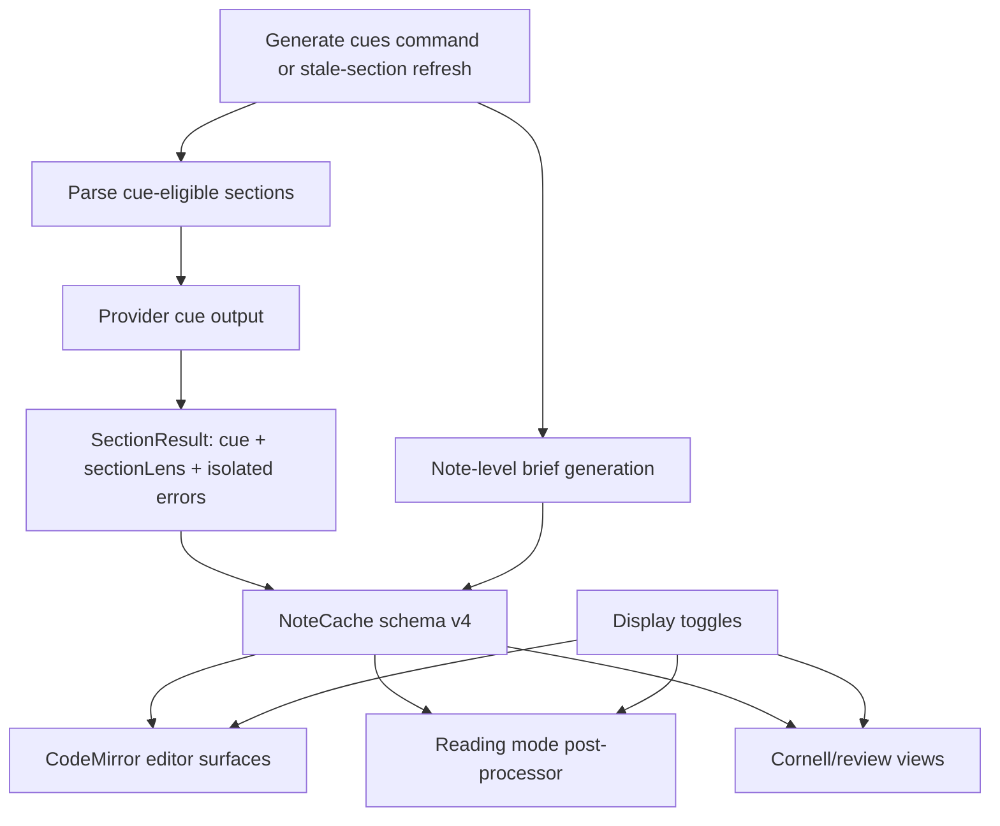

# AI-native review surfaces - Plan

## Goal Capsule

| Field | Value |
|---|---|
| Objective | Implement Section Lens and Note Brief as generated, cached review artifacts that can be shown or hidden independently from cue generation. |
| Authority | The user request and `docs/ideation/2026-06-27-ai-native-review-surfaces-visual-sketch.html` define scope. Existing cue generation, cache, and Obsidian rendering patterns define implementation shape. |
| Execution profile | Standard feature work touching provider schemas, cache migration, generation orchestration, settings, editor/reading rendering, and tests. |
| Stop conditions | Stop if provider contracts cannot preserve cue generation compatibility, if display toggles would mutate note markdown, or if generation cannot be cached without invalidating existing caches. |
| Tail ownership | Implementation should land as focused PRs matching the child issues created from this plan. |

---

## Product Contract

### Summary

CueCraft should move beyond "one question plus terms beside a heading" by generating two AI-native study surfaces: Section Lens, a concise memory sentence for each section, and Note Brief, a note-level overview with a small set of high-value review cards.
Both artifacts are generated when cues are generated, cached with the note, and shown only when their display toggles are enabled.

### Problem Frame

The current Cornell-inspired cue model mirrors pen-and-paper notes: a question on the side and support terms under it.
That helps active recall, but it does not fully use AI's ability to compress meaning, identify salience, and orient a reader before review.
The selected sketch directions keep the normal Obsidian note as the center while adding generated comprehension surfaces that make dense notes easier to read and retain.

### Requirements

**Generated artifacts**

- R1. Each cue-eligible section stores a Section Lens with a one-sentence takeaway, a critical phrase, and a short explanation of why that phrase matters.
- R2. Each generated note stores a Note Brief with an overview plus three review cards: what matters, review first, and say it back.
- R3. Generating cues also generates Section Lens and Note Brief, even when their display toggles are off.
- R4. Incremental section regeneration updates only the regenerated sections' cues and Section Lens artifacts while preserving unchanged sections.
- R5. Note Brief regeneration happens during full-note generation and during any incremental pass that changes the set or content of sections enough to make the note-level brief stale.

**Display behavior**

- R6. Users can turn Section Lens display on or off from settings without deleting cached Section Lens data.
- R7. Users can turn Note Brief display on or off from settings without deleting cached Note Brief data.
- R8. Section Lens appears in normal note review surfaces without mutating the Markdown document.
- R9. Note Brief appears as a generated, non-editing overview surface near the top of the note when enabled.
- R10. Existing cue display modes, Cornell view behavior, Reading mode affordances, and generated cue data remain usable when either new surface is hidden.

**Compatibility and reliability**

- R11. Existing caches migrate without breaking cue rendering.
- R12. Provider failures for Section Lens or Note Brief are isolated so usable cue questions are not discarded.
- R13. Existing provider implementations continue to validate structured output and repair malformed responses where they already do so.

### Scope Boundaries

In scope:
- Section Lens and Note Brief generation, persistence, settings toggles, and rendering.
- Provider prompt/schema changes needed to populate the new artifacts.
- Unit and integration coverage for generation, cache migration, settings normalization, and DOM rendering helpers.

Deferred to follow-up work:
- Signal Box phrase highlighting inside the note body.
- Recall Ladder interaction and staged reveal practice.
- Memory Queue, spaced review, scoring, and cross-note scheduling.
- Editing generated Section Lens or Note Brief content by hand.
- Analytics about whether users read or complete the generated surfaces.

### Acceptance Examples

- AE1. Given a note with two cue-eligible headings, when the user runs Generate cues, then the cache stores two Section Lens artifacts and one Note Brief.
- AE2. Given Section Lens display is off, when the user generates cues, then the cache still stores Section Lens data and the editor does not render the lens blocks.
- AE3. Given Note Brief display is off, when the user generates cues, then the cache still stores Note Brief data and no note-level brief appears in editor or Reading mode.
- AE4. Given a user edits only one section and runs a stale-section refresh, then unchanged sections keep their existing cue and Section Lens data.
- AE5. Given a legacy cache, when CueCraft loads it, then cue rendering still works and new Section Lens and Note Brief fields are null until regenerated.

---

## Planning Contract

### Key Technical Decisions

- KTD1. Generate Section Lens as part of cue output.
  The per-section provider request already has the section heading, content, preset, cue options, and optional whole-note context, so extending `CueOutput` avoids a second provider call for every section and keeps incremental generation cheap.
- KTD2. Store Note Brief as a structured note-level artifact separate from legacy `summary`.
  Existing `summary` and `outline.learningObjective` are used by Cornell and short-form hook views; a separate `noteBrief` object lets the new surface evolve without changing old rendering contracts.
- KTD3. Treat display toggles as display-only.
  `showSectionLens` and `showNoteBrief` should hide or show cached surfaces, not decide whether AI generation runs.
- KTD4. Keep Section Lens and Note Brief out of Markdown.
  Rendering should use CodeMirror decorations, Reading mode post-processing, and Cornell/review view DOM builders so generated content remains non-destructive.
- KTD5. Migrate caches forward rather than invalidating them.
  `CACHE_SCHEMA_VERSION` should bump, legacy caches should gain null review artifacts, and existing cue data should remain valid.
- KTD6. Isolate artifact failures.
  A malformed Section Lens should leave the cue question usable; a failed Note Brief should not make the note's section cues unusable.

### High-Level Technical Design

The implementation should keep generation and display separate.
Provider calls populate `SectionResult.sectionLens` and `NoteGenerationResult.noteBrief`; cache persistence stores those artifacts whether display toggles are on or off.
Renderers read the cache and settings to decide what appears in the editor, Reading mode, and review views.

### Assumptions

- Display toggles should default on for this feature rollout so the new surfaces are visible after generation, while still allowing users to disable each surface.
- Note Brief generation is not gated by the current `autoSummary` setting because the user explicitly required generation even when the display is hidden.
- Existing `autoSummary` behavior can continue to control legacy summary use, but the implementation may reuse the same note-level provider pass if it keeps the user-visible semantics clear.

### System-Wide Impact

This work changes the generated data model and provider output contract, so every provider and cache migration path must be updated together.
It also adds a second kind of editor-rendered generated content, so CodeMirror updates must continue to track heading line movement while typing.
The settings UI gains display toggles whose names must make clear that hiding a surface does not stop generation.

### Sources and Research

- `docs/ideation/2026-06-27-ai-native-review-surfaces-visual-sketch.html` is the visual and product source for Section Lens and Note Brief.
- `src/generator.ts` already orchestrates section cue generation, batching, summary generation, cancellation, and progress reporting.
- `src/cache.ts` already has schema migration, section reconciliation, stale-section detection, and per-note persistence.
- `src/cue-extension.ts` and `src/reading-cues.ts` already resolve cached cues to current heading lines and render without mutating Markdown.
- `src/settings.ts` already normalizes persisted settings and groups cue generation versus appearance controls.
- `src/byok/providers/*` already validates structured cue and summary output across AI SDK, Claude CLI, Codex CLI, Ollama, and vendor providers.

---

## Implementation Units

### U1. Add review artifact data contracts

- **Goal:** Define Section Lens and Note Brief data shapes across schemas, provider runtime types, generation result types, and the cache.
- **Requirements:** R1, R2, R11, R12, R13.
- **Dependencies:** None.
- **Files:** `src/schemas.ts`, `src/byok/types.ts`, `src/byok/providers/types.ts`, `src/generator.ts`, `src/cache.ts`, `tests/schemas.test.ts`, `tests/cache.test.ts`, `tests/byok/public-contract.test.ts`.
- **Approach:** Add reusable types for `SectionLens` and `NoteBrief`. Extend cue output with an optional or nullable `sectionLens`, and extend note generation output with nullable `noteBrief`. Bump cache schema to v4 with nullable new fields and migrate v1-v3 caches by filling `sectionLens: null` on sections and `noteBrief: null` on notes.
- **Patterns to follow:** `cueOutputSchema`, `summaryOutputSchema`, `CACHE_SCHEMA_VERSION`, `migrateCache`, and `buildNoteCache`.
- **Test scenarios:**
  - Validate a cue output that includes a Section Lens with `takeaway`, `keyPhrase`, and `explanation`.
  - Reject a Section Lens with a missing takeaway while keeping existing cue validation failure messages clear.
  - Validate a Note Brief with overview and the three required cards.
  - Migrate v3 caches to v4 with existing cue fields preserved and new review artifact fields set to null.
  - Build a new cache from generation output containing Section Lens and Note Brief and validate it.
- **Verification:** Schema tests prove valid and invalid artifacts, cache tests prove migration and persistence, and provider public contract tests include the new runtime shape.

### U2. Populate Section Lens through provider cue generation

- **Goal:** Make every cue generation path request, validate, and carry Section Lens data with the cue.
- **Requirements:** R1, R3, R4, R12, R13.
- **Dependencies:** U1.
- **Files:** `src/byok/providers/ai-sdk-provider.ts`, `src/byok/providers/claude-cli-provider.ts`, `src/byok/providers/codex-cli-provider.ts`, `src/byok/providers/ollama-provider.ts`, `src/byok/providers/local-cli-cue-batch.ts`, `src/schemas.ts`, `src/generator.ts`, `tests/generator.test.ts`, `tests/ai-sdk-providers.test.ts`, `tests/claude-cli-provider.test.ts`, `tests/codex-cli-provider.test.ts`, `tests/ollama-provider.test.ts`.
- **Approach:** Update single and batched cue prompts to ask for a Section Lens in addition to the existing question, keywords, confidence, and rationale. In `applyCueResult`, copy `sectionLens` when valid and record a section-level artifact error only when the provider returns an unusable cue. For malformed optional lens content, prefer clear validation behavior over silently rendering bad text.
- **Patterns to follow:** Current cue prompt guidance, `validateCue`, `validateCueBatch`, `parseCueBatch`, and provider repair prompts.
- **Test scenarios:**
  - Single-section generation returns `SectionResult.sectionLens` alongside the existing question.
  - Batched generation maps each returned Section Lens to the matching section index.
  - A provider section failure still isolates the failed section without discarding successful sections' lenses.
  - Whole-note context and cue options continue to pass through unchanged.
  - Provider prompt tests assert the requested JSON keys include Section Lens fields.
- **Verification:** Existing generator tests continue to pass after being extended for `sectionLens`, and provider tests prove each provider requests and validates the new fields.

### U3. Generate and cache Note Brief during cue generation

- **Goal:** Generate a structured Note Brief whenever cue generation runs, independent of whether the Note Brief display is enabled.
- **Requirements:** R2, R3, R5, R10, R12, R13.
- **Dependencies:** U1.
- **Files:** `src/byok/types.ts`, `src/byok/providers/types.ts`, `src/byok/providers/ai-sdk-provider.ts`, `src/byok/providers/claude-cli-provider.ts`, `src/byok/providers/codex-cli-provider.ts`, `src/byok/providers/ollama-provider.ts`, `src/generator.ts`, `src/cache.ts`, `src/main.ts`, `tests/generator.test.ts`, `tests/cache.test.ts`, `tests/study-area.test.ts`.
- **Approach:** Add a note-level brief generation path after section cue generation completes. It should receive the note title, clamped full text, generated section questions, and enough section metadata to recommend review order. Store the result as `NoteGenerationResult.noteBrief` and `NoteCache.noteBrief`. During incremental stale-section regeneration, refresh Note Brief after changed sections are reconciled so note-level guidance does not point at stale or removed sections.
- **Patterns to follow:** Existing summary generation in `generateNote`, stale-section refresh in `regenerateStaleSections`, and `regenerateQueuedSections` for study areas.
- **Test scenarios:**
  - Full-note generation calls the note-level brief provider after section cues finish and stores `noteBrief`.
  - Full-note generation still returns usable section cues when Note Brief generation fails.
  - Generation cancellation before the note-level pass returns no Note Brief and marks the run canceled.
  - Incremental generation that changes one section refreshes Note Brief after cache reconciliation.
  - A note with no cue-worthy sections does not call the Note Brief provider.
- **Verification:** Generator and main/study-area tests prove Note Brief generation happens as part of cue generation and remains isolated from cue failures.

### U4. Add display toggles and settings normalization

- **Goal:** Let users independently show or hide Section Lens and Note Brief without changing generation behavior or deleting cached artifacts.
- **Requirements:** R3, R6, R7, R10.
- **Dependencies:** U1.
- **Files:** `src/settings.ts`, `src/main.ts`, `tests/settings.test.ts`.
- **Approach:** Add boolean settings such as `showSectionLens` and `showNoteBrief`, default them on for the rollout, normalize malformed persisted values in `loadPluginData`, and place controls near Appearance or Note format settings. Toggle handlers should refresh editor and Reading mode surfaces without calling generation or marking cue-generation settings dirty.
- **Patterns to follow:** `renderInReadingMode`, `readingModeDisplay`, `editorCueDisplay`, `refreshEditorCues`, and `refreshReadingModeSurface`.
- **Test scenarios:**
  - Default settings include both display toggles.
  - Invalid persisted toggle values normalize to defaults.
  - Changing display toggles saves settings and refreshes rendered surfaces.
  - Changing display toggles does not call `noteCueSettingsChanged` or prompt for regeneration.
- **Verification:** Settings tests cover defaults, normalization, and display-only behavior.

### U5. Render Section Lens in note surfaces

- **Goal:** Show Section Lens near its section when enabled, while keeping it anchored to headings as users type or insert lines.
- **Requirements:** R1, R6, R8, R10.
- **Dependencies:** U1, U2, U4.
- **Files:** `src/cue-extension.ts`, `src/reading-cues.ts`, `src/main.ts`, `styles.css`, `tests/cue-extension.test.ts`, `tests/reading-cues.test.ts`.
- **Approach:** Extend the cue line data builder or create a parallel review-surface data builder that resolves Section Lens artifacts to current section heading lines by stable section id. Render Section Lens as a compact non-editing block in the editor and Reading mode when `showSectionLens` is enabled. Reuse the transaction mapping and heading resolution patterns already used for cue cards so lens blocks move when users type above a section.
- **Patterns to follow:** `buildCueLineData`, `buildCueWidgetDecorations`, `buildCueGutterMarkers`, `buildReadingCueMap`, and `renderReadingCues`.
- **Test scenarios:**
  - Editor render data includes a lens for sections with cached Section Lens data and omits sections without it.
  - Editor render data omits lens blocks when `showSectionLens` is false.
  - A document change above a heading maps the lens to the new heading line.
  - Reading mode inserts a Section Lens once per matching heading and avoids duplicate insertion on repeated post-processing.
  - Existing cue rendering still works when Section Lens is hidden.
- **Verification:** DOM and render-state tests prove lens placement, toggle behavior, and no duplicate rendering.

### U6. Render Note Brief overview in note surfaces

- **Goal:** Show the Note Brief overview and cards near the top of the note when enabled, without mutating Markdown or replacing existing cue displays.
- **Requirements:** R2, R7, R9, R10.
- **Dependencies:** U1, U3, U4.
- **Files:** `src/cue-extension.ts`, `src/reading-cues.ts`, `src/main.ts`, `src/cornell.ts`, `src/cornell-view.ts`, `styles.css`, `tests/cue-extension.test.ts`, `tests/reading-cues.test.ts`, `tests/cornell.test.ts`.
- **Approach:** Add a Note Brief widget for the editor and Reading mode that renders before the first cue-eligible section or near the note title region when possible. In Cornell/review views, reuse the existing summary rendering area but prefer the structured Note Brief when present. Keep empty or failed briefs hidden unless the implementation adds a clear non-blocking status affordance.
- **Patterns to follow:** Cornell summary rendering in `src/cornell-view.ts`, `buildReadingReviewEl`, and CodeMirror block widget rendering.
- **Test scenarios:**
  - Editor rendering includes one Note Brief widget when `showNoteBrief` is true and cache has `noteBrief`.
  - Editor rendering omits Note Brief when the setting is false or cache has no `noteBrief`.
  - Reading mode inserts one Note Brief and guards against duplicate post-processor runs.
  - Cornell view uses structured Note Brief content without dropping existing summary fallback behavior.
  - Existing cue cards and Section Lens still render when Note Brief is hidden.
- **Verification:** Rendering tests cover editor, Reading mode, and Cornell/review view output with the toggle on and off.

### U7. Add documentation and manual verification coverage

- **Goal:** Make the new surfaces testable by a human reviewer and keep the GitHub child issues implementable independently.
- **Requirements:** R1-R13.
- **Dependencies:** U1, U2, U3, U4, U5, U6.
- **Files:** `README.md`, `docs/ideation/2026-06-27-ai-native-review-surfaces-visual-sketch.html`, `tests/*`.
- **Approach:** Add a concise user-facing note for the two toggles and a manual test checklist covering full generation, hidden display generation, incremental regeneration, editor typing, Reading mode, and Cornell/review view behavior. Do not rewrite the sketch unless implementation reveals a mismatch that should be recorded.
- **Patterns to follow:** Existing manual test notes in PR bodies and settings copy in `src/settings.ts`.
- **Test scenarios:**
  - Manual test instructions include generation with both toggles on.
  - Manual test instructions include generation with each toggle off while inspecting the cache-backed UI after toggling back on.
  - Manual test instructions include adding a new heading and confirming unchanged sections are not regenerated unnecessarily.
- **Verification:** Documentation gives a reviewer enough steps to validate generation, hiding, and incremental behavior without reading implementation code.

---

## Verification Contract

| Gate | Applies to | Done signal |
|---|---|---|
| `bun test` | U1-U7 | Unit and DOM tests pass after schema, generation, settings, and rendering updates. |
| `bun run typecheck` | U1-U7 | TypeScript accepts the provider contract, cache schema, and rendering changes. |
| `bun run build` | U1-U7 | Plugin bundle builds after provider prompt/schema updates. |
| Manual Obsidian test | U5-U7 | Generate cues on a sample note, toggle Section Lens and Note Brief independently, type above headings, and confirm surfaces remain aligned. |

---

## Definition of Done

- Section Lens and Note Brief are generated and cached during cue generation whether or not their displays are enabled.
- Display toggles hide/show cached surfaces without triggering provider calls or deleting data.
- Existing cue questions, keywords, Cornell views, Reading mode affordances, and editor hook rail modes still work.
- Legacy caches load through migration and do not break existing cue rendering.
- Provider output validation and repair behavior is updated for all current provider paths.
- Automated tests and manual verification cover hidden-display generation, incremental regeneration, and heading-aligned rendering.
- Abandoned exploratory code and temporary issue-body files are removed from the final diff.
