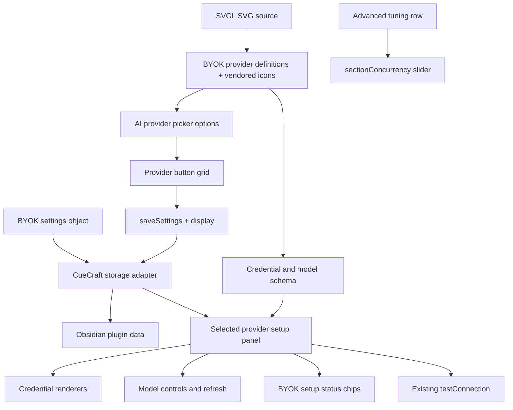

# feat: Simplify AI model settings

## Summary

Replace the numbered AI model setup flow with a compact provider picker and one active-provider setup panel. BYOK should own provider names, SVG icons, credential/model schemas, and the serializable provider-settings shape, while CueCraft renders and persists that BYOK state through an Obsidian adapter.

---

## Problem Frame

The current AI model settings subpage still reads like a feature-development checklist: five numbered sections, long descriptions, a provider dropdown, separate credential/model/status rows, and speed tuning at the same visual weight as setup. That was useful while provider support was evolving, but it now makes routine setup feel larger than it is.

The ideation deck selects Option A: a rounded, three-across provider button grid with real provider icons and a single active setup panel. This plan turns that direction into production work without changing which providers exist or how BYOK calls them.

The provider metadata boundary should also move forward. Today CueCraft settings code still has provider-specific names, credential copy, and field branching. The redesigned UI should consume BYOK definitions so future providers can be added in BYOK without scattering names such as Claude, ChatGPT, OpenRouter, or Codex CLI through the rest of the app.

Storage note, superseded 2026-06-29: `docs/plans/2026-06-29-001-feat-secure-byok-credential-storage-plan.md` replaces this plan's cloud API-key storage assumption. CueCraft still persists non-secret BYOK settings in `data.json`, but cloud API keys now belong in CueCraft-owned secure credential storage outside `data.json`.

---

## Requirements

### Provider Picker

- R1. The AI model subpage replaces the provider dropdown with a compact three-across provider button grid.
- R2. Provider buttons show real provider icons, provider names, selected state, and accessible pressed/selected semantics.
- R3. The picker is data-driven from the currently supported provider IDs so adding future providers does not require rewriting the layout.
- R4. Unsupported future providers from the design deck are not shown as selectable production options until provider runtimes exist.

### Active Provider Setup

- R5. The selected provider owns the visible setup panel: credential or host/command field, model control, model refresh action when supported, connection test, and setup status.
- R6. Provider-specific language stays concise: cloud providers use API key and model language, Ollama uses host and local model language, and CLI providers use command and optional model override language.
- R7. Existing save, model refresh, test connection, password visibility, custom model, OpenRouter compatibility, Anthropic model, Ollama, and CLI behaviors are preserved.
- R8. Setup status chips move into the active provider panel and continue to reflect key/command, model, and connection state.

### Layout and Quality

- R9. Parallel request tuning moves out of the primary setup path into an Advanced row or disclosure.
- R10. The page uses much less instructional copy while retaining enough context for users to know what to enter.
- R11. The redesigned settings remain usable in narrow Obsidian settings panes, light and dark themes, keyboard navigation, and high-contrast focus states.
- R12. Tests cover provider picker contracts, provider-specific panel branching, status behavior, advanced tuning placement, and preservation of existing provider setup behavior.

### BYOK Boundary and Storage

- R13. BYOK exports provider display metadata, including user-facing labels, optional product labels, vendored SVG icon metadata, credential kind, model behavior, and model-list capability.
- R14. CueCraft settings UI renders provider names, icons, credential labels, and model labels from BYOK definitions instead of hardcoding provider-specific copy.
- R15. BYOK owns a serializable provider settings shape for selected provider, per-provider credentials/config, selected models, fetched model state, and verification snapshots.
- R16. CueCraft persists BYOK settings through the normal Obsidian plugin data file as a nested `byok` object, with migration from the existing flat settings fields and no separate BYOK file by default.
- R17. Provider SVGs are sourced from SVGL during implementation and vendored into BYOK metadata; CueCraft does not fetch icon assets from SVGL at runtime.

---

## Key Technical Decisions

- KTD1. Make BYOK the provider metadata source: provider definitions should include display labels, icon metadata, credential schema, model behavior, and setup capabilities.
- KTD2. Vendor provider icons from SVGL into BYOK metadata: the app is not React-based and settings must render offline, so implementation should pull SVGs from SVGL during development, normalize them into inline metadata, and keep the supplied OpenRouter SVG as a fallback when SVGL lacks a matching asset.
- KTD3. Do not add unimplemented providers as enabled buttons: the grid should be ready for more providers, but production choices must match `ProviderId` and BYOK runtime support.
- KTD4. Persist BYOK state through CueCraft, not from BYOK directly: BYOK defines the serializable settings shape and migration helpers, while CueCraft stores that object inside Obsidian plugin data.
- KTD5. Make speed tuning secondary: parallel requests is important for troubleshooting and power users, but it should not compete with provider setup in the default visual hierarchy.
- KTD6. Use native buttons and Obsidian DOM APIs: this keeps the settings page accessible, theme-aware, and aligned with existing tests.
- KTD7. Preserve existing provider behavior while moving metadata ownership: credential, model, refresh, status, and test-connection behavior already exists, so implementation should rearrange and generalize it without rewriting provider calls.

---

## High-Level Technical Design

The implementation should introduce a small settings-helper surface for rendering BYOK definitions. Provider execution remains in BYOK, and CueCraft's adapter bridges BYOK settings to Obsidian plugin data.

---

## Implementation Units

### U1. Move provider metadata and settings contracts into BYOK

- **Goal:** Make BYOK the source for provider display metadata, vendored SVG icon metadata, credential/model schema, and serializable provider settings.
- **Requirements:** R2, R3, R4, R13, R14, R15, R16, R17.
- **Dependencies:** None.
- **Files:** `src/byok/types.ts`, `src/byok/registry.ts`, `src/byok/index.ts`, `src/byok/setup-status.ts`, `src/byok-cuecraft-adapter.ts`, `src/provider-id.ts`, `tests/byok/public-contract.test.ts`, `tests/byok/import-boundary.test.ts`, `tests/byok-cuecraft-adapter.test.ts`.
- **Approach:** Extend BYOK provider definitions with labels, optional product labels, SVG icon metadata sourced from SVGL, credential kind, model behavior, model-list support, and concise UI labels. Vendor the SVG metadata into source code instead of fetching icons at runtime. Add a BYOK-owned serializable settings shape that can hold selected provider, per-provider config, fetched model state, and verification snapshots. Add CueCraft adapter migration from existing flat settings fields into a nested `byok` object stored in normal plugin data.
- **Patterns to follow:** `src/byok/registry.ts` for provider definition metadata; `src/byok/setup-status.ts` for provider-neutral setup state; `tests/byok/public-contract.test.ts` for public API expectations; `tests/byok-cuecraft-adapter.test.ts` for adapter behavior.
- **Test scenarios:**
  - BYOK definitions expose every supported provider with display label, icon metadata, credential kind, model behavior, and model-list capability.
  - Current provider icons use vendored SVGL SVG metadata where available.
  - OpenRouter icon metadata uses SVGL when available or the supplied SVG path data as the custom fallback.
  - Runtime settings rendering does not call SVGL or depend on network access for icons.
  - CueCraft can migrate existing flat provider settings into `settings.byok` without losing API keys, hosts, commands, selected models, fetched models, or verification snapshots.
  - BYOK import-boundary tests still prevent Obsidian, DOM UI, and CueCraft settings imports from entering BYOK internals.
  - CueCraft can round-trip BYOK settings through its adapter while retaining current provider IDs for backward compatibility.
- **Verification:** BYOK exposes all provider metadata needed by the UI, and CueCraft owns only the storage adapter.

### U2. Render the compact provider picker from BYOK definitions

- **Goal:** Ship the most visible simplification by swapping provider selection from a dropdown to the three-across grid.
- **Requirements:** R1, R2, R3, R4, R10, R11, R12, R13, R14.
- **Dependencies:** U1.
- **Files:** `src/settings.ts`, `styles.css`, `tests/ai-provider-settings-controls.test.ts`, `tests/settings.test.ts`.
- **Approach:** Add a focused settings helper that renders provider buttons from BYOK definitions. Update `renderAiModelSection` so selecting a provider updates BYOK selected-provider state through the adapter, saves settings, and re-renders the page using the same persistence behavior as the current dropdown.
- **Patterns to follow:** `src/appearance-thumbnail-controls.ts` for a settings-local DOM helper; existing provider dropdown handler in `src/settings.ts`; Appearance thumbnail selected-border styling in `styles.css`.
- **Test scenarios:**
  - Selecting OpenAI from the picker persists `provider: "openai"` and refreshes the settings page.
  - Re-rendering the subpage with `provider: "anthropic"` marks Anthropic selected.
  - The provider grid uses three columns at normal settings widths and wraps without clipped labels in narrow panes.
  - The old `AI provider` dropdown is no longer rendered on the AI model subpage.
  - Provider button labels and icons come from BYOK definitions, not settings-local provider name tables.
- **Verification:** Provider selection works through the new visual control with BYOK-owned display metadata and the same saved setting as before.

### U3. Compose the active provider setup panel

- **Goal:** Collapse credentials, model controls, model refresh, connection testing, and setup status into one selected-provider panel.
- **Requirements:** R5, R6, R7, R8, R10, R12, R13, R14, R15.
- **Dependencies:** U2.
- **Files:** `src/settings.ts`, `src/model-combobox.ts`, `styles.css`, `tests/cloud-model-settings.test.ts`, `tests/provider-setup-status.test.ts`, `tests/settings.test.ts`.
- **Approach:** Replace numbered headings with a compact active panel. Use BYOK credential/model schema to decide which field controls render, while reusing current credential, model, refresh, and test behavior where possible. Keep model refresh buttons adjacent to model controls.
- **Patterns to follow:** Existing `renderProviderCredentialSettings`, `renderProviderModelSettings`, `renderCloudCredentialSettings`, `renderFetchedModelSelector`, and `renderProviderSetupStatus` methods; BYOK registry metadata from U1.
- **Test scenarios:**
  - A BYOK API-key provider definition renders an API key field, model selector, model refresh action when supported, test connection action, and three status chips.
  - OpenRouter preserves model combobox compatibility warnings and fetched model metadata.
  - A BYOK host provider definition renders host and local model controls without API key language.
  - BYOK command provider definitions render command plus optional model override without API key or model refresh controls.
  - The password eye button still toggles masked API key visibility.
- **Verification:** Each supported provider still exposes its current setup behavior from inside the active panel.

### U4. Move setup status and connection actions into a concise header

- **Goal:** Make setup state readable without a separate verbose status row.
- **Requirements:** R5, R7, R8, R10, R11, R12, R13, R15.
- **Dependencies:** U3.
- **Files:** `src/settings.ts`, `styles.css`, `tests/provider-setup-status.test.ts`, `tests/settings.test.ts`.
- **Approach:** Place provider identity, concise helper text, status chips, and a Test connection button in the active panel header or footer. Use BYOK provider labels and setup status metadata; keep existing Notice and provider-specific connection behavior.
- **Patterns to follow:** `.cuecraft-status-chip` styles in `styles.css`; `deriveCueCraftProviderSetupStatus` tests in `tests/provider-setup-status.test.ts`.
- **Test scenarios:**
  - A saved key/command, selected model, verified connection, stale connection, and untested connection all render the same chip labels and state classes as before.
  - Clicking Test connection still calls the existing provider-specific connection path.
  - Status copy is shorter than the old `Setup status` row but still distinguishes stale, untested, and verified states.
  - The active panel remains readable when chips wrap.
- **Verification:** Users can see whether the active provider is ready without reading a separate setup-status paragraph.

### U5. Demote parallel requests into Advanced and polish responsive behavior

- **Goal:** Finish the simplification by moving speed tuning out of the main setup path and tuning the responsive UI.
- **Requirements:** R9, R10, R11, R12.
- **Dependencies:** U4.
- **Files:** `src/settings.ts`, `src/parallel-requests-guidance.ts`, `styles.css`, `tests/parallel-requests-guidance.test.ts`, `tests/settings.test.ts`, `docs/ideation/2026-06-27-ai-settings-simplification.html`.
- **Approach:** Render the `sectionConcurrency` slider in an Advanced row or disclosure with concise copy from `formatParallelRequestsDescription`. Tune spacing, selected borders, icon sizing, focus rings, dark-theme colors, and narrow-pane wrapping against the Option A deck.
- **Patterns to follow:** Current concurrency slider in `renderAiModelSection`; Appearance thumbnail grid responsive CSS; existing status chip CSS.
- **Test scenarios:**
  - The parallel requests slider still saves values from 1 through 5 and updates its description.
  - The speed control is visually grouped under Advanced rather than the default provider setup path.
  - Provider buttons keep stable dimensions when labels wrap.
  - The grid remains usable in narrow panes without overlap or clipped provider names.
  - Light and dark theme variables keep icons, borders, selected state, and chips legible.
- **Verification:** The AI model subpage opens as a compact provider setup surface, with speed tuning available but no longer visually dominant.

---

## Scope Boundaries

### In Scope

- Redesigning the AI model settings subpage around Option A from the ideation deck.
- BYOK-owned provider display metadata, vendored SVG icon metadata sourced from SVGL, credential/model schema, and serializable provider settings shape.
- CueCraft storage adapter that persists BYOK settings inside normal Obsidian plugin data and migrates existing flat fields.
- Concise copy, selected state, status placement, and responsive styling.
- Tests for DOM contracts and existing provider setup behavior.

### Deferred to Follow-Up Work

- Adding new providers such as Mistral, Perplexity, Replicate, or Custom.
- Moving API key editing into modals.
- Encrypting or moving stored provider credentials.
- Saving BYOK settings to a separate `byok.json` file.
- Changing BYOK generation behavior beyond provider metadata and settings-shape ownership.
- Runtime fetching provider icons from SVGL or any other external icon service.
- Native GitHub sub-issue relationships beyond linked issue bodies and epic checklists.

### Outside This Product's Identity

- Showing production users selectable providers that CueCraft cannot run.
- Adding React to render one settings subpage.
- Hardcoding provider names, product names, or icons in CueCraft settings UI after BYOK exposes that metadata.
- Replacing the existing model combobox or provider test-connection behavior as part of this visual simplification.

---

## Acceptance Examples

- AE1. Given the AI model subpage opens with Anthropic selected, when the user scans the page, then Anthropic is highlighted in a three-across provider grid and its setup panel is visible without numbered instructions.
- AE2. Given the user selects OpenRouter, when the page re-renders, then the OpenRouter button is selected and the panel shows OpenRouter API key, OpenRouter model, refresh models, test connection, and status chips.
- AE3. Given the user selects Codex CLI, when the panel renders, then it shows command and optional model override controls and does not mention API keys.
- AE4. Given a saved provider has a stale connection snapshot, when the panel renders, then the connection chip shows stale state near the active provider.
- AE5. Given the settings pane is narrow, when the provider grid wraps, then icon buttons, labels, selected state, status chips, and panel controls stay readable without clipped text.
- AE6. Given a user wants to tune speed, when they open Advanced, then the existing parallel requests slider is available and continues to save the same setting.
- AE7. Given CueCraft renders the provider picker, when provider labels and icons appear, then they come from BYOK provider definitions rather than settings-local hardcoded provider copy.
- AE8. Given a user upgrades from flat provider settings, when settings load, then CueCraft migrates those values into the nested BYOK settings object and persists them in the normal plugin data file.
- AE9. Given the settings page renders offline, when provider icons appear, then they render from BYOK-vendored SVG metadata and do not request SVGL.

---

## System-Wide Impact

- The visible settings experience changes substantially, but provider execution, saved settings keys, model refresh data, and connection status snapshots should remain compatible.
- The provider picker creates a reusable UI metadata seam for future providers, with BYOK as the source of supported provider IDs, labels, icons, settings schema, and behavior.
- The settings data shape gains a nested BYOK object while preserving migration compatibility for existing flat settings keys.
- SVGL becomes a development-time icon source, not a runtime dependency.
- Tests should grow around settings DOM rendering so future provider additions do not regress the simplified page.

---

## Risks & Dependencies

- **Icon implementation mismatch:** `react-icons/si` exports React components, but this plugin is not React-based. Mitigation: use equivalent SVG path metadata inline and keep React out of runtime dependencies.
- **Icon source coverage:** SVGL may not include every provider, or a logo may differ from the supplied asset. Mitigation: vendor icons into BYOK and allow a custom fallback source for missing or product-specific SVGs such as OpenRouter.
- **Icon service availability:** SVGL can fail or rate-limit during development. Mitigation: treat SVGL as an acquisition source only; committed BYOK metadata is the runtime source.
- **Settings migration risk:** Moving provider settings into a nested BYOK object can lose data if migration is incomplete. Mitigation: add adapter tests for every current provider's key, host, command, model, fetched models, and verification snapshot.
- **Settings method size:** `src/settings.ts` is already large. Mitigation: move picker rendering and metadata into a small helper instead of adding another long inline block.
- **Boundary overreach:** BYOK should not write Obsidian files directly. Mitigation: BYOK owns serializable state and CueCraft owns persistence through an adapter.
- **Behavior drift while rearranging UI:** The existing provider setup behavior is branchy. Mitigation: reuse current behavior first, then generalize rendering from BYOK metadata.
- **Future-provider temptation:** The deck includes more providers than CueCraft supports. Mitigation: render only supported provider IDs and leave future providers as follow-up issues.
- **Responsive regressions:** Three-across grids can fail in Obsidian's narrow settings pane. Mitigation: fixed icon/button dimensions, responsive grid tracks, and explicit narrow-pane tests/manual screenshots.

---

## Sources & Research

- `docs/ideation/2026-06-27-ai-settings-simplification.html` contains the selected Option A direction and OpenRouter SVG.
- `https://svgl.app/docs/api` documents SVGL's search and raw SVG endpoints used as a development-time icon source.
- `src/settings.ts` owns the current AI model subpage, provider credential controls, model controls, setup status chips, test connection, and parallel request slider.
- `src/byok/types.ts` defines the public provider and runtime contracts that should grow to include provider settings and display metadata.
- `src/byok/registry.ts` exposes current provider IDs, labels, and capability metadata.
- `src/provider-id.ts` defines persisted provider IDs and legacy normalization.
- `src/model-combobox.ts` renders the existing model selector that the redesign should preserve.
- `src/byok-cuecraft-adapter.ts` maps CueCraft settings into BYOK provider configs and setup helpers.
- `styles.css` contains existing settings flow, thumbnail control, model combobox, and status chip styles to reuse.
- `tests/appearance-thumbnail-controls.test.ts`, `tests/provider-setup-status.test.ts`, `tests/cloud-model-settings.test.ts`, and `tests/parallel-requests-guidance.test.ts` show nearby test patterns for this work.
