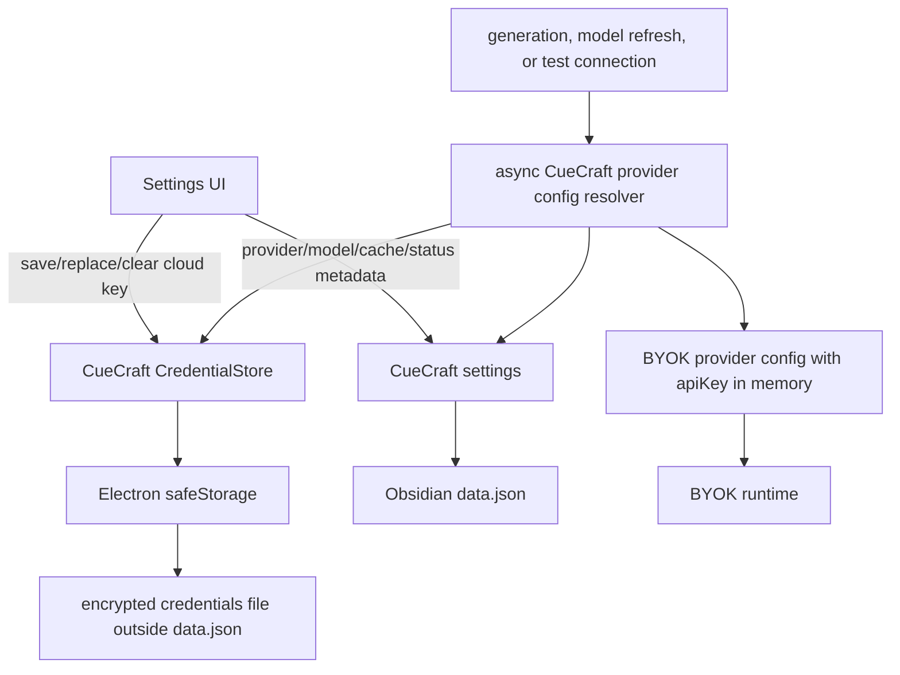
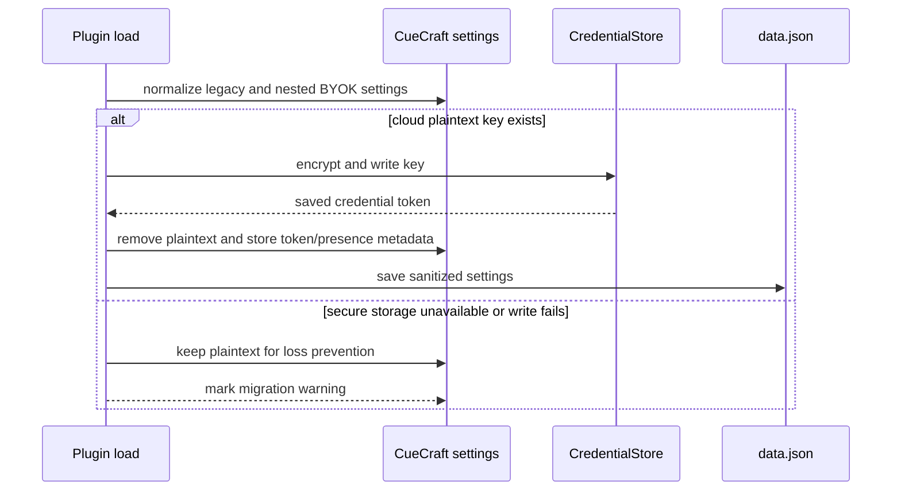

# Secure BYOK Credential Storage - Plan

## Goal Capsule

| Field | Value |
|---|---|
| Objective | Move cloud provider API keys out of Obsidian `data.json` and into a CueCraft-owned encrypted credential file backed by Electron `safeStorage`, while keeping BYOK persistence-free and Electron-free. |
| Authority | User-confirmed direction on 2026-06-29: CueCraft should use Electron `safeStorage`; BYOK should not be tied to Electron; cloud keys must not be stored in `data.json`. |
| Execution profile | Standard/deep security-sensitive refactor across settings persistence, provider construction, migration, and setup status. |
| Stop conditions | Stop if `safeStorage` is unavailable or reports Linux `basic_text` for cloud key storage; stop if migration cannot write encrypted credentials without preserving the old plaintext settings. |
| Tail ownership | CueCraft owns secure credential storage and migration. BYOK owns runtime provider contracts and receives resolved secrets only at call time. |

---

## Product Contract

### Summary

CueCraft should stop treating cloud API keys as ordinary BYOK settings. `data.json` should keep provider choice, model selection, fetched model metadata, verification snapshots, and non-secret local provider values, while cloud API keys live in a separate encrypted credentials file that CueCraft reads and writes through Electron `safeStorage`.

This plan supersedes the storage part of `docs/plans/2026-06-27-002-feat-ai-settings-simplification-plan.md`: CueCraft can still persist non-secret BYOK settings in `data.json`, but cloud API keys are no longer part of that nested settings object.

### Problem Frame

The current BYOK settings shape has one `credential: string` field for cloud API keys, Ollama hosts, and CLI commands. That makes cloud secrets flow into `src/byok-cuecraft-adapter.ts`, the settings UI, setup status fingerprints, provider construction, and finally Obsidian `saveData`, which serializes them into the plugin data object.

That is not the boundary CueCraft wants long-term. `docs/byok-extraction.md` already says BYOK should not own encryption or persistence, and the future standalone TypeScript BYOK package should receive provider configs after an app has resolved credentials. CueCraft is the app in this repo, so it should own the secure store without importing Electron into `src/byok/**`.

Electron `safeStorage` is a good fit for the current desktop-only Obsidian plugin because `manifest.json` is already `isDesktopOnly: true`, `esbuild.config.mjs` already externalizes `electron`, and `safeStorage` avoids the native binary distribution work that `@napi-rs/keyring` would introduce. The important guardrail is Linux: if Electron selects `basic_text`, CueCraft must refuse cloud key storage instead of silently downgrading to weak protection.

### Requirements

**Secret Storage**

- R1. Cloud provider API keys for Anthropic, OpenAI, Google, xAI, and OpenRouter are never written to `data.json` after a successful migration or save.
- R2. CueCraft stores cloud provider API keys in a separate encrypted credential file outside `data.json`, using Electron `safeStorage` to encrypt and decrypt string payloads.
- R3. CueCraft refuses to save, migrate, decrypt, or use cloud API keys when `safeStorage` is unavailable or the selected Linux backend is `basic_text`.
- R4. Encrypted credentials are not deleted or overwritten when `safeStorage`, file I/O, or migration fails.

**BYOK Boundary**

- R5. `src/byok/**` remains persistence-free and Electron-free; BYOK runtime configs still receive plain `apiKey` values only after CueCraft resolves them at runtime.
- R6. BYOK-facing stored state no longer requires a generic plaintext `credential` value for cloud providers.
- R7. Non-secret provider inputs remain persistable in normal settings: Ollama host, Codex CLI command, Claude CLI command, selected models, model caches, and verification metadata.

**Migration and Runtime Behavior**

- R8. Existing plaintext cloud API keys migrate into the encrypted credential file before CueCraft removes them from persisted settings.
- R9. Migration is loss-resistant: if encrypted storage cannot be written and verified, CueCraft leaves the legacy plaintext value intact and surfaces a setup warning.
- R10. Provider creation, model refresh, connection testing, generation, and study-area generation resolve cloud API keys from the secure store immediately before creating a BYOK runtime.
- R11. Setup status and verification freshness use credential presence plus a non-secret change token, not a stored plaintext key or weak key-derived hash.

**Settings UX**

- R12. Settings never render a saved cloud API key as an input value by default.
- R13. Settings show a saved-key state with replace and clear affordances for cloud providers.
- R14. Settings show an actionable unavailable-storage state when secure credential storage is unavailable, while Ollama and CLI providers remain usable.
- R15. Changing, clearing, or migrating a cloud key resets fetched model state and marks prior connection verification stale.

**Quality**

- R16. Tests cover migration success and failure, no plaintext persistence, unsafe Linux backend refusal, runtime key resolution, saved-key UI state, and Ollama/CLI regression behavior.
- R17. Documentation describes CueCraft's secure-storage model and BYOK's caller-owned persistence boundary.

### Acceptance Examples

- AE1. Given `data.json` contains an existing OpenAI key, when CueCraft loads and `safeStorage` is available, then the key is encrypted into the credential file and the next saved `data.json` contains no OpenAI key value.
- AE2. Given migration cannot write the encrypted credential file, when CueCraft loads settings with a legacy plaintext key, then the key remains in settings and CueCraft warns that secure migration is incomplete.
- AE3. Given Electron reports the Linux `basic_text` backend, when a user tries to save a cloud API key, then CueCraft refuses the save and explains that secure storage is unavailable.
- AE4. Given a cloud key is already saved, when settings render, then the password field is empty and the UI shows that a key is saved without exposing the key.
- AE5. Given a saved cloud key and selected model, when generation starts, then CueCraft decrypts the key in memory, creates the BYOK runtime, and does not write the plaintext key back to settings.
- AE6. Given an Ollama host or CLI command is configured, when settings save, then those non-secret values continue to round-trip through `data.json`.

### Scope Boundaries

#### In Scope

- CueCraft-owned encrypted credential store using Electron `safeStorage`.
- Separate credentials file outside `data.json`.
- Migration from existing flat and nested plaintext cloud credential fields.
- Runtime provider construction changes needed to decrypt keys on demand.
- Settings UI changes for saved, replace, clear, and unavailable cloud key states.
- Focused tests and documentation updates.

#### Deferred to Follow-Up Work

- Optional command-based cloud credential sources such as `op`, `bw`, or environment-variable references.
- Cross-device credential sync or backup UX for encrypted credential files.
- Publishing BYOK as a standalone package.

#### Outside This Product's Identity

- Adding `@napi-rs/keyring` or `keyring-node` to CueCraft for this work.
- Moving Electron or secure-storage logic into `src/byok/**`.
- Storing encrypted cloud key blobs inside `data.json`.
- Adding mobile support for cloud key storage; the plugin is already desktop-only.

---

## Planning Contract

### Key Technical Decisions

- KTD1. Use Electron `safeStorage` in CueCraft, not `@napi-rs/keyring`. `safeStorage` ships with Electron, so plugin distribution stays focused on the bundled JavaScript, manifest, and styles rather than native `.node` binaries and platform-specific package filtering.
- KTD2. Store encrypted credentials in a separate CueCraft credential file. `data.json` keeps only non-secret provider settings and metadata, satisfying the user's requirement that cloud keys are not stored there.
- KTD3. Prefer the async `safeStorage` APIs where Obsidian's Electron runtime supports them. If the runtime only supports the sync API, implementation may wrap it behind the same async interface, but it must still enforce availability and `basic_text` checks.
- KTD4. Treat Linux `basic_text` as unavailable for cloud secrets. A feature that silently stores secrets under weak fallback semantics is worse than an explicit setup block.
- KTD5. Keep BYOK app-agnostic. Changes under `src/byok/**` are limited to neutral metadata/state contracts if needed; no Electron imports, Obsidian imports, filesystem writes, or storage policy enters BYOK.
- KTD6. Replace cloud key fingerprints with non-secret credential change tokens. A token generated when the key is saved or migrated can mark verification stale without storing the key or a weak key hash.
- KTD7. Decrypt only at runtime boundaries. Plaintext keys exist only in local variables needed to create a BYOK provider for model refresh, test connection, generation, or study-area work.
- KTD8. Make migration two-phase. Write and read-check the encrypted credential first, then remove plaintext from settings and save `data.json`; on failure, keep the old value and notify the user.
- KTD9. Preserve local providers as they are. Ollama host and CLI command values are not API secrets and should remain in the normal settings flow.

### High-Level Technical Design

### System-Wide Impact

- Settings persistence changes from one JSON-only store to JSON metadata plus a credential file.
- Provider construction becomes async where cloud providers are involved.
- Ribbon/status setup checks need secure-store presence information instead of a direct settings string.
- Tests must mock the credential store and Electron `safeStorage` instead of importing Electron directly.
- Documentation must reconcile the older "CueCraft persists BYOK settings" plan language with the new cloud secret exception.

### Alternatives Considered

| Alternative | Decision | Rationale |
|---|---|---|
| Keep plaintext in `data.json` and improve copy | Rejected | It acknowledges the problem without reducing the risk. |
| Use `@napi-rs/keyring` in CueCraft | Rejected for now | It matches the upstream `cc-byok` model, but native binary distribution is unnecessary while CueCraft is already an Electron desktop plugin. |
| Store `safeStorage` encrypted blobs inside `data.json` | Rejected | It still puts cloud credential material in the file the user explicitly wants to keep non-secret. |
| Move secure storage into BYOK | Rejected | It would couple the future standalone TypeScript library to Electron or platform storage policy. |
| Add command/env secret providers now | Deferred | It is a useful future fallback, but it widens UX and threat-model scope beyond the confirmed `safeStorage` plan. |

### Risks & Dependencies

- **Linux availability:** Some Linux installs may not have a supported secret service and may report `basic_text`. Mitigation: block cloud key storage with a clear settings state and keep local providers usable.
- **Migration loss:** Removing plaintext before the encrypted file is durable would lose keys. Mitigation: two-phase migration with read-check and no deletion on failure.
- **Async churn:** Current `makeProvider()` and `isConfigured()` are synchronous. Mitigation: isolate async credential resolution behind CueCraft helpers and update call sites in one unit.
- **Accidental DOM exposure:** Existing settings inputs prefill saved keys. Mitigation: replace with saved/replace/clear UI and tests that assert the key string is not rendered.
- **Credential file corruption:** Encrypted file read/write can fail independently from `data.json`. Mitigation: fail closed for cloud providers, keep old encrypted entries on write failure, and surface repair actions.
- **Verification drift:** Current setup status derives freshness from a weak key hash. Mitigation: store non-secret credential tokens and update snapshots when keys change.

### Sources & Research

- `docs/ideation/2026-06-29-byok-secure-credential-storage-ideation.md` documents the initial keychain-first recommendation and the later `safeStorage` option.
- `docs/byok-extraction.md` defines the current BYOK boundary and says BYOK does not own encryption or persistence of stored keys.
- `docs/plans/2026-06-27-001-refactor-byok-provider-module-plan.md` records the package-shaped BYOK direction and caller-owned credential persistence decision.
- `docs/plans/2026-06-27-002-feat-ai-settings-simplification-plan.md` is superseded only for cloud API-key storage in `data.json`; its UI and metadata goals remain compatible.
- `src/byok/types.ts`, `src/byok/setup-status.ts`, and `src/byok-cuecraft-adapter.ts` currently put `credential` into stored BYOK settings and derive setup status from that value.
- `src/main.ts` currently persists settings through `saveData` and constructs providers synchronously through `makeProvider()`.
- `src/settings.ts` currently writes cloud keys through `setCueCraftProviderCredential`, pre-fills password inputs, refreshes models, and tests connections through the same in-settings credential value.
- `manifest.json` already marks the plugin desktop-only.
- `esbuild.config.mjs` already externalizes `electron`.
- [Electron `safeStorage` documentation](https://www.electronjs.org/docs/latest/api/safe-storage) describes OS-backed string encryption and exposes Linux backend detection, including the unsafe `basic_text` backend.
- [Obsidian manifest reference](https://docs.obsidian.md/Reference/Manifest) documents plugin manifest metadata including desktop-only plugin behavior.

---

## Implementation Units

### U1. Add CueCraft Secure Credential Store

- **Goal:** Introduce a CueCraft-owned credential storage boundary backed by Electron `safeStorage` and a credentials file outside `data.json`.
- **Requirements:** R1, R2, R3, R4, R16
- **Dependencies:** None
- **Files:** `src/secure-credential-store.ts`, `src/electron-safe-storage.ts`, `tests/secure-credential-store.test.ts`, `tests/electron-safe-storage.test.ts`
- **Approach:** Define a small async credential-store interface with operations for capability check, save, read, clear, and presence. The `safeStorage` implementation should encrypt string keys to base64 payloads in a versioned credentials file and reject cloud secret operations when storage is unavailable or `basic_text` is selected. Electron access should be isolated in one module so Vitest can use fakes.
- **Patterns to follow:** Existing adapter style in `src/byok-cuecraft-adapter.ts`; transport injection pattern from BYOK provider tests; package desktop boundary from `esbuild.config.mjs`.
- **Test scenarios:**
  - Saving a cloud key with an available fake `safeStorage` writes only encrypted/base64 material to the credentials file fixture.
  - Reading a saved key decrypts to the original plaintext without exposing it through settings metadata.
  - Clearing a saved key removes only that provider entry and leaves other provider entries intact.
  - When the fake selected backend is `basic_text`, cloud save/read reports unavailable and does not write a credential file.
  - When credential file JSON is corrupt, reads fail closed with an actionable error and do not overwrite the file.
  - When a write fails after an old encrypted key exists, the old encrypted key remains available.
- **Verification:** Credential storage works through fakes without importing Electron in tests, and unsafe storage states are represented as first-class results instead of swallowed exceptions.

### U2. Split Cloud Secret Metadata from Provider Settings

- **Goal:** Remove plaintext cloud API-key storage from the BYOK stored settings path while preserving non-secret host and command values.
- **Requirements:** R1, R5, R6, R7, R11, R15, R16
- **Dependencies:** U1
- **Files:** `src/byok/types.ts`, `src/byok/setup-status.ts`, `src/byok-cuecraft-adapter.ts`, `tests/byok-cuecraft-adapter.test.ts`, `tests/provider-setup-status.test.ts`, `tests/byok/public-contract.test.ts`
- **Approach:** Replace the cloud use of `ByokProviderStoredSettings.credential` with non-secret saved-state metadata such as presence and credential version. Keep the persisted value for providers whose credential kind is `host` or `command`. The CueCraft adapter remains the place that understands which provider kinds use secure storage.
- **Patterns to follow:** `byokProviderDefinition(provider).credentialKind` branching in `src/byok/registry.ts`; setup-status stale detection in `src/byok/setup-status.ts`.
- **Test scenarios:**
  - Normalizing an OpenAI or OpenRouter provider with secure credential metadata produces no stored plaintext credential.
  - Normalizing Ollama preserves the host in provider settings.
  - Normalizing Codex CLI and Claude CLI preserves command defaults and model overrides.
  - Setup status reports `keySaved: true` for a cloud provider with saved credential metadata and no plaintext key.
  - Changing a cloud credential version marks prior verification stale.
  - BYOK public-contract tests prove `src/byok/**` does not import Electron, Obsidian, CueCraft plugin classes, or the secure credential store.
- **Verification:** Stored settings can represent cloud key presence without containing the key, and local provider behavior still round-trips.

### U3. Implement Loss-Resistant Migration

- **Goal:** Migrate existing plaintext cloud keys from flat legacy fields and nested BYOK settings into the secure credential file without data loss.
- **Requirements:** R1, R4, R8, R9, R15, R16
- **Dependencies:** U1, U2
- **Files:** `src/main.ts`, `src/byok-cuecraft-adapter.ts`, `src/secure-credential-store.ts`, `tests/byok-cuecraft-adapter.test.ts`, `tests/plugin-data-migration.test.ts`
- **Approach:** During plugin data load, detect cloud plaintext values from legacy flat settings and nested BYOK settings. For each cloud provider, write and read-check the encrypted credential before clearing the plaintext and saving sanitized settings. If any provider fails migration, keep its plaintext field and record a warning state for settings to render.
- **Patterns to follow:** `loadPluginData()` normalization in `src/main.ts`; existing `normalizeCueCraftProviderSettings()` migration tests in `tests/byok-cuecraft-adapter.test.ts`.
- **Test scenarios:**
  - Flat legacy `openaiApiKey` migrates into the credential store and the saved plugin data contains no key string.
  - Nested BYOK `providers.openrouter.credential` migrates into the credential store and is removed from settings.
  - Multiple cloud providers migrate independently, so one failure does not delete another provider's old plaintext key.
  - If secure-store write succeeds but read-check fails, plaintext remains in settings and sanitized save is skipped for that provider.
  - Migration preserves selected provider, selected model, fetched model metadata, and verification snapshots.
  - Running migration twice is idempotent and does not change credential tokens unnecessarily.
- **Verification:** A simulated save after successful migration cannot find known key test strings in serialized plugin data, while migration failure keeps recoverable state.

### U4. Resolve Credentials at Runtime Boundaries

- **Goal:** Make provider creation and provider-dependent operations resolve cloud keys from the secure store immediately before use.
- **Requirements:** R5, R10, R11, R16
- **Dependencies:** U1, U2, U3
- **Files:** `src/main.ts`, `src/settings.ts`, `src/byok-cuecraft-adapter.ts`, `tests/byok-cuecraft-adapter.test.ts`, `tests/provider-factory.test.ts`, `tests/study-area.test.ts`, `tests/generator.test.ts`
- **Approach:** Replace synchronous provider construction with an async CueCraft config resolution path for operations that need a provider. Keep BYOK provider factories synchronous if possible by passing them a fully resolved config; CueCraft handles the async storage lookup before calling BYOK.
- **Patterns to follow:** Current `makeProvider()` call sites in `src/main.ts` and `src/settings.ts`; BYOK `createByokProvider(config, deps)` contract in `src/byok/providers/provider-factory.ts`.
- **Test scenarios:**
  - Cloud model refresh decrypts the saved key and passes it to BYOK without writing it into settings.
  - Cloud connection test fails with a clear unavailable-storage result when the credential store cannot decrypt.
  - Note generation resolves the selected provider key once per run and passes the key into the BYOK runtime.
  - Study-area generation resolves credentials before work begins and handles unavailable storage like provider setup failure.
  - Ollama and CLI providers still construct without touching the secure credential store.
  - Automatic generation does not repeatedly show user-facing notices when secure storage is unavailable.
- **Verification:** Every provider-using path compiles with async credential resolution, and cloud operations cannot be reached through stale plaintext settings.

### U5. Update Settings UI for Saved, Replace, Clear, and Unavailable States

- **Goal:** Prevent saved cloud keys from being rendered back into the DOM and give users clear controls for replacing or clearing them.
- **Requirements:** R3, R12, R13, R14, R15, R16
- **Dependencies:** U1, U2, U4
- **Files:** `src/settings.ts`, `src/notice.ts`, `tests/cloud-credential-settings.test.ts`, `tests/cloud-model-settings.test.ts`, `tests/notice.test.ts`
- **Approach:** Change cloud credential controls so saved keys render as a saved state plus an empty replacement input and clear action. Disable cloud key save/replace when secure storage is unavailable. Keep model refresh buttons and test connection disabled until a secure key is saved and a model is selected where required.
- **Patterns to follow:** Existing `renderCloudCredentialSettings()`, `renderAnthropicCredentialSettings()`, `renderProviderModelSettings()`, and setup status rendering in `src/settings.ts`.
- **Test scenarios:**
  - A saved OpenAI key renders a saved state and does not place the key string in any input value or text node.
  - Entering a replacement key stores it through the credential store, clears model-list caches, and re-renders as saved.
  - Clearing a saved key removes credential metadata, clears fetched model state, and marks connection verification stale.
  - Unavailable secure storage disables cloud key save and shows copy that points users to supported secure storage or local providers.
  - Anthropic's specialized model selector still disables model fetch until a saved key exists.
  - Ollama host and CLI command fields still prefill their non-secret values as before.
- **Verification:** Settings support the expected cloud key lifecycle without exposing the saved key in the rendered UI.

### U6. Rework Setup Status and Verification Snapshots

- **Goal:** Make setup status and verified/stale connection state work without plaintext cloud keys or weak key-derived hashes.
- **Requirements:** R11, R15, R16
- **Dependencies:** U2, U3, U5
- **Files:** `src/byok/setup-status.ts`, `src/byok-cuecraft-adapter.ts`, `tests/provider-setup-status.test.ts`, `tests/byok-cuecraft-adapter.test.ts`, `tests/byok/model-status.test.ts`
- **Approach:** Store a non-secret credential version or change token when a cloud key is saved or migrated. Verification snapshots should compare that token plus selected model state. Local providers can continue using their existing non-secret host/command value or an equivalent token.
- **Patterns to follow:** `recordProviderConnectionSuccess()` and `deriveProviderSetupStatus()` in `src/byok/setup-status.ts`.
- **Test scenarios:**
  - Recording a cloud provider connection stores the current credential token and model.
  - Replacing a cloud key changes the token and marks the old verification stale.
  - Clearing a cloud key reports incomplete setup and stale/untested connection state.
  - Changing only a cloud model still marks verification stale.
  - CLI default model sentinel behavior remains unchanged.
  - Ollama host/model stale detection remains unchanged.
- **Verification:** Setup status has no dependency on plaintext cloud key strings and still reflects real setup changes.

### U7. Documentation and Compatibility Cleanup

- **Goal:** Document the new storage model and remove stale claims that cloud API keys live in normal BYOK settings.
- **Requirements:** R5, R7, R17
- **Dependencies:** U1, U2, U3, U4, U5, U6
- **Files:** `docs/byok-extraction.md`, `docs/CueCraft-Progress.md`, `docs/plans/2026-06-27-002-feat-ai-settings-simplification-plan.md`, `tests/byok/public-contract.test.ts`
- **Approach:** Update docs to say CueCraft stores non-secret BYOK settings in `data.json` and cloud API keys in a separate encrypted credential file. Keep the old AI settings plan as historical context, but add a supersession note so future implementers do not follow its storage wording.
- **Patterns to follow:** Current BYOK extraction docs and progress-note style.
- **Test scenarios:**
  - Boundary test prevents Electron imports under `src/byok/**`.
  - Documentation examples show BYOK receiving a runtime `apiKey` from the caller rather than loading it itself.
- **Verification:** The docs and tests agree that BYOK is standalone-friendly and CueCraft owns secure persistence.

---

## Verification Contract

| Gate | Command | Proves |
|---|---|---|
| Typecheck | `bun run typecheck` | Async provider resolution and credential metadata type changes compile across settings, main plugin runtime, and BYOK adapters. |
| Unit tests | `bun run test` | Migration, secure-store fakes, provider config resolution, setup status, settings helpers, and provider regressions pass without live provider accounts. |
| Build | `bun run build` | The Obsidian plugin bundle still builds with `electron` externalized and no new native dependency packaging. |
| Secret audit | Targeted test/assertion over serialized plugin data | Known test API-key strings do not appear in sanitized `data.json` after successful save or migration. |
| Boundary audit | BYOK public-contract/import-boundary test | `src/byok/**` remains free of Electron, Obsidian, DOM UI, and CueCraft storage imports. |

---

## Definition of Done

- Cloud API keys are stored only in the encrypted credential file after successful save or migration.
- `data.json` contains no cloud key plaintext or encrypted cloud key blob.
- Cloud providers fail closed when secure storage is unavailable or unsafe.
- Migration preserves recoverability on every failure path.
- Settings never render saved cloud key plaintext by default.
- BYOK remains persistence-free, Electron-free, and future package-friendly.
- Ollama and CLI provider behavior is unchanged except where setup status now shares token-based verification helpers.
- The verification contract passes.
- Documentation names the new storage boundary and supersedes the older plaintext storage assumption.
- Any abandoned exploratory code from implementation is removed before landing.
