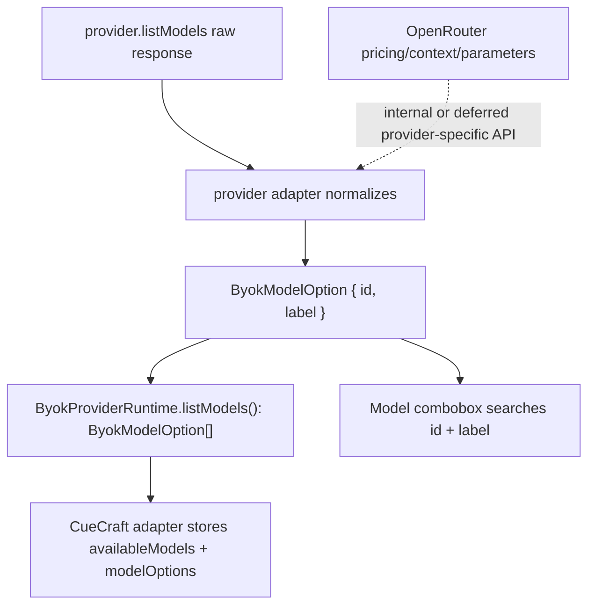

# BYOK Portable Model Options - Plan

## Goal Capsule

| Field | Value |
|---|---|
| Objective | Shrink `packages/byok` model option contracts to provider-portable identity data before extraction as a public TypeScript library. |
| Authority | User asked to apply the strongest interface-review recommendation: make `ByokModelOption` boring before extraction, because `pricing`, `contextLength`, `supportedParameters`, provider-prefix parsing, and compatibility badges are OpenRouter-shaped and subjective. |
| Execution profile | Standard refactor touching exported TypeScript types, provider model normalization, CueCraft model-combobox callers, package docs, and public-contract tests. |
| Stop conditions | Stop if removing rich metadata would require changing provider generation behavior, credential setup behavior, or adding replacement UX beyond preserving model selection. |
| Tail ownership | `ce-work` owns code changes, tests, and docs updates; remaining broader interface questions should become follow-up notes rather than expanding this PR. |

---

## Product Contract

### Summary

BYOK should expose model-list results as portable model choices, not as a partially-populated cross-provider metadata schema. The public model option shape should carry only stable fields every provider can supply: model ID and display label.

CueCraft can still render fetched model selectors and keep current selected-model behavior. It should stop depending on OpenRouter-only pricing, context-length, supported-parameter, provider-prefix, and compatibility-score helpers from `@cuecraft/byok`.

### Problem Frame

`ByokModelOption` currently mirrors OpenRouter `/models` data and forces other providers into null-filled fields. That makes the public library interface look broader and more reliable than it is. It also exports subjective helpers such as "Low cost" and "Large context" sorting that depend on missing metadata for most providers.

This is the wrong seam for an open-source library. Provider adapters should normalize model choices to a small common interface; provider-specific richness can remain internal or return later through explicitly named provider-specific APIs.

### Requirements

**Portable Model Contract**

- R1. `ByokModelOption` exposes only model identity and display fields that every listed provider can supply.
- R2. `listModels()` returns a normalized model-option array for providers that support model discovery, rather than a `string | rich option` union.
- R3. Fallback model-option helpers create portable options without requiring a provider-specific `source` enum.

**Provider-Specific Metadata Removal**

- R4. OpenRouter `pricing`, `contextLength`, `supportedParameters`, and upstream-provider parsing are removed from the main public model option contract.
- R5. OpenRouter raw response types and normalizers are no longer exported from the main public barrel.
- R6. Subjective compatibility helpers and badges based on rich OpenRouter metadata are removed from the main public API and from CueCraft settings UI callers.

**Compatibility and Documentation**

- R7. CueCraft model selectors still show fetched model IDs and labels, preserve selected custom models, and search by ID/label.
- R8. Package README, API reference, and extraction notes document the smaller model-list contract and stop advertising compatibility metadata as public surface.
- R9. Public-contract tests fail if the removed provider-specific helpers re-enter the main barrel unintentionally.

### Scope Boundaries

#### In Scope

- `packages/byok` model option types, model-list normalization, public exports, docs, and tests.
- CueCraft callers that import `ModelOption`, `ModelOptionSource`, `sortByokModelOptions`, or model compatibility helpers from `@cuecraft/byok`.
- Tests that assert model-option shape, model-list behavior, and public API exports.

#### Deferred to Follow-Up Work

- Removing Anthropic-specific helper exports such as custom model selection, model hints, and display copy.
- Separating CueCraft-style stored settings and setup-status helpers from the runtime package.
- Reworking provider registry UI metadata, icons, `requiresNetwork`, `requiresDownload`, or `ByokProviderDeps.appInfo`.
- Adding provider-specific subpaths for richer metadata such as OpenRouter model pricing.

---

## Planning Contract

### Key Technical Decisions

- KTD1. Make `ByokModelOption` the stable public model-list item. It should contain `id` and `label` only, because these fields are portable across OpenAI, Anthropic, Google, xAI, OpenRouter, and Ollama.
- KTD2. Normalize provider `listModels()` outputs at the provider seam. Returning a single `ByokModelOption[]` removes the downstream `string | option` split and keeps CueCraft adapter logic simple.
- KTD3. Delete subjective compatibility sorting from the package. "Large context" and "Low cost" are product/UI opinions over incomplete provider metadata, so they do not belong in the main public library API.
- KTD4. Preserve OpenRouter display labels where available. The OpenRouter adapter can still map `name` to `label`, but raw pricing/context/parameter fields should not cross the public seam.
- KTD5. Keep this PR focused on model-list shape. Broader interface cleanup is real, but bundling Anthropic helpers or setup-state removal into this change would make review harder and risk unrelated behavior drift.

### High-Level Technical Design

### Assumptions

- The current UI does not need to preserve OpenRouter compatibility badges as part of this cleanup; losing those badges is acceptable because the user specifically flagged them as questionable provider-specific value.
- Existing generated declarations under `packages/byok/.tmp/types` are build output and should not be edited manually.
- The package can make breaking public API changes because it is still `0.0.0-private` and has not been published.

### Sources and Research

- `packages/byok/src/types.ts` defines `ByokModelOption` with OpenRouter-rich fields and `ByokListedModel` as a string-or-option union.
- `packages/byok/src/models/model-options.ts` exposes `OpenRouterRawModel`, `normalizeOpenRouterModel`, and source-aware string normalization.
- `packages/byok/src/models/model-compatibility.ts` implements structured-output, low-cost, and large-context helpers from optional rich metadata.
- `src/model-combobox.ts`, `src/settings.ts`, and `src/byok-cuecraft-adapter.ts` are the primary CueCraft consumers of rich model options and compatibility helpers.
- `docs/byok-extraction.md` currently advertises rich model options and OpenRouter compatibility metadata as public surface.

---

## Implementation Units

### U1. Collapse Public Model Types

- **Goal:** Replace the rich model option and listed-model union with a portable `ByokModelOption` list contract.
- **Requirements:** R1, R2, R3, R4
- **Dependencies:** None
- **Files:** `packages/byok/src/types.ts`, `packages/byok/src/registry.ts`, `packages/byok/src/models/model-options.ts`, `packages/byok/src/providers/types.ts`, `packages/byok/src/providers/ai-sdk-provider.ts`, `packages/byok/src/providers/anthropic-provider.ts`, `packages/byok/src/providers/openai-provider.ts`, `packages/byok/src/providers/google-provider.ts`, `packages/byok/src/providers/xai-provider.ts`, `packages/byok/src/providers/openrouter-provider.ts`, `packages/byok/src/providers/ollama-provider.ts`, `packages/byok/tests/model-options.test.ts`, `packages/byok/tests/ai-sdk-providers.test.ts`, `packages/byok/tests/anthropic-provider.test.ts`, `packages/byok/tests/ollama-provider.test.ts`
- **Approach:** Redefine `ByokModelOption` as `{ id: string; label: string }`. Remove `ByokModelOptionSource` and `ByokListedModel` if no longer needed. Update model helpers so string IDs normalize to portable options and OpenRouter model listing keeps only `id` and `name`/`label`. Ensure every provider runtime that lists models returns portable options.
- **Execution note:** Start with package model-option tests so the new shape is asserted before changing consumers.
- **Patterns to follow:** Existing `normalizeModelIds()` and `sortModelOptions()` helper style; provider `listModels()` tests that inject fake list implementations.
- **Test scenarios:**
  - Normalizing `["gpt-4o-mini"]` returns `{ id: "gpt-4o-mini", label: "gpt-4o-mini" }`.
  - Normalizing an OpenRouter model with `id` and `name` returns a portable option that preserves the display name as `label`.
  - OpenAI, Google, xAI, Anthropic, Ollama, and OpenRouter provider tests expect `listModels()` to resolve to model-option arrays, not mixed string/rich metadata arrays.
  - `isModelOption()` rejects plain strings and objects missing either `id` or `label`.
- **Verification:** Package model-list behavior is uniform and TypeScript callers no longer see nullable pricing/context/parameter fields on `ByokModelOption`.

### U2. Remove Compatibility Metadata API

- **Goal:** Remove OpenRouter-rich and subjective model compatibility helpers from the main public API.
- **Requirements:** R4, R5, R6, R9
- **Dependencies:** U1
- **Files:** `packages/byok/src/index.ts`, `packages/byok/src/models/model-compatibility.ts`, `packages/byok/tests/public-contract.test.ts`, `packages/byok/tests/model-compatibility.test.ts`, `packages/byok/tests/model-status.test.ts`, `packages/byok/tests/package-readiness.test.ts`
- **Approach:** Stop exporting `normalizeOpenRouterModel`, `OpenRouterRawModel`, `modelCompatibilityBadges`, `modelCompatibilityWarning`, `modelStructuredOutputSupport`, `isLargeContextModel`, `isLowCostModel`, `sortByokModelOptions`, and related types from the main barrel. Delete or internalize tests that only cover removed public helpers. Keep `sortModelOptions()` if CueCraft still needs stable current-model-first sorting.
- **Patterns to follow:** `packages/byok/tests/public-contract.test.ts` already snapshots intentional exports and should be the main guard against accidental surface growth.
- **Test scenarios:**
  - Public barrel export snapshot no longer contains removed OpenRouter raw normalizer or compatibility helpers.
  - Import-boundary and package-readiness tests still pass with the smaller model helper set.
  - No package test imports `model-compatibility.ts` as a public behavior after removal.
- **Verification:** The public API contains portable model helpers only, and provider-specific metadata cannot be imported from `@cuecraft/byok`.

### U3. Adapt CueCraft Model Selector Callers

- **Goal:** Update CueCraft app code to consume portable model options while preserving model selection and search behavior.
- **Requirements:** R7
- **Dependencies:** U1, U2
- **Files:** `src/model-combobox.ts`, `src/settings.ts`, `src/byok-cuecraft-adapter.ts`, `src/cue-provider.ts`, `tests/model-combobox.test.ts`, `tests/byok-cuecraft-adapter.test.ts`
- **Approach:** Remove `ModelOptionSource`, `sortByokModelOptions`, and compatibility helper imports. Build fallback options from current model IDs without provider source. Search model suggestions by `id` and `label` only. Simplify model refresh application now that listed models are always normalized options; keep `availableModels` as sorted IDs for existing settings compatibility.
- **Patterns to follow:** Existing combobox dedupe/current-model fallback behavior in `buildModelComboboxOptions()` and adapter model-refresh storage behavior in `applyCueCraftListedModels()`.
- **Test scenarios:**
  - A fetched model list displays labels when labels differ from IDs.
  - A custom current model not present in fetched options is added as a selectable fallback.
  - Filtering by model ID or label still returns expected suggestions.
  - Applying listed models stores `availableModels` as IDs and `modelOptions` as portable options.
  - Existing OpenRouter model-option fixtures no longer include pricing/context/parameter fields.
- **Verification:** CueCraft settings model selectors work without badges or compatibility warnings and keep current fetched-model persistence behavior.

### U4. Update Documentation and API Reference

- **Goal:** Align package docs and extraction notes with the smaller public model interface.
- **Requirements:** R8, R9
- **Dependencies:** U1, U2, U3
- **Files:** `packages/byok/README.md`, `packages/byok/API.md`, `docs/byok-extraction.md`, `packages/byok/tests/public-contract.test.ts`
- **Approach:** Replace rich model option documentation with the portable `{ id, label }` contract. Remove docs that advertise pricing/context/supported-parameter badges or `OpenRouterRawModel` as public API. Note that provider-specific metadata is intentionally deferred until a named provider-specific API exists.
- **Patterns to follow:** Existing package docs structure and `documents examples against the public barrel` assertion in the public-contract test.
- **Test scenarios:**
  - README and API examples import only names exported from the public barrel.
  - Extraction notes describe model discovery as portable model choices rather than rich OpenRouter metadata.
  - Public contract test continues to reject undocumented internal submodule imports in docs examples.
- **Verification:** A future reader preparing extraction will not be pointed toward removed rich model APIs.

---

## Verification Contract

| Gate | Command | Done signal |
|---|---|---|
| BYOK typecheck | `bun run typecheck:byok` | Package declarations compile with the portable model option shape. |
| BYOK tests | `bun run test:byok` | Provider, model helper, public-contract, and package-readiness tests pass. |
| Workspace typecheck | `bun run typecheck` | CueCraft callers compile against the smaller BYOK public API. |
| Focused app tests | `bun test tests/model-combobox.test.ts tests/byok-cuecraft-adapter.test.ts` | Model selector and settings adapter behavior remains intact. |

---

## Definition of Done

- `ByokModelOption` no longer exposes `provider`, `source`, `contextLength`, `pricing`, or `supportedParameters`.
- `ByokProviderRuntime.listModels()` no longer returns a mixed `string | ByokModelOption` union.
- The main `@cuecraft/byok` barrel no longer exports OpenRouter raw model normalizers or compatibility badge/warning helpers.
- CueCraft settings and model combobox code compile and pass focused tests without compatibility badges.
- README, API reference, and extraction notes describe the portable model option contract.
- Removed helper tests are deleted or replaced with tests that guard the new surface; no abandoned compatibility code remains in the diff.
