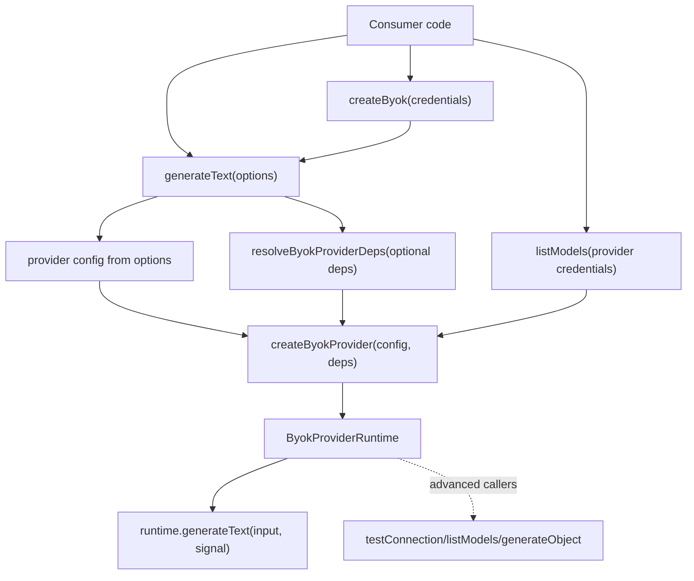

# BYOK Function-First API - Plan

## Goal Capsule

| Field | Value |
|---|---|
| Objective | Add a tiny function-first BYOK API so a TypeScript consumer can generate text with one import and one options object, while preserving the lower-level provider runtime for custom transports and CueCraft internals. |
| Authority | User asked LFG to apply the strongest recommendation from `docs/ideation/2026-07-03-byok-interface-simplification-ai-sdk-comparison.html`: copy the AI SDK's simplicity shape, not its exact API. |
| Execution profile | Standard public API feature touching `packages/byok` exported types, runtime construction defaults, README/API docs, examples, and package public-contract tests. |
| Stop conditions | Stop if the change requires replacing provider implementations, changing CueCraft generation behavior, adding streaming support, or breaking existing `createByokProvider(config, deps)` callers. |
| Tail ownership | `ce-work` owns implementation, verification, and PR preparation; broader package subpath separation and streaming remain follow-up work. |

---

## Product Contract

### Summary

BYOK should make first text generation feel small. The default README path should be one import and one call, with credentials explicit and runtime machinery hidden unless the caller needs it.

This plan adds a top-level `generateText` facade, a credential-bound `createByok` client, and optional default transport dependencies. It keeps the existing provider runtime API as the advanced layer so CueCraft and custom-runtime consumers can continue using it.

### Problem Frame

The current BYOK quick start teaches `ByokHttpClient`, `ByokProviderDeps`, runtime construction, connection testing, and generation before the first successful text response. That is too much ceremony for an open-source TypeScript library whose first impression will be compared against AI SDK's `generateText({ model, prompt })` path.

BYOK should not clone AI SDK exactly because BYOK's domain includes explicit user-owned credentials, local providers, model discovery, setup state, and custom transports. The simplification should put a thin BYOK-owned facade in front of the existing runtime rather than rewriting provider internals.

### Requirements

**Function-First Generation**

- R1. The main `@cuecraft/byok` entrypoint exports a `generateText` helper with a flat options object: provider config fields (`provider`, `apiKey` or `host`, `model`), prompt text, optional `signal`, and optional custom deps.
- R2. The helper returns the existing simple text output shape so first-call examples can destructure `{ text }`.
- R3. The helper supports browser/Electron-safe core providers: Anthropic, OpenAI, Google, xAI, OpenRouter, and Ollama.

**Credential-Bound Client**

- R4. The main entrypoint exports `createByok` for repeated calls with one provider credential or Ollama host.
- R5. The client exposes repeated text generation only: it binds provider credentials or Ollama host, and each text call supplies `model` plus text input. Advanced runtime access remains the existing `createByokProvider` layer.

**Default Transport Dependencies**

- R6. Runtime construction no longer requires callers to hand-write a fetch-to-`ByokHttpClient` adapter in environments where `globalThis.fetch` exists.
- R7. Existing custom `ByokProviderDeps` callers remain supported, including tests and app-owned transports.
- R7a. Default dependency resolution is implemented by an internal helper, not a new default public abstraction.
- R7b. Dependency merge behavior is defined: full deps win as supplied; cloud calls may provide only `fetchImpl`; Ollama calls may provide only `http`; missing `fetchImpl` fails with a clear BYOK error when a default fetch is unavailable.
- R7c. The default HTTP adapter forwards abort signals when available and caps response bodies before parsing JSON.

**Documentation and Public Contract**

- R8. `packages/byok/README.md` leads with the function-first happy path before runtime factories, model listing, setup status, or CLI providers.
- R9. `packages/byok/API.md` documents the facade, default dependency behavior, and the advanced runtime layer.
- R9a. README and API docs state the credential boundary: BYOK receives caller-owned secrets, does not persist or log them, browser/renderer usage is appropriate only for user-entered transient keys, and app-owned keys should stay behind a server, main process, or custom transport.
- R9b. README and API docs say BYOK is AI-SDK-shaped, not AI-SDK-compatible; callers needing AI SDK `LanguageModel` objects or full AI SDK result semantics should use AI SDK directly.
- R10. Public-contract and example tests guard the new exports and prevent README, API, and extraction docs from teaching internal imports.

**Local and Provider Metadata Safety**

- R11. Ollama hosts accepted by the facade and default runtime path must be valid `http:` or `https:` URLs without embedded credentials; LAN and remote hosts are allowed only as explicit caller input and documented as prompt destinations.
- R12. Provider-specific transmitted metadata is not part of the function-first API or shared dependency surface.

### Scope Boundaries

#### In Scope

- Main-entrypoint helpers for text generation and repeated credential-bound use.
- Optional/default BYOK transport dependency construction.
- Documentation changes that move runtime and setup-state APIs below the happy path.
- Package tests and example fixtures proving the new public surface.

#### Deferred to Follow-Up Work

- `streamText`; current provider runtimes expose non-streaming text only, so streaming would require a separate provider contract.
- Full public-surface subpath split such as `@cuecraft/byok/runtime`, `@cuecraft/byok/setup`, or `@cuecraft/byok/anthropic`.
- AI SDK `LanguageModel` compatibility adapters or exact result-object parity.
- Moving setup-state, registry, or Anthropic model-selection helpers out of the main barrel.
- Local CLI provider support in the main `generateText` helper; CLI execution remains Node-only through `@cuecraft/byok/node`.
- A loopback-only Ollama policy. Remote Ollama is a legitimate user-owned deployment, so this PR validates URL shape and documents the trust boundary rather than banning non-loopback hosts.

---

## Planning Contract

### Key Technical Decisions

- KTD1. Add a facade instead of replacing the runtime. `generateText` and `createByok` should delegate through `createByokProvider`, preserving provider behavior and avoiding a parallel implementation path.
- KTD2. Keep provider and credential explicit. BYOK should feel familiar to AI SDK users, but it should not hide credentials behind ambient provider conventions because explicit user-owned credentials are the package's reason to exist.
- KTD3. Make dependency injection optional, not obsolete. Default deps should use `globalThis.fetch` and an internal package-owned HTTP adapter; custom deps remain available for Electron IPC, tests, request instrumentation, and unusual runtimes.
- KTD4. Put Ollama on the same happy path when `host` is provided. Ollama is already a core provider and only needs the default HTTP adapter to avoid extra ceremony.
- KTD5. Keep `testConnection` and `generateObject` on the advanced runtime layer, while exposing model-free `listModels(options)` for setup-time discovery. Runtime `listModels()` remains available for callers that already need a provider runtime.
- KTD6. Support matrix is documented, not guessed from `fetch`. Node 20 and Electron main are first-class direct-call environments; Electron renderer and browser direct calls depend on provider CORS and host-app security policy; browser apps with app-owned keys should use a backend or custom transport.
- KTD7. The first `createByok` client should stay narrower than `ByokProviderRuntime`. If a caller wants runtime methods, `createByokProvider` is the named advanced API.

### High-Level Technical Design

### Assumptions

- This package is still `0.0.0-private`, but existing workspace callers should remain source-compatible unless they opt into the new facade.
- `globalThis.fetch` is available in the primary Node 20, browser, and Electron-adjacent environments documented for BYOK.
- Consumers that need custom request behavior will still pass `ByokProviderDeps`; the new defaults are a convenience path, not a security boundary.
- The ideation artifact is reference-only input for this implementation. Do not include it in the implementation PR unless the user separately asks to publish generated ideation docs.

### Sources and Research

- `docs/ideation/2026-07-03-byok-interface-simplification-ai-sdk-comparison.html` ranks the function-first facade as the strongest simplification.
- `packages/byok/README.md` currently starts with runtime factories, manual `ByokHttpClient` construction, and connection testing before text generation.
- `packages/byok/API.md` documents `createByokProvider(config, deps)` and required `ByokProviderDeps`.
- `packages/byok/src/providers/provider-factory.ts` centralizes core provider runtime creation and is the correct delegation seam.
- `packages/byok/src/types.ts` defines the current provider configs, deps, text input/output types, and runtime contract.
- `packages/byok/tests/public-contract.test.ts` snapshots the main public barrel and validates documentation examples against public imports.

---

## Implementation Units

### U1. Add Default Dependency Resolution

- **Goal:** Provide package-owned default `ByokProviderDeps` so common Node 20/browser/Electron-safe usage does not require a hand-written HTTP adapter.
- **Requirements:** R6, R7, R7a, R7b, R7c, R11
- **Dependencies:** None
- **Files:** `packages/byok/src/types.ts`, `packages/byok/src/providers/provider-factory.ts`, `packages/byok/src/providers/node-provider-factory.ts`, `packages/byok/src/providers/default-deps.ts`, `packages/byok/tests/provider-factory.test.ts`
- **Approach:** Introduce an internal dependency resolver that accepts existing full deps or provider-specific partial deps, defaults `fetchImpl` from `globalThis.fetch`, and builds the existing `ByokHttpClient` response shape with abort forwarding, capped response text, and best-effort JSON. Update core and Node provider factories to accept omitted deps while preserving current explicit-deps behavior. Normalize Ollama host URLs before runtime construction and reject non-http(s), embedded credentials, and invalid URLs.
- **Execution note:** Prove this with provider-factory tests before adding the facade, because all later units depend on default runtime construction.
- **Patterns to follow:** Existing `ByokHttpClient` response shape in README examples and provider-factory test setup.
- **Test scenarios:**
  - Calling `createByokProvider` for a cloud provider without deps uses `globalThis.fetch` and returns the expected runtime ID.
  - Calling `createByokProvider` for Ollama without deps uses the default HTTP adapter.
  - Passing explicit `fetchImpl` and `http` continues to route through the supplied functions.
  - Passing only `fetchImpl` works for cloud providers, and passing only `http` works for Ollama.
  - When no fetch implementation is available, runtime construction or first request fails with a clear BYOK provider error instead of a low-level undefined-function error.
  - Ollama rejects `file:`, `javascript:`, malformed URLs, and URLs with username/password credentials; explicit LAN or remote `http(s)` hosts remain accepted.
  - Default HTTP requests honor abort where fetch supports it and reject oversized response bodies before JSON parsing.
- **Verification:** Existing provider factory tests pass, and new tests prove old and new dependency paths both work.

### U2. Add Function-First Text Generation

- **Goal:** Export a top-level `generateText` helper from the main barrel for browser/Electron-safe providers.
- **Requirements:** R1, R2, R3, R9a, R10, R11, R12
- **Dependencies:** U1
- **Files:** `packages/byok/src/client.ts`, `packages/byok/src/index.ts`, `packages/byok/src/types.ts`, `packages/byok/tests/public-contract.test.ts`, `packages/byok/tests/client.test.ts`, `packages/byok/tests/fixtures/main-entrypoint.ts`
- **Approach:** Add explicit facade option types for a flat BYOK-owned API: cloud calls use `provider`, `apiKey`, `model`, `prompt`, optional `signal`, and optional `deps`; Ollama calls use `provider: "ollama"`, `host`, `model`, `prompt`, optional `signal`, and optional `deps`. The helper constructs a runtime through `createByokProvider` and calls `runtime.generateText`, returning the existing `ByokTextGenerationOutput`.
- **Patterns to follow:** Existing provider config discriminated unions in `types.ts` and the text output contract used by `ByokProviderRuntime.generateText`.
- **Test scenarios:**
  - An OpenAI-style options object creates the OpenAI runtime and returns `{ text }` from its text generator.
  - Anthropic, Google, xAI, and OpenRouter options are accepted by facade type and provider-dispatch tests so R3 coverage is explicit.
  - An Ollama-style options object creates the Ollama runtime, forwards prompt and abort signals, and returns `{ text }`.
  - The abort signal option is forwarded to `runtime.generateText`.
  - Provider-specific transmitted metadata is not accepted by the shared facade.
  - Public barrel export snapshot includes `generateText` and the new public facade types.
  - The main entrypoint fixture typechecks using the new happy-path import.
- **Verification:** Package public-contract tests and new facade tests prove the happy path without custom deps.

### U3. Add Credential-Bound Client

- **Goal:** Export `createByok` for repeated text-generation calls with a shared provider credential or Ollama host.
- **Requirements:** R4, R5, R10
- **Dependencies:** U1, U2
- **Files:** `packages/byok/src/client.ts`, `packages/byok/src/index.ts`, `packages/byok/src/types.ts`, `packages/byok/tests/client.test.ts`, `packages/byok/tests/public-contract.test.ts`
- **Approach:** Build a small client facade around the same `generateText` path. The client binds only provider credentials or Ollama host plus optional deps; every `client.generateText` call requires `model` and text input. Do not add runtime-style methods to the client. Callers that need `testConnection` or `generateObject` should use `createByokProvider`; callers that only need model discovery should use model-free `listModels(options)`.
- **Patterns to follow:** Existing provider config union naming and runtime factory delegation rather than new provider-specific classes.
- **Test scenarios:**
  - A credential-bound OpenAI client can generate text with only model and prompt on the per-call input.
  - A credential-bound Ollama client can generate text with host bound and model per call.
  - Custom deps supplied to `createByok` are reused by client calls.
  - Type tests or fixture assertions reject a client call that omits `model`.
  - The client does not expose runtime-style methods such as `testConnection`, `listModels`, or `generateObject`.
- **Verification:** Client tests demonstrate repeated-call ergonomics without creating a second provider abstraction.

### U4. Rewrite BYOK Docs Around the Happy Path

- **Goal:** Make README and API reference present the new facade first and demote runtime factories to advanced usage.
- **Requirements:** R8, R9, R9a, R9b, R10, R11, R12
- **Dependencies:** U2, U3
- **Files:** `packages/byok/README.md`, `packages/byok/API.md`, `docs/byok-extraction.md`, `packages/byok/tests/public-contract.test.ts`
- **Approach:** Replace the current quick start with the one-call `generateText` example. Add a short repeated-call client example. Move manual transport, runtime factory, connection testing, model listing, setup-state, and local CLI sections under advanced usage. Keep lower-level docs complete so existing consumers can still find the runtime contract. Update `docs/byok-extraction.md` only where it describes quick-start ergonomics or public imports.
- **Patterns to follow:** Existing README structure and public-contract doc example scan.
- **Test scenarios:**
  - README examples import `generateText` and `createByok` from `@cuecraft/byok`.
  - API reference documents `generateText`, `createByok`, default deps, and the existing advanced runtime factory.
  - README/API docs state that BYOK is AI-SDK-shaped, not AI-SDK-compatible, and point full AI SDK users back to AI SDK.
  - README/API docs state credential and browser/renderer trust boundaries.
  - README/API docs explain that Ollama prompts are sent to the configured host and that remote hosts are caller-approved trust boundaries.
  - README/API docs do not expose OpenRouter-specific metadata options in the shared interface.
  - Public-contract docs scan covers `packages/byok/README.md`, `packages/byok/API.md`, and `docs/byok-extraction.md`, rejecting examples that import provider internals.
- **Verification:** `typecheck:byok-examples` catches fixture drift, and public-contract tests catch export/docs drift.

### U5. Preserve Workspace Compatibility and Verify Package Boundaries

- **Goal:** Ensure the new facade does not regress CueCraft's existing runtime usage or package extraction readiness.
- **Requirements:** R7, R10
- **Dependencies:** U1, U2, U3, U4
- **Files:** `packages/byok/tests/package-readiness.test.ts`, `packages/byok/tests/import-boundary.test.ts`, `src/byok-cuecraft-adapter.ts`, `tests/byok-cuecraft-adapter.test.ts`
- **Approach:** Keep existing app adapter imports valid. Update tests only if public export snapshots or docs examples intentionally changed. Do not migrate CueCraft app generation to the facade in this PR unless required by type changes; the facade is for external consumers and docs first.
- **Patterns to follow:** Existing package boundary tests that keep BYOK free of Obsidian, Electron, storage, and CueCraft settings imports.
- **Test scenarios:**
  - Current CueCraft adapter tests still pass without migrating adapter behavior.
  - Import-boundary tests confirm the new client file does not import app-only modules.
  - Package readiness tests confirm package exports, files, and docs remain publishable.
- **Verification:** Workspace typecheck and package-readiness tests pass with both facade and runtime APIs available.

---

## Verification Contract

| Gate | Command | Done signal |
|---|---|---|
| BYOK typecheck | `bun run typecheck:byok` | New facade and optional-deps types compile. |
| BYOK example typecheck | `bun run typecheck:byok-examples` | Public entrypoint fixtures compile against the documented happy path. |
| BYOK tests | `bun run test:byok` | Provider factory, facade, public-contract, import-boundary, and package-readiness tests pass. |
| Workspace typecheck | `bun run typecheck` | Existing CueCraft callers remain compatible with the runtime API. |
| Focused app tests | `bun test tests/byok-cuecraft-adapter.test.ts` | Existing adapter behavior stays intact. |
| Lint | `bun run lint` | No new lint errors; pre-existing unrelated warnings may be reported separately. |

---

## Definition of Done

- `@cuecraft/byok` exports a documented `generateText` helper that can generate text for core providers without caller-written deps in fetch-capable environments.
- `@cuecraft/byok` exports a documented `createByok` client for repeated calls with bound credentials or Ollama host.
- Existing `createByokProvider(config, deps)` usage remains valid, and custom deps still override defaults.
- README first successful generation path is no longer runtime-first or transport-first.
- API reference documents the facade, default deps, and the advanced runtime layer without promising exact AI SDK compatibility.
- Public-contract tests guard the new exports and examples.
- Existing CueCraft BYOK adapter behavior remains unchanged unless a type-only adjustment is required.
- No abandoned experimental facade code, generated type artifacts, or stale docs remain in the diff.
