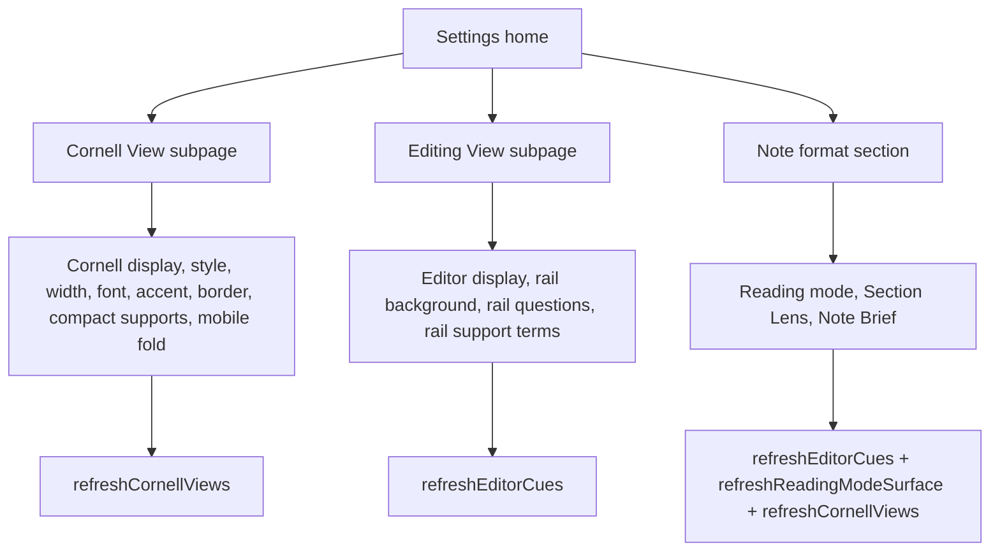

# feat: Split Cornell and Editing View settings

## Goal Capsule

| Field | Value |
|---|---|
| Objective | Rename the existing Appearance settings destination to Cornell View, add a new Editing View settings page, and move editor-only display controls there. |
| Authority | User request and ideation source define the product boundary; existing settings persistence keys and renderer behavior constrain the implementation. |
| Execution profile | Single-phase settings UI change in TypeScript, with focused unit coverage for settings taxonomy and refresh behavior. |
| Stop conditions | Stop if the split would require persisted settings migration, product behavior changes beyond settings placement, or removal of Cornell View. |
| Tail ownership | LFG owns implementation, review fixes, verification, commit, push, PR, and CI follow-up when a remote/PR is available. |

---

## Product Contract

### Summary

CueCraft settings currently mix editor-only visual controls with Cornell View appearance controls under a single Appearance page, while some editor rail controls live in Note format.
The implementation should make settings taxonomy match user-facing surfaces: Cornell View contains Cornell-only appearance controls, Editing View contains controls that only affect the editor, and cross-view review toggles stay out of Editing View.

### Problem Frame

Cornell View may eventually be removed because it adds an extra user step with limited benefit.
That makes Editing View appearance work strategically important: the editor may become CueCraft's main review surface, so editor-only appearance controls need a clear, first-class settings destination.

### Requirements

- R1. The settings home exposes a `Cornell View` navigation card instead of `Appearance`.
- R2. The `Cornell View` subpage contains only settings whose visible effect is the Cornell pane: Cornell display mode, Cornell view style, cue column width, cue font size, cue accent color, cue column border, compact supports, and mobile cue-column folding.
- R3. The settings home exposes a new `Editing View` navigation card for editor-only display controls.
- R4. The `Editing View` subpage contains `Editor cue display`, `Rail card background`, `Show rail questions`, and `Show rail support terms`.
- R5. `Show Section Lens` and `Show Note Brief` remain outside `Editing View` because they affect editor, Reading mode, and Cornell/review surfaces together.
- R6. Reading mode settings remain outside `Editing View` for this slice.
- R7. Existing persisted settings keys and defaults remain compatible; no settings migration or data shape change is introduced.
- R8. Summaries on the home cards describe their own surface only: Cornell summary should not include editor state, and Editing View summary should not include Cornell state.
- R9. Changing moved Editing View controls continues to refresh editor cues, while Cornell View appearance controls continue to refresh Cornell views.

### Acceptance Examples

- AE1. Given the user opens CueCraft settings, when the home cards render, then the visible cards include `Cornell View` and `Editing View` and do not include `Appearance`.
- AE2. Given the user opens `Cornell View`, when the page renders, then `Editor cue display`, `Rail card background`, `Show rail questions`, and `Show rail support terms` are absent.
- AE3. Given the user opens `Editing View`, when the page renders, then editor display, rail card background, rail questions, and rail support terms controls are present.
- AE4. Given the user opens `Note format`, when the section renders, then Reading mode, Section Lens, and Note Brief controls are still present, while editor rail-only controls are absent.
- AE5. Given the user changes an editor-only control, when the setting is saved, then CueCraft refreshes editor cues and does not depend on Cornell view refresh.
- AE6. Given the user changes a Cornell View appearance control, when the setting is saved, then CueCraft refreshes Cornell views and does not depend on editor cue refresh.

### Scope Boundaries

#### In Scope

- Settings navigation labels, subpage routing, subpage headings, descriptions, and summary strings.
- Moving existing controls between existing/new subpage render methods without changing stored settings names.
- Focused tests that protect page taxonomy and refresh behavior.

#### Deferred to Follow-Up Work

- Renaming or redesigning `Note format` into a broader `Review Surfaces` or `Reading View` settings area.
- Removing Cornell View or changing its runtime behavior.
- Adding new Editing View appearance options beyond relocating existing editor-only controls.
- Full settings information-architecture redesign beyond this split.

#### Outside This Product's Identity

- Duplicating the same setting controls across multiple pages.
- Treating cross-view review-surface toggles as editor-only settings.

### Sources

- Origin ideation: `docs/ideation/2026-07-02-editing-view-settings-split-ideation.html`
- Current settings navigation and summary code: `src/settings.ts`
- Editor render payload wiring: `src/main.ts`
- Existing settings enum/default tests: `tests/settings.test.ts`

---

## Planning Contract

### Key Technical Decisions

- KTD1. Rename the subpage identity in UI and code from `appearance` toward `cornell-view`, but keep persisted settings fields unchanged. This satisfies R1-R2 without introducing migration risk.
- KTD2. Add `editing-view` as a sibling settings subpage instead of folding editor controls into `Note format`. The user's boundary is surface-specific, and `Note format` still contains cross-view and Reading mode settings.
- KTD3. Move controls by extracting/reusing small render helpers inside `CueCraftSettingTab`, not by adding a new settings framework. `src/settings.ts` already owns subpage routing and rendering; a local split is the smallest consistent change.
- KTD4. Preserve refresh paths by surface. Editor-only controls should call `refreshEditorCues()`, Cornell-only controls should call `refreshCornellViews()`, and cross-view review toggles should keep calling `refreshReviewSurfaces()`.
- KTD5. Use tests against rendered settings text and stubbed refresh methods rather than broad browser automation for taxonomy. This catches the requested split while staying close to existing Vitest coverage.

### Assumptions

- The implementation can use existing Obsidian `Setting` primitives and current test environment helpers without introducing a UI framework.
- The existing untracked ideation files are source/context artifacts, not implementation artifacts that must be committed with the code change unless shipping policy later requires including them.

### High-Level Technical Design

### System-Wide Impact

The change is localized to settings UI and tests.
Runtime cue generation, cache schema, Cornell rendering, editor rendering, Reading mode rendering, and persisted setting keys remain unchanged.
The user-visible impact is navigational clarity and a first-class Editing View settings destination.

---

## Implementation Units

### U1. Rename Appearance destination to Cornell View

- **Goal:** Make the existing Appearance navigation and subpage represent Cornell View only.
- **Requirements:** R1, R2, R8, R9; AE1, AE2, AE6.
- **Dependencies:** None.
- **Files:** `src/settings.ts`, `tests/settings.test.ts`.
- **Approach:** Replace the current `appearance` subpage routing label with a Cornell View destination. Rename the summary helper so it reports only Cornell View values. Keep Cornell controls in the existing Cornell appearance rendering path, including mobile folding if it remains Cornell-only.
- **Patterns to follow:** Existing `renderSettingsNavCard`, `renderSubpageHeader`, `saveAppearanceChange`, and thumbnail settings helpers in `src/settings.ts`.
- **Test scenarios:**
  - Render the settings home and expect `Cornell View` to appear while `Appearance` does not appear as a nav card.
  - Open or render the Cornell View subpage and expect Cornell-specific controls to appear.
  - Open or render the Cornell View subpage and expect editor-only controls to be absent.
  - Change a Cornell View toggle such as cue column border and expect settings save plus Cornell view refresh.
- **Verification:** Cornell View is the only Cornell appearance destination, and all Cornell View controls preserve their prior persistence and refresh behavior.

### U2. Add Editing View destination and move editor-only controls

- **Goal:** Create a new Editing View page and move editor-only controls into it.
- **Requirements:** R3, R4, R7, R8, R9; AE1, AE3, AE5.
- **Dependencies:** U1.
- **Files:** `src/settings.ts`, `tests/settings.test.ts`.
- **Approach:** Add `editing-view` to the settings subpage union and switch. Add a home nav card with an Editing View summary. Move or extract the existing `Editor cue display`, `Rail card background`, `Show rail questions`, and `Show rail support terms` controls into an Editing View render method. Keep their current setting keys and `refreshEditorCues()` calls.
- **Patterns to follow:** Existing subpage switch cases and the current editor display / rail card / rail visibility control implementations in `src/settings.ts`.
- **Test scenarios:**
  - Render the settings home and expect `Editing View` to appear with an editor-only summary.
  - Open or render the Editing View subpage and expect editor display, rail card background, rail questions, and rail support terms controls.
  - Change `Show rail questions` and expect settings save plus editor cue refresh.
  - Change `Rail card background` and expect settings save plus editor cue refresh.
- **Verification:** Editing View controls use the same persisted settings keys as before and are no longer rendered from Cornell View or Note format.

### U3. Keep Note format cross-view controls scoped correctly

- **Goal:** Remove editor rail-only controls from Note format while preserving Reading mode and cross-view review-surface controls there.
- **Requirements:** R5, R6, R7, R9; AE4.
- **Dependencies:** U2.
- **Files:** `src/settings.ts`, `tests/settings.test.ts`.
- **Approach:** Leave `Show CueCraft in Reading mode`, `Reading mode display`, `Show Section Lens`, and `Show Note Brief` in `renderNoteFormatSection`. Remove the rail question/support settings from this section after U2 owns them. Keep `Fold cue column on mobile` with Cornell View if implementation confirms it only affects Cornell layout.
- **Patterns to follow:** Existing `refreshReviewSurfaces()` for review toggles and `refreshReadingModeSurface()` for Reading mode controls.
- **Test scenarios:**
  - Render Note format and expect Reading mode, Section Lens, and Note Brief controls to remain.
  - Render Note format and expect rail question/support controls to be absent.
  - Change `Show Section Lens` and expect the cross-view refresh helper behavior to remain intact.
- **Verification:** Note format no longer contains editor-only controls, and cross-view review settings still refresh all affected surfaces.

### U4. Update documentation references if needed

- **Goal:** Keep user-facing docs aligned with the new settings labels.
- **Requirements:** R1, R3, R5.
- **Dependencies:** U1, U2, U3.
- **Files:** `README.md`.
- **Approach:** Update only references that would become wrong after the split, such as instructions that say review toggles live under `Note format` if the implementation changes that location. Do not rewrite broader product copy or remove Cornell View language.
- **Patterns to follow:** Existing concise README settings instructions.
- **Test scenarios:** Test expectation: none -- documentation-only alignment when references change.
- **Verification:** README references do not contradict the shipped settings labels.

---

## Verification Contract

| Gate | Applies To | Done Signal |
|---|---|---|
| `bun test tests/settings.test.ts` | U1-U3 | Focused settings taxonomy and refresh behavior coverage passes. |
| `bun test` | U1-U4 | Full Vitest suite passes after settings refactor. |
| `bun run typecheck` | U1-U4 | TypeScript accepts the updated subpage union and helpers. |
| Manual settings smoke in Obsidian or equivalent DOM render check | U1-U3 | Home cards, Cornell View page, Editing View page, and Note format section show the intended controls without duplicate settings. |

---

## Definition of Done

- The settings home has separate Cornell View and Editing View cards.
- The former Appearance destination is no longer visible as `Appearance`.
- Cornell View contains Cornell-only visual controls.
- Editing View contains editor-only visual controls and carries the future-main-surface rationale in copy where appropriate.
- Note format keeps Reading mode and cross-view review controls but no longer contains editor rail-only controls.
- Persisted settings shape remains backward compatible.
- Focused tests cover navigation taxonomy, moved controls, and refresh behavior.
- `bun test` and `bun run typecheck` pass, or any failure is documented as an unresolved pipeline blocker.
- Abandoned exploratory code is removed before shipping.
