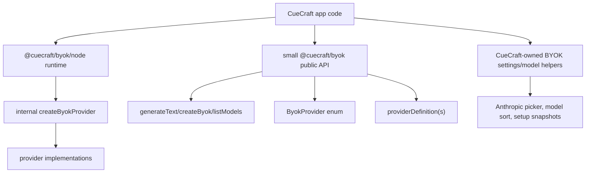

# BYOK Public Interface Shrink - Plan

## Goal Capsule

| Field | Value |
|---|---|
| Objective | Make CueCraft consume BYOK through the same small public API external users should see, including `ByokProvider`, then shrink `@cuecraft/byok`'s main public barrel by moving CueCraft-specific setup/model/UI helpers out of that surface. |
| Authority | User requested LFG implementation from `docs/ideation/2026-07-03-byok-public-interface-shrink-ideation.html`. |
| Execution profile | Single-phase API-boundary refactor touching CueCraft adapter/settings imports, BYOK barrel exports, README/API docs, package public-contract tests, and focused type/test coverage. |
| Stop conditions | Stop if removing a public export would require changing provider behavior, removing CueCraft's `generateObject` path, or replacing the Node CLI provider runtime. |
| Tail ownership | `ce-work` owns implementation and verification; `lfg` owns review, commit, push, PR, and CI follow-through. |

---

## Product Contract

### Summary

BYOK should have a small public TypeScript library surface and CueCraft should dogfood it like an external consumer.
CueCraft can still own its rich settings UI, Anthropic model picker, verification snapshots, and model sorting behavior, but those app-specific concerns should not force `@cuecraft/byok` to export every helper through its main barrel.

### Problem Frame

The current `@cuecraft/byok` barrel exports both a new simple public API (`ByokProvider`, `generateText`, `createByok`, `listModels`) and many CueCraft-shaped helper APIs: Anthropic picker helpers, setup-state storage helpers, fetched-model sorters, model-option normalization, provider fingerprinting, raw provider definitions, and runtime factories.
CueCraft imports those helpers directly, which makes it hard to shrink BYOK without breaking the app.

This refactor should first move CueCraft usage onto a public-facing provider enum and public model-listing path where practical, then relocate app-specific helper logic into CueCraft-owned modules so the BYOK main barrel can be smaller.

### Requirements

**CueCraft Public API Dogfooding**

- R1. CueCraft source code uses `ByokProvider` enum values for provider-specific BYOK config and provider-definition lookups where provider IDs are authored in code.
- R2. CueCraft setup/model-refresh flows use top-level `listModels(options)` for cloud and Ollama setup-time model discovery instead of constructing a provider runtime only to call `runtime.listModels()`.
- R3. CueCraft continues to use `createByokNodeProvider()` for full generation/runtime behavior because CLI providers and `generateObject` remain runtime-only.

**BYOK Public Surface Reduction**

- R4. The main `@cuecraft/byok` barrel no longer exports CueCraft-specific Anthropic picker helpers.
- R5. The main barrel no longer exports setup-state/storage helpers such as provider fingerprinting or verification snapshot mutation helpers.
- R6. The main barrel no longer exports low-level model normalization/sorting helpers that CueCraft can own locally.
- R7. The main barrel no longer exports raw `BYOK_PROVIDER_DEFINITIONS` if `byokProviderDefinition(s)` covers public metadata access.
- R8. The public barrel still exports the small application-facing API: `ByokProvider`, `generateText`, `createByok`, `listModels`, public provider IDs/metadata accessors, public errors, and core config/result types needed by external wrappers and CueCraft.

**Behavior Preservation**

- R9. CueCraft cue generation behavior remains unchanged, including runtime `generateObject` usage when available and text+JSON repair fallback otherwise.
- R10. CueCraft settings behavior remains unchanged for provider selection, credential editing, Anthropic custom model selection, model refresh, connection testing, and provider setup status.
- R11. BYOK package internals may keep helper modules for provider implementations and tests, but those helpers stop being advertised as public main-entry exports.

**Documentation and Contract Tests**

- R12. `packages/byok/README.md`, `packages/byok/API.md`, and `docs/byok-extraction.md` describe the reduced main public surface and demote runtime factories/helper APIs.
- R13. Public-contract tests snapshot the smaller export list and continue preventing docs from importing package internals.
- R14. Type fixtures prove CueCraft-style public enum usage and top-level model listing remain supported.

### Scope Boundaries

#### In Scope

- Moving or duplicating CueCraft-specific helper logic into `src/` modules when needed to remove public BYOK exports.
- Updating CueCraft imports to use `ByokProvider` and top-level `listModels`.
- Shrinking the main barrel exports and updating docs/tests accordingly.
- Keeping provider runtime factories available internally and through the Node entrypoint where CueCraft generation needs them.

#### Deferred

- Removing `generateObject()` from provider runtimes.
- Adding a public `testConnection(options)` helper.
- Creating a new published `@cuecraft/byok/cuecraft` subpath.
- Fully eliminating provider metadata; this plan shrinks raw/helper exports while keeping public provider-definition accessors.
- Changing secure credential storage or Obsidian UI layout.

---

## Planning Contract

### Key Technical Decisions

- KTD1. Prefer CueCraft-owned helper modules over new public subpaths. A `@cuecraft/byok/cuecraft` subpath would preserve modularity but still makes CueCraft settings behavior part of the package export story; moving helper logic into `src/` best serves public-surface shrink.
- KTD2. Keep `createByokNodeProvider()` public on `@cuecraft/byok/node`. CueCraft needs CLI providers and runtime `generateObject`; hiding this would force a larger generation rewrite.
- KTD3. Keep provider-definition accessors public for now. CueCraft and external settings UIs still need metadata, but remove raw definition-map export and app-shaped helpers.
- KTD4. Use top-level `listModels(options)` only for setup-time model discovery. Generation and connection testing continue through runtime providers.
- KTD5. Preserve behavior before shrinking exports. Move imports first, then remove exports and let TypeScript/public-contract tests prove no app code depends on removed names.
- KTD6. Use enum values for authored provider IDs, but do not force migration of every serialized string field. Stored settings and external data remain string IDs.

### High-Level Technical Design

### Assumptions

- The current branch already contains the function-first API, `ByokProvider` enum, and model-free `listModels(options)` helper.
- `@cuecraft/byok` is still a private workspace package, so public-surface shrink can happen without external semver migration.
- The untracked ideation HTML files are reference artifacts and should not be staged unless explicitly requested.

### Sources and Research

- `docs/ideation/2026-07-03-byok-public-interface-shrink-ideation.html` ranks the split-audience approach as the top direction.
- `packages/byok/src/index.ts` currently exports simple public helpers plus many setup/model/CueCraft-specific helpers.
- `src/byok-cuecraft-adapter.ts` imports BYOK setup-state, Anthropic, sorting, registry, error, and runtime types.
- `src/settings.ts` imports Anthropic picker helpers, model normalization helpers, and provider metadata helpers from BYOK.
- `packages/byok/tests/public-contract.test.ts` snapshots the current broad public barrel.

---

## Implementation Units

### U1. Add CueCraft-Owned BYOK Helper Modules

- **Goal:** Give CueCraft local homes for helper logic that should leave the BYOK public barrel.
- **Requirements:** R4, R5, R6, R9, R10, R11
- **Files:** `src/byok-setup-status.ts`, `src/byok-model-options.ts`, `src/anthropic-model-options.ts`, `src/byok-cuecraft-adapter.ts`, `src/settings.ts`, `src/model-combobox.ts`
- **Approach:** Move or copy only the helper logic CueCraft actually uses: setup status derivation and connection recording; fetched/model option normalization and sorting; Anthropic model selection, hinting, and unavailable-copy helpers. Keep names close to current BYOK names at first to reduce churn, then import from local modules.
- **Test Scenarios:** Existing settings and adapter typechecking passes; Anthropic model selector still supports known models and custom model ID; model combobox still preserves current model ID and sorted options; setup status and connection success semantics remain unchanged.
- **Verification:** `bun run typecheck` and focused tests covering BYOK adapter/settings behavior.

### U2. Migrate CueCraft To Public BYOK Enum And Top-Level Model Listing

- **Goal:** Make CueCraft use `ByokProvider` enum values and public `listModels(options)` for setup-time discovery.
- **Requirements:** R1, R2, R3, R9, R10, R14
- **Files:** `src/byok-cuecraft-adapter.ts`, `src/settings.ts`, `src/parallel-requests-guidance.ts`, `src/secure-credential-store.ts`, `src/cue-provider.ts`, `tsconfig.json`, `esbuild.config.mjs`
- **Approach:** Replace authored provider strings with `ByokProvider` enum values where practical. Add a small CueCraft helper that resolves credentials/settings into `ByokListModelsOptions` and calls `listModels`. Use that path for model refresh and no-selected-model cloud connection probes. Leave full generation and connection testing on `createByokNodeProvider`.
- **Test Scenarios:** Cloud model refresh uses `listModels(options)` with API keys; Ollama model refresh uses `listModels({ provider: ByokProvider.Ollama, host })`; CLI providers still do not expose model listing; CueCraft generation still builds node runtime configs correctly.
- **Verification:** `bun run typecheck`, `bun run test:byok`, and focused app tests.

### U3. Shrink BYOK Main Barrel And Public Contract

- **Goal:** Remove app-specific helper exports from `@cuecraft/byok` after CueCraft no longer imports them.
- **Requirements:** R4, R5, R6, R7, R8, R11, R13
- **Files:** `packages/byok/src/index.ts`, `packages/byok/src/node.ts`, `packages/byok/tests/public-contract.test.ts`, `packages/byok/tests/fixtures/main-entrypoint.ts`, `packages/byok/tests/fixtures/node-entrypoint.ts`
- **Approach:** Remove exports for Anthropic picker helpers, model-option helper functions, fetched-model sorting helpers, setup-state helpers, raw `BYOK_PROVIDER_DEFINITIONS`, and unused rate-limit class if no public tests/docs require it. Keep internal modules intact for providers/tests. Keep types needed by CueCraft and external consumers. Update snapshots and fixtures to assert the smaller public surface.
- **Test Scenarios:** Public barrel exports only intentional names; docs examples use only public names; Node entrypoint still exports node runtime factory and local CLI helpers; no app code imports removed BYOK exports.
- **Verification:** `bun run typecheck:byok`, `bun run typecheck:byok-examples`, `bun run test:byok`.

### U4. Rewrite BYOK Docs Around The Reduced Surface

- **Goal:** Align README/API/extraction docs with the smaller interface.
- **Requirements:** R12, R13
- **Files:** `packages/byok/README.md`, `packages/byok/API.md`, `docs/byok-extraction.md`, `docs/plans/2026-07-03-002-refactor-byok-public-interface-shrink-plan.md`
- **Approach:** Present the small public surface first and remove/de-emphasize examples that require public access to runtime factories or app-shaped helper APIs. Keep advanced runtime/node documentation only where still exported. Explain that CueCraft-specific settings helpers live in CueCraft, not BYOK.
- **Test Scenarios:** Public-contract docs scan passes; README examples continue to use `ByokProvider`, `generateText`, `createByok`, and `listModels`; docs no longer list removed helper exports as public.
- **Verification:** Public-contract tests and example typecheck.

### U5. Verify Compatibility And Clean Up

- **Goal:** Ensure no stale imports, docs, or tests remain after the surface reduction.
- **Requirements:** R9, R10, R13, R14
- **Files:** `src/**/*.ts`, `packages/byok/src/**/*.ts`, `packages/byok/tests/**/*.ts`, `tests/**/*.ts`
- **Approach:** Search for removed export names outside package internals and update or delete stale tests. Run the BYOK and workspace verification gates. Keep unrelated untracked ideation artifacts out of the implementation commit unless the user explicitly wants them included.
- **Test Scenarios:** No `@cuecraft/byok` imports reference removed helper names; package boundary tests still prove BYOK does not import CueCraft; app typecheck still passes; BYOK tests still pass.
- **Verification:** Full verification contract below.

---

## Verification Contract

| Gate | Command | Done signal |
|---|---|---|
| BYOK typecheck | `bun run typecheck:byok` | Reduced public barrel and internal helpers compile. |
| BYOK example typecheck | `bun run typecheck:byok-examples` | Public entrypoint fixtures compile against reduced exports. |
| BYOK tests | `bun run test:byok` | Public-contract, package-readiness, provider, and facade tests pass. |
| Workspace typecheck | `bun run typecheck` | CueCraft app imports and settings adapter compile against public BYOK surface. |
| Focused app tests | `bun test tests/byok-cuecraft-adapter.test.ts` | CueCraft BYOK behavior remains compatible where tests exist. |
| Lint | `bun run lint` | No new lint errors; pre-existing unrelated warnings may be reported separately. |

---

## Definition of Done

- CueCraft-authored provider IDs use `ByokProvider` enum values where practical.
- CueCraft setup-time model refresh uses the top-level public `listModels(options)` helper for cloud and Ollama providers.
- CueCraft generation still uses `createByokNodeProvider()` and preserves `generateObject` behavior for AI SDK providers.
- The main `@cuecraft/byok` barrel is smaller and no longer exports CueCraft-specific Anthropic picker helpers, setup-state helpers, raw provider definition map, or low-level model sorting/normalization helpers.
- README, API reference, extraction notes, and public-contract tests describe the reduced public surface.
- Existing BYOK provider behavior and CueCraft settings/generation behavior remain unchanged except for import/API boundary cleanup.
- Verification commands in the Verification Contract have been run or any inability to run them is documented.
