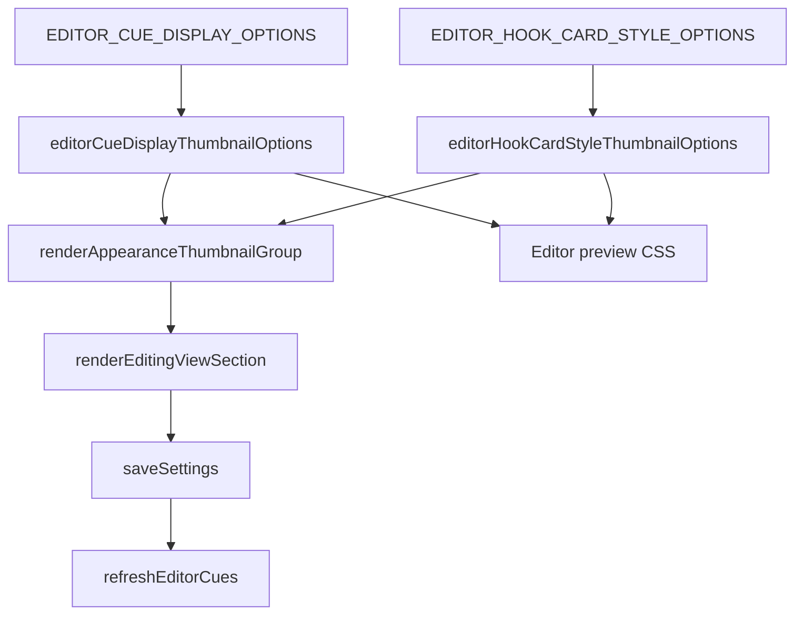

# feat: Add Editing View thumbnail previews

## Goal Capsule

| Field | Value |
|---|---|
| Objective | Replace the Editing View `Editor cue display` and `Rail card background` dropdowns with Cornell-style thumbnail buttons that preview editor-specific behavior. |
| Authority | User request and the Editor-Truth Miniatures direction in `docs/ideation/2026-07-04-editing-view-thumbnail-previews-ideation.html`; existing settings contracts remain authoritative for persisted values. |
| Execution profile | Localized UI/settings change with focused DOM and settings tests. |
| Stop conditions | Stop if implementation requires changing persisted setting IDs, adding new display modes, or replacing the shared thumbnail primitive. |
| Tail ownership | LFG owns implementation, review, browser testing, commit, push, PR update/create, and CI follow-up. |

---

## Product Contract

### Summary

Editing View should use the same thumbnail-button interaction quality as Cornell View Style while previewing editor-specific cue placement.
The outer control should look like the existing Cornell thumbnail cards: compact white cards, paper-like preview panes, concise labels, muted descriptions, and a clear selected border.
The preview art should be polished enough to ship, but it should not copy the rough ideation mockups verbatim.

### Problem Frame

The Editing View page now contains editor-only settings, but two of its most visual choices are still hidden behind dropdowns.
Users must choose labels like "Threaded margin notes" or "Hook minimap" without seeing where cues will appear in the editor.
The Cornell View Style thumbnails already solve this recognition problem for Cornell-only styles, so Editing View should extend that pattern with editor-truth miniatures.

### Requirements

- R1. `Editor cue display` renders as a thumbnail group covering every value in `EDITOR_CUE_DISPLAY_OPTIONS`.
- R2. Each display thumbnail uses a CodeMirror/editor-like scene that previews the option's placement: inline block, anchored cards, collapsed tabs, threaded notes, active-section composer, or hook minimap.
- R3. `Rail card background` renders as a thumbnail group covering every value in `EDITOR_HOOK_CARD_STYLE_OPTIONS`.
- R4. Rail-card background thumbnails preview material treatment on a shared rail-card scene and avoid implying a display-mode change.
- R5. Thumbnail cards follow the Cornell View Style control language: preview pane first, bold label, short muted description, native button semantics, and clear selected state.
- R6. Selecting either group persists the same settings keys, refreshes editor cues, updates the setting description, and does not refresh Cornell views.
- R7. Tests cover option coverage, preview DOM classes, settings render behavior, click behavior, and refresh boundaries.

### Success Criteria

- The Editing View page no longer uses dropdowns for `Editor cue display` or `Rail card background`.
- Adding a new editor display option or rail-card style fails focused tests until a thumbnail recipe exists.
- Existing persisted settings continue to load and summarize without migration.

### Scope Boundaries

- In scope: Editing View settings UI for existing editor display and rail-card background values.
- In scope: editor-specific preview recipes in the shared thumbnail helper module and supporting CSS.
- Out of scope: adding new editor display modes, changing actual editor cue rendering behavior, changing Cornell View thumbnails, or implementing the optional paired preview row.
- Out of scope: treating the ideation HTML mockup as production code or copying its CSS wholesale.

### Assumptions

- The existing `renderAppearanceThumbnailGroup` primitive remains the shared control renderer.
- The Cornell View Style thumbnail treatment is the visual target for the outer cards, but the preview scenes inside each card remain editor-specific.
- No external research is needed because local patterns for thumbnail controls, settings persistence, and editor cue display options are already established.

---

## Planning Contract

### Key Technical Decisions

- KTD1. Extend `src/appearance-thumbnail-controls.ts` with editor thumbnail option factories instead of creating a new settings component. This preserves one accessible thumbnail-button primitive and keeps option coverage testable in one place.
- KTD2. Use DOM/CSS miniatures rather than raster screenshots. Structured previews stay theme-aware, scale in Obsidian settings panes, and can be validated in JSDOM.
- KTD3. Keep preview recipes descriptive rather than render-path coupled. The thumbnails should show placement truth and material truth without importing CodeMirror rendering or editor decoration code into settings.
- KTD4. Use existing option metadata for labels and descriptions. The option source modules remain authoritative for persisted IDs and user-facing names.
- KTD5. Route selection through the existing Editing View save path. The groups should call `saveSettings()` and `refreshEditorCues()` only, matching the rest of Editing View.

### High-Level Technical Design

The preview factories return `AppearanceThumbnailOption<T>` values with editor-specific `renderPreview` callbacks.
The settings page should treat these factories the same way it already treats cue width and cue font thumbnails.

### Sequencing

Build the preview factories and CSS before replacing the dropdowns.
Then wire the settings controls to those factories.
Finish with tests that lock option coverage and refresh behavior.

---

## Implementation Units

### U1. Add editor thumbnail preview recipes

- **Goal:** Add thumbnail option factories for `EditorCueDisplay` and `EditorHookCardStyle`.
- **Requirements:** R1, R2, R3, R4, R5, R7.
- **Dependencies:** None.
- **Files:** `src/appearance-thumbnail-controls.ts`, `styles.css`, `tests/appearance-thumbnail-controls.test.ts`.
- **Approach:** Export `editorCueDisplayThumbnailOptions()` and `editorHookCardStyleThumbnailOptions()`. Render compact editor scenes with stable preview classes per option ID. Use the Cornell-style card shell already provided by `renderAppearanceThumbnailGroup`; the new recipes only own the preview contents.
- **Patterns to follow:** Existing `cornellStyleThumbnailOptions()`, `cueColumnWidthThumbnailOptions()`, and the CSS around `.cuecraft-preview-surface`, `.cuecraft-preview-card`, and `.cuecraft-thumbnail-button`.
- **Test scenarios:**
  - Every option from `EDITOR_CUE_DISPLAY_OPTIONS` appears in `editorCueDisplayThumbnailOptions()`.
  - Every option from `EDITOR_HOOK_CARD_STYLE_OPTIONS` appears in `editorHookCardStyleThumbnailOptions()`.
  - Rendering editor display thumbnails produces one stable preview class for each display ID.
  - Rendering rail background thumbnails produces one stable preview class for each style ID.
  - Display previews include editor-scene structure rather than Cornell-only preview classes.
- **Verification:** Focused thumbnail-control tests fail if an option lacks a recipe or if editor previews fall back to generic Cornell preview classes.

### U2. Replace Editing View dropdowns with thumbnail groups

- **Goal:** Swap `Editor cue display` and `Rail card background` from dropdowns to thumbnail groups in the Editing View page.
- **Requirements:** R1, R3, R5, R6, R7.
- **Dependencies:** U1.
- **Files:** `src/settings.ts`, `tests/settings.test.ts`.
- **Approach:** Import the two new thumbnail factories and render them through the existing `renderEditingViewThumbnailSetting` helper. Keep the current dynamic description behavior by deriving descriptions from the selected option after save. Do not change settings keys, defaults, validation, or summary behavior.
- **Patterns to follow:** Existing Editing View width/font thumbnail wiring in `renderEditingViewSection`; existing Cornell View thumbnail wiring for class naming and group rendering.
- **Test scenarios:**
  - Opening Editing View renders thumbnail buttons for every editor display option.
  - Clicking `hook-minimap` updates `editorCueDisplay`, saves settings, refreshes editor cues, and does not refresh Cornell views.
  - Clicking `gradient` updates `editorHookCardStyle`, saves settings, refreshes editor cues, and does not refresh Cornell views.
  - Reopening the settings tab marks persisted editor display and rail-card style values as selected.
  - The Editing View page still contains cue width/font thumbnails and rail question/support toggles.
- **Verification:** The Editing View page no longer creates dropdown controls for these two settings, and behavior remains editor-only.

### U3. Polish CSS and responsive behavior

- **Goal:** Make the editor thumbnails feel consistent with Cornell View Style while staying legible in narrow Obsidian settings panes.
- **Requirements:** R2, R4, R5.
- **Dependencies:** U1, U2.
- **Files:** `styles.css`.
- **Approach:** Add editor-preview CSS under the existing thumbnail-preview style area. Use Obsidian theme variables where practical, fixed preview aspect ratios, stable dimensions, and concise internal marks. Keep CSS scoped to preview classes so actual editor cue rendering is unaffected.
- **Patterns to follow:** Existing `.cuecraft-thumbnail-group-display-mode`, `.cuecraft-thumbnail-group-view-style`, `.cuecraft-preview-style-*`, and selected thumbnail button styles.
- **Test scenarios:** Test expectation: none -- CSS polish is covered by DOM class assertions and browser/manual inspection rather than unit assertions.
- **Verification:** Desktop and narrow-pane browser inspection shows no text overlap, clipped previews, layout shift, or selected-state ambiguity.

---

## Verification Contract

| Gate | Applies to | Done signal |
|---|---|---|
| `bun run typecheck` | U1-U2 | TypeScript accepts the new factories, imports, and generic thumbnail wiring. |
| `bun run lint` | U1-U3 | ESLint reports no new errors. Existing warnings may remain if unrelated. |
| `bun run test tests/appearance-thumbnail-controls.test.ts` | U1 | Thumbnail factory and preview DOM coverage pass. |
| `bun run test tests/settings.test.ts` | U2 | Editing View render, click, save, and refresh-boundary behavior passes. |
| `bun run test` | U1-U3 | Full test suite remains green. |
| Browser/manual inspection | U3 | Editing View thumbnail groups resemble Cornell View Style cards and remain usable in a narrow settings pane. |

---

## Definition of Done

- U1 complete when editor display and rail background thumbnail factories exist, are exported, and have option-coverage tests.
- U2 complete when the Editing View page renders those thumbnail groups and selection changes persist through the existing editor-only refresh path.
- U3 complete when thumbnail preview CSS is scoped, responsive, and visually aligned with Cornell View Style without copying ideation mockup CSS directly.
- The implementation leaves unrelated untracked ideation files untouched unless a later shipping step explicitly scopes them into the PR.
- All verification gates in the Verification Contract have been run or any inability to run them is recorded in the final handoff.

---

## Sources & Research

- `docs/ideation/2026-07-04-editing-view-thumbnail-previews-ideation.html` captures the Editor-Truth Miniatures direction and the Cornell View Style visual target.
- `src/appearance-thumbnail-controls.ts` owns the existing thumbnail primitive and Cornell preview recipes.
- `src/settings.ts` owns the Editing View settings page and existing editor-only save/refresh behavior.
- `src/editor-cue-display.ts` defines the editor display option IDs, labels, and descriptions.
- `src/editor-hook-card-style.ts` defines the rail-card background option IDs, labels, and descriptions.
- `styles.css` contains existing thumbnail card styling and editor hook visual language.
- `tests/appearance-thumbnail-controls.test.ts` and `tests/settings.test.ts` contain the focused DOM/settings coverage to extend.
