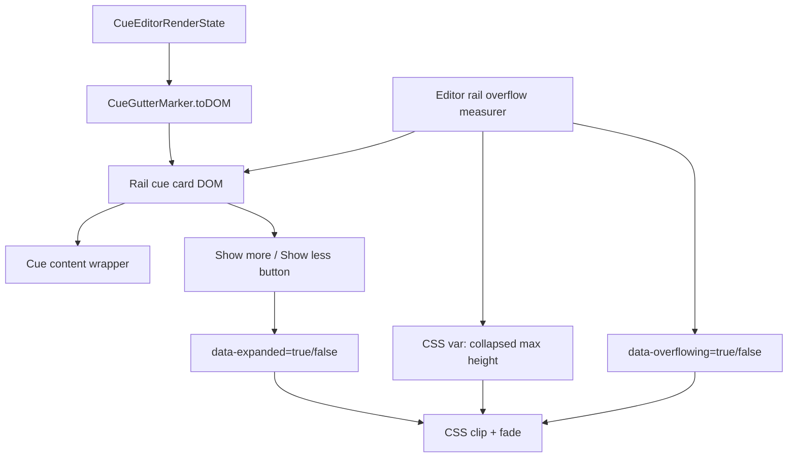

# feat: Add editor rail show more expansion

## Goal Capsule

| Field | Value |
|---|---|
| Objective | Prevent long Editing View side cue cards from visually crowding or overlapping later sections by collapsing overflowed rail cards behind a polished `Show more` / `Show less` affordance. |
| Authority | User request prefers a rail-card hide-content option after comparing Cornell View's row-height behavior with Editing View's gutter rail behavior; existing editor cue display contracts remain authoritative. |
| Execution profile | Single feature branch layered onto the current `codex/editing-view-settings` rail display implementation, with focused DOM/unit coverage and full local verification. |
| Stop conditions | Stop if implementation requires replacing CodeMirror gutter rendering, changing persisted settings IDs, or adding document-layout spacers that push editor content down. |
| Tail ownership | LFG owns implementation, review fixes, browser testing, commit, push, PR creation, and CI follow-up when remote and PR tooling are available. |

---

## Product Contract

### Summary

Editing View rail cards can become taller than the note section they annotate.
Cornell View avoids this because its cue and note cells are normal grid siblings, but Editing View rail cards are CodeMirror gutter markers that do not participate in editor document layout.
Instead of implementing content-pushing spacers now, rail cards should collapse overflowed content, fade the bottom edge, and expose a `Show more` control when more content exists.

### Problem Frame

Editing View is increasingly important as the possible future main review surface.
Long cue questions, Section Lens details, and support terms can make left-side cue cards visually run into the next section, especially in Cornell-style editor displays.
The editor should preserve a tidy section rhythm without hiding information permanently or making the rail feel broken.

### Requirements

- R1. Rail-side Editing View cue cards collapse when their rendered content exceeds the available collapsed height for their section.
- R2. Collapsed rail cards show a bottom affordance only when there is actually hidden content.
- R3. The affordance uses `Show more` to expand that cue card in place and `Show less` to collapse it again.
- R4. The collapsed max height is section-aware when measurable: it should use the vertical space before the next editor cue or section, with minimum and maximum clamps so cards are neither tiny nor enormous.
- R5. If section-aware measurement is unavailable, the rail card falls back to a stable fixed maximum height.
- R6. Expansion applies to the current DOM card only and may reset on note change, display mode change, or editor rerender.
- R7. The behavior applies to current rail-style displays that can produce tall cue cards: `Cornell`, `Cornell Exam Prep`, `Cornell Minimal`, `Anchored card rail`, and `Threaded margin notes`.
- R8. Inline cues, hidden/retired display modes, Note Brief widgets, Reading mode, and Cornell View rendering are unchanged.
- R9. The implementation remains accessible: the toggle is a real button, has correct expanded state, and does not steal normal editor interactions.
- R10. Tests cover overflow affordance rendering, toggle behavior, measurement-driven data attributes, and non-rail exclusion.

### Acceptance Examples

- AE1. Given an Editing View rail cue whose content fits within its available section height, when the editor renders, then no `Show more` button is visible for that cue.
- AE2. Given an Editing View rail cue whose content is taller than its available section height, when the editor renders, then the cue is clipped with a bottom fade and a `Show more` button.
- AE3. Given an overflowed rail cue, when the user clicks `Show more`, then that card expands in place, the full cue content becomes visible, and the button changes to `Show less`.
- AE4. Given an expanded rail cue, when the user clicks `Show less`, then that card returns to its collapsed height and the button changes back to `Show more`.
- AE5. Given Inline cues are selected, when cues render under headings, then no rail overflow affordance is added.

### Scope Boundaries

#### In Scope

- Rail-card DOM wrappers, data attributes, and button affordance needed for collapse/expand.
- Section-aware collapsed-height measurement for editor rail cards.
- CSS for collapsed height, fade, button placement, and expanded state.
- Focused tests in existing cue-extension test coverage.

#### Deferred to Follow-Up Work

- True Cornell View-style push-down spacing inside the editor document.
- Persisting expansion state across editor rerenders, files, sessions, or display-mode changes.
- A settings toggle for enabling/disabling rail-card truncation.
- Applying this behavior to retired hidden display modes if their implementation remains only for compatibility.

#### Outside This Product's Identity

- Making long rail cards scroll internally by default.
- Mutating markdown content or adding hidden spacer text to the note.
- Replacing CodeMirror gutter markers with a full custom editor layout engine.

---

## Planning Contract

### Key Technical Decisions

- KTD1. Use collapse/expand rather than push-down spacers for this slice. CodeMirror gutter markers do not affect editor line layout, and measured spacers would be a larger layout system; collapse/expand solves the immediate visual problem with less risk.
- KTD2. Make overflow detection measurement-driven. The `Show more` control should appear only when rendered content exceeds the collapsed height, not simply because a card uses a rail display.
- KTD3. Keep collapsed height section-aware but clamped. Use distance to the next rail cue or next section when the editor can measure it, then clamp to a minimum and maximum so extremely short or long sections still produce usable cards.
- KTD4. Keep expansion DOM-local. Per-card expansion can reset on rerender; this avoids adding persisted state or CodeMirror state effects for a preference-like microinteraction.
- KTD5. Scope the behavior to rail displays. Inline body widgets should continue to occupy normal document flow and do not need `Show more`.

### High-Level Technical Design

The renderers should produce a consistent rail-card structure that can be measured and clipped.
A small CodeMirror view plugin or existing extension hook can measure visible rail cards after updates and set card-specific data/CSS variables.
The button toggles `data-expanded` on its card without dispatching editor transactions.

### Assumptions

- Measuring visible DOM cards is acceptable because the behavior is visual and should follow CodeMirror's currently rendered viewport.
- A fallback collapsed max height is acceptable when next-section geometry is unavailable, such as during initial render or virtualized offscreen states.
- Browser tests can exercise the pure DOM interaction and local unit tests can cover renderer structure; visual inspection can validate the final feel.

### System-Wide Impact

The change affects Editing View visual behavior only.
It does not change cue generation, cache format, settings persistence, Cornell View, Reading mode, or markdown document content.
It does add a measurement pass to the editor cue extension, so implementation should avoid layout loops and keep the pass scoped to rendered rail cards.

---

## Implementation Units

### U1. Add rail-card overflow DOM contract

- **Goal:** Give rail cue cards a consistent measurable content wrapper and toggle button without changing visible behavior until measurement marks overflow.
- **Requirements:** R1, R2, R3, R7, R8, R9; AE1, AE2, AE3, AE4, AE5.
- **Dependencies:** None.
- **Files:** `src/cue-extension.ts`, `tests/cue-extension.test.ts`.
- **Approach:** Update rail display renderers so eligible cards include a content wrapper around cue content and a button element reserved for expansion. Use stable classes/data attributes for card role, display ID, line, overflow state, and expanded state. Keep Inline cues and Note Brief widgets out of this structure. Ensure the button handler prevents editor focus surprises and toggles only the owning card.
- **Patterns to follow:** Existing `renderEditorHookElement`, `renderCornellCueElement`, `CueGutterMarker.toDOM`, and JSDOM helper tests in `tests/cue-extension.test.ts`.
- **Test scenarios:**
  - Render an Anchored card rail cue and expect a rail overflow root/content/button structure.
  - Render a Cornell Exam Prep cue and expect the same overflow structure around the Cornell cue body.
  - Render an Inline cue and expect no rail overflow button or rail overflow content wrapper.
  - Click the toggle button on a rail card and expect `data-expanded` plus button text/ARIA state to switch from collapsed to expanded and back.
- **Verification:** Eligible rail cards have a stable DOM contract for measurement and expansion while inline cues remain unchanged.

### U2. Measure section-aware overflow and collapsed height

- **Goal:** Detect which rendered rail cards overflow and set a section-aware collapsed max height.
- **Requirements:** R1, R2, R4, R5, R6, R7; AE1, AE2.
- **Dependencies:** U1.
- **Files:** `src/cue-extension.ts`, `tests/cue-extension.test.ts`.
- **Approach:** Add an editor-view measurement pass to the cue extension that runs after relevant editor updates and resize/layout changes. For each visible eligible rail card, compute available vertical space to the next rendered rail card or next relevant editor block when possible. Set a CSS custom property such as `--cuecraft-rail-collapsed-max-height` and `data-overflowing` based on content scroll height versus collapsed height. Fall back to a fixed max height when geometry cannot be resolved. Avoid dispatching CodeMirror transactions from the measurement pass.
- **Patterns to follow:** Existing CodeMirror extension construction in `cueEditorExtension`, current `buildCueGutterMarkers` line ordering, and CSS data-attribute patterns for editor hook display state.
- **Test scenarios:**
  - Unit-test the available-height helper with adjacent cue top positions and verify min/max clamping.
  - Unit-test overflow classification where content height is below, equal to, and above the collapsed height.
  - DOM-level test: a mocked rail card with large content receives `data-overflowing="true"` and a collapsed-height CSS variable.
  - DOM-level test: a mocked rail card with fitting content receives `data-overflowing="false"`.
- **Verification:** Overflow controls appear only for cards whose content is actually hidden, and measurement does not require changing editor state.

### U3. Style collapsed, faded, and expanded rail cards

- **Goal:** Make collapsed rail cards look intentional and readable while preserving current rail display styles.
- **Requirements:** R1, R2, R3, R5, R7, R9; AE2, AE3, AE4.
- **Dependencies:** U1, U2.
- **Files:** `styles.css`.
- **Approach:** Add scoped CSS for eligible rail cards that applies `max-height`, `overflow: hidden`, a bottom fade, and a compact text button only when `data-overflowing="true"` and not expanded. Remove the cap and fade when expanded. Keep the button legible in classic, gradient, Cornell, Exam Prep, Minimal, and threaded styles. Ensure hidden/retired display CSS is not unintentionally revived.
- **Patterns to follow:** Existing `.cuecraft-editor-hook-*` data-attribute CSS and Cornell-style editor card CSS.
- **Test scenarios:** Test expectation: none -- CSS visual polish is covered by DOM data/class tests and browser/manual inspection.
- **Verification:** Long cards show a calm fade and button; expanded cards show full content; non-overflow cards look like they do today.

### U4. Verify editor behavior and shipping readiness

- **Goal:** Prove the rail expansion behavior is stable across affected display modes and does not regress settings-era cue rendering.
- **Requirements:** R7, R8, R9, R10.
- **Dependencies:** U1, U2, U3.
- **Files:** `tests/cue-extension.test.ts`, `tests/settings.test.ts` if settings surface assumptions need adjustment.
- **Approach:** Extend focused cue-extension coverage and run the project verification gates. If browser automation is available through the pipeline, inspect an editor page with long rail cards to ensure the visual affordance appears and toggles.
- **Patterns to follow:** Existing focused tests around editor cue placement, cue width/font settings, and display-specific DOM in `tests/cue-extension.test.ts`.
- **Test scenarios:**
  - Existing cue renderer tests continue to pass for Cornell, Cornell Exam Prep, Cornell Minimal, Anchored card rail, Threaded margin notes, and Inline cues.
  - A long eligible rail card can be expanded and collapsed without changing the editor document.
  - A non-overflowing card does not show the affordance.
  - Settings tests continue to pass without adding a new persisted setting.
- **Verification:** Focused tests, typecheck, lint, build, full test suite, and browser/manual inspection all pass or blockers are recorded.

---

## Verification Contract

| Gate | Applies To | Done Signal |
|---|---|---|
| `bun run test tests/cue-extension.test.ts` | U1, U2, U4 | Rail overflow DOM, toggle behavior, and measurement helpers pass focused coverage. |
| `bun run test tests/settings.test.ts` | U4 | Existing Editing View settings behavior remains green. |
| `bun run typecheck` | U1-U4 | TypeScript accepts new renderer/measurement types. |
| `bun run lint` | U1-U4 | ESLint reports no new errors; unrelated existing warnings may remain documented. |
| `bun run build` | U1-U4 | Production bundle builds. |
| `bun run test -- --silent --reporter=dot` | U1-U4 | Full Vitest suite passes. |
| Browser/manual inspection | U3, U4 | A long rail card shows `Show more`, expands to full content, collapses back, and non-overflow cards show no affordance. |

---

## Definition of Done

- Rail-side Editing View cue cards can collapse overflowing content behind a `Show more` button.
- `Show more` appears only when card content exceeds the measured or fallback collapsed height.
- `Show more` expands the owning card in place and becomes `Show less`; `Show less` collapses it again.
- Collapsed height uses section-aware available space when measurable and a stable fallback when not.
- Cornell-style rail displays, Anchored card rail, and Threaded margin notes support the behavior.
- Inline cues, Note Brief, Reading mode, Cornell View, cue generation, and persisted settings remain unchanged.
- Focused and full verification gates pass, or any inability to run a gate is recorded as a shipping blocker.
- Abandoned exploratory code is removed before shipping.
