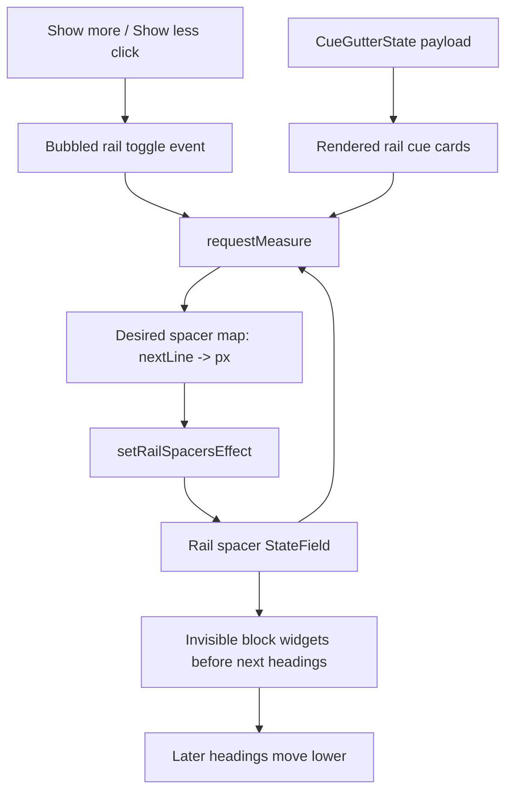

# feat: Add editor rail section spacers

## Goal Capsule

| Field | Value |
|---|---|
| Objective | Make expanded Editing View rail cue cards reserve editor document space so later headings move down instead of being visually overlapped. |
| Authority | The user chose option 1 from the overlap discussion: add measured spacer widgets to the editor document while keeping rail cues in the gutter. |
| Execution profile | Single stacked implementation branch on top of `codex/editor-rail-show-more`, which already adds rail overflow wrappers and `Show more` / `Show less`. |
| Stop conditions | Stop if implementation requires replacing CodeMirror gutter rendering, mutating markdown text, persisting expansion state, or changing Editing View settings. |
| Tail ownership | LFG owns implementation, review fixes, verification, commit, push, PR creation, and CI follow-up when tooling permits. |

---

## Product Contract

### Summary

Editing View rail cues currently live in the CodeMirror gutter, so taller cue cards can visually overlap the next section even when the card is collapsed or expanded.
`Show more` makes this more obvious because expansion changes the rail card height but does not affect editor document layout.
The editor should keep the rail cue presentation while adding document-flow space below each affected section, matching the Cornell View expectation that tall side cues push later content downward.

### Problem Frame

Cornell View can push the next section down because its cue and note content are normal layout siblings.
Editing View rail cards are gutter markers, so they float beside the document without participating in line layout.
Option 1 solves this by keeping the existing rail cards but adding measured, invisible block widgets in the editor flow before the next heading whenever the current rail card is taller than the natural space to that next heading.

### Requirements

- R1. Rail-style Editing View cues that are taller than the distance to the next rendered rail cue reserve enough editor-flow spacer height to prevent visual overlap.
- R2. Clicking `Show more` on an overflowed rail card expands that card and causes the following heading to move lower when the expanded card would otherwise overlap it.
- R3. Clicking `Show less` collapses the card and reduces or removes the spacer if the shorter card no longer needs as much reserved space.
- R4. Spacer measurement must converge without oscillating: existing spacer height is accounted for when calculating the next desired spacer height.
- R5. Spacer widgets apply only to rail-style displays: `Cornell`, `Cornell Exam Prep`, `Cornell Minimal`, `Anchored card rail`, and `Threaded margin notes`.
- R6. Inline cues, hidden/retired display modes, Note Brief widgets, Reading mode, Cornell View rendering, cue generation, and persisted settings remain unchanged.
- R7. Spacer widgets are invisible, non-interactive, and do not mutate markdown content.
- R8. Spacer state follows document edits and cue line remapping, so headings do not retain stale spacer positions after text is inserted or removed above them.
- R9. Tests cover spacer calculation, spacer decoration placement, show-more-triggered measurement, non-rail exclusion, and stable no-op updates.

### Acceptance Examples

- AE1. Given the first rail cue card is taller than the natural space before the second section heading, when cues render, then an invisible spacer appears before the second heading and the second heading is visually pushed down.
- AE2. Given an overflowed collapsed rail cue, when the user clicks `Show more`, then the card expands and the following heading moves down enough that the expanded card no longer overlaps it.
- AE3. Given an expanded rail cue with reserved spacer height, when the user clicks `Show less`, then the card collapses and the reserved spacer shrinks or disappears.
- AE4. Given inline cues are selected, when cues render, then no rail spacer widgets are created.
- AE5. Given the document changes above a cued section, when cue line positions are remapped, then spacer placement follows the updated cue lines.

### Scope Boundaries

#### In Scope

- A rail-spacer state effect and decoration field for invisible block widgets.
- Measurement that calculates desired spacer height from rendered rail card geometry.
- A DOM event from `Show more` / `Show less` that schedules a fresh measurement pass.
- Focused unit tests in `tests/cue-extension.test.ts`.
- Minimal CSS for the invisible spacer element if needed.

#### Deferred to Follow-Up Work

- Persisting expanded/collapsed state across editor rerenders, files, sessions, or display-mode changes.
- A settings toggle for enabling/disabling rail spacers.
- Replacing gutter rails with a custom side-by-side editor layout.
- Applying spacer behavior to retired hidden display modes.

#### Outside This Product's Identity

- Mutating markdown content to add blank lines or hidden spacer text.
- Showing visible section dividers or extra UI labels as part of spacer behavior.
- Making rail cards scroll internally as the primary solution.

---

## Planning Contract

### Key Technical Decisions

- KTD1. Keep cue cards in the gutter and add editor-flow spacers separately. This preserves the rail appearance and minimizes disruption to display modes that already render correctly.
- KTD2. Represent spacing as CodeMirror block widget decorations before the next heading. A spacer before the next cue line moves the next heading and its content down without changing markdown.
- KTD3. Calculate desired spacer height with the prior spacer included. The measured distance between rail cards already includes any current spacer, so the formula must preserve stable spacer height instead of oscillating between "too much" and "none."
- KTD4. Re-measure after `Show more` / `Show less` using a bubbled DOM event. The click changes DOM height without dispatching an editor transaction, so the view plugin needs an explicit local signal to request measurement.
- KTD5. Store spacer state in a dedicated StateField. Keeping spacer decorations separate from inline cue widgets avoids mixing measured layout state into the existing cue widget field and makes no-op comparison straightforward.

### High-Level Technical Design

The measurement pass reads each eligible rail card and its next rendered rail card.
For card `A` and next card `B`, it compares card `A`'s rendered height with the measured top-to-top distance to `B`.
Because that measured distance already includes any existing spacer before `B`, the new desired spacer for `B` should be derived from the existing spacer plus the remaining overlap.
When the desired spacer map is unchanged, no effect is dispatched.

### Assumptions

- Visible rail-card DOM order matches cue order, as `buildCueGutterMarkers` already renders markers top-to-bottom from sorted cue data.
- A spacer before the next cue line is the right place to reserve space because it directly moves the following heading and section down.
- Initial render may briefly show natural layout until the first measurement pass writes spacer state; this is acceptable as long as measurement converges quickly.
- Last-section rail cues do not need a spacer unless a future design needs bottom padding after the note.

### System-Wide Impact

The change affects Editing View layout only.
It does not alter cache format, generation, settings persistence, markdown content, Cornell View, or Reading mode.
It does add a measured layout feedback loop in the CodeMirror extension, so no-op detection and bounded measurement are part of correctness.

---

## Implementation Units

### U1. Add rail spacer state and block widgets

- **Goal:** Introduce invisible editor-flow spacer decorations keyed by the line of the following heading.
- **Requirements:** R1, R5, R6, R7, R8; AE1, AE4, AE5.
- **Dependencies:** None.
- **Files:** `src/cue-extension.ts`, `tests/cue-extension.test.ts`, `styles.css`.
- **Approach:** Add a `RailSpacerWidget` and a dedicated StateField that stores the current cue payload plus a map of spacer heights. Build block widget decorations at the target line's `from` position with `side: -1`, so the spacer appears before the heading it needs to push down. Reuse existing cue line remapping on document changes so spacer target lines follow edits. Keep this field out of inline displays and clear it when the current display is not rail-spacer-eligible.
- **Patterns to follow:** Existing `CueWidget`, `NoteBriefWidget`, `cueField`, `cueGutterField`, and `mapCuePayloadThroughChanges` in `src/cue-extension.ts`.
- **Test scenarios:**
  - Given spacer heights for lines 3 and 5, building spacer decorations places block widgets at `doc.line(3).from` and `doc.line(5).from`.
  - Given `inline-cues`, spacer decorations are empty.
  - Given a document edit inserts lines above a cued section, spacer target positions follow the remapped cue lines.
  - Given a spacer widget renders, its DOM is aria-hidden, non-interactive, and has the expected height style.
- **Verification:** Rail spacer decorations can reserve editor-flow space without changing existing cue widget or gutter marker placement.

### U2. Measure overlap and dispatch stable spacer updates

- **Goal:** Convert rendered rail-card overlap into a stable spacer-height map.
- **Requirements:** R1, R3, R4, R5, R7; AE1, AE3.
- **Dependencies:** U1.
- **Files:** `src/cue-extension.ts`, `tests/cue-extension.test.ts`.
- **Approach:** Extend the existing rail measurement pass to also compute desired spacer heights. For each rail card with a following rail card, read both bounding boxes, read the current spacer height for the following card's line, and calculate the desired spacer as the existing spacer plus any remaining overlap plus a small gap. Drop entries whose desired height is zero or below a tolerance. Dispatch a spacer effect only when the map changes.
- **Execution note:** Treat this as a layout feedback loop; write focused helper tests before wiring it into the view plugin.
- **Patterns to follow:** Existing `measureRailOverflowCards`, `applyRailOverflowMeasurements`, `scheduleRailOverflowMeasure`, and no-op update style in CodeMirror StateFields.
- **Test scenarios:**
  - Given no existing spacer, a 200px card with only 120px to the next card produces a positive spacer.
  - Given an existing spacer already included in the measured distance, the computed desired spacer remains stable instead of dropping to zero.
  - Given content no longer overlaps, the desired spacer map omits that target line.
  - Given a non-rail display, measurement produces no spacer updates.
- **Verification:** Measurement converges and does not dispatch repeated no-op updates.

### U3. Re-measure on rail expansion and collapse

- **Goal:** Make `Show more` and `Show less` immediately update editor spacing.
- **Requirements:** R2, R3, R4, R9; AE2, AE3.
- **Dependencies:** U1, U2.
- **Files:** `src/cue-extension.ts`, `tests/cue-extension.test.ts`.
- **Approach:** After the rail-card toggle changes `data-expanded`, dispatch a bubbled custom event from the card. The CodeMirror view plugin listens on `view.dom`, requests a measurement pass, and removes the listener in `destroy`. Keep the button's editor-event prevention behavior so the click does not edit the note or unexpectedly move the cursor.
- **Patterns to follow:** Existing `finalizeRailOverflowCard` toggle handler and `ViewPlugin.fromClass` lifecycle in `src/cue-extension.ts`.
- **Test scenarios:**
  - Clicking `Show more` still updates `data-expanded`, button text, and `aria-expanded`.
  - Clicking the toggle dispatches the rail-measure event.
  - The view plugin schedules measurement when the event bubbles from a rail card.
  - Removing the plugin detaches the event listener.
- **Verification:** Expansion and collapse cause the following heading to move according to the card's current rendered height.

### U4. Verify rail spacer behavior end to end

- **Goal:** Prove the spacer layer preserves existing cue behavior while fixing rail overlap.
- **Requirements:** R5, R6, R7, R8, R9; AE1-AE5.
- **Dependencies:** U1, U2, U3.
- **Files:** `tests/cue-extension.test.ts`, `styles.css`.
- **Approach:** Extend focused cue-extension coverage around rail displays and keep full project verification green. Browser/manual verification remains useful because the feature is visual, but this plugin does not expose a normal web route; record any browser-test limitation if the pipeline cannot exercise Obsidian editor layout directly.
- **Patterns to follow:** Existing cue renderer tests, editor placement tests, and rail overflow tests in `tests/cue-extension.test.ts`.
- **Test scenarios:**
  - Existing Cornell, Cornell Exam Prep, Cornell Minimal, Anchored card rail, Threaded margin notes, and Inline cue tests continue to pass.
  - A measured expanded rail card creates a spacer before the next heading.
  - A collapsed rail card shrinks the spacer when its rendered height is smaller.
  - Note Brief widgets remain placed near the top and are not treated as rail spacers.
- **Verification:** Focused tests, typecheck, lint, build, and full test suite pass, with any existing unrelated lint warning documented.

---

## Verification Contract

| Gate | Applies To | Done Signal |
|---|---|---|
| `bun run test tests/cue-extension.test.ts` | U1-U4 | Focused rail spacer, overflow, toggle, and placement tests pass. |
| `bun run typecheck` | U1-U4 | TypeScript accepts new StateField/effect/plugin types. |
| `bun run lint` | U1-U4 | ESLint reports no new errors; unrelated existing warnings may remain documented. |
| `bun run build` | U1-U4 | Production bundle builds. |
| `bun run test` | U1-U4 | Full Vitest suite passes. |
| Browser/manual inspection | U2-U4 | In Obsidian Editing View, `Show more` expands a rail cue and the following heading moves down instead of being overlapped. |

---

## Definition of Done

- Rail-style Editing View cue cards reserve editor-flow space when their rendered height would overlap the next section.
- `Show more` expands the card and moves following headings down as needed.
- `Show less` collapses the card and shrinks or removes the reserved spacer.
- Spacer computation accounts for existing spacer height and avoids oscillating layout updates.
- Spacer widgets are invisible, non-interactive, and do not mutate markdown.
- Inline cues, retired display modes, Note Brief, Reading mode, Cornell View, cue generation, and settings remain unchanged.
- Focused and full automated verification gates pass, or any inability to run a gate is recorded.
- Abandoned exploratory code is removed before shipping.
