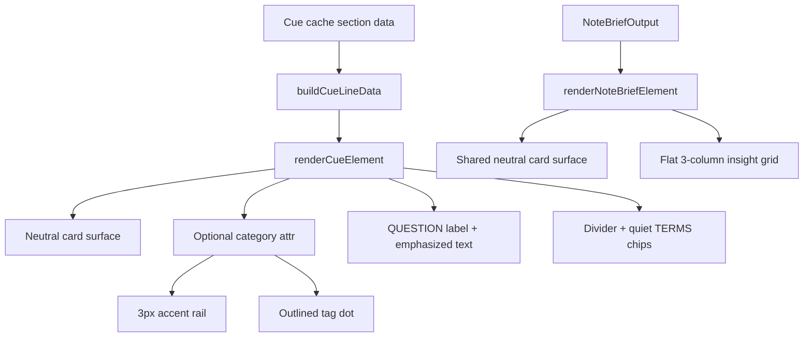

# CueCraft Card System Redesign - Plan

## Goal Capsule

| Field | Value |
|---|---|
| Objective | Replace the bright pastel CueCraft review surfaces with one calm, Obsidian-native card system for Note Brief, section cue cards, and tags. |
| Authority | The user-provided redesign spec is the product authority; existing renderer and settings patterns in `src/cue-extension.ts`, `src/editor-hook-rail.ts`, and `styles.css` define implementation shape. |
| Execution profile | Single implementation phase on `codex/cuecraft-redesign-card-system`, based on `main`, landing as one pull request. |
| Stop conditions | Stop if the required semantic cue families cannot be represented without changing generated cue data beyond this visual redesign's scope. |
| Tail ownership | `ce-work` owns implementation, verification, commit, push, PR creation, and residual review/CI follow-up. |

---

## Product Contract

### Summary

CueCraft should feel like enhanced markdown inside Obsidian, not a web dashboard.
The Note Brief, section cue cards, and category tags will share the same background, border, radius, shadow, and quiet typography, while category color is limited to a narrow cue-card rail and a small tag dot.

### Problem Frame

The current review surfaces mix accent-tinted fills, gradients, confidence-colored rails, and nested white note-brief cards.
Those styles compete with the note content and make CueCraft feel visually inconsistent across editor cue displays, Reading mode cues, and Note Brief output.
The redesign unifies the surfaces around Obsidian theme variables and makes the active-recall question the primary visual object.

### Requirements

**Unified Surface**

- R1. Note Brief, inline cue cards, anchored rail cue cards, and section tags use the same `--cc-card`, `--cc-border`, `--cc-text`, `--cc-muted`, `--cc-radius`, and `--cc-shadow` tokens scoped to CueCraft containers.
- R2. Review surfaces use `--cc-card` backgrounds, 1px `--cc-border` borders, shared radius, and subtle shadow instead of filled pastel backgrounds, gradients, or nested white sub-cards.
- R3. Note Brief renders as a flat label, summary line, and three-column insight grid with title plus one-line body for each insight.

**Semantic Color**

- R4. Category color appears only as a 3px cue-card accent rail and a small dot inside an outlined tag.
- R5. The semantic category palette supports `sequences`, `linkedlists`, `stacks`, and `intervals`, using Obsidian theme variables for surfaces and fixed hues only for those category marks.
- R6. Existing confidence semantics remain data-bearing but no longer paint the cue-card rail in the redesigned surfaces.

**Cue Structure**

- R7. Cue cards render a small uppercase `QUESTION` label, emphasized question text, a thin divider, and quiet `TERMS` chips.
- R8. Section Lens remains quieter than the question and does not introduce another card surface.
- R9. Section cue cards remain anchored to their section heading through the existing editor gutter and widget placement behavior.

**Compatibility**

- R10. Existing render functions keep their public call shapes unless a minimal optional cue category field is needed to carry semantic color.
- R11. The redesign respects Obsidian light and dark themes by mapping surfaces and text to native theme variables.

### Scope Boundaries

The active scope is the visual system and the smallest data-rendering path needed for category accents and tags.
It does not redesign settings, generation presets, Cornell layout presets, export formats, or prompt strategy beyond adding category data only if implementation confirms it is required to render semantic tags.

### Acceptance Examples

- AE1. Given a cue with category `stacks`, when it renders in the editor rail, then the card surface is neutral and only the left rail plus category dot use the stacks hue.
- AE2. Given a Note Brief, when it renders in editor, Reading, or Cornell context, then it has one outer card surface and a flat three-column insight grid with no nested white cards.
- AE3. Given support terms are present, when a cue card renders, then the terms appear as muted outlined chips after a divider rather than as a loud pill or inline decorative text.
- AE4. Given a cue has confidence `high`, `medium`, or `low`, when it renders in the redesigned surfaces, then confidence does not override the category rail color.

---

## Planning Contract

### Key Technical Decisions

- KTD1. Keep the renderer DOM stable where possible and add structure only for the requested hierarchy. `renderCueElement()` and `renderNoteBriefElement()` are already tested entry points, so the branch should add labels, wrappers, and chips inside those functions without changing callers unnecessarily.
- KTD2. Use CSS custom properties scoped to `.cuecraft-cue`, `.cuecraft-note-brief`, and `.cuecraft-editor-hook` rather than global `:root` tokens. This keeps CueCraft theme decisions contained inside plugin surfaces and follows the user's request to scope variables to plugin containers.
- KTD3. Treat category color as separate from confidence. Existing `data-confidence` is currently used for rails, but the redesign's semantic colors are category-based; confidence can remain on the dataset for future behavior without painting redesigned rails.
- KTD4. Add a minimal optional `category` field and prompt/schema guidance instead of heuristic keyword parsing. The requested families are semantic concepts, and keyword guessing would produce decorative or misleading color when a note happens to mention a matching word.
- KTD5. Preserve heading anchoring through existing CodeMirror gutter/widget logic. `buildCueGutterMarkers()` already places non-inline displays at heading lines, so the redesign should not move placement responsibility into CSS positioning hacks.

### High-Level Technical Design

This sketch is directional guidance, not implementation code.
The important boundary is that renderer data decides semantic category, while CSS decides the shared surface and the limited visual marks.

### Assumptions

- The category label can be optional for existing cached/generated cues; uncategorized cues should still render a neutral card without a misleading semantic dot.
- The user-provided amber token `#9a7b २b` contains an invalid character sequence, so implementation should use the intended amber hue `#9a7b2b`.
- Browser QA should not require starting a dev server unless the user explicitly asks; this plugin's automated verification can focus on DOM and CSS tests.

### Sources & Research

- `src/cue-extension.ts` owns `renderCueElement()`, `renderNoteBriefElement()`, `buildCueLineData()`, and heading-attached editor widgets.
- `src/editor-hook-rail.ts` owns anchored rail card data such as tone, gradient index, title density, and current/upcoming state.
- `styles.css` currently applies gradient/pastel cue surfaces, accent-tinted Note Brief backgrounds, nested Note Brief cards, and confidence rail coloring.
- `tests/cue-extension.test.ts` already verifies cue DOM shape, Note Brief structure, support-term visibility, and heading anchoring.
- `tests/settings-css.test.ts` shows the repo pattern for CSS assertion tests over `styles.css`.

---

## Implementation Units

### U1. Shared Card Tokens And Neutral Surfaces

- **Goal:** Add CueCraft card-system CSS variables and apply them to Note Brief, inline cues, anchored rail cards, and related hook surfaces.
- **Requirements:** R1, R2, R6, R9, R11
- **Dependencies:** None
- **Files:** `styles.css`, `tests/settings-css.test.ts`
- **Approach:** Scope `--cc-*` tokens to `.cuecraft-cue`, `.cuecraft-note-brief`, and `.cuecraft-editor-hook`. Replace the current filled/gradient cue and Note Brief backgrounds with `--cc-card`, `--cc-border`, `--cc-radius`, and `--cc-shadow`. Remove confidence-based rail coloring from redesigned surfaces while preserving `data-confidence` for tests and future logic.
- **Patterns to follow:** Existing Obsidian variable usage in `styles.css`; CSS text assertions in `tests/settings-css.test.ts`.
- **Test scenarios:**
  - Read `styles.css` and expect the shared `--cc-card`, `--cc-border`, `--cc-text`, `--cc-muted`, `--cc-radius`, and `--cc-shadow` variables to be scoped to CueCraft review containers.
  - Read the `.cuecraft-note-brief` rule and expect `background: var(--cc-card)`, `border: 1px solid var(--cc-border)`, and no `interactive-accent` fill mix.
  - Read the anchored rail rule and expect no gradient background for the neutral card surface.
  - Read confidence selectors and expect they do not set the redesigned cue-card rail color.
- **Verification:** CSS assertions prove the shared token contract and removal of pastel/gradient fills.

### U2. Cue Card DOM Hierarchy

- **Goal:** Render cue cards with an explicit question block, divider, and quiet term chips.
- **Requirements:** R2, R7, R8, R10
- **Dependencies:** U1
- **Files:** `src/cue-extension.ts`, `tests/cue-extension.test.ts`
- **Approach:** Update inline and anchored-card rendering to add a `QUESTION` label before the question text and render support terms as individual chip elements after a divider. Keep `renderCueElement()` parameters stable and preserve existing visibility settings for questions and support terms. Keep Section Lens in the same card but visually separated as quiet supporting content.
- **Patterns to follow:** `appendEditorHookSectionLabel()` for uppercase labels; existing `showQuestion` and `showSupportTerms` tests in `tests/cue-extension.test.ts`.
- **Test scenarios:**
  - Render an inline cue with question and keywords and expect a `QUESTION` label, one question text element, a terms container, and one chip per keyword.
  - Render an anchored-card rail cue and expect the visible section labels to include `QUESTION` and `TERMS` while keyword chips preserve the keyword text.
  - Render with `showQuestion: false` and expect no question label or question text while Section Lens still renders when present.
  - Render with `showSupportTerms: false` and expect no terms label, divider, or chips.
- **Verification:** DOM tests prove the requested cue structure without changing caller contracts.

### U3. Semantic Category Tags And Accent Marks

- **Goal:** Add the minimal category representation needed for semantic rail accents and outlined section tags.
- **Requirements:** R4, R5, R10
- **Dependencies:** U1, U2
- **Files:** `src/cue-extension.ts`, `src/schemas.ts`, `src/cache.ts`, `src/byok-cuecraft-adapter.ts`, `src/local-cli-cue-batch.ts`, `tests/cue-extension.test.ts`, `tests/schemas.test.ts`, `tests/cache.test.ts`, `tests/byok-cuecraft-adapter.test.ts`, `styles.css`, `tests/settings-css.test.ts`
- **Approach:** Add an optional cue category union for `sequences`, `linkedlists`, `stacks`, and `intervals`. Propagate the optional value through provider output validation, cache normalization, and `CueLineData`. Update local and BYOK cue-generation schema/prompt guidance so generated cues can supply the category without making old cached cues invalid. Render a muted outlined `#category` tag with a category dot when a category is present; omit the tag for uncategorized cues rather than guessing. Add category-specific CSS variables and `data-category` selectors that apply hue only to the 3px rail and tag dot.
- **Patterns to follow:** Existing confidence schema/cache/prompt propagation for narrow enum data; existing JSDOM render tests.
- **Test scenarios:**
  - Validate accepted category values and reject unrelated values without breaking cue validation.
  - Build cue line data from a cached categorized section and expect the category to survive into render data.
  - Build BYOK/local cue-generation prompts or schemas and expect they name the four allowed category values.
  - Render a categorized cue and expect `data-category`, a `#stacks`-style outlined tag, and a dot element.
  - Render an uncategorized cue and expect no category tag or category-specific dot.
  - Read `styles.css` and expect category hues to appear only in rail and dot selectors.
- **Verification:** Schema, prompt, cache, DOM, and CSS tests prove category color is semantic, generated intentionally, and backward-compatible for old cues.

### U4. Flat Note Brief Insight Grid

- **Goal:** Redesign Note Brief as a quiet summary plus flat three-column insight grid sharing the card system.
- **Requirements:** R1, R2, R3, R11
- **Dependencies:** U1
- **Files:** `src/cue-extension.ts`, `tests/cue-extension.test.ts`, `styles.css`, `tests/settings-css.test.ts`
- **Approach:** Keep `renderNoteBriefElement()` output semantic as a `section role="note"`, but rename or supplement classes so the three insight items read as columns rather than nested cards. Style the grid without individual white card backgrounds or decorative accent fills. Preserve the existing `whatMatters`, `reviewFirst`, and `sayItBack` order.
- **Patterns to follow:** Existing `noteBriefCardOrder` and Note Brief JSDOM test.
- **Test scenarios:**
  - Render a Note Brief and expect label text, overview text, and exactly three insight items in the existing order.
  - Expect each insight item to expose a title and one detail body without adding a nested card role or nested card surface class.
  - Read Note Brief CSS and expect insight items do not define their own filled background.
  - Render editor, Reading, and Cornell variants and expect each keeps the shared `cuecraft-note-brief` class plus its variant class.
- **Verification:** DOM and CSS tests prove the flat, shared Note Brief structure.

### U5. Final Visual Regression Guardrails

- **Goal:** Add lightweight automated guardrails that prevent the old decorative palette from returning.
- **Requirements:** R1, R2, R4, R6, R11
- **Dependencies:** U1, U2, U3, U4
- **Files:** `tests/settings-css.test.ts`, `tests/cue-extension.test.ts`
- **Approach:** Extend existing tests rather than introducing a visual test harness. Assert the contract at the CSS and DOM boundary: shared tokens exist, accent colors are constrained, terms are chips, Note Brief is flat, and heading-attached markers still use the existing CodeMirror positions.
- **Patterns to follow:** Existing `ruleFor()` CSS helper and heading marker tests in `tests/cue-extension.test.ts`.
- **Test scenarios:**
  - Confirm no rule for the redesigned card surfaces uses gradient or `color-mix` accent fills as the main card background.
  - Confirm category accent CSS targets only rail and dot affordances.
  - Confirm existing heading anchoring tests still pass for `anchored-card-rail`.
  - Confirm all cue DOM tests pass with both visible and hidden question/support settings.
- **Verification:** The full relevant Vitest suite passes, and typechecking confirms optional category data did not break existing consumers.

---

## Verification Contract

| Gate | Applies to | Done signal |
|---|---|---|
| `bun test tests/cue-extension.test.ts tests/settings-css.test.ts tests/schemas.test.ts tests/cache.test.ts tests/byok-cuecraft-adapter.test.ts` | U1-U5 | DOM, schema, prompt, cache, and CSS contract tests pass for the redesigned surfaces. |
| `bun test` | U1-U5 | Existing behavior outside the redesign remains green. |
| `bun run typecheck` | U2-U4 | TypeScript accepts the optional category propagation and renderer changes. |
| `bun run lint` | U1-U5 | Formatting and lint rules pass without suppressions. |

---

## Definition of Done

- The plan file is included on the implementation branch as the planning artifact for the PR.
- Note Brief, cue cards, and category tags share one visual surface system mapped to Obsidian theme variables.
- Category color appears only as a cue-card rail and tag dot.
- Questions are visually primary, terms are quiet chips, and Note Brief insights are flat columns.
- Existing cue placement remains anchored to section headings.
- All verification gates in the Verification Contract pass or any residual gap is documented in the PR body by the LFG pipeline.
- Dead-end implementation code and unused styles from abandoned approaches are removed before commit.
