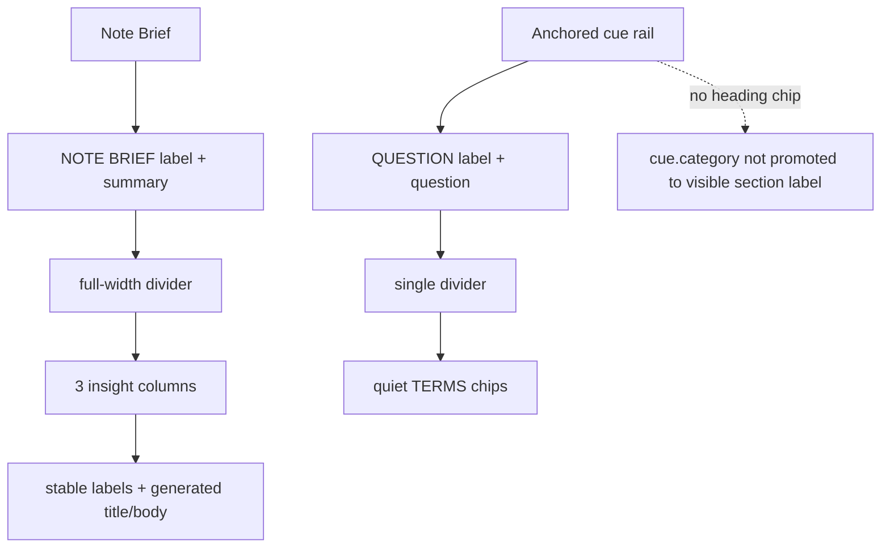

# CueCraft Reference Design Impact - Plan

## Goal Capsule

| Field | Value |
|---|---|
| Objective | Bring the current CueCraft card-system redesign closer to the user's reference by making Note Brief more editorial, anchored cue cards narrower and quieter, and generated metadata less distracting. |
| Authority | The Product Contract in `docs/plans/2026-07-06-002-feat-cuecraft-reference-design-impact-plan.html` is the product authority. Existing renderer and CSS patterns in `src/cue-extension.ts` and `styles.css` define the implementation shape. |
| Execution profile | One phase on the current redesign branch. This is a visual/UI polish change with focused renderer and CSS tests. |
| Stop conditions | Stop if implementing a heading-side chip requires inventing a domain-neutral generation field beyond this visual pass. Do not repurpose `cue.category` as a general section label. |
| Tail ownership | LFG owns implementation, review, browser testing, commit, push, PR update, and CI follow-through. |

---

## Product Contract

### Summary

The proposed changes make Note Brief more editorial, make anchored cue cards narrower and calmer, and keep generated metadata visually subordinate to the user's note.
The design should read as enhanced markdown with study scaffolding, not as a separate web app sitting on top of Obsidian.

Product Contract preservation: Product Contract unchanged; planning resolves the heading-chip question by omitting any new heading-side chip until a domain-neutral source exists.

### Problem Frame

The first redesign pass established the unified card system and removed the loud pastel fills.
The remaining gap is hierarchy: Note Brief needs to feel like a concise document overview, cue cards need to be clearly attached to headings without stealing attention, and category or keyword metadata must avoid becoming decorative noise.

### Requirements

**Note Brief hierarchy**

- R1. Note Brief must read as an editorial overview.
- R7. All generated surfaces must share one card system.

**Anchored cue rail**

- R2. Anchored cue cards must stay compact.
- R4. The cue rail must preserve markdown primacy.
- R5. Cue typography must remain quiet.
- R6. Anchored cue cards should have one primary internal divider.

**Domain-neutral metadata**

- R3. Heading-side chips must be domain-neutral.

### Acceptance Examples

- AE1. **Trigger:** A generated Note Brief appears at the top of a note. **Covers R1, R7.** The summary reads as the dominant content, the insight grid starts after a full-width divider, and only dividers between insight columns are visible.
- AE2. **Trigger:** A cue card is displayed in anchored rail mode. **Covers R2, R4, R5, R6.** The card is narrow, top-aligned with its heading, separated from the note body by a comfortable gutter, and structured as question followed by one divider and terms.
- AE3. **Trigger:** A section has a generated heading-side term. **Covers R3.** The term appears only if it is domain-neutral; coding-only values such as `sequences`, `linkedlists`, `stacks`, and `intervals` do not become general note labels.

### Scope Boundaries

**In scope**

- Visual hierarchy, rail width, Note Brief editorial structure, quiet term chip styling, divider behavior, and preventing the current coding-only category enum from becoming a general heading chip.

**Deferred to Follow-Up Work**

- Adding a new domain-neutral `primaryTerm` or equivalent generation field.
- Rendering a heading-side chip beside the markdown heading once a domain-neutral source exists.

**Out of scope**

- Using the current coding-interview category enum as a general labeling system.
- Adding decorative color fills.
- Turning the note into a dashboard layout.

### Dependencies and Assumptions

- The current `cue.category` field may remain available for optional accent data, but this plan must not surface it as a general visible section label.
- Existing note brief data already carries generated titles and details, so the editorial layout can add stable labels without changing provider schemas.

---

## Planning Contract

### Key Technical Decisions

- KTD1. **Use fixed Note Brief column labels while preserving generated content.** The renderer should add stable labels such as `CORE IDEA`, `REVIEW FIRST`, and `SELF-TEST`, then keep the model-generated title and detail as the column body.
- KTD2. **Do not add a heading chip in this phase.** A true heading chip needs a domain-neutral data source, and introducing that field would expand prompt, schema, cache, and UI behavior beyond this visual pass.
- KTD3. **Simplify anchored rail cards by hiding Section Lens there.** The reference card has one scan path: `QUESTION`, question text, divider, `TERMS`. Section Lens can remain in other cue surfaces where there is room for supporting explanation.
- KTD4. **Keep the redesign in existing renderer and CSS files.** The current branch already centralizes Note Brief, cue labels, tags, and rail CSS in `src/cue-extension.ts` and `styles.css`; adding new abstractions would not reduce complexity.

### High-Level Technical Design

### Assumptions

- The conservative heading-chip decision satisfies R3 and AE3 because no coding-only category chip will be promoted beside a heading.
- Existing category data can continue to exist for compatibility, but this plan should avoid adding new user-visible category labels in anchored rail mode.

### Sources / Research

- `docs/plans/2026-07-06-002-feat-cuecraft-reference-design-impact-plan.html` supplies the product requirements and visual impact framing.
- `docs/plans/2026-07-06-001-feat-cuecraft-card-system-redesign-plan.md` explains the current redesign branch's card-token, rail, tag, and Note Brief architecture.
- `src/cue-extension.ts` owns cue DOM rendering, Note Brief rendering, section labels, and Section Lens placement.
- `styles.css` owns shared CueCraft card tokens, Note Brief hierarchy, term chips, editor hook rail width, rail typography, and divider spacing.
- `tests/cue-extension.test.ts` and `tests/settings-css.test.ts` already cover the relevant DOM and CSS contracts.

---

## Implementation Units

### U1. Editorial Note Brief Structure

- **Goal:** Render Note Brief insights with stable editorial labels while preserving generated titles and details.
- **Requirements:** R1, R7, AE1.
- **Dependencies:** None.
- **Files:** `src/cue-extension.ts`, `tests/cue-extension.test.ts`, `styles.css`, `tests/settings-css.test.ts`.
- **Approach:** Add a small local label map for `whatMatters`, `reviewFirst`, and `sayItBack`. Render each insight as stable label, generated title, and generated detail. Add a full-width divider between overview and the insight grid through CSS rather than adding a nested card surface.
- **Patterns to follow:** Keep the existing `renderNoteBriefElement()` loop and class naming style; extend the DOM shape with one lightweight label element rather than replacing the whole renderer.
- **Test scenarios:** Covers AE1. Render `NOTE_BRIEF` and expect the three stable labels, the generated review title to remain visible, and the overview text unchanged. Read `styles.css` and expect the insight grid to have a top border while individual insight columns still only divide between columns.
- **Verification:** Focused renderer and CSS tests prove the brief hierarchy changed without changing provider output shape.

### U2. Anchored Rail Cue Simplification

- **Goal:** Make anchored card rail cues follow the reference scan path and avoid visible coding-only category labels.
- **Requirements:** R2, R3, R4, R5, R6, AE2, AE3.
- **Dependencies:** None.
- **Files:** `src/cue-extension.ts`, `tests/cue-extension.test.ts`.
- **Approach:** In anchored-card-rail rendering, keep `data-category` for compatibility and optional accent styling, but do not render a visible category tag. Hide Section Lens in anchored-card-rail mode so the card reads as question, divider, and terms. Leave inline, Cornell, and alternate editor displays behaviorally intact unless the same coding-only tag would become a heading-side label.
- **Patterns to follow:** Use the existing `showSectionLabels` branch and `appendSectionLens()` helper boundary instead of adding a new rendering mode.
- **Test scenarios:** Covers AE2 and AE3. Render an anchored rail cue with category and Section Lens and expect no `.cuecraft-section-tag`, no `LENS` label, no `.cuecraft-section-lens`, and labels `QUESTION` and `TERMS` only. Render an anchored rail cue with question/support terms hidden and expect no Lens-only card content.
- **Verification:** DOM tests prove anchored cards have the simple reference structure and do not promote coding-specific category values as labels.

### U3. Cue Rail and Note Brief Visual Polish

- **Goal:** Tune CSS so Note Brief and anchored cue cards match the reference hierarchy and restrained spacing.
- **Requirements:** R1, R2, R4, R5, R6, R7, AE1, AE2.
- **Dependencies:** U1, U2.
- **Files:** `styles.css`, `tests/settings-css.test.ts`.
- **Approach:** Reduce anchored-card-rail max width toward the reference card width, increase the editor rail gutter/page shift where needed, soften anchored question title weight, preserve full-width dividers with slightly more vertical margin, and give Note Brief overview/insight spacing a more editorial rhythm.
- **Patterns to follow:** Continue using scoped `--cc-*` tokens and Obsidian theme variables already introduced by the redesign branch.
- **Test scenarios:** Covers AE1 and AE2. Read `styles.css` and expect anchored rail max width to be narrower than the prior `22rem`, dense question titles to use a calmer weight, editor hook dividers to retain full-width behavior with more vertical margin, and Note Brief overview/insight spacing to use a grid-top divider.
- **Verification:** CSS tests pin the hierarchy changes so later visual tweaks do not drift back toward the denser card.

### U4. Focused Verification and Regression Coverage

- **Goal:** Keep the visual redesign covered by fast, focused tests before broader verification runs.
- **Requirements:** R1-R7, AE1-AE3.
- **Dependencies:** U1, U2, U3.
- **Files:** `tests/cue-extension.test.ts`, `tests/settings-css.test.ts`.
- **Approach:** Update existing assertions instead of adding a separate test suite. Keep tests readable by asserting the visible DOM contract and the specific CSS rules that encode hierarchy.
- **Test scenarios:** Render Note Brief and anchored rail examples with category, Section Lens, long question, and hidden-display settings. Read CSS for Note Brief grid divider, anchored rail width, anchored title weight, divider spacing, and quiet chips.
- **Verification:** Focused tests, typecheck, and lint pass without relying on manual Obsidian testing.

---

## Verification Contract

| Gate | Scope | Done signal |
|---|---|---|
| Focused DOM and CSS tests | U1-U4 | `./node_modules/.bin/vitest run tests/cue-extension.test.ts tests/settings-css.test.ts` passes. |
| Typecheck | U1-U4 | `bun run typecheck` passes with no TypeScript errors. |
| Lint | U1-U4 | `bun run lint` passes, or any pre-existing unrelated lint failures are identified as residuals. |
| Browser/manual visual check | U1-U4 | The Obsidian-rendered card shape shows an editorial Note Brief and a narrow anchored rail cue with `QUESTION`, one divider, and `TERMS` chips. |

---

## Definition of Done

- Note Brief uses stable insight labels and a full-width divider before the insight grid.
- Anchored rail cards no longer show a Lens section or visible coding-only category tag.
- Anchored rail cards are narrower, quieter, and visually subordinate to markdown content.
- Category values are not promoted as general heading-side chips.
- Focused DOM/CSS tests, typecheck, lint, browser testing, and CI complete or any residual failure is made durable in the PR body.
- The diff contains no abandoned experiment code or unrelated refactors.
