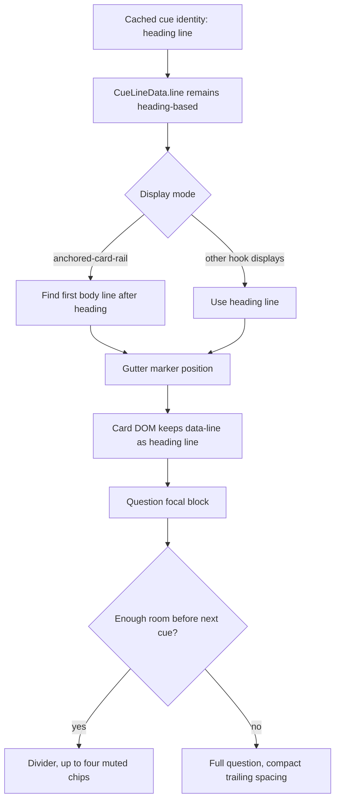

# Cue Card Rail Hierarchy - Plan

## Goal Capsule

| Field | Value |
|---|---|
| Objective | Make anchored editor cue cards visually align with the note body under each heading and read as question first, terms second. |
| Authority | User-provided design and current-implementation screenshots, then `docs/ideation/2026-07-08-cue-card-rail-hierarchy-ideation.html`, then current renderer/test patterns. |
| Scope | Anchored card rail rendering, placement, CSS hierarchy, adaptive short-section compaction, term limits, and focused tests. |
| Execution profile | Single-phase implementation; one branch and one PR are sufficient. |
| Stop conditions | Stop if body-line placement requires changing parser/cache semantics or if visual QA shows the chosen placement breaks non-anchored hook displays. |
| Tail ownership | Implementation should leave no plan progress markers; completion is derived from git, tests, and PR review. |

---

## Product Contract

### Summary

Anchored cue cards should sit beside the first body text under each note heading, not visually above the section content.
Inside the card, the recall question is the focal text, with muted support terms shown after a divider and capped to four visible chips.
When nearby section anchors leave too little vertical room, the card should preserve the full question, suppress terms, and tighten only the auto-compacted card's spacing.

### Problem Frame

The current implementation has the right card structure but the wrong visual priority.
Cards attach to heading-line gutter positions, which makes them float above the answer text in the current screenshot.
Term chips can outnumber the question visually, which weakens the active-recall scan path.

### Requirements

**Anchoring**

- R1. Anchored card rail cues align with the first body line beneath their heading when the section has body text.
- R2. The placement change is scoped to `anchored-card-rail`; other hook displays keep their existing heading-line marker behavior.
- R3. Anchored cards remain attached to their section when edits insert lines above or inside the note.

**Card hierarchy**

- R4. The anchored-card question text renders around 15-16px, semibold, and remains the card's focal element.
- R5. A thin divider separates the question block from support terms.
- R6. `QUESTION` and `TERMS` labels stay visible but muted relative to the question.

**Terms**

- R7. Anchored cards show no more than four term chips by default.
- R8. Terms beyond the first four remain hidden in anchored cards without an overflow control.
- R9. Term chips render smaller and quieter than the question text.

**Adaptive spacing**

- R13. Anchored cards hide support terms when the next cue is 6 or fewer source lines away for a standard question, 7 or fewer for a long question, or 8 or fewer for a dense question.
- R14. Cards compacted by R13 use reduced trailing vertical padding so adjacent card borders retain at least 6px of visible separation in the supplied layout without moving either anchor.
- R15. Adaptive spacing never truncates the question and does not change inline cues, other hook displays, final anchored cards, or the persisted rail-support setting.

**Safety**

- R10. Existing settings for hiding rail questions or support terms continue to suppress their respective card sections.
- R11. Failed cue cards keep their compact failure behavior and do not render term controls.
- R12. The change does not modify Markdown content, cache data, cue generation, or provider contracts.

### Acceptance Examples

- AE1. Given an anchored-card rail cue on a section with a heading and body text, when the gutter markers are built, then the card marker is positioned at the first body line and remains associated with the original cue line in DOM data.
- AE2. Given five support terms and sufficient section space, when the anchored card renders, then only the first four chips are visible and no overflow control appears.
- AE3. Given rail support terms are hidden by settings, when the anchored card renders, then no terms label, chips, or `+N more` control appears.
- AE4. Given an active-section-composer or collapsed-tabs display, when gutter markers are built, then marker positions match the existing heading-line behavior.
- AE5. Given a dense anchored question and a next cue 8 source lines away, when gutter markers are built, then the first card is question-only and receives compact spacing while the next card remains anchored to its own section; visual QA shows at least 6px between their borders in the supplied layout.
- AE6. Given a standard question with 7 source lines before the next cue, or a final cue with no successor, when gutter markers are built, then support terms remain available unless the global setting hides them.

### Scope Boundaries

- Keep this limited to anchored editor cue cards.
- Do not redesign Note Brief, Cornell view hook mode, provider prompts, cache shape, or keyword generation.
- Do not add a new persisted setting for term caps; four visible terms is the product behavior for this card.
- Do not add runtime height measurement, collision observers, question clamping, or anchor displacement for adaptive spacing.

Product Contract preservation: changed R8 and AE2 to reflect the previously approved removal of `+N more`; added R13-R15 and AE5-AE6 for adaptive short-section spacing.

---

## Planning Contract

### Key Technical Decisions

- KTD1. Use body-line marker targeting for anchored cards, not a CSS-only offset. The repo currently places markers at `headingLine.from`; moving the marker to the next document line for anchored cards is more stable across heading sizes than guessing an offset in CSS.
- KTD2. Preserve `CueLineData.line` as the section heading identity. The data model and cache matching stay heading-based; only the gutter marker target changes for anchored-card rail display.
- KTD3. Implement the term cap inside the renderer rather than changing generated keywords. The card is a presentation surface, and cache/provider output should remain complete.
- KTD4. Keep anchored-card overflow terms hidden without local interaction state. The renderer should cap presentation at four chips without writing plugin settings or mutating cache data.
- KTD5. Extend existing focused tests. `tests/cue-extension.test.ts` and `tests/settings-css.test.ts` already pin this surface, so new coverage should live there rather than in a new suite.
- KTD6. Use title-density-specific source-line thresholds: hide terms through 6 lines for standard questions, 7 for long questions, and 8 for dense questions. (session-settled: user-approved — chosen over a global eight-line cutoff: shorter questions can retain useful terms with less room, while dense questions need a larger safety margin.)
- KTD7. Derive compaction from cue-anchor distance and the existing `titleDensity` classification, not runtime card measurement. Deterministic marker construction avoids the focus and refresh layout instability already observed on this surface.
- KTD8. Mark only automatically compacted cards and reduce their trailing padding. Preserve the full question, body-line anchor, and global visibility settings; do not solve collisions by truncating text or shifting cards away from their sections.

### High-Level Technical Design

### Assumptions

- The first body line is the line immediately after the heading when it exists in the document.
- If the heading is the final line or the next line cannot be used, anchored cards may fall back to the heading line rather than disappearing.
- Source-line distance is an intentionally conservative proxy for vertical room; wrapped questions are accounted for through the existing standard, long, and dense title classifications.

### Sources & Research

- `docs/ideation/2026-07-08-cue-card-rail-hierarchy-ideation.html` establishes the ranked direction and rejects CSS-only offset as brittle.
- `src/cue-extension.ts` owns `CueLineData`, `renderEditorHookElement()`, `buildCueGutterMarkers()`, and existing card DOM structure.
- `src/editor-hook-rail.ts` owns card presentation data and should not need cache/provider changes for this slice.
- `styles.css` owns anchored-card rail hierarchy, gutter widths, responsive rail sizing, label styling, and term-chip styling.
- `tests/cue-extension.test.ts` already covers anchored-card DOM, hidden settings, and gutter marker positions.
- `tests/settings-css.test.ts` already covers compact rail card CSS and should pin the new visual hierarchy.

---

## Implementation Units

### U1. Anchored-Card Body-Line Placement

- **Goal:** Position anchored-card rail markers at the first body line while preserving heading-line cue identity.
- **Requirements:** R1, R2, R3, R12, AE1, AE4.
- **Dependencies:** None.
- **Files:** `src/cue-extension.ts`, `tests/cue-extension.test.ts`.
- **Approach:** Add a small placement helper used by `buildCueGutterMarkers()`. For `anchored-card-rail`, target the next line after `cue.line` when it exists; otherwise fall back to the heading line. Keep `root.dataset.line` as the original cue line so section identity and existing click/debug semantics remain stable. Leave inline widget placement and other hook displays unchanged.
- **Patterns to follow:** Existing `mapCueLineThroughChanges()` and `buildCueGutterMarkers()` guardrails for bounded line numbers; existing marker-position tests in `tests/cue-extension.test.ts`.
- **Test scenarios:**
  - Covers AE1. Given `# A\nalpha\n# B\nbeta`, when anchored-card rail markers are built for cues on lines 1 and 3, then marker positions are line 2 and line 4 while rendered card `data-line` values remain `1` and `3`.
  - Covers AE4. Given the same note and `active-section-composer`, when markers are built, then positions remain line 1 and line 3.
  - Covers R3. Given lines are inserted above the second heading after cues are set, when the gutter field remaps payload and rebuilds markers, then the second anchored marker follows the section to its new body line.
  - Covers R1. Given a heading at the end of the document, when markers are built, then the marker falls back to the heading line rather than throwing or disappearing.
- **Verification:** Focused marker tests pass and confirm anchored-card placement changed without affecting other display modes.

### U2. Question-First Card Hierarchy

- **Goal:** Tune anchored-card rail CSS so the question is the visual focal point and terms are secondary.
- **Requirements:** R4, R5, R6, R9, R11.
- **Dependencies:** None.
- **Files:** `styles.css`, `tests/settings-css.test.ts`.
- **Approach:** Scope the stronger typography to `.cuecraft-editor-hook-anchored-card-rail .cuecraft-editor-hook-title` so other hook displays keep their current scale. Use 15-16px semibold sizing for normal titles, preserve existing long/dense reductions, mute section labels, and keep a thin divider before the terms section. Shrink and soften chips through anchored-card-specific term styles rather than globally changing all cue terms.
- **Patterns to follow:** Existing scoped `--cc-*` variables, current `.cuecraft-editor-hook-section-label:not(:first-child)` divider rule, and CSS text assertions in `tests/settings-css.test.ts`.
- **Test scenarios:**
  - Read `styles.css` and expect an anchored-card-specific title rule with 15-16px sizing, semibold weight, and readable line-height.
  - Read `styles.css` and expect dense/long anchored-card title rules to preserve reduced sizing for long questions.
  - Read `styles.css` and expect the terms divider to remain a thin border between question and terms.
  - Read `styles.css` and expect anchored-card term chips to be smaller and muted relative to the title.
- **Verification:** CSS assertions prove the hierarchy rules are present and scoped to anchored cards.

### U3. Term Cap

- **Goal:** Cap anchored-card term chips at four visible chips without an overflow control.
- **Requirements:** R7, R8, R10, R11, R12, AE2, AE3.
- **Dependencies:** U2.
- **Files:** `src/cue-extension.ts`, `tests/cue-extension.test.ts`, `styles.css`, `tests/settings-css.test.ts`.
- **Approach:** Add an anchored-card-specific keyword rendering path inside `renderEditorHookElement()`. Render the first four keywords and omit overflow from this presentation surface. Keep the existing `appendCueTerms()` path for inline, Cornell, and other displays. Ensure hidden support-term settings skip the entire terms section.
- **Patterns to follow:** Existing `appendCueTerms()` and `appendEditorHookSectionLabel()` boundaries; existing hidden-settings tests for `showSupportTerms`; Obsidian-compatible plain DOM event handling used elsewhere in render helpers.
- **Test scenarios:**
  - Covers AE2. Given five keywords, when an anchored card renders, then four `.cuecraft-cue-term` chips are visible and no overflow control appears.
  - Covers AE3. Given `showSupportTerms: false`, when an anchored card renders with five keywords, then no terms label or chips appear.
  - Covers R11. Given a failed cue, when an anchored card renders, then no terms appear.
  - Given an inline cue with five keywords, when it renders, then all keywords still render through the existing path.
- **Verification:** DOM tests prove the cap, hidden-settings behavior, failure behavior, and non-anchored display preservation.

### U5. Density-Aware Short-Section Compaction

- **Goal:** Prevent adjacent anchored cards from touching or overlapping while preserving full questions and section alignment.
- **Requirements:** R13, R14, R15, AE5, AE6, KTD6, KTD7, KTD8.
- **Dependencies:** U1, U2.
- **Files:** `src/cue-extension.ts`, `src/editor-hook-rail.ts`, `styles.css`, `tests/cue-extension.test.ts`, `tests/settings-css.test.ts`.
- **Approach:** Reuse the card model's existing standard/long/dense title classification when gutter markers compare the current anchored cue with its next valid cue. Apply the density threshold from KTD6 to derive an auto-compacted marker option. Auto-compaction suppresses terms for that card and emits a stable card state for anchored-card CSS to reduce trailing padding; cards with sufficient room keep the global support-term behavior. Keep this calculation inside marker construction so edits rebuild the deterministic state without runtime element measurement.
- **Patterns to follow:** Existing `titleDensity` derivation in `src/editor-hook-rail.ts`, marker-specific options and equality keys in `src/cue-extension.ts`, anchored-card data attributes in the renderer, and scoped CSS assertions in `tests/settings-css.test.ts`.
- **Execution note:** Add failing focused marker/DOM and CSS tests before changing the thresholds or compact styling.
- **Test scenarios:**
  - Covers AE5. Given a dense question whose next anchored cue is 8 source lines away, when markers render, then the first card has compact state, contains no Terms block, and keeps the complete question text.
  - Covers R13. Given long and standard questions at their 7-line and 6-line boundaries, when markers render, then each card compacts; adding one source line to each interval preserves terms.
  - Covers AE6. Given a final anchored cue, when it renders, then it retains terms and does not receive compact state.
  - Covers R15. Given a non-anchored hook display or globally hidden support terms, when markers render, then adaptive spacing does not change that display's existing behavior.
  - Covers R14. Read `styles.css` and expect compact anchored cards to reduce trailing padding by 6px while retaining their normal top alignment, border, and full title rules; manual replay confirms at least 6px between card borders in the supplied layout.
- **Verification:** Focused marker/DOM tests prove all density boundaries and unaffected states; CSS assertions pin the compact spacing without introducing position transitions or runtime measurement.

### U4. Focused Verification Pass

- **Goal:** Run the narrow automated gates that prove this UI polish without broad unrelated churn.
- **Requirements:** R1-R15, AE1-AE6.
- **Dependencies:** U1, U2, U3, U5.
- **Files:** `tests/cue-extension.test.ts`, `tests/settings-css.test.ts`.
- **Approach:** Use existing test commands for the changed test files first, then the repo's normal test/build gates if focused tests pass. Record any manual visual gap in the PR body rather than inventing browser automation for an Obsidian-only editor surface.
- **Execution note:** This is UI polish in an Obsidian editor surface; automated DOM/CSS coverage is necessary but not a substitute for a manual screenshot check in Obsidian.
- **Patterns to follow:** README development commands and existing Vitest test layout.
- **Test scenarios:**
  - Focused cue-extension tests cover renderer DOM and marker placement.
  - Focused settings-css tests cover visual hierarchy rules.
  - Full suite confirms no unrelated cue display behavior regressed.
- **Verification:** Focused tests pass, full test/build commands pass or any environment-limited gap is documented with the failing command and reason.

---

## Verification Contract

| Gate | Applies To | Done Signal |
|---|---|---|
| Focused renderer tests | U1, U3, U5 | `tests/cue-extension.test.ts` passes with anchored placement, term-cap, density-boundary, and compact-state coverage. |
| Focused card-model tests | U5 | `tests/editor-hook-rail.test.ts` passes with shared title-density behavior preserved. |
| Focused CSS tests | U2, U3, U5 | `tests/settings-css.test.ts` passes with anchored-card hierarchy and compact trailing-spacing assertions. |
| Full test suite | U1-U4 | The repo test suite passes after focused tests. |
| Type/build gate | U1-U4 | The production build or typecheck gate passes with no new TypeScript errors. |
| Manual visual check | U1-U3 | Anchored cards visually start beside the body text below headings, question text dominates, and terms read as secondary. |

---

## Definition of Done

- Anchored rail cards use body-line placement without changing cue identity, cache data, or non-anchored hook display placement.
- Anchored card question text is the card focal point with muted labels and a thin divider before terms.
- Anchored card terms show at most four chips and expose no overflow control.
- Standard, long, and dense questions auto-compact through 6, 7, and 8 source lines respectively, hiding terms and leaving visible separation without truncating or shifting the question.
- Focused DOM/CSS tests cover the new contracts and the repo's broader verification gates have been run or their environment gaps documented.
- The diff includes the originating ideation artifact and this plan in the implementation branch.
- No abandoned experiment code, unused imports, or unrelated formatting churn remains in the final diff.
