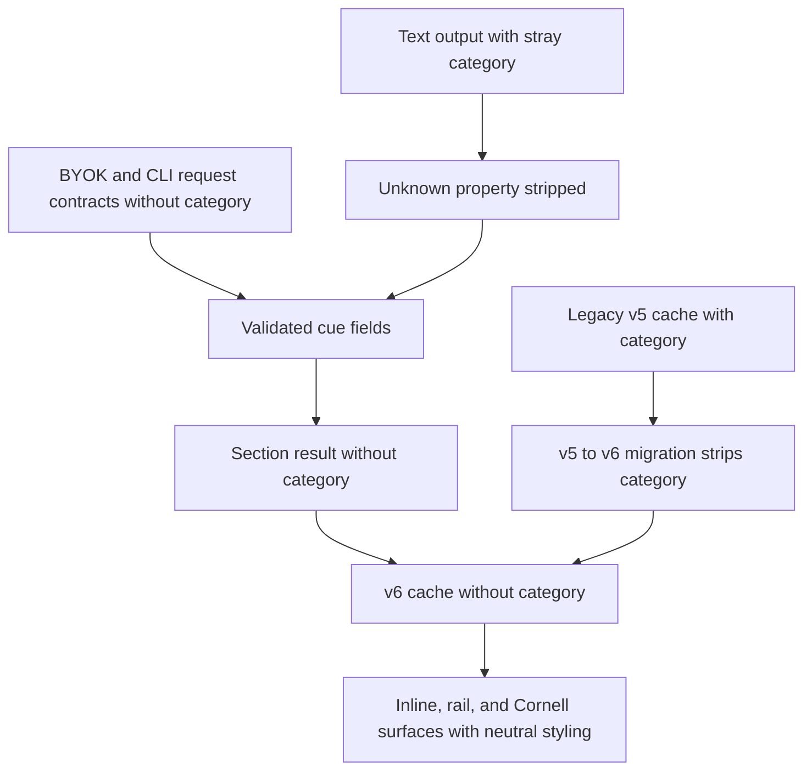

# Remove Cue Categories - Plan

## Goal Capsule

- **Objective:** Remove the accidental cue-category system from generation, storage, and presentation without changing useful study content.
- **Authority:** The user-directed removal decision governs product scope; this plan governs implementation details; existing repository patterns govern mechanics.
- **Execution profile:** One implementation phase and one pull request stacked on `codex/use-byok-object-instructions`.
- **Stop conditions:** Stop if removal would discard non-category cache data, alter keywords/support terms, or require a replacement taxonomy.
- **Tail ownership:** The LFG pipeline owns implementation, verification, review fixes, branch publication, pull-request creation, and CI follow-through.

---

## Product Contract

### Summary

CueCraft will stop asking models to classify note sections into the data-structure-specific categories `sequences`, `linkedlists`, `stacks`, and `intervals`.
The category field, cached values, visible tags, and category colors will be removed while cue questions, keywords, confidence, rationale, Section Lens, summary, and Note Brief behavior remain intact.

### Problem Frame

The category enum originated from a programming-note example and does not describe general notes.
It now adds prompt noise, misleading visual metadata, and a structured-output failure path when a model returns `category: null`.
The field has no study behavior beyond choosing accent colors and rendering optional tags, so retaining or generalizing it would add product complexity without improving recall.

### Requirements

**Generation contract**

- R1. Cue generation must no longer request, describe, validate, or expose a category field in BYOK object generation, BYOK text generation, or local CLI batch generation.
- R2. Otherwise-valid text or batch output that includes a legacy or stray category property must remain usable, and that property must be discarded without triggering repair.

**Data compatibility**

- R3. Runtime cue results, editor models, and newly written caches must not contain category data.
- R4. Existing v5 and older caches must upgrade to the current schema while preserving every non-category cue and note artifact.

**Presentation**

- R5. Cue surfaces must render without category attributes, category tags, category dots, or category-derived colors.
- R6. Questions, keywords/support terms, confidence, rationale, Section Lens, summary, and Note Brief content and visibility controls must remain unchanged.

### Scope Boundaries

- No replacement taxonomy, category inference, or user-configurable category system will be introduced.
- No changes will be made to summary instructions, provider routing, keyword generation, or support-term semantics.
- The unrelated Note Brief instruction that warns against generic "category labels" such as "Core idea" remains in place.
- Existing appearance-accent behavior will not be redesigned in this change.

### Acceptance Examples

- AE1. Given any cue-generation route, when CueCraft builds the request contract, then neither the prompt nor the structured schema contains the category field or any legacy category value.
- AE2. Given an otherwise-valid text cue containing `category: null`, a legacy category value, or an unrelated category value, when CueCraft validates it, then the cue succeeds and the extra property is absent from the normalized result.
- AE3. Given a v5 cache containing category plus all supported study artifacts, when CueCraft loads it, then only category is discarded and every other field is preserved.
- AE4. Given a generated or migrated cue, when inline, editor-rail, and Cornell surfaces render it, then no category marker is present and questions plus support terms render as before.

---

## Planning Contract

### Key Technical Decisions

- KTD1. **Delete the category concept end to end.** (session-settled: user-directed — chosen over generalizing the taxonomy: the existing values were accidental programming-note labels and provide no useful general classification.) This decision governs R1, R3, and R5.
- KTD2. **Advance the cache schema to v6.** Add an explicit v5-to-v6 migration that strips category while the existing migration matrix continues to normalize v1-v4 caches directly to the current schema. This decision governs R3 and R4.
- KTD3. **Use the existing permissive output boundary for legacy extra properties.** Removing category from the Zod object contracts lets unknown category properties be stripped while the remaining cue fields are still validated. This decision governs R1 and R2.

### Assumptions

- Normal cue rails and label icons will use their existing neutral fallback tokens after category-specific variables are removed.
- Category has no external consumer beyond the repository paths and cached generated data identified by the code scan.
- The implementation remains one phase because generation, migration, and presentation removal must land together to avoid an intermediate contract mismatch.

### High-Level Technical Design

### System-Wide Impact

- **Generation:** Both structured-object and text/repair paths consume a smaller cue contract.
- **Persistence:** Cache schema v6 removes generated metadata while preserving user-visible study artifacts.
- **Rendering:** Inline, editor-hook, and Cornell models lose category propagation and tags.
- **Styling:** The four category palette variables, category selectors, tag rules, and the Note Brief's legacy `--cc-sequences` dependency are removed.

### Sources and Research

- `docs/plans/2026-07-06-001-feat-cuecraft-card-system-redesign-plan.md` documents the original category introduction across schema, cache, renderer, and CSS.
- `docs/plans/2026-07-06-002-feat-cuecraft-reference-design-impact-plan.md` records that the enum is coding-specific and should not label general notes.
- Current implementations in `src/schemas.ts`, `src/cache.ts`, `src/cue-extension.ts`, and `styles.css` confirm category has no behavior beyond validation, propagation, tags, and accent selection.
- No `docs/solutions/` corpus or `CONCEPTS.md` exists, so there are no institutional learnings that constrain this removal.

---

## Implementation Units

### U1. Remove category from generation contracts

- **Goal:** Remove category from every cue request and normalized provider output.
- **Requirements:** R1, R2; AE1, AE2; KTD1, KTD3.
- **Dependencies:** None.
- **Files:** `src/schemas.ts`, `src/byok-cuecraft-adapter.ts`, `src/local-cli-cue-batch.ts`, `tests/schemas.test.ts`, `tests/byok-cuecraft-adapter.test.ts`, `tests/local-cli-cue-batch.test.ts`.
- **Approach:** Delete the enum, type, schema properties, JSON-schema properties, and prompt wording.
  Preserve all question, keyword, confidence, rationale, and Section Lens requirements.
  Replace positive category assertions with negative contract assertions and compatibility coverage for stray output properties.
- **Patterns to follow:** Keep `cueOutputSchema` and batch parsing as the normalization boundary rather than adding a category-specific sanitizer.
- **Test scenarios:**
  - Covers AE1. Build BYOK object, BYOK text, and local CLI batch requests and assert the field name plus all four legacy values are absent while the remaining cue contract stays present.
  - Covers AE2. Validate otherwise-valid single cues with `category: null`, `category: "sequences"`, and `category: "unrelated"`; each succeeds with no category property in the normalized result.
  - Covers AE2. Validate equivalent batch output and assert no repair retry occurs solely because of the stray property.
  - Reject malformed required cue fields exactly as before after category is removed.
- **Verification:** Focused schema and provider tests prove all request shapes and normalization paths use the reduced contract.

### U2. Remove runtime propagation and migrate caches

- **Goal:** Remove category from internal models and persist a category-free v6 cache without data loss.
- **Requirements:** R3, R4, R6; AE3; KTD1, KTD2.
- **Dependencies:** U1.
- **Files:** `src/generator.ts`, `src/cache.ts`, `src/main.ts`, `src/editor-hook-rail.ts`, `src/cue-extension.ts`, `tests/generator.test.ts`, `tests/cache.test.ts`, `tests/editor-hook-rail.test.ts`, `tests/cue-extension.test.ts`.
- **Approach:** Remove category fields and comparisons from section results, cached sections, cue line data, and editor-hook cards.
  Advance the cache schema and migrate v5 by removing only the category property.
  Detect when plugin-data loading normalizes a stored cache and persist the normalized cache map so migrated category data does not remain on disk until an unrelated save.
  Keep older migration paths and reconciliation behavior intact.
- **Execution note:** Add the rich v5 compatibility test before changing the cache schema so the migration proves preservation rather than only successful parsing.
- **Patterns to follow:** Mirror the versioned migration structure already used for rationale, review artifacts, and the original category addition.
- **Test scenarios:**
  - Covers AE3. Load a v5 cache containing category, questions, keywords, confidence, rationale, Section Lens, learning objective, summary, and Note Brief; assert category is not an own property and all other values are unchanged.
  - Load persisted plugin data containing that rich v5 cache, then assert startup writes v6 data with category removed and every other field preserved.
  - Upgrade v1-v4 cache fixtures to v6 and retain existing preservation assertions.
  - Build and reconcile new cache sections and assert their shape contains no category field while section identity and generated artifacts remain stable.
  - Build editor-hook cards from successful and failed cues and assert questions, terms, confidence, Section Lens, errors, and visibility state are unchanged.
- **Verification:** Cache, generator, editor-model, and type checks prove category no longer crosses runtime boundaries and old data remains usable.

### U3. Remove category presentation and styling

- **Goal:** Remove category-specific DOM and CSS while retaining the current neutral cue-card hierarchy.
- **Requirements:** R5, R6; AE4; KTD1.
- **Dependencies:** U2.
- **Files:** `src/cue-extension.ts`, `styles.css`, `tests/cue-extension.test.ts`, `tests/settings-css.test.ts`.
- **Approach:** Delete category datasets, tag construction, category palette variables, selectors, tag rules, and category-accent fallbacks.
  Replace the Note Brief icon's `--cc-sequences` dependency and normal cue rails/icons with neutral tokens.
  Preserve failed-cue styling, questions, support-term chips, Section Lens, overflow behavior, and visibility settings.
- **Patterns to follow:** Use the neutral `--cc-border` and `--cc-muted` tokens already used when a cue has no category.
- **Test scenarios:**
  - Covers AE4. Render inline, anchored rail, alternate editor-hook, and Cornell cues and assert there is no `data-category`, `.cuecraft-section-tag`, category dot, or legacy category text.
  - Covers AE4. Render a migrated v5 cue and assert its keywords still appear as support-term chips.
  - Assert normal cue rails and label icons use neutral tokens and the Note Brief no longer references the legacy palette.
  - Assert failed-cue error rails retain their error styling and are not neutralized.
  - Retain existing question, support-term, Section Lens, overflow, and show/hide assertions when rewriting category-heavy fixtures.
- **Verification:** DOM and CSS tests prove category presentation is gone without weakening existing study surfaces.

---

## Verification Contract

| Gate | Scope | Done signal |
|---|---|---|
| Focused generation tests | U1 | Schema, BYOK adapter, and local CLI batch tests pass with no category request surface. |
| Focused data tests | U2 | Cache, plugin-data persistence, generator, editor-hook, and cue-model tests pass, including rich v5 preservation. |
| Focused presentation tests | U3 | Cue DOM and CSS tests pass for neutral normal states and unchanged error states. |
| `bun run typecheck` | U1-U3 | TypeScript reports no remaining category type or property references. |
| `bun run lint` | U1-U3 | ESLint passes without unused imports or stale helpers. |
| `bun test` | U1-U3 | The complete Vitest suite passes. |
| `bun run build` | U1-U3 | The production plugin bundle builds successfully. |
| Repository search | U1-U3 | Category-specific enum values, types, datasets, palette variables, and tag helpers are absent; unrelated prose uses of “category” remain intact. |

---

## Definition of Done

- All three implementation units satisfy their requirements and test scenarios.
- New cue requests and outputs have no category contract.
- Existing v5 and older caches load into v6 without losing non-category artifacts.
- Migrated plugin caches are written back during startup so legacy category data does not remain in persisted storage.
- Cue displays contain no category tags, attributes, dots, or category-derived colors.
- Keywords/support terms and all other study artifacts behave as before.
- Focused checks, typecheck, lint, full tests, and production build pass.
- The branch diff contains no abandoned compatibility shim, replacement taxonomy, or unrelated cleanup.
