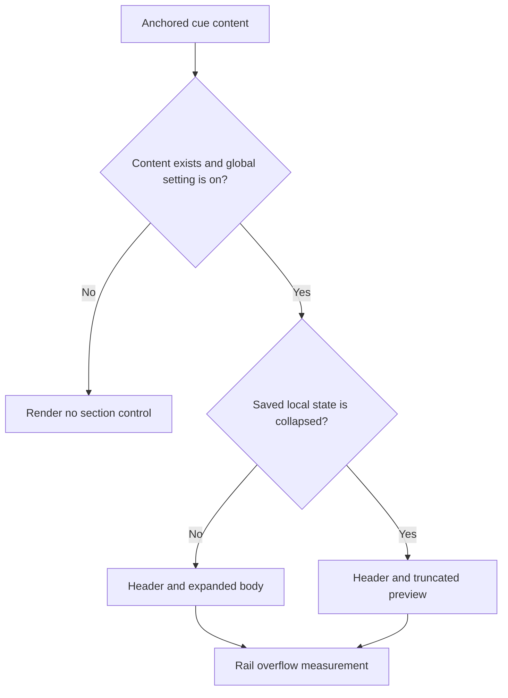
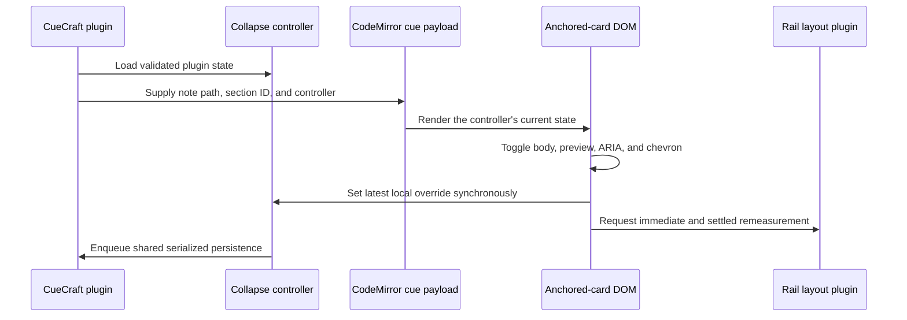

# Cue Rail Section Collapse - Plan

## Goal Capsule

| Item | Decision |
|---|---|
| Objective | Let users collapse Summary, Question, and Terms independently in anchored cue-rail cards without losing section context. |
| Product authority | The confirmed setting-plus-local-override direction, the v0 prototype, and this Product Contract. |
| Execution profile | One bounded feature across persisted plugin data, anchored-card DOM, rail measurement, CSS, and tests. |
| Stop conditions | Stop if implementation requires changing other review surfaces, global setting semantics, or note identity beyond the confirmed scope. |
| Tail ownership | Automated tests prove state and DOM contracts; a manual Obsidian pass proves keyboard, theme, and animation quality. |

---

## Product Contract

### Summary

Anchored cue-rail cards gain collapse-in-place controls for Summary, Question, and Terms.
Each available section keeps a visible header while its body is collapsed.
The current global settings remain the master visibility controls.
Local collapsed state is remembered per note and note section.

### Problem Frame

The richer cue rail improves understanding, but a fully expanded card can compete with the note and consume vertical space.
The existing global settings are too broad for users who want different emphasis in different note sections.
The existing card-wide Show more control solves overflow, but it does not let users choose which cue content to keep open.

### Actor

- A1. A CueCraft user reviewing a note in Editing View with the anchored cue rail enabled.

### Requirements

**Section interaction**

- R1. Collapse controls apply only to Summary, Question, and Terms in anchored cue-rail cards.
- R2. Each rendered cue content section has an independent header button that remains visible in both states.
- R3. A section with no saved override starts expanded.
- R4. The header button toggles its body and shows a down chevron when expanded and a right-pointing chevron when collapsed.
- R5. A collapsed header shows one muted, italic, single-line preview below its label row; activating that preview expands the section.
- R6. Summary and Question previews use their displayed text, while Terms uses the rendered terms joined by comma and space.

**Accessibility and presentation**

- R7. Each header exposes `aria-expanded` and `aria-controls`, and its controlled body has a document-unique ID.
- R8. Collapsed bodies are hidden from assistive technology while the preview remains available.
- R9. Body height and opacity transition for about 200 ms, and reduced-motion preferences disable the transition.
- R10. Styling uses existing CueCraft and Obsidian theme variables under the anchored-card root.

**Visibility and persistence**

- R11. Existing global visibility settings determine whether a cue content section and its local control exist.
- R12. Hiding a content type globally preserves its saved local state and restores that state when the type is shown again.
- R13. Collapsed state persists by note path, cached note-section ID, and content kind so it survives note close and reopen.
- R14. Globally enabled, non-empty Terms remain renderable in compact cards; space compaction must not silently replace the user-controlled visibility model.
- R15. Missing content and failed cue cards do not render empty disclosure controls.

### Key Decision

- **Use global settings plus persisted local overrides.** Global settings control whether content exists; local controls manage expanded state for one note section. (session-settled: user-directed — chosen over global-only controls and isolated card-only state: users need both a durable default and precise review focus.) Governs R1-R5 and R11-R14.

### Acceptance Examples

- AE1. Given a note with no saved overrides, when its anchored cues render, then every available and globally enabled section is expanded.
- AE2. Given an expanded Summary, when the user activates its header, then only the Summary body collapses and its truncated takeaway preview appears.
- AE3. Given collapsed Terms with more than four generated terms, when the card renders, then the preview lists the same four rendered terms and activating it expands Terms.
- AE4. Given a saved collapsed Question, when the user closes and reopens the note, then the Question remains collapsed while the same note section in another note keeps its own state.
- AE5. Given a saved Terms override, when Terms is globally hidden and later shown, then the control is absent while hidden and its saved state returns when shown.
- AE6. Given nearby cue cards that use compact spacing, when Terms is globally enabled and non-empty, then its disclosure control remains available.
- AE7. Given a card with card-wide overflow controls, when a section is toggled, then the card-wide expanded state stays unchanged while overflow and spacer measurements update to match the new section height.

### Scope Boundaries

- Preserve inline cues, Cornell displays, other editor-hook displays, and failed-cue presentation.
- Preserve the card-wide Show more and Show less control as a separate overflow affordance.
- Do not redesign or relocate the existing global settings.
- Do not add note-rename migration, stale-state pruning, or cross-device state synchronization.
- Do not add React or another UI framework.

---

## Planning Contract

### Key Technical Decisions

- KTD1. **Persist only collapsed entries in a dedicated store.** Use a defensive loader and a store modeled on `src/visibility.ts`. Update memory synchronously, and make the plugin's shared data writer the serialization boundary for settings, caches, visibility, and collapse state so an older whole-plugin snapshot cannot finish last. This implements R3 and R12-R13. (session-settled: user-directed — chosen over global-only controls and non-persisted card state: local choices must survive reopening the note.)
- KTD2. **Carry stable identity and a live state bridge through the render model.** Add the cached note-section ID to cue render data and supply the note path plus a stable collapse controller to anchored widgets. Marker construction reads current state from the controller, while header activation updates it synchronously before persistence. Widget equality must include identity and collapsed state so CodeMirror cannot retain stale DOM or callbacks.
- KTD3. **Use one disclosure button per cue content section.** The button contains the existing icon and label row, chevron, and collapsed preview. The controlled body remains a sibling wrapper. Build with the renderer's existing document-owned DOM pattern and Obsidian `setIcon`; do not introduce React.
- KTD4. **Keep global and local precedence explicit.** Apply global visibility and content-existence checks first, then resolve local collapse state. Remove compact-for-space Terms suppression because it would bypass R11 and R14.
- KTD5. **Reuse rail measurement signaling.** A section toggle updates its DOM immediately, persists the new state, and asks the existing rail overflow and spacer system to remeasure both immediately and after the relevant height transition settles. The immediate measurement is final when reduced motion disables transitions. Section toggles do not modify card-wide expanded state.
- KTD6. **Animate a section wrapper, not measured content height.** Use a grid-row and opacity transition with an overflow-hidden inner body. Rotate the chevron with the same cadence and provide a reduced-motion override.

### High-Level Technical Design

#### Visibility precedence

#### Persistence and layout loop

### Risks and Mitigations

- **Rerender drift:** CodeMirror may reuse a marker after state changes. Include identity and section state in widget equality and cover explicit rerenders.
- **Persistence races:** Rapid clicks may overlap `saveData` calls. Serialize or coalesce writes and test delayed saves.
- **Layout drift:** Section animation changes card height while overflow and spacer logic measure it. Remeasure after the transition and retain current card-wide overflow rules.
- **Duplicate control IDs:** Split editors can render the same note more than once. Generate document-unique body IDs instead of using the persisted key as an HTML ID.

### Sources and Patterns

- `src/cue-extension.ts` owns cue render data, anchored-card DOM, CodeMirror widget equality, and rail measurement events.
- `src/editor-hook-rail.ts` owns the card presentation model and global question and terms options.
- `src/main.ts` owns plugin data loading, persistence, and the active-note render payload.
- `src/visibility.ts` provides the closest defensive-load and injected-persistence store pattern.
- `docs/plans/2026-07-04-002-feat-editor-rail-show-more-plan.md` establishes card-wide expansion as DOM-local and independent.
- `docs/plans/2026-07-08-001-feat-cue-card-rail-hierarchy-plan.md` establishes anchored-card compaction and spacer constraints.

---

## Implementation Units

### U1. Persist per-note cue section state

- **Goal:** Add validated, race-safe storage for collapsed Summary, Question, and Terms state.
- **Requirements:** R3 and R11-R13; KTD1-KTD2.
- **Dependencies:** None.
- **Files:** `src/cue-section-collapse.ts`, `src/main.ts`, `src/cue-extension.ts`, `tests/cue-section-collapse.test.ts`, `tests/plugin-data-migration.test.ts`.
- **Approach:** Store collapsed entries only. Validate loaded note paths, note-section IDs, content kinds, and boolean values. Add stable cached IDs to `CueLineData`. Pass the active note path and a stable collapse controller into the editor payload. Serialize all whole-plugin data writes through `persistPluginData`, not only writes initiated by the collapse store. Keep saved overrides when a global setting hides content.
- **Execution note:** Implement store and load-normalization tests before wiring plugin data.
- **Patterns to follow:** `VisibilityStore`, `loadHiddenMap`, `loadPluginData`, and `persistPluginData`.
- **Test scenarios:**
  1. A missing or malformed stored value loads as an empty map without changing settings, caches, or hidden-note state.
  2. Collapsing one content kind stores only that note path, note-section ID, and kind; expanding it removes the sparse entry.
  3. Two notes and two note sections with similar headings keep independent state.
  4. Rapid collapse-expand-collapse actions with delayed persistence leave the final stored state collapsed.
  5. Interleaved collapse and cache or settings writes leave the final persisted snapshot with both updates.
  6. `buildCueLineData` preserves the cached section ID after edits move its heading to another line.
- **Verification:** Plugin data round-trips valid state, rejects malformed state, and exposes the correct snapshot to rendering.

### U2. Render accessible independent disclosures

- **Goal:** Convert each anchored-card label and body into an independent disclosure without changing other cue surfaces.
- **Requirements:** R1-R8, R11-R15, AE1-AE6; KTD2-KTD4.
- **Dependencies:** U1.
- **Files:** `src/cue-extension.ts`, `src/editor-hook-rail.ts`, `tests/cue-extension.test.ts`, `tests/editor-hook-rail.test.ts`.
- **Approach:** Replace anchored section label rows with button-based disclosure headers while preserving Summary, Question, Terms order and icons. Put the collapsed preview inside the same button for one keyboard target. Resolve initial and rebuilt marker state from the stable controller, and call it synchronously on activation before updating DOM and scheduling persistence. Give each body a document-unique ID and synchronize its hidden state with `aria-expanded`. Keep missing and globally hidden sections absent. Preserve Terms in compact cards and keep the existing four-term display cap.
- **Patterns to follow:** `appendEditorHookSectionLabel`, `appendLabelIcon`, anchored-card DOM assertions, and current global visibility tests.
- **Test scenarios:**
  1. Each available header is a button with a chevron, matching `aria-controls`, unique body ID, and expanded state by default.
  2. Clicking Summary collapses only Summary and updates its body, preview, ARIA state, and chevron state.
  3. Activating a collapsed preview expands the same section without changing siblings.
  4. Terms preview joins the same capped terms shown by the expanded body.
  5. Global hiding removes the applicable header and body but does not erase the supplied saved state.
  6. Missing Summary, empty Terms, and failed cue cards do not create empty disclosure controls.
  7. Inline and Cornell DOM stays unchanged.
  8. Compact anchored cards retain non-empty Terms when the global setting is on.
- **Verification:** DOM tests prove independent state, accessible relationships, preview sources, visibility precedence, and surface isolation.

### U3. Animate sections and integrate rail measurement

- **Goal:** Match the v0 collapse behavior while keeping anchored cards, overflow controls, and spacers stable.
- **Requirements:** R4-R5, R9-R10, and AE7; KTD5-KTD6.
- **Dependencies:** U2.
- **Files:** `styles.css`, `src/cue-extension.ts`, `tests/cue-extension.test.ts`, `tests/editor-hook-layout.test.ts`, `tests/settings-css.test.ts`.
- **Approach:** Scope disclosure layout to `.cuecraft-editor-hook-anchored-card-rail`. Animate grid rows, opacity, and chevron rotation with theme variables and visible focus styles. Apply the ellipsis contract to previews. Disable transitions for reduced motion. Trigger the existing overflow and spacer measurement path immediately after every toggle and again when the relevant wrapper transition settles; the immediate path covers reduced-motion mode.
- **Patterns to follow:** Existing anchored-card selectors, `RAIL_CARD_TOGGLE_EVENT`, rail spacer measurement, and current reduced-motion rules.
- **Test scenarios:**
  1. Section toggles request remeasurement without changing card-wide expanded state.
  2. Collapsing enough content removes obsolete overflow UI and shrinks excess spacer height.
  3. Re-expanding content restores overflow protection without clipping the section body.
  4. CSS includes grid-row and opacity transitions, chevron rotation, one-line ellipsis, focus visibility, theme variables, and reduced-motion overrides.
  5. With transitions disabled, a toggle still requests the final overflow and spacer measurement.
  6. Manual Obsidian verification covers pointer use, Tab focus, Enter and Space activation, repeated focus retention, light and dark themes, and animation quality.
- **Verification:** Automated layout and CSS contracts pass, and manual inspection matches the prototype behavior without rail overlap.

---

## Verification Contract

| Gate | Coverage | Done signal |
|---|---|---|
| `bun test` | Store, migration, DOM, accessibility, compaction, overflow, and CSS contracts | All tests pass. |
| `bun run typecheck` | Render-state and persisted-state types | No TypeScript errors. |
| `bun run lint` | Source, tests, and CSS-adjacent TypeScript | No lint findings. |
| `bun run build` | Production Obsidian bundle | Build completes successfully. |
| Manual Obsidian check | Keyboard, animation, focus, themes, note reopen, and rail spacing | Behavior matches AE1-AE6 in light and dark themes. |

---

## Definition of Done

- Summary, Question, and Terms collapse independently in anchored cue-rail cards.
- Headers, previews, chevrons, ARIA state, keyboard behavior, and reduced motion satisfy R2-R10.
- Local state persists per note path, note-section ID, and content kind with latest-write-wins behavior.
- Global visibility, missing content, compact cards, and other review surfaces satisfy R11-R15.
- Card-wide Show more and spacer behavior remain independent and stable.
- U1-U3 verification and the full Verification Contract pass.
- Abandoned experiments, unused state fields, and obsolete selectors are absent from the final diff.
