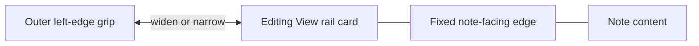
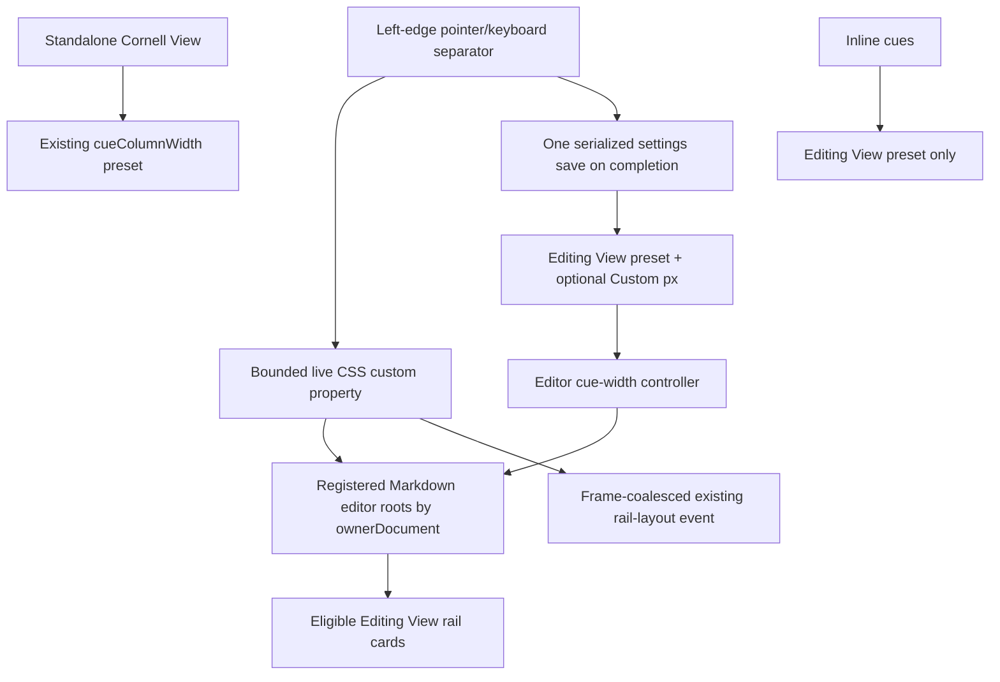

# Editing View Cue Rail Resize - Plan

## Goal Capsule

- **Objective:** Let users resize beside-note cue cards directly in Editing View while the note-facing edge remains aligned with the note.
- **Authority:** The confirmed left-edge interaction, global preference behavior, and this Product Contract govern product scope. Existing editor-rail layout and persistence contracts govern implementation.
- **Execution profile:** One implementation phase with three dependent units.
- **Stop conditions:** Stop if the implementation would change standalone Cornell View, give inline cues Custom pixel widths or grips, or require an unbounded layout-observer loop.
- **Tail ownership:** The implementation owns editor-only width state, grip interaction, persistence, layout integration, regression tests, and manual Obsidian verification.

---

## Product Contract

### Summary

Editing View will gain a separate preset-or-custom cue width. Eligible rail cards will inherit a live width from their editor roots and expose a left-edge resize grip, while standalone Cornell View remains independent and inline cues stay preset-only and grip-free.

#### Post-implementation product decision — August 13, 2026

The shipped interaction supersedes the Editing View preset portions of this plan. Editing View no longer exposes Narrow, Medium, Wide, or Custom width controls in settings. It starts at Medium and saves a custom pixel width only after the user resizes the rail directly. Existing valid custom widths remain compatible; retired editor presets are discarded. Inline cues use Medium, while standalone Cornell View retains its separate width setting unchanged.

### Problem Frame

The Narrow, Medium, and Wide presets cannot accommodate every window size, note layout, or reading preference. Users can see the width they need while reviewing a note, but changing it currently requires leaving that context for settings.

The note occupies the space to the right of the cue rail, so resizing from that side would conflict with the alignment boundary users are trying to preserve. The width control also cannot continue sharing state with standalone Cornell View once Editing View supports a custom pixel width.

### Requirements

#### Resize interaction

- R1. Resizing is available only on Editing View rail cards positioned beside the note.
- R2. Each eligible card exposes a grip along its outer left edge, while the card's note-facing right edge remains anchored.
- R3. Dragging the grip left widens the Editing View cue rail, and dragging it right narrows the rail.
- R4. All visible Editing View rail cards follow the width continuously while the user drags any one grip.
- R5. Resizing is constrained to a usable range so cards cannot become unreadably narrow, cover the note, or extend beyond the available workspace.

#### Discoverability and accessibility

- R6. The grip remains faintly visible at rest and becomes more prominent on hover or keyboard focus.
- R7. The grip communicates horizontal resizing through its visual treatment and pointer cursor without obscuring cue content.
- R8. A keyboard user can focus the grip and adjust the same global Editing View width without using a pointer.

#### Preference behavior

- R9. Completing a resize selects a Custom Editing View width and preserves it across notes and Obsidian restarts.
- R10. Choosing Narrow, Medium, or Wide replaces the Custom Editing View width with the selected editor preset. Entering Custom preserves the last editor preset for inline cues; standalone Cornell View retains its own independent preset throughout.
- R11. The width preference applies globally to eligible Editing View rail cards rather than to an individual cue, note section, or note.
- R12. Standalone Cornell View retains its independent preset behavior. Inline cues use the last Editing View preset, never adopt its Custom pixel width, and do not expose the resize grip.

### Key Decisions

- **Resize from the outer left edge.** (session-settled: user-directed — chosen over the right edge: the note-facing edge is the alignment boundary users want to keep fixed.) Governs R2-R3.
- **Use one global Editing View width.** (session-settled: user-directed — chosen over per-note and per-cue state: cue width should remain consistent while moving through notes.) Governs R4 and R9-R11.
- **Keep the grip subtly visible.** (session-settled: user-approved — chosen over hover-only visibility: users need to discover that cue width is adjustable.) Governs R6-R8.
- **Limit resizing to Editing View rail cards.** (session-settled: user-directed — chosen over changing all cue surfaces: standalone Cornell View and inline layouts serve different spatial models.) Governs R1 and R12.

### Layout Relationship

The grip moves the card's outer boundary under R2-R5; it does not move the anchored edge into the note.

### Key Flow

- F1. Resize the Editing View cue rail
  - **Trigger:** The user drags a grip or uses keyboard controls while the grip is focused.
  - **Steps:** Cuecraft previews the bounded width on every visible eligible rail card. A completed pointer or keyboard interaction selects Custom and saves once; cancellation restores the previously committed width.
  - **Outcome:** The chosen width remains consistent across notes and after restart, until a preset replaces it.
  - **Covered by:** R1-R11.
- F2. Return to a preset width
  - **Trigger:** The user selects Narrow, Medium, or Wide in Editing View settings.
  - **Steps:** Cuecraft clears the custom width, applies the selected editor preset, and refreshes Editing View cues without refreshing standalone Cornell View.
  - **Outcome:** Eligible Editing View rail cards use the selected responsive preset and settings no longer report Custom.
  - **Covered by:** R9-R12.

### Acceptance Examples

- AE1. **Covers R2-R4.** Given several Editing View rail cards, when the user drags one grip left or right, then every visible card widens or narrows respectively while each note-facing edge stays aligned.
- AE2. **Covers R5.** Given a card at either resize limit, when the user continues dragging beyond the limit, then the card remains at the usable boundary without covering the note or leaving the workspace.
- AE3. **Covers R6-R8.** Given a grip at rest, then it remains faintly visible; when the user hovers or focuses it, it becomes more prominent and supports horizontal width adjustment by pointer or keyboard.
- AE4. **Covers R9 and R11.** Given a completed custom resize, when the user opens another note or restarts Obsidian, then eligible Editing View rail cards use the saved custom width.
- AE5. **Covers R10.** Given a Custom width, when the user selects Narrow, Medium, or Wide, then Editing View returns to that preset and no longer uses the previous custom value.
- AE6. **Covers R12.** Given standalone Cornell View or an inline cue layout, when the Editing View rail width changes, then that surface does not gain a grip or adopt the custom rail width.
- AE7. **Covers R3-R5 and R9.** Given an active drag, when pointer capture is cancelled, lost unexpectedly, or the editor widget is destroyed, then Cuecraft clears the drag state, restores the committed width, and does not save a Custom value.
- AE8. **Covers R8-R10.** Given a focused grip, when the user presses Left, Right, Home, or End, then width changes in the matching physical direction or to the matching bound, editor caret/scroll behavior does not run, and the final width persists as Custom.

### Scope Boundaries

#### Included

- Editing View rail cards in Anchored card rail, Threaded margin notes, and Editing View's Cornell-style rail layouts.
- Pointer and keyboard resizing, one global editor preference, Custom settings state, persistence, and overlap remeasurement.
- Existing Narrow, Medium, and Wide controls as the way to replace Custom with a preset.

#### Deferred to Follow-Up Work

- Per-note, per-section, and per-cue widths.
- Cue height resizing or a two-dimensional corner handle.
- A same-card pointer alternative made of increment/decrement buttons; the current scope provides drag, keyboard adjustment, and the existing preset controls without claiming full WCAG 2.2 dragging-movement conformance.

#### Outside This Product Change

- Standalone Cornell View width controls, rendering, persistence, and display-mode controls.
- Direct resizing, Custom pixel widths, and grip DOM for inline cues and non-rail editor-hook layouts.
- A redesign of the three existing preset thumbnails beyond showing the derived Custom state.

---

## Planning Contract

### Key Technical Decisions

No additional user-settled technical decisions were introduced during the non-interactive planning pass. The implementation defaults below are explicit assumptions for review rather than product commitments.

### Assumptions

- A1. **Separate editor state from Cornell state.** Retain `cueColumnWidth` for standalone Cornell View. Add an Editing View preset plus a nullable custom pixel width; rail cards use Custom when present, while inline cues retain the editor preset.
- A2. **Preserve upgraded appearance.** When the editor preset is absent in stored data, initialize it from the legacy `cueColumnWidth` value. Normalize invalid presets to Medium and invalid custom values to no Custom value.
- A3. **Use bounded CSS pixels for Custom.** Store a finite whole-pixel value between 96px and 512px. During an interaction, further cap the effective width by the space between the rail's fixed right edge and its workspace's left boundary, keeping a 12px safety inset. A narrower viewport may clamp display without overwriting the saved preference.
- A4. **Treat Custom as derived settings state.** Editing View settings report Custom whenever a custom pixel width exists. Custom is not a fourth preset a user selects directly; selecting Narrow, Medium, or Wide clears the custom value and makes that preset authoritative.
- A5. **Use Pointer Events with explicit cancellation.** A primary-button drag captures its pointer, snapshots start position and width, previews `startWidth + (startX - clientX)`, commits once on `pointerup`, and reverts without saving on `pointercancel`, unexpected `lostpointercapture`, or teardown.
- A6. **Keep live updates out of CodeMirror state.** Preview through a validated CSS custom property on registered Editing View roots in each owning document. Do not rebuild gutter markers or save settings on pointer moves.
- A7. **Use separator keyboard semantics.** Each rendered grip is a vertical `separator` with an accessible name and current/minimum/maximum values. Left increases width, Right decreases it, Home selects the minimum, and End selects the current dynamic maximum; handled keys do not reach CodeMirror. Arrow steps are 8px.
- A8. **Reuse bounded rail measurement.** Width changes dispatch the existing rail-layout signal at most once per animation frame so wrapping can update spacer heights. Do not add a `ResizeObserver`, clear spacer state during the drag, or recursively request measurements from stale writes.
- A9. **Keep width motion immediate.** Do not transition width during drag. The visual grip is a narrow line inside a pointer target at least 24px wide, with theme-variable colors and a visible focus state.

### High-Level Technical Design

The live path changes CSS on stable editor roots so the active grip is not replaced during pointer capture. The committed path updates plugin settings once and lets future editor renders initialize from the saved preset/custom state.

### System-Wide Impact

- **Settings and persistence:** Editing View gains its own preset and optional Custom width. Standalone Cornell View keeps the existing `cueColumnWidth` field and refresh path.
- **Editor rendering:** The existing rail-layout eligibility seam adds grip DOM and a custom-width hook. Inline and non-rail displays keep their current preset classes and DOM.
- **Layout:** The current note-relative translation continues to anchor the right edge. Width previews trigger the existing bounded spacer measurement so wrapping does not reintroduce cue overlap.
- **Accessibility:** Grip DOM exposes separator semantics, range values, keyboard commands, pointer cursor, and visible hover/focus states.
- **Pop-out windows:** Width application is scoped through each element's owning document/editor root rather than a global `document` assumption.

### Risks and Mitigations

- **Layout feedback or startup freeze:** A width change can alter wrapping and card height. Keep previews out of CodeMirror render state, coalesce the existing layout event, and extend the current bounded-measurement regression tests.
- **Pointer capture leak:** Note switches, pointer cancellation, or widget destruction can leave selection/cursor state stuck. Use one idempotent cleanup path and test every termination route.
- **Surface leakage:** A shared width field or broad CSS selector could alter standalone Cornell View or inline cues. Split settings state, reuse the editor rail predicate, and add negative DOM/CSS tests.
- **Preset migration regression:** Existing users could see Editing View jump to Medium after upgrade. Seed the new editor preset from valid legacy state and cover missing/invalid combinations.
- **Workspace overflow:** An absolute custom maximum is not sufficient in a narrow editor. Snapshot the available left-side geometry at interaction start and combine it with absolute bounds.
- **Duplicate global controls:** Every separately rendered rail card exposes the same global operation. Give each grip a contextual accessible name and identical range semantics; verify tab and focus behavior with several cues before considering a future rail-level handle abstraction.

### Sources and Research

- `src/cue-extension.ts` provides the rail-layout predicate, rail-card finalizer, gutter rendering, layout event, and bounded spacer measurement that this work extends.
- `src/main.ts` owns editor render payloads, global settings persistence, and editor refresh behavior.
- `src/settings.ts`, `src/settings-summaries.ts`, and `src/appearance-thumbnail-controls.ts` own the existing shared preset controls and summary text that must be separated.
- `src/cornell-layout.ts` and `src/cornell-view.ts` establish the preset type and standalone Cornell View behavior that must remain unchanged.
- `src/editor-hook-layout.ts` and `styles.css` establish the note-relative rail translation, page-shift offsets, responsive preset widths, card borders, and display-specific clipping constraints.
- `tests/cue-extension.test.ts`, `tests/settings.test.ts`, `tests/plugin-data-migration.test.ts`, `tests/settings-css.test.ts`, and `tests/editor-hook-layout.test.ts` contain the closest regression patterns.
- Recent rail-layout fixes `80b2da6`, `f732bc4`, and `880f1a9` establish that measurement writes must stay bounded and must not create viewport feedback.
- [W3C Pointer Events](https://www.w3.org/TR/pointerevents/) defines pointer capture, cancellation, and `touch-action` behavior used by the drag lifecycle.
- [WAI-ARIA separator](https://www.w3.org/TR/wai-aria/#separator) and the [Window Splitter APG](https://www.w3.org/WAI/ARIA/apg/patterns/windowsplitter/) define vertical separator range and keyboard semantics.
- [CodeMirror lifecycle APIs](https://codemirror.net/docs/ref/#view.PluginValue.destroy) establish teardown ownership for editor plugins and widgets.
- [Obsidian pop-out window guidance](https://docs.obsidian.md/plugins/guides/pop-out-windows) requires using element-owned documents instead of a global window/document assumption.
- No `CONCEPTS.md`, root `solutions/`, or `docs/solutions/` corpus exists, so no institutional solution note constrains this implementation.

---

## Implementation Units

### Phase 1. Add bounded, persistent Editing View rail resizing

### U1. Separate and normalize Editing View width preferences

- **Goal:** Give Editing View an independent preset/custom width without changing standalone Cornell View or inline cue behavior.
- **Requirements:** R9-R12; F2; AE4-AE6; A1-A4.
- **Dependencies:** None.
- **Files:** `src/editor-cue-width.ts` (new), `src/settings.ts`, `src/settings-summaries.ts`, `src/appearance-thumbnail-controls.ts`, `src/main.ts`, `tests/editor-cue-width.test.ts` (new), `tests/settings.test.ts`, `tests/plugin-data-migration.test.ts`, `tests/appearance-thumbnail-controls.test.ts`.
- **Approach:** Add pure editor-width types, bounds, normalization, preset/custom resolution, left-edge delta, and keyboard-step helpers. Extend settings with an editor preset and nullable custom pixel width while preserving `cueColumnWidth` for standalone Cornell View. On load, migrate a missing editor preset from a valid legacy Cornell preset and discard invalid custom values. Pass the editor preset into all Editing View renders, but expose Custom only to eligible rail layouts. Update the Editing View thumbnail group and summary to derive Custom from the nullable value; selecting any preset clears Custom, saves once, and refreshes editor cues only. Leave the standalone Cornell controls, summary, and refresh callback on `cueColumnWidth`.
- **Patterns to follow:** Reuse the existing pure width helpers, thumbnail option renderer, serialized settings persistence, and isolated Editing/Cornell save callbacks. Keep Custom out of the shared `CueColumnWidth` union.
- **Test scenarios:**
  - Covers AE4. Save and reload a valid custom pixel width and assert the Editing View summary reports Custom.
  - Covers AE5. Select each preset from Custom and assert custom becomes null, the editor preset updates, editor cues refresh, and Cornell state/refresh do not change.
  - Covers AE6. Change standalone Cornell width and assert editor preset/custom state do not change; change Editing View width and assert `cueColumnWidth` does not change.
  - Covers A2. Load settings that predate the editor fields and assert a valid legacy preset seeds the editor preset; invalid, non-finite, fractional, and out-of-range custom values normalize deterministically.
  - Cover the pure left-edge width formula, keyboard direction, absolute bounds, and dynamic maximum without DOM.
- **Verification:** Focused width-helper, migration, settings, summary, and thumbnail tests pass with no standalone Cornell View source change required.

### U2. Add the left-edge pointer and keyboard interaction

- **Goal:** Let any eligible Editing View rail card preview and commit the global Custom width without replacing the active CodeMirror marker.
- **Requirements:** R1-R5, R7-R9, R11-R12; F1; AE1-AE4, AE6-AE8; A5-A7.
- **Dependencies:** U1.
- **Files:** `src/cue-extension.ts`, `src/main.ts`, `src/editor-cue-width.ts`, `tests/cue-extension.test.ts`, `tests/editor-cue-width.test.ts`.
- **Approach:** Extend the existing rail-card finalizer so only displays accepted by `railLayoutAppliesToDisplay()` receive a left-edge separator grip. Add stable preview, commit, and cancel callbacks to the editor render payload; exclude callback identity and transient width from gutter marker equality so pointer movement never rebuilds DOM. On primary `pointerdown`, snapshot the measured width and dynamic available maximum, set pointer capture, and mark drag state. Pointer moves validate the matching pointer and apply the pure left-edge formula to every registered visible Editing View root in each owning document. `pointerup` commits Custom once before releasing capture. Cancellation, unexpected lost capture, and teardown cancel pending work, restore the committed value, and remove cursor/selection state without saving. Keyboard Left/Right/Home/End use the same preview/commit path, keep ARIA range values current, and suppress CodeMirror's default key handling.
- **Patterns to follow:** Reuse the section-disclosure native event/ARIA patterns, owner-document access, existing render payload, and plugin settings save path. Use Pointer Events and capture; do not attach uncaptured global mouse listeners.
- **Test scenarios:**
  - Covers AE1. Render several eligible cards, drag one left/right, and assert all registered cards preview the same width while the source grip remains mounted.
  - Covers AE2. Drag beyond absolute and workspace bounds and assert the pure/effective width remains clamped.
  - Covers AE3 and AE8. Assert separator role, vertical orientation, accessible contextual name, min/max/current values, focusability, pointer cursor hook, Left/Right direction, Home/End bounds, and stopped editor key propagation.
  - Covers AE7. Exercise `pointercancel`, unexpected `lostpointercapture`, mismatched pointer IDs, non-primary buttons, and teardown; assert one cleanup, no save, and committed-width restoration.
  - Covers R9. Exercise successful pointer and keyboard completion and assert one Custom persistence call per completed interaction rather than per move/repeat.
  - Covers AE6. Assert grip absence for inline and every non-rail editor-hook display; retain coverage for all five existing rail-layout display families.
- **Verification:** Focused editor-width and cue-extension DOM tests prove direction, eligibility, accessibility, one-shot persistence, and idempotent cancellation.

### U3. Integrate custom width, grip styling, and bounded overlap measurement

- **Goal:** Preserve the rail's right-edge alignment, card borders, responsive layout safety, and non-overlap behavior throughout resizing.
- **Requirements:** R2, R4-R7, R12; F1; AE1-AE3, AE6-AE7; A3, A6, A8-A9.
- **Dependencies:** U1-U2.
- **Files:** `src/cue-extension.ts`, `src/editor-hook-layout.ts`, `styles.css`, `tests/cue-extension.test.ts`, `tests/settings-css.test.ts`, `tests/editor-hook-layout.test.ts`.
- **Approach:** Add an editor-only Custom state class and CSS custom property after existing preset selectors, scoped to `.cuecraft-editor-rail-card`. Keep the current `translateX(-100% ...)` geometry so changing width moves only the outer left edge. Update page-shift/masthead width calculations to consume the effective custom variable when active. Place a 24px-wide transparent hit target just inside the outer left edge with a thin visible line, `ew-resize`, `touch-action: none`, theme variables, and stronger hover/focus/drag states; do not change card overflow globally or animate width. During preview, coalesce the existing `RAIL_CARD_LAYOUT_EVENT` to one request per animation frame so spacer height follows text wrapping without adding a new observer or clearing existing spacer state.
- **Patterns to follow:** Append overrides after the existing rail preset rules, preserve display-specific borders/pseudo-elements, and reuse the current read/write rail measurement cycle and stale-write guards.
- **Test scenarios:**
  - Covers AE1. Assert custom CSS overrides only eligible editor rail widths and preserves the note-relative transform/right edge.
  - Covers AE2. Assert min/max/fallback CSS and dynamic geometry hooks prevent invalid or unbounded width values.
  - Covers AE3. Assert the faint line remains visible at rest, strengthens on hover/focus/drag, uses theme variables, exposes a minimum 24px target, and has no width transition.
  - Covers AE6. Assert selectors cannot match standalone Cornell View or inline cue roots and that legacy preset selectors remain intact.
  - Repeatedly preview widths that change wrapping and assert layout notifications and CodeMirror measurements stay frame-bounded, spacer writes converge, and no viewport/layout feedback loop appears.
  - Verify Anchored card rail, Threaded margin notes, Cornell Classic, Exam Prep, and Minimal rail cards retain their full border/visual treatment with the grip present.
- **Verification:** Focused CSS, editor-hook layout, and rail-spacer regression tests pass; manual Obsidian checks show a stable fixed right edge, no overlap, and no startup freeze.

---

## Verification Contract

| Gate | Scope | Done signal |
|---|---|---|
| Editor-width unit tests | U1-U2 | Normalization, migration, left-edge direction, dynamic bounds, and keyboard steps are deterministic. |
| Settings isolation tests | U1 | Editing View reports Custom and preset selection clears it without mutating or refreshing standalone Cornell View. |
| Grip DOM and lifecycle tests | U2 | Eligible displays expose accessible grips; pointer/keyboard completion saves once; every cancellation route reverts and cleans up. |
| Layout and CSS regression tests | U3 | Custom width is editor-rail-only, the right edge remains anchored, styling is theme-safe, and spacer measurements stay bounded. |
| `bun run typecheck` | U1-U3 | TypeScript passes with the new settings and render-payload fields. |
| `bun run lint` | U1-U3 | ESLint passes with no global document assumption, stale listeners, or unused shared-width helpers. |
| `bun run test` | U1-U3 | The full Vitest suite passes, including the recent rail-overlap/freeze regressions. |
| `bun run build` | U1-U3 | The production Obsidian plugin bundle builds successfully. |
| Manual Obsidian QA | U1-U3 | Pointer and keyboard resizing work across eligible Editing View rail styles, persist after note/restart, reset through presets, and leave standalone Cornell View/inline cues unchanged. |

---

## Definition of Done

- U1-U3 satisfy every traced requirement and acceptance example.
- Editing View has independent preset/custom width persistence with a backward-compatible initial preset.
- Dragging a left-edge grip changes every visible eligible card continuously, keeps the note-facing edge fixed, and commits exactly once on successful completion.
- Keyboard Left/Right/Home/End adjustments expose correct separator semantics and persist through the same Custom path.
- Cancellation, lost capture, note switch/widget teardown, and plugin disable leave no stuck cursor, selection suppression, pending frame, or unintended save.
- Selecting Narrow, Medium, or Wide clears Custom and refreshes Editing View only.
- Standalone Cornell View and inline cue layouts retain their current controls, width state, DOM, and CSS behavior.
- Custom width cannot become non-finite, unreadably narrow, unbounded, or wider than the source workspace available during interaction.
- Rail spacer measurement remains bounded and no startup freeze, overlap, or missing card border regression appears.
- Focused checks, typecheck, lint, full tests, production build, and manual Obsidian QA pass.
- The branch diff contains the requirements/plan artifact and no unrelated cleanup or abandoned resize experiments.
