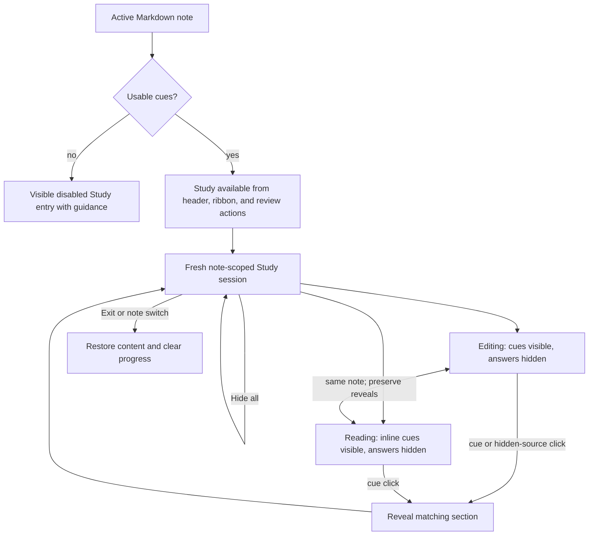

# In-Note Study Mode - Plan

## Goal Capsule

| Field | Value |
|---|---|
| Objective | Make retrieval practice available directly in the active note, with an easy entry point, section-by-section answer reveal, and persistent controls in both Editing and Reading views. |
| Product authority | The settled behavior in this plan, then `docs/designs/2026-08-15-editor-study-mode-interaction.html`, then the Cornell-removal research listed under Sources & Research. |
| Scope | Study entry, transient session behavior, per-section reveal, Editing and Reading parity, Reading cue-display simplification, and existing action convergence. |
| Execution profile | Code change spanning shared Study state and the Editing, Reading, command, ribbon, and settings surfaces. |
| Open blockers | None. Planning may choose implementation details but must preserve the behaviors and boundaries below. |

---

## Product Contract

### Summary

Study Mode becomes a note-level review session inside the active Markdown note in both Editing and Reading views.
The note-header Study button is the primary entry, the repurposed Cornell ribbon icon is the persistent shortcut, and sticky controls keep progress, reset, and exit actions available while reviewing.
Reading View uses one fixed inline-cue presentation that Study Mode augments instead of replacing.

### Problem Frame

Per-section retrieval practice currently depends on opening a dedicated Cornell destination, adding a mode change before the learner can begin recall.
The existing in-note Study behavior only hides the note globally and does not provide section progress, independent reveal, or persistent controls.
Reading View also asks users to choose a cue-display preference even though inline cues are the presentation needed for in-note review.

### Key Decisions

- **Use the active note as the Study destination.** (session-settled: user-approved — chosen over retaining Cornell View as the primary review destination: Study should be immediately available where users already read and edit.) Governs R1, R4, R16.
- **Keep Study entry visible when cues are unavailable.** (session-settled: user-directed — chosen over hiding the control or generating automatically: the disabled control should explain the prerequisite.) Governs R3.
- **Provide equivalent Study behavior in Editing and Reading.** (session-settled: user-directed — chosen over switching users into Editing or offering reduced Reading controls: view preference should not weaken the review loop.) Governs R5, R8, R10, R11.
- **Preserve a same-note session across view changes.** (session-settled: user-directed — chosen over restarting when the Markdown view mode changes: a display-mode change should not erase review progress.) Governs R6.
- **Let editing intent reveal the answer.** (session-settled: user-directed — chosen over blocking interaction with hidden source: clicking hidden content should continue naturally into editing.) Governs R13.
- **End the session when the active note changes.** (session-settled: user-directed — chosen over background per-note sessions or carrying Study into the next note: review state is transient and note-scoped.) Governs R7.
- **Standardize Reading View on inline cues.** (session-settled: user-directed — chosen over a configurable Reading display or temporary Study override: the alternate compact Cornell entry adds an unnecessary choice.) Governs R14, R15.

### Actors

- A1. The learner reads, recalls, reveals answers, and may edit the active note during a Study session.
- A2. CueCraft exposes Study availability, maintains transient progress, and presents the same session through the active Markdown view.

### Requirements

**Entry and availability**

- R1. The active note header presents Study as the primary way to begin an in-note review session.
- R2. The existing Cornell ribbon position becomes a persistent Study shortcut for the active Markdown note.
- R3. When the active note has no usable cues, Study entry controls remain visible but disabled and explain on hover that cues must be generated first.
- R4. When Study Mode is inactive, activating any Study entry starts a fresh session for the active note without opening another view or pane.

**Session lifecycle and controls**

- R5. An active Study session offers the same progress and reveal behavior in Editing and Reading views.
- R6. Switching between Editing and Reading for the same note preserves the active session and its revealed sections.
- R7. Switching to a different note ends Study Mode and clears the previous note's reveal progress.
- R8. While Study Mode is active, sticky controls keep revealed-section progress, Hide all, and Exit available as the user scrolls.
- R9. Hide all returns every answer section in the current session to its hidden state without ending Study Mode.
- R10. Exit ends Study Mode, restores all source content, and clears the session's reveal progress.

**Recall and reveal**

- R11. Entering Study Mode leaves cues and section headings visible while hiding the source content that answers each usable cue.
- R12. Activating a cue reveals only its matching source section, and activating it again hides that section.
- R13. Clicking hidden source content in Editing reveals that section and places the editing cursor at the clicked location.

**Reading View and existing actions**

- R14. Reading View always presents usable cached cues inline beneath their matching headings, independent of Study Mode.
- R15. The Reading mode display setting and its compact Review in Cornell presentation are removed.
- R16. Existing actions intended to review the active note or toggle Study Mode enter or control the same in-note Study session.
- R17. Explicit Open Cornell View behavior remains available until Cornell View removal is implemented separately.

### Key Flows

- F1. Begin a Study session
  - **Trigger:** A1 activates Study from the note header, ribbon, or an existing review action while the active note has usable cues.
  - **Actors:** A1, A2
  - **Steps:** A2 begins a fresh note-scoped session, hides answer content, leaves prompts and headings visible, and presents sticky controls.
  - **Outcome:** A1 can start retrieval practice without leaving the active note.
  - **Covers:** R1, R2, R4, R8, R11, R16.
- F2. Reveal and reset answers
  - **Trigger:** A1 attempts recall from a visible cue.
  - **Actors:** A1, A2
  - **Steps:** A1 activates the cue to reveal its answer, continues section by section, and may use Hide all to restart the pass.
  - **Outcome:** Each answer remains independently controlled and progress stays visible.
  - **Covers:** R8, R9, R12.
- F3. Continue studying across Markdown modes
  - **Trigger:** A1 switches the active note between Editing and Reading while Study Mode is active.
  - **Actors:** A1, A2
  - **Steps:** A2 presents the same session in the destination mode with the same revealed sections and control state.
  - **Outcome:** A1 changes how the note is viewed without losing study progress.
  - **Covers:** R5, R6, R14.
- F4. Edit a hidden answer
  - **Trigger:** A1 clicks hidden source content in Editing during Study Mode.
  - **Actors:** A1, A2
  - **Steps:** A2 reveals the matching section and places the cursor where A1 clicked.
  - **Outcome:** Study concealment does not obstruct an immediate editing task.
  - **Covers:** R13.
- F5. Leave the session
  - **Trigger:** A1 exits Study Mode or activates a different note.
  - **Actors:** A1, A2
  - **Steps:** A2 restores hidden source content and clears transient reveal progress; a note switch also ends Study Mode.
  - **Outcome:** No Study concealment or progress leaks into normal use or another note.
  - **Covers:** R7, R10.

### Acceptance Examples

- AE1. **Covers R3.** Given an active note with no usable cues, when A1 views a Study entry control, then the control is visible and disabled, and its hover explanation says to generate cues first.
- AE2. **Covers R1, R4, R8, R11.** Given an active note with usable cues, when A1 activates the note-header Study button, then the current note remains on screen, answer content is hidden, prompts and headings remain visible, and sticky progress, Hide all, and Exit controls appear.
- AE3. **Covers R2, R5, R16.** Given an active note with usable cues in Editing or Reading, when A1 activates the ribbon Study shortcut, then the same in-note Study session begins in the current Markdown view.
- AE4. **Covers R8.** Given a long note in an active Study session, when A1 scrolls away from the note header, then the progress, Hide all, and Exit controls remain accessible without returning to the top.
- AE5. **Covers R12.** Given a hidden answer section, when A1 activates its cue once, then only its matching section is revealed; when A1 activates that cue again, then the section is hidden.
- AE6. **Covers R9.** Given two answer sections have been revealed, when A1 uses Hide all, then both sections are hidden and the session remains active.
- AE7. **Covers R5, R6.** Given one section is revealed in Editing, when A1 switches the same note to Reading, then Study Mode remains active and that section remains revealed with matching progress.
- AE8. **Covers R13.** Given a hidden answer in Editing, when A1 clicks a location inside it, then its section becomes visible and the cursor is placed at the clicked location.
- AE9. **Covers R7.** Given an active Study session with revealed sections, when A1 opens a different note, then Study Mode ends and the previous note's progress is cleared.
- AE10. **Covers R10.** Given an active Study session, when A1 chooses Exit, then all source content is visible and reopening Study starts with no sections revealed.
- AE11. **Covers R14, R15.** Given a note with usable cached cues in Reading View, when Study Mode is inactive, then cues appear inline beneath their headings and no Reading display preference or compact Review in Cornell control is offered.
- AE12. **Covers R16, R17.** Given an active note with usable cues, when A1 invokes an existing review or Study toggle action, then it controls the in-note session; when A1 explicitly invokes Open Cornell View, then the existing Cornell destination still opens.

### Scope Boundaries

- This plan owns in-note Study entry, transient session behavior, per-section reveal, sticky controls, Editing and Reading parity, and the fixed inline-cue Reading presentation.
- Cornell View removal is separate work; this plan preserves the explicit Open Cornell View path until that removal occurs.
- Cue generation, regeneration, stale-cue refresh, failed-cue recovery, and cue-quality repair do not change here.
- Scoring, spaced repetition, review history, and persisted per-note Study sessions are outside this work.
- Note Brief and Section Lens behavior do not change.

### Dependencies and Assumptions

- Study availability depends on the active note having usable cached cues.
- A cue can be associated with one source section closely enough to hide and reveal that answer independently.
- Editing and Reading can present the same transient note-scoped session without changing Markdown or persisted cue data.

### Sources & Research

- `docs/designs/2026-08-15-editor-study-mode-interaction.html` is the visual authority for the note-header entry, sticky active controls, and repurposed ribbon shortcut.
- `docs/ideation/2026-07-30-cornell-view-removal-ideation.html` establishes that per-section reveal must migrate into native note surfaces before Cornell View can be removed.
- `docs/reports/2026-08-09-cornell-view-specific-features.html` documents the current Cornell review loop and the capability gap in Editing and Reading.
