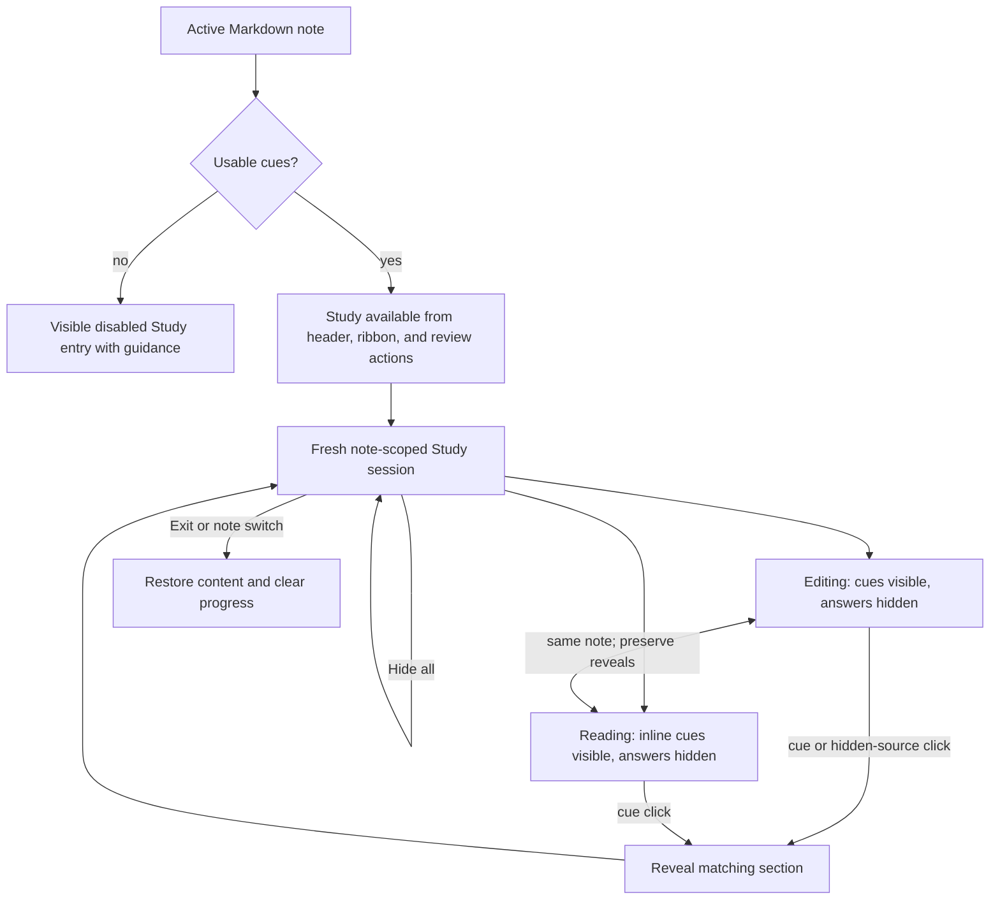
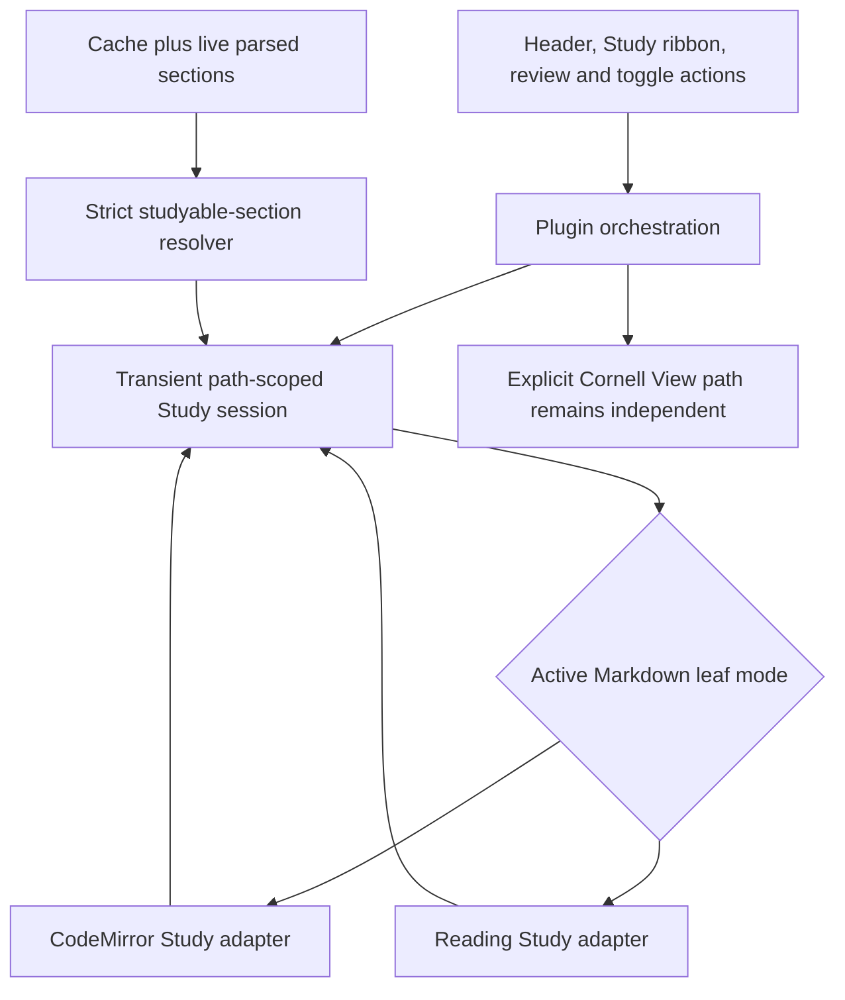
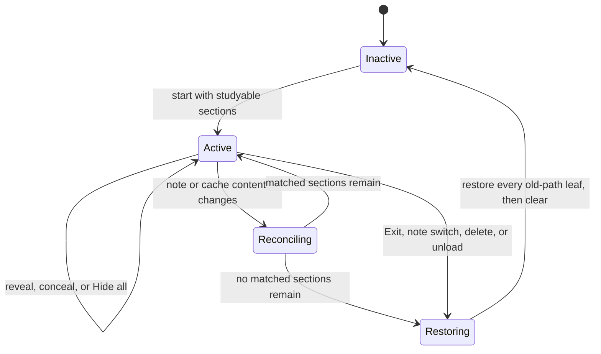

# In-Note Study Mode - Plan

## Goal Capsule

| Field | Value |
|---|---|
| Objective | Make retrieval practice available directly in the active note, with an easy entry point, section-by-section answer reveal, and persistent controls in both Editing and Reading views. |
| Product authority | The settled behavior in this plan, then `docs/designs/2026-08-15-editor-study-mode-interaction.html`, then the Cornell-removal research listed under Sources & Research. |
| Scope | Study entry, transient session behavior, per-section reveal, Editing and Reading parity, Reading cue-display simplification, and existing action convergence. |
| Execution profile | One implementation phase on one branch and one pull request. Units run in dependency order because both renderers consume the same transient session contract. |
| Stop conditions | Stop if a settled Study behavior cannot be implemented without mutating Markdown, persisted cue data, or the explicit Cornell View path. |
| Tail ownership | LFG owns implementation, verification, independent review, commit, pull request creation, and CI follow-through. |
| Open blockers | None. Execution-time DOM findings must fail open rather than conceal content whose section cannot be identified safely. |

---

## Product Contract

### Summary

Study Mode becomes a note-level review session inside the active Markdown note in both Editing and Reading views.
The note-header Study button is the primary entry, the repurposed Cornell ribbon icon is the persistent shortcut, and sticky controls keep progress, reset, and exit actions available while reviewing.
Reading View uses one fixed inline-cue presentation that Study Mode augments instead of replacing.

### Problem Frame

Per-section retrieval practice currently depends on opening a dedicated Cornell destination, adding a mode change before the learner can begin recall.
The existing in-note Study behavior only hides the note globally and does not provide section progress, independent reveal, or persistent controls.
Reading View also asks users to choose a cue-display preference even though inline cues are the presentation needed for in-note review.

### Key Decisions

- **Use the active note as the Study destination.** (session-settled: user-approved — chosen over retaining Cornell View as the primary review destination: Study should be immediately available where users already read and edit.) Governs R1, R4, R16.
- **Keep Study entry visible when cues are unavailable.** (session-settled: user-directed — chosen over hiding the control or generating automatically: the disabled control should explain the prerequisite.) Governs R3.
- **Provide equivalent Study behavior in Editing and Reading.** (session-settled: user-directed — chosen over switching users into Editing or offering reduced Reading controls: view preference should not weaken the review loop.) Governs R5, R8, R10, R11.
- **Preserve a same-note session across view changes.** (session-settled: user-directed — chosen over restarting when the Markdown view mode changes: a display-mode change should not erase review progress.) Governs R6.
- **Let editing intent reveal the answer.** (session-settled: user-directed — chosen over blocking interaction with hidden source: clicking hidden content should continue naturally into editing.) Governs R13.
- **End the session when the active note changes.** (session-settled: user-directed — chosen over background per-note sessions or carrying Study into the next note: review state is transient and note-scoped.) Governs R7.
- **Standardize Reading View on inline cues.** (session-settled: user-directed — chosen over a configurable Reading display or temporary Study override: the alternate compact Cornell entry adds an unnecessary choice.) Governs R14, R15, R18.

### Actors

- A1. The learner reads, recalls, reveals answers, and may edit the active note during a Study session.
- A2. CueCraft exposes Study availability, maintains transient progress, and presents the same session through the active Markdown view.

### Requirements

**Entry and availability**

- R1. The active note header presents Study as the primary way to begin an in-note review session.
- R2. The existing Cornell ribbon position becomes a persistent Study shortcut for the active Markdown note.
- R3. When the active note has no usable cues, Study entry controls remain visible but disabled and explain on hover that cues must be generated first.
- R4. When Study Mode is inactive, activating any Study entry starts a fresh session for the active note without opening another view or pane.

**Session lifecycle and controls**

- R5. An active Study session offers the same progress and reveal behavior in Editing and Reading views.
- R6. Switching between Editing and Reading for the same note preserves the active session and its revealed sections.
- R7. Switching to a different note ends Study Mode and clears the previous note's reveal progress.
- R8. While Study Mode is active, sticky controls keep revealed-section progress, Hide all, and Exit available as the user scrolls.
- R9. Hide all returns every answer section in the current session to its hidden state without ending Study Mode.
- R10. Exit ends Study Mode, restores all source content, and clears the session's reveal progress.

**Recall and reveal**

- R11. Entering Study Mode leaves cues and section headings visible while hiding the source content that answers each usable cue.
- R12. Activating a cue reveals only its matching source section, and activating it again hides that section.
- R13. Clicking hidden source content in Editing reveals that section and places the editing cursor at the clicked location.

**Reading View and existing actions**

- R14. When existing Reading and per-note visibility gates permit cues, Reading View presents them only inline beneath their matching headings.
- R15. The Reading mode display setting and its compact Review in Cornell presentation are removed.
- R16. Existing actions intended to review the active note or toggle Study Mode enter or control the same in-note Study session.
- R17. Explicit Open Cornell View behavior remains available until Cornell View removal is implemented separately.
- R18. An active Reading Study session temporarily presents its required inline cues without changing saved visibility controls.

### Key Flows

- F1. Begin a Study session
  - **Trigger:** A1 activates Study from the note header, ribbon, or an existing review action while the active note has usable cues.
  - **Actors:** A1, A2
  - **Steps:** A2 begins a fresh note-scoped session, hides answer content, leaves prompts and headings visible, and presents sticky controls.
  - **Outcome:** A1 can start retrieval practice without leaving the active note.
  - **Covers:** R1, R2, R4, R8, R11, R16.
- F2. Reveal and reset answers
  - **Trigger:** A1 attempts recall from a visible cue.
  - **Actors:** A1, A2
  - **Steps:** A1 activates the cue to reveal its answer, continues section by section, and may use Hide all to restart the pass.
  - **Outcome:** Each answer remains independently controlled and progress stays visible.
  - **Covers:** R8, R9, R12.
- F3. Continue studying across Markdown modes
  - **Trigger:** A1 switches the active note between Editing and Reading while Study Mode is active.
  - **Actors:** A1, A2
  - **Steps:** A2 presents the same session in the destination mode with the same revealed sections and control state.
  - **Outcome:** A1 changes how the note is viewed without losing study progress.
  - **Covers:** R5, R6, R14.
- F4. Edit a hidden answer
  - **Trigger:** A1 clicks hidden source content in Editing during Study Mode.
  - **Actors:** A1, A2
  - **Steps:** A2 reveals the matching section and places the cursor where A1 clicked.
  - **Outcome:** Study concealment does not obstruct an immediate editing task.
  - **Covers:** R13.
- F5. Leave the session
  - **Trigger:** A1 exits Study Mode or activates a different note.
  - **Actors:** A1, A2
  - **Steps:** A2 restores hidden source content and clears transient reveal progress; a note switch also ends Study Mode.
  - **Outcome:** No Study concealment or progress leaks into normal use or another note.
  - **Covers:** R7, R10.

### Acceptance Examples

- AE1. **Covers R3.** Given an active note with no usable cues, when A1 views a Study entry control, then the control is visible and disabled, and its hover explanation says to generate cues first.
- AE2. **Covers R1, R4, R8, R11.** Given an active note with usable cues, when A1 activates the note-header Study button, then the current note remains on screen, answer content is hidden, prompts and headings remain visible, and sticky progress, Hide all, and Exit controls appear.
- AE3. **Covers R2, R5, R16.** Given an active note with usable cues in Editing or Reading, when A1 activates the ribbon Study shortcut, then the same in-note Study session begins in the current Markdown view.
- AE4. **Covers R8.** Given a long note in an active Study session, when A1 scrolls away from the note header, then the progress, Hide all, and Exit controls remain accessible without returning to the top.
- AE5. **Covers R12.** Given a hidden answer section, when A1 activates its cue once, then only its matching section is revealed; when A1 activates that cue again, then the section is hidden.
- AE6. **Covers R9.** Given two answer sections have been revealed, when A1 uses Hide all, then both sections are hidden and the session remains active.
- AE7. **Covers R5, R6.** Given one section is revealed in Editing, when A1 switches the same note to Reading, then Study Mode remains active and that section remains revealed with matching progress.
- AE8. **Covers R13.** Given a hidden answer in Editing, when A1 clicks a location inside it, then its section becomes visible and the cursor is placed at the clicked location.
- AE9. **Covers R7.** Given an active Study session with revealed sections, when A1 opens a different note, then Study Mode ends and the previous note's progress is cleared.
- AE10. **Covers R10.** Given an active Study session, when A1 chooses Exit, then all source content is visible and reopening Study starts with no sections revealed.
- AE11. **Covers R14, R15.** Given a note with usable cached cues whose Reading visibility gates permit display, when Study Mode is inactive, then cues appear inline beneath their headings and no Reading display preference or compact Review in Cornell control is offered.
- AE12. **Covers R16, R17.** Given an active note with usable cues, when A1 invokes an existing review or Study toggle action, then it controls the in-note session; when A1 explicitly invokes Open Cornell View, then the existing Cornell destination still opens.
- AE13. **Covers R18.** Given saved visibility controls that suppress Reading cues, when A1 starts Study in Reading, then required inline cues appear for the session and the saved controls remain unchanged after Exit.

### Scope Boundaries

- This plan owns in-note Study entry, transient session behavior, per-section reveal, sticky controls, Editing and Reading parity, and the fixed inline-cue Reading presentation.
- Cornell View removal is separate work; this plan preserves the explicit Open Cornell View path until that removal occurs.
- Cue generation, regeneration, stale-cue refresh, failed-cue recovery, and cue-quality repair do not change here.
- Scoring, spaced repetition, review history, and persisted per-note Study sessions are outside this work.
- Note Brief and Section Lens behavior do not change.
- Activating or removing the existing unused Study hide-style preference is deferred; Editing Study uses non-collapsing concealment so hidden content retains an exact click target.

### Dependencies and Assumptions

- Study availability depends on the active note having usable cached cues.
- A cue can be associated with one source section closely enough to hide and reveal that answer independently.
- Editing and Reading can present the same transient note-scoped session without changing Markdown or persisted cue data.

### Sources & Research

- `docs/designs/2026-08-15-editor-study-mode-interaction.html` is the visual authority for the note-header entry, sticky active controls, and repurposed ribbon shortcut.
- `docs/ideation/2026-07-30-cornell-view-removal-ideation.html` establishes that per-section reveal must migrate into native note surfaces before Cornell View can be removed.
- `docs/reports/2026-08-09-cornell-view-specific-features.html` documents the current Cornell review loop and the capability gap in Editing and Reading.

Product Contract preservation: restructured, no scope change: R14 split into R14 and R18 to distinguish the inline-only presentation rule from the transient Study visibility override; AE11 and AE13 carry the resulting conditions.

---

## Planning Contract

### Key Technical Decisions

- KTD1. **Own Study state in a transient path-scoped controller.** A new controller keeps the active note path, studyable section IDs, and revealed IDs outside renderer-local state and outside persisted `PluginData`. This supports R5-R10 without writing review progress to disk.
- KTD2. **Conceal only fresh cues that match a current section exactly.** Session admission requires a successful question, a nonempty live body, an exact stable section-ID match, and matching cached/live content hashes. Cached line fallback remains visible but noninteractive during Study and never affects concealment or progress.
- KTD3. **Project the path-scoped session into the active Markdown leaf.** Editing and Reading adapters consume the same snapshot. An active-leaf change restores the prior projection, preserves progress when the path is unchanged, and projects into the new active leaf.
- KTD4. **Restore the projected surface before clearing session identity.** Exit, note switch, cue loss, file rename or deletion, and plugin unload first remove concealment from the previously projected leaf, then clear the controller. Ambiguous or unmatched content always remains visible.
- KTD5. **Extend the existing CodeMirror cue payload for editor Study state.** Answer-range decorations, cue reveal state, progress controls, and click-to-edit behavior travel through the existing transaction and document-change mapping patterns in `src/cue-extension.ts`.
- KTD6. **Separate Reading decorations from the sticky control host.** Cues and concealment remain block-owned and use stable section markers. One control host belongs to the active Reading view container and is removed on rerender, leaf change, or session exit.
- KTD7. **Keep persisted visibility separate from the Study session.** Outside Study Mode, existing Reading and per-note visibility controls remain authoritative. An active Reading Study session temporarily renders its required inline cues without changing those saved controls.
- KTD8. **Use non-collapsing editor concealment without changing Markdown.** Hidden content retains its document range and click target so reveal can preserve the selected position required by R13. The pre-existing unused collapse preference is not activated by this work.
- KTD9. **Converge entry actions while preserving explicit Cornell intent.** The header action, Study ribbon, review action, and toggle command use the shared session. `Open Active Note in Cornell View` and the Cornell view implementation remain unchanged.
- KTD10. **Remove the Reading presentation choice through normalization.** Inline becomes the only Reading cue presentation, and loading old plugin data deletes `readingModeDisplay` so later saves cannot preserve the obsolete key.

### High-Level Technical Design

The diagrams show direction and ownership, not implementation syntax.

### Assumptions

- “Always inline” means inline is the only Reading cue presentation; `renderInReadingMode` and per-note visibility remain authoritative outside Study Mode.
- Starting from an inactive entry creates a fresh session. Header, ribbon, and toggle actions exit an already active same-note session, while `Review This Note` is idempotent and preserves same-note progress.
- A context-menu review for another note ends the old session, activates the target note, and starts a fresh target session.
- Regeneration or document edits reconcile the active section set: surviving reveal IDs remain, new studyable sections start hidden, missing IDs are removed, and zero studyable sections ends the session.
- A file rename ends and clears the session. Focusing a non-Markdown view without changing the active note path preserves the path-scoped progress until a Markdown leaf projects it again.
- Failed cues remain visible as noninteractive warnings and do not count toward progress. Note Brief, Section Lens, and support-term behavior remain unchanged.
- Study cue controls support pointer and keyboard activation and expose their revealed state to assistive technology.
- Persistent no-cue Study entries remain focusable with `aria-disabled`, expose generate-first guidance on hover and focus, and show the same notice when activated by keyboard or touch.

### Implementation Constraints

- Do not persist Study session or reveal state.
- Do not mutate Markdown or add editor changes to undo history when concealment changes.
- Do not use cached line fallback to choose hidden answer ranges.
- Remove concealed answer bodies from the assistive-technology reading order and restore their semantics on reveal or Exit.
- Do not leave body-level Study classes or renderer-owned state as the source of truth.
- Do not remove or redirect the explicit Cornell command, view registration, or Cornell repair controls.
- Keep Generate and Study ribbon actions visually distinguishable.

### Sequencing

1. Establish strict live-section eligibility and the transient session contract.
2. Add the Editing adapter and prove document mapping and cursor behavior.
3. Add the Reading adapter and remove the obsolete Reading presentation choice.
4. Converge entry actions and lifecycle orchestration across all Markdown leaves.

### Risks and Dependencies

- Reading postprocessors receive block-local DOM and may not classify every rendered node. The adapter must leave uncertain content visible and manual verification must include lists, code blocks, tables, callouts, and embeds.
- CodeMirror can retain widgets whose equality inputs omit Study state. Reveal state and answer bounds must participate in refresh decisions.
- Active-leaf changes can strand concealed content unless teardown restores the prior projection before applying the session to another leaf.
- Obsidian exposes no dedicated Markdown mode-change event in the installed typings. Session continuity must come from path ownership plus normal leaf and render lifecycle reconciliation.

### Sources and Patterns

- `src/main.ts` owns commands, ribbons, Markdown leaf refresh, Reading postprocessing, settings normalization, and Cornell routing.
- `src/cue-extension.ts` provides live section resolution, CodeMirror transaction mapping, widgets, gutter markers, and cue render state.
- `src/reading-cues.ts` provides Reading cue mapping and currently owns the removable Reading presentation policy.
- `src/cue-section-collapse.ts` demonstrates a synchronous transient controller API, although Study state must not persist like collapse preferences.
- `src/parser.ts` provides current section IDs and body boundaries.
- `tests/cue-extension.test.ts`, `tests/reading-cues.test.ts`, `tests/editor-cue-refresh.test.ts`, `tests/settings.test.ts`, and `tests/plugin-data-migration.test.ts` are the established focused suites.
- No applicable institutional learning exists under `docs/solutions/`; current code and the Product Contract are authoritative.

---

## Implementation Units

### U1. Shared Study Session and Safe Section Eligibility

- **Goal:** Create the transient session controller and a strict live-section descriptor that every surface can consume.
- **Requirements:** R3-R7, R9-R12; F1, F2, F5; AE1, AE5, AE6, AE9, AE10; KTD1-KTD4.
- **Dependencies:** None.
- **Files:** `src/study-session.ts`, `src/parser.ts` or an existing section-resolution helper, `tests/study-session.test.ts`.
- **Approach:** Model inactive, active, reconciling, and restoring transitions around one note path. Admit descriptors only when section ID and content hash match current nonempty bodies with successful questions. Expose start, toggle reveal, Hide all, reconcile, and exit operations as synchronous state changes.
- **Test scenarios:**
  - Start with multiple exact live matches and report zero revealed out of the studyable total.
  - Toggle sections independently, toggle one back to hidden, and clear all reveals without ending.
  - Reject stale hashes, errored, empty, missing, and line-fallback-only sections from concealment and progress.
  - Keep fallback-only cues visible but noninteractive with no reveal state.
  - Map already admitted editor ranges through body edits, then reconcile structural or cache changes by preserving verified reveals, hiding new matches, pruning removed IDs, and ending when none remain.
  - Preserve state for the same path and restore then clear for a different path or rename.
- **Verification:** Focused session tests pass and expose no persistence dependency.

### U2. Editing View Study Projection

- **Goal:** Conceal and reveal answer bodies in Editing while preserving normal cue displays, edits, selections, and document history.
- **Requirements:** R5, R6, R8-R13; F2-F4; AE2, AE4-AE8; KTD2, KTD3, KTD5, KTD8.
- **Dependencies:** U1.
- **Files:** `src/cue-extension.ts`, `styles.css`, `tests/cue-extension.test.ts`, `tests/editor-cue-refresh.test.ts`, `tests/settings-css.test.ts`.
- **Approach:** Extend the existing editor render payload with a Study snapshot and callbacks. Derive answer ranges from strict descriptors, map them through transactions, include Study state in widget and gutter equality, render sticky controls once per editor, and reveal before dispatching an explicit cursor selection for editing intent.
- **Test scenarios:**
  - Keep headings and every configured cue display visible while concealing only matched section bodies.
  - Toggle one cue by pointer and keyboard, synchronize progress, and let Hide all reconceal revealed answers.
  - Map answer ranges and reveal state through text inserted above and inside sections without changing Markdown or undo history.
  - Reveal concealed content at the clicked document position for pointer and keyboard editing intent.
  - Keep failed and fallback-only cues visible but noninteractive and excluded from progress.
  - Remove concealed answers from the accessibility reading order and restore their semantics on reveal or Exit.
  - Preserve selection when Study starts or Hide all runs, then reveal before the next editing interaction.
  - Remove all concealment, controls, classes, and listeners when the payload exits Study or the editor is destroyed.
- **Verification:** Editor-focused tests and Study CSS assertions pass for Source mode and Live Preview projections.

### U3. Reading View Study Projection and Inline-Only Presentation

- **Goal:** Provide the same Study session in Reading View and make inline cues its only cue presentation.
- **Requirements:** R5, R6, R8-R12, R14, R15, R18; F2, F3; AE3-AE7, AE11, AE13; KTD3, KTD6-KTD8, KTD10.
- **Dependencies:** U1.
- **Files:** `src/reading-cues.ts`, `src/main.ts`, `src/settings.ts`, `styles.css`, `tests/reading-cues.test.ts`, `tests/settings.test.ts`, `tests/plugin-data-migration.test.ts`, `tests/settings-css.test.ts`, `docs/CueCraft-Progress.md`.
- **Approach:** Remove review-button and Reading display policy helpers, render inline cues whenever existing Reading visibility gates allow them, and temporarily project inline cues for active Reading Study sessions. Keep cue and concealment ownership block-local, but mount one sticky control host in the active Reading view container.
- **Test scenarios:**
  - Show inline cues outside Study when Reading rendering is enabled and omit the compact Cornell review affordance.
  - Temporarily show inline cues during Reading Study without mutating saved Reading or per-note visibility.
  - Toggle matched answers independently, update sticky progress, Hide all, and Exit using pointer and keyboard controls.
  - Process the same block repeatedly without duplicate cues, controls, listeners, or concealment markers.
  - Leave unmatched, overlapping, or unclassifiable nodes visible.
  - Keep failed and fallback-only cues visible but noninteractive and exclude them from progress.
  - Remove concealed answers from the accessibility reading order and restore their semantics on reveal or Exit.
  - Remove the settings control and default/type exports, delete legacy `readingModeDisplay` during load, and omit it from future saves.
- **Verification:** Reading, settings, migration, and CSS suites pass; progress documentation describes inline-only Reading behavior.

### U4. Entry Actions and Cross-Leaf Lifecycle Orchestration

- **Goal:** Make every Study entry operate the shared session and move its projection safely with the active Markdown leaf.
- **Requirements:** R1-R8, R10, R16, R17; F1, F3, F5; AE1-AE4, AE7, AE9, AE10, AE12; KTD3, KTD4, KTD7, KTD9.
- **Dependencies:** U1, U2, U3.
- **Files:** `src/main.ts`, `styles.css`, `tests/editor-cue-refresh.test.ts`, `tests/reading-cues.test.ts`, `tests/settings-css.test.ts`, and focused plugin integration tests following existing `src/main.ts` mock patterns.
- **Approach:** Add one guarded header action per Markdown leaf, repurpose the Cornell ribbon slot for Study, and route review and toggle commands through the controller. Reconcile actions and the active projection on layout, active-leaf, file, cache, and plugin lifecycle changes. Restore the prior projection before moving, clearing, or replacing a session.
- **Test scenarios:**
  - Show enabled header and ribbon entries for a studyable note and visible disabled entries with generate-first guidance when no safe live cue exists.
  - Start from header or ribbon in Editing and Reading without opening another pane.
  - Keep `Review This Note` idempotent, make toggle entry points exit an active same-note session, and keep commands without cues on the generate-first notice path.
  - Move the projection between leaves for one path and across Editing-to-Reading mode changes without losing reveal progress.
  - Restore the prior projected leaf before ending on note switch, cue clearing, file rename or deletion, or plugin unload.
  - Preserve path-scoped progress while focus is on a non-Markdown view and apply it when a same-path Markdown leaf becomes active again.
  - Keep no-cue header and ribbon entries focusable, expose guidance on hover and focus, and show the same notice for touch or keyboard activation.
  - Keep Generate and Study ribbons distinct and preserve the explicit Cornell command and view behavior.
- **Verification:** Cross-leaf integration tests pass and manual Obsidian verification covers every entry, transition, and teardown path.

---

## Verification Contract

| Gate | Command or method | Proves | Units |
|---|---|---|---|
| Focused behavior | `bun run test -- tests/study-session.test.ts tests/cue-extension.test.ts tests/reading-cues.test.ts tests/editor-cue-refresh.test.ts tests/settings.test.ts tests/plugin-data-migration.test.ts tests/settings-css.test.ts` | Session transitions, renderer behavior, migration, and styling contracts | U1-U4 |
| Full tests | `bun run test` | No regression across cue generation, Cornell, settings, and existing renderers | U1-U4 |
| Type safety | `bun run typecheck` | New session and renderer contracts satisfy TypeScript | U1-U4 |
| Static quality | `bun run lint` | Repository lint rules and Obsidian plugin conventions remain satisfied | U1-U4 |
| Production build | `bun run build` | The plugin bundles successfully with production settings | U1-U4 |
| Manual Obsidian QA | Load the built plugin and exercise Source mode, Live Preview, Reading, multiple leaves, long-note sticky controls, cue-less notes, mode changes, note switches, and rich Markdown sections | Real CodeMirror and Markdown postprocessor lifecycles match the tested contracts | U2-U4 |

Browser testing is not a substitute for Obsidian runtime QA. The pipeline browser pass may verify the HTML interaction mock, but it cannot prove plugin behavior inside Obsidian.

---

## Definition of Done

- U1 is done when one transient controller owns note-scoped progress, strict live eligibility fails open, and lifecycle transitions are covered by focused tests.
- U2 is done when Editing conceals and reveals matched bodies across all cue displays, sticky controls work, and editing intent restores a usable cursor without document mutations.
- U3 is done when Reading has inline cues only, full Study parity, idempotent postprocessing, fail-open masking, and no persisted `readingModeDisplay` key or settings UI.
- U4 is done when header, ribbon, review, and toggle actions converge on the shared session; the active projection moves safely; prior projections restore before teardown; and explicit Cornell opening remains intact.
- All focused and full automated verification gates pass.
- The pull request records exact manual Obsidian checks for sticky controls, accessibility states, cursor placement, active-leaf movement, rich Markdown handling, and restoration after exit or note change; an unavailable Obsidian runtime does not block autonomous shipping.
- The final diff contains no abandoned renderer state, obsolete Reading review-button code, stale settings branches, or experimental artifacts.
