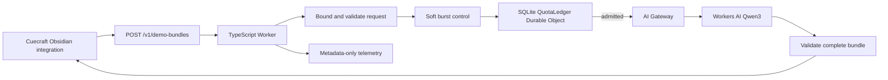

# Hosted Demo Inference Service - Plan

## Goal Capsule

- **Objective:** Define an independently deployable Cloudflare service that gives approximately 50 anonymous Cuecraft installations per UTC day one complete demo bundle: cues for up to five sections, a Summary, and a Note Brief.
- **Product authority:** This plan owns the hosted service, public inference contract, quota policy, privacy boundary, and operational stop conditions. The Cuecraft plugin remains a separate consumer governed by `docs/plans/2026-08-15-1914-feat-hosted-demo-obsidian-integration-plan.md`.
- **Open blockers:** None for planning. Public release remains gated on representative Qwen quality, structured-output and schema-validity behavior, latency, neuron usage, and validation that the maximum admitted request stays within the Workers Free active-CPU limit.

---

## Product Contract

### Summary

Build a narrow Cloudflare-hosted inference service that returns a complete Cuecraft demo bundle for one bounded note request. Run it on Cloudflare Free, reserve capacity for approximately 50 daily installations, and fail closed until the next UTC reset when the application allowance is exhausted.

### Problem Frame

Cuecraft currently depends on a configured local, CLI, or cloud provider before it can generate study artifacts. That setup protects user choice but delays the first successful experience and can prevent a new user from seeing the product's value.

An anonymous public inference service introduces a denial-of-wallet risk and cannot establish a durable human identity. The service therefore needs a bounded product operation, layered anonymous quotas, a global capacity boundary, and a content-minimizing privacy posture.

### Key Decisions

- **Launch on Cloudflare Free and fail closed at the daily application cap.** (session-settled: user-approved — chosen over paid or self-hosted launch infrastructure: the free tier can serve the initial audience and can later upgrade in place.) Governs R6–R11.
- **Provide the full demo bundle to approximately 50 daily users.** (session-settled: user-directed — chosen over cue-only capacity for approximately 100 daily users: the demo must show the complete Cuecraft experience.) Governs R2, R4, R7–R9.
- **Bound cue generation to five sections.** (session-settled: user-directed — chosen over whole-note cue generation: the bounded set controls cost while Summary and Note Brief preserve the complete experience.) Governs R2, R4, R12.
- **Use Qwen3 30B-A3B on Workers AI for the initial service.** (session-settled: user-approved — chosen over RunPod or a fixed VPS: managed inference is cheaper and simpler at launch volume.) Governs R6 and R12.
- **Keep the deployed service in its own repository.** The service owns its versioned API contract; this document is a seed artifact until that repository exists. Governs R1 and R5.
- **Make the Durable Object ledger authoritative for quota admission.** AI Gateway and network limits provide defense in depth rather than exact allowance accounting. Governs R7–R11.
- **Use one Cloudflare-native TypeScript deployment.** (session-settled: user-approved — chosen over an Agents SDK, Node server, container, or multi-service architecture: one Worker and one SQLite-backed Durable Object are sufficient for the bounded API.) Governs R22–R25.
- **Keep the HTTP and persistence layers minimal.** (session-settled: user-approved — chosen over Hono, D1, KV quota accounting, and an ORM: a native Fetch handler, Zod validation, Durable Object RPC, and direct SQLite queries minimize dependencies and active CPU.) Governs R22–R26.
- **Generate the complete bundle in one non-streaming model call.** (session-settled: user-approved — chosen over per-section and per-artifact calls: one compound call avoids repeated prompt tokens and preserves the 180-neuron envelope.) Governs R27–R29.
- **Use Cloudflare-native metadata-only operations tooling.** (session-settled: user-approved — chosen over a third-party telemetry stack at launch: AI Gateway, Analytics Engine, Workers Logs, the Workers Vitest integration, Wrangler, and GitHub Actions cover the initial operational needs.) Governs R30–R35.

<!-- ce-section: work-relationships -->
### How This Work Fits Together

This plan owns only the hosted Cloudflare service. The broader breakdown is the current understanding and may be revised when each repository is planned.

- **Hosted demo inference service**
  - Owns the public bundle contract, inference, quota admission, privacy controls, and operational telemetry.
- **Cuecraft Obsidian integration**
  - Depends on the service's versioned contract.
  - Owns fresh-install defaults, consent, note selection, display, and provider fallback behavior.
  - Is specified separately in `docs/plans/2026-08-15-1914-feat-hosted-demo-obsidian-integration-plan.md`.



### Recommended Implementation Baseline

The first service implementation should use this stack. Planning may revise a component only when measured evidence shows that it cannot meet a requirement or release gate.

| Layer | Initial choice | Boundary |
| --- | --- | --- |
| Runtime | Cloudflare Worker using TypeScript and the ES modules format | Generate runtime and binding types with `wrangler types`. Do not run a Node server or container. |
| HTTP API | Native Fetch handler | Expose `POST /v1/demo-bundles`, a minimal health route, and a protected operator control route. Do not introduce Hono for the initial route count. |
| Contract validation | Zod | Validate the public request, the public response, and parsed model output. Keep the versioned JSON contract authoritative in the service repository. |
| Exact quota state | One SQLite-backed Durable Object class named `QuotaLedger` | Access it through typed RPC. Use direct `ctx.storage.sql` queries and a short synchronous transaction; do not use an ORM, D1, or KV for authoritative admission. |
| Inference | Workers AI binding with `@cf/qwen/qwen3-30b-a3b-fp8` | Use fixed Cuecraft prompts, one non-streaming compound call, explicit token bounds, and no client-selected model or generation parameters. |
| Model gateway | AI Gateway | Keep caching off, set payload collection off explicitly, retain metadata, and configure a coarse emergency rate limit. It is defense in depth, not the quota ledger. |
| Burst control | Workers Rate Limiting binding | Apply a permissive short-window limit before admission. Treat it as local and eventually consistent, never as exact accounting. |
| Operational metrics | Workers Analytics Engine and whitelisted Workers Logs | Emit one content-free operation event and content-free exception metadata. Do not add a third-party telemetry service at launch. |
| Testing | Vitest with the Cloudflare Workers integration | Run contract, quota-concurrency, Durable Object eviction, and mocked-inference tests in the Workers runtime; keep a separate deployed smoke test using synthetic content. |
| Delivery | Wrangler and GitHub Actions | Run formatting, type checking, and tests on pull requests; deploy through Wrangler only after the main branch passes those checks. |

#### Request Lifecycle

1. The Worker rejects unsupported methods, content types, contract versions, and oversized bodies before parsing the full request.
2. Zod validates the bounded request and normalizes only fields owned by the contract.
3. A Rate Limiting binding applies cheap burst control without deciding the exact allowance.
4. The Worker calls `QuotaLedger.admit()` with HMAC-derived installation, session, and operation keys.
5. `QuotaLedger` performs one atomic read-modify-write transaction and returns either a denial or a durable reservation identifier.
6. After admission, the Worker calls Qwen once through AI Gateway. The model call occurs outside the Durable Object transaction so inference latency never holds the quota lock.
7. Zod validates the parsed cues, Summary, and Note Brief as one complete response. A malformed component fails the whole operation.
8. The Worker records the content-free result metadata, calls `QuotaLedger.finish()`, and returns the complete bundle or a structured failure.

If the Worker or model fails after admission, the reservation remains spent. This fail-closed behavior prevents retries or crashes from exceeding the shared allowance.

#### Quota Ledger Shape

The initial schema needs only daily aggregate state, deduplicated operations, and an operator setting. Exact columns may be sharpened during implementation planning.

```text
daily_usage(
  utc_day PRIMARY KEY,
  admissions,
  reserved_neurons
)

operations(
  operation_hash PRIMARY KEY,
  installation_hash,
  session_hash,
  admitted_at,
  reserved_neurons,
  status
)

service_settings(
  setting PRIMARY KEY,
  value,
  updated_at
)
```

Client-supplied identifiers are anonymous assertions, not authentication. The Worker shall HMAC them with a server-held secret before persistence. A secret embedded in the Obsidian plugin would be extractable and shall not be treated as authorization.

#### Initial Model Envelope

The Qwen3 model is currently priced at 4,625 neurons per million input tokens and 30,475 neurons per million output tokens. An illustrative 10,000-token input plus 4,000-token output consumes approximately 168.15 neurons, leaving about 11.85 neurons inside the 180-neuron reservation. Prompt, schema, and response overhead count toward these bounds; the numbers are an initial test envelope, not final caps.

The initial implementation shall attempt one compound response shaped like:

```json
{
  "sections": [],
  "summary": {},
  "noteBrief": {}
}
```

The Qwen model contract exposes a `response_format` parameter, while Cloudflare's separate JSON Mode supported-model list does not currently name Qwen3. Planning shall therefore treat deployed structured-output support as an empirical release gate. Zod validation remains mandatory even if the model accepts a JSON Schema. No repair call is enabled until representative measurements prove that the original call plus the worst permitted repair remains within the same 180-neuron reservation.

### Actors

- A1. **Anonymous Cuecraft installation:** Requests one daily full-demo bundle without creating an account or supplying an API key.
- A2. **Cuecraft integration:** Selects bounded note content, presents consent, supplies anonymous identifiers, and consumes the service contract.
- A3. **Hosted demo service:** Validates requests, admits quota, performs inference, validates outputs, and returns machine-readable results or denials.
- A4. **Service operator:** Observes aggregate usage, disables the service when necessary, and decides whether to upgrade the Cloudflare plan.
- A5. **Cloudflare platform:** Runs the Worker, SQLite-backed Durable Objects, AI Gateway controls, and Workers AI inference.

### Requirements

**Service and contract boundary**

- R1. The hosted demo service shall be independently deployable and shall not depend on the Cuecraft plugin build or release process.
- R2. The service shall expose one versioned full-demo operation accepting a note title, bounded whole-note context, one to five ordered section inputs, anonymous installation and session assertions, and an operation identifier.
- R3. The public contract shall not expose general chat messages, client-selected models, client-selected token limits, provider credentials, or arbitrary system instructions.
- R4. A successful response shall contain one schema-valid cue result per requested section, a schema-valid Summary result, and a schema-valid Note Brief result.
- R5. The service repository shall be authoritative for request and response compatibility, supported contract versions, quota-denial reasons, and reset-time semantics.

**Free-tier capacity and quotas**

- R6. Initial inference shall use Cloudflare Workers AI model `@cf/qwen/qwen3-30b-a3b-fp8` under the Workers Free allocation.
- R7. Each admitted full-demo operation shall reserve no more than 180 neurons so 50 operations fit within the 9,000-neuron application allowance.
- R8. The service shall admit at most one full-demo operation per anonymous installation per session, per rolling hour, and per UTC day.
- R9. The service shall stop admitting operations when either 50 daily operations have been admitted or the 9,000-neuron daily application allowance has been reserved, whichever occurs first.
- R10. Daily service and installation allowances shall reset at 00:00 UTC; exhaustion shall not fall through to paid inference or another provider.
- R11. Admission shall be atomic across concurrent requests, and duplicate operation identifiers shall never reserve or spend a second allowance.

**Abuse, privacy, and safety**

- R12. The service shall enforce model-independent source, section-count, and output bounds before inference; planning shall select exact caps that keep the worst admitted operation within R7.
- R13. The service shall construct Cuecraft-owned prompts and reject inputs that attempt to use the endpoint as a general-purpose LLM proxy.
- R14. Raw note content, generated artifacts, and full request or response payloads shall not be persisted, cached, or written to application or AI Gateway logs.
- R15. Operational telemetry may retain anonymous quota keys, timestamps, model usage, latency, result status, and neuron counts without retaining note-derived content.
- R16. Anonymous installation, session, and coarse network controls shall be treated as abuse deterrents rather than authenticated person identity; the global limits in R9 remain the final cost boundary.
- R17. The operator shall be able to stop all new inference admissions without redeploying either Cuecraft client code or the model provider.

**Response integrity and operations**

- R18. A response shall be reported as successful only after every requested artifact passes its schema validation; the service shall never label a partial or malformed bundle as complete.
- R19. Invalid requests shall be rejected before quota admission, while any operation that reaches inference shall consume its reserved installation and global allowance even if inference fails.
- R20. Quota and capacity denials shall identify the limiting scope and return the next applicable UTC reset time without exposing internal provider details.
- R21. Unsupported client or contract versions shall fail before quota admission with a response that lets Cuecraft direct the user to update.

**Implementation baseline**

- R22. The initial deployment shall contain one TypeScript ES-module Worker and one SQLite-backed `QuotaLedger` Durable Object class configured through Wrangler.
- R23. The public Worker shall use a native Fetch handler rather than an application framework and shall expose only the versioned bundle operation, a minimal health route, and a protected operator control route.
- R24. Zod schemas shall validate requests before admission and validate parsed model output and public responses before success.
- R25. Exact quota admission shall use typed Durable Object RPC and direct SQLite queries inside a short atomic transaction; no model or other network call shall occur inside that transaction.
- R26. Client-supplied installation, session, and operation identifiers shall be HMAC-derived with a server-held secret before storage; no shared secret shall be embedded in Cuecraft.
- R27. The initial inference path shall request all section cues, the Summary, and the Note Brief in one non-streaming Qwen call with one fixed compound output contract.
- R28. Model input, prompt, schema, and output bounds shall be selected from deployed measurements that keep the worst admitted operation within 180 neurons.
- R29. Model output shall pass application-owned schema validation regardless of provider structured-output support; no repair call shall be enabled unless its worst-case cost also fits inside the original reservation.
- R30. Every Workers AI call shall traverse AI Gateway with response caching disabled and request and response payload collection explicitly disabled while retaining metadata.
- R31. Workers Rate Limiting and AI Gateway limits may reject obvious bursts, but their decisions shall never replace the authoritative Durable Object admission transaction.
- R32. The service shall emit only content-free operation data to Analytics Engine and whitelisted content-free exception metadata to Workers Logs.
- R33. The operator kill switch shall be stored in the quota ledger and changed through a protected operator route so admissions can stop without a redeploy.
- R34. Automated verification shall use Vitest with Cloudflare's Workers integration for request contracts, quota races, Durable Object persistence and eviction, model failures, and content-free telemetry; deployed smoke tests shall use synthetic note content.
- R35. GitHub Actions shall run formatting, type checking, and automated tests before Wrangler may deploy the main branch.

### Key Flows

- F1. **Generate a full demo bundle**
  - **Trigger:** A1 requests hosted generation from A2.
  - **Actors:** A1, A2, A3, A5
  - **Steps:** A3 validates the version and bounds, atomically reserves the applicable allowances, constructs fixed Cuecraft prompts, runs the bounded inference work, validates the complete bundle, records metadata-only usage, and returns the result.
  - **Outcome:** A2 receives all requested cues, Summary, and Note Brief under one operation result.
  - **Covers:** R2–R16, R18–R32
- F2. **Reject an exhausted allowance**
  - **Trigger:** A1 requests another operation after a session, hourly, installation-daily, or global allowance is exhausted.
  - **Actors:** A1, A2, A3
  - **Steps:** A3 identifies the exhausted scope before inference and returns its reset time; A2 presents the service-provided limit state.
  - **Outcome:** No model call occurs and no fallback provider is charged.
  - **Covers:** R8–R11, R20
- F3. **Stop or later expand the service**
  - **Trigger:** A4 detects abuse, a provider incident, a quality regression, or sustained legitimate demand near the daily cap.
  - **Actors:** A3, A4, A5
  - **Steps:** A4 disables new admissions or upgrades the Workers plan while preserving the public contract and current quota semantics.
  - **Outcome:** Cost exposure stops immediately, or capacity expands without requiring a Cuecraft release.
  - **Covers:** R5, R9, R10, R17, R33

### Acceptance Examples

- AE1. **Covers R2, R4, R7–R9, R18.** Given an eligible installation with remaining allowances and five valid sections, when it requests a full-demo operation, then it receives five valid cue results, one valid Summary, and one valid Note Brief within a single reserved daily operation.
- AE2. **Covers R2, R12, R19.** Given a request containing six sections or exceeding the selected source bound, when validation runs, then the service rejects it without reserving quota or invoking Workers AI.
- AE3. **Covers R8, R10, R20.** Given an installation that already admitted a daily operation, when it submits a new operation identifier before 00:00 UTC, then the service performs no inference and returns the daily reset time.
- AE4. **Covers R9–R11.** Given concurrent requests racing for the last daily capacity, when admission runs, then only capacity already covered by the remaining reservation is admitted and no duplicate identifier receives a second reservation.
- AE5. **Covers R18, R19.** Given inference returns a malformed Summary or Note Brief after admission, when validation runs, then the service returns an operation failure, does not label the bundle complete, and retains the spent reservation.
- AE6. **Covers R14, R15.** Given a successful operation, when the operator inspects Worker, Durable Object, and AI Gateway records, then metadata needed for quota and operations is present but note and artifact content is absent.
- AE7. **Covers R17.** Given the operator disables admissions, when an otherwise eligible installation requests generation, then the service makes no inference call and returns a temporary unavailability response.
- AE8. **Covers R22–R26.** Given concurrent valid requests for the last capacity, when their native Worker handlers call `QuotaLedger.admit()`, then one short SQLite transaction applies all exact quota checks and identifiers are persisted only as server-derived HMAC values.
- AE9. **Covers R27–R29.** Given a valid five-section request, when inference runs, then one non-streaming Qwen call attempts the full compound bundle and the service reports success only if the entire parsed response passes Zod validation within the measured 180-neuron envelope.
- AE10. **Covers R30–R32.** Given a completed inference request, when the operator inspects AI Gateway, Analytics Engine, and Workers Logs, then token, model, latency, quota, and result metadata are available but request and response payloads and note-derived content are absent.
- AE11. **Covers R31.** Given an eventually consistent burst limiter admits more concurrent requests than intended, when the requests reach the Durable Object, then exact installation and global limits still prevent excess inference admissions.
- AE12. **Covers R33.** Given the operator disables admissions through the protected control route, when an otherwise valid request arrives without a redeploy, then the Durable Object denies admission and no model call occurs.
- AE13. **Covers R34, R35.** Given a service change reaches a pull request and later the main branch, when GitHub Actions runs, then Cloudflare-runtime tests, type checks, and formatting checks must pass before Wrangler deploys it.

### Success Criteria

- A representative capped-note validation run can admit 50 complete operations while staying below Cloudflare's 10,000-neuron free limit and at or below the service's 9,000-neuron application allowance.
- Every response labeled successful in the validation run contains all requested cue results, Summary, and Note Brief in their agreed schemas.
- Concurrency testing cannot exceed session, installation, daily-operation, or reserved-neuron limits.
- Log inspection confirms that no note-derived input or output payload is persisted by service-controlled storage or logging.
- The deployed Worker remains within the Cloudflare Free per-invocation CPU limit under representative requests.
- A maximum-sized synthetic request completes request parsing, Zod validation, prompt construction, Durable Object admission, and response validation within the applicable Workers Free active-CPU limits.
- A deployed Qwen spike establishes whether `response_format` produces reliable compound output; release does not depend on undocumented JSON Mode support.
- Representative five-section bundles demonstrate that one call can meet artifact-quality and schema-validity thresholds without exceeding 180 neurons.
- Automated concurrency tests prove that approximate rate-limit behavior cannot bypass the authoritative Durable Object cap.

### Scope Boundaries

- The service does not implement the Cuecraft user interface, provider settings, consent presentation, or artifact rendering.
- The initial service does not provide accounts, durable person identity, paid-user entitlements, subscriptions, or user-purchased credits.
- The initial service does not use RunPod, a VPS, a custom model deployment, Cloudflare Agents, or an autonomous agent loop.
- The initial service does not use Hono, an ORM, D1, KV for exact quota state, Queues, Workflows, R2, streaming generation, response caching, or a third-party telemetry platform.
- The public contract does not support more than five cue-bearing sections, arbitrary chat, custom prompts, model selection, or automatic whole-vault processing.
- A future Workers Paid upgrade may expand capacity, but it does not change the initial product behavior specified here.

### Dependencies and Assumptions

- Cloudflare continues to offer Workers, SQLite-backed Durable Objects, AI Gateway core controls, and Qwen3 30B-A3B within the documented Free-plan limits.
- Cloudflare's documented 10,000-neuron allocation resets daily at 00:00 UTC and rejects additional Free-plan inference rather than billing overages.
- Cloudflare's current Workers AI data terms continue to state that customer content is not used to train models without explicit consent.
- The current Qwen neuron conversion remains 4,625 neurons per million input tokens and 30,475 neurons per million output tokens for launch-envelope calculations; planning shall re-check it immediately before implementation.
- The Cuecraft integration supplies the agreed schemas and bounded context needed by R2 and consumes the service response without requiring a generic provider API.
- Anonymous installation identifiers can be reset by a determined client; R16 and the global reservation cap bound the resulting risk.

### Outstanding Questions

**Deferred to planning**

- What exact source-character, assembled-input-token, and output-token caps keep every admitted operation within the 180-neuron reservation?
- Does the deployed Qwen model honor `response_format` reliably despite not appearing in Cloudflare's current JSON Mode supported-model list, and what prompt-only parsing strategy is acceptable if it does not?
- Can a bounded repair call fit inside the original 180-neuron reservation under the worst admitted input, or should malformed output fail without repair?
- How long should operation identifiers remain recognized for duplicate suppression without retaining response payloads?
- What exact permissive burst thresholds protect the public endpoint without penalizing legitimate shared networks or being mistaken for authoritative quotas?

### Sources and Research

- `src/cue-provider.ts` defines the existing cue, batched-cue, Summary, and optional Note Brief provider capabilities that the external contract must satisfy.
- `src/generator.ts` shows the current ordered section generation followed by whole-note Summary and Note Brief generation.
- `src/settings.ts` establishes the current default provider, section concurrency of five, automatic Summary default, and note-review settings.
- [Cloudflare Workers pricing](https://developers.cloudflare.com/workers/platform/pricing/) documents Free Worker and SQLite-backed Durable Object allowances.
- [Cloudflare Workers AI pricing](https://developers.cloudflare.com/workers-ai/platform/pricing/) documents the 10,000-neuron daily Free allocation and current model prices.
- [Qwen3 30B-A3B model page](https://developers.cloudflare.com/ai/models/%40cf/qwen/qwen3-30b-a3b-fp8/) documents the selected model and its current unit pricing.
- [Cloudflare AI Gateway pricing](https://developers.cloudflare.com/ai-gateway/reference/pricing/) and [logging controls](https://developers.cloudflare.com/ai-gateway/observability/logging/) document free core rate limiting and metadata-only logs.
- [Workers AI data usage](https://developers.cloudflare.com/workers-ai/platform/data-usage/) documents Cloudflare's current customer-content commitments.
- [TypeScript on Workers](https://developers.cloudflare.com/workers/languages/typescript/) documents the first-class TypeScript runtime and generated binding types.
- [SQLite-backed Durable Object storage](https://developers.cloudflare.com/durable-objects/api/sqlite-storage-api/) documents direct SQL access, transactions, input gates, and output gates.
- [Durable Object design rules](https://developers.cloudflare.com/durable-objects/best-practices/rules-of-durable-objects/) recommend typed RPC, SQLite storage, and short transactions rather than holding coordination across external I/O.
- [Workers Rate Limiting](https://developers.cloudflare.com/workers/runtime-apis/bindings/rate-limit/) documents its locality and eventually consistent accuracy, which is why it remains a soft outer defense.
- [Workers Analytics Engine pricing](https://developers.cloudflare.com/analytics/analytics-engine/pricing/) documents the current Workers Free daily write and query allocations.
- [Workers Vitest integration](https://developers.cloudflare.com/workers/testing/vitest-integration/) documents Cloudflare's recommended Worker-runtime unit and integration test setup.
- [Workers AI JSON Mode](https://developers.cloudflare.com/workers-ai/features/json-mode/) documents the current supported-model list and the requirement to handle schema failures.
