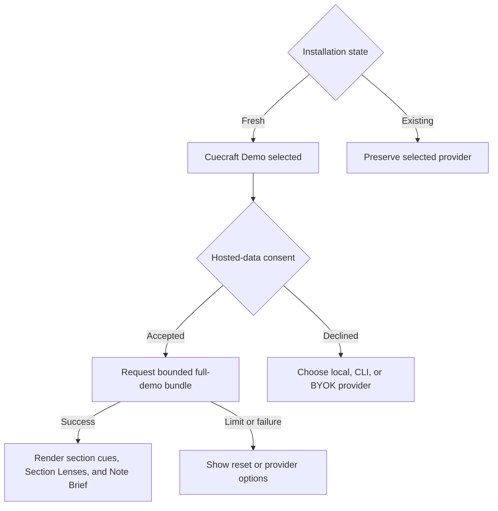

# Hosted Demo Obsidian Integration - Plan

## Goal Capsule

- **Objective:** Let a fresh Cuecraft installation generate its first complete study experience without configuring an AI provider: a question, keyword supports, and a Section Lens for up to five sections, plus one Note Brief.
- **Product authority:** This plan owns Cuecraft's provider default, consent, bounded note selection, hosted-request lifecycle, artifact presentation, and fallback behavior. The separately deployed service is governed by `docs/plans/2026-08-15-1914-feat-hosted-demo-inference-service-plan.md`.
- **Open blockers:** None for planning. Implementation depends on a deployed service contract that satisfies the companion plan.

---

## Product Contract

### Summary

Add a credential-free Cuecraft Demo provider for fresh installations. One explicit user action sends a bounded note bundle to the hosted service and returns questions, keyword supports, and Section Lenses for up to five sections plus one Note Brief, while existing installations and existing providers retain their current behavior.

### Problem Frame

Fresh Cuecraft settings currently select Ollama, and generation remains unavailable until the selected provider's required configuration fields are populated. A user who has not already installed a local model, authenticated a CLI, or obtained a cloud key cannot immediately experience Cuecraft's core study surfaces.

The hosted demo must remove that setup delay without silently transmitting note content, replacing an existing user's provider, enabling unbounded automatic generation, or turning Cuecraft into an account system.

### Key Decisions

- **Default fresh installations to Cuecraft Demo.** (session-settled: user-approved — chosen over requiring provider setup before first use: immediate value is the purpose of the hosted demo.) Governs R1–R4.
- **Provide a complete daily study bundle.** (session-settled: user-directed — chosen over question-only generation: the demo must include section questions, keyword supports, Section Lenses, and a Note Brief even if capacity falls to approximately 50 daily users.) Governs R9–R13.
- **Limit demo cues to the first five eligible sections in document order.** The deterministic bound preserves the current note order without adding a selection workflow. Governs R9 and R10.
- **Preserve every existing installation's selected provider.** Hosted demo is an onboarding default, not an upgrade migration. Governs R3, R4, R18, and R19.
- **Require disclosure before the first hosted request.** The provider may be selected by default, but note content is not transmitted until the user accepts. Governs R5–R8.
- **Keep the integration in the Cuecraft repository.** The plugin consumes the versioned external contract and does not own service deployment or quota implementation. Governs R1, R14–R17.

<!-- ce-section: work-relationships -->
### How This Work Fits Together

This plan owns only the Cuecraft Obsidian integration. The broader breakdown is the current understanding and may be revised when each repository is planned.

- **Cuecraft Obsidian integration**
  - Owns fresh-install defaults, consent, source selection, request presentation, artifact rendering, and provider switching.
- **Hosted demo inference service**
  - Enables this integration through a versioned full-demo bundle contract.
  - Owns inference, authoritative quotas, privacy controls, and reset semantics.
  - Is specified separately in `docs/plans/2026-08-15-1914-feat-hosted-demo-inference-service-plan.md`.

### Actors

- A1. **New Cuecraft user:** Wants to experience Cuecraft before configuring a model or cloud credential.
- A2. **Existing Cuecraft user:** Already has provider settings that must remain unchanged after upgrade.
- A3. **Cuecraft plugin:** Determines eligibility, presents consent, sends the bounded request, and renders or rejects the result.
- A4. **Hosted demo service:** Returns a complete bundle or a structured limit, version, validation, or availability response.

### Requirements

**Provider default and compatibility**

- R1. Cuecraft shall expose a credential-free, model-free Cuecraft Demo provider that consumes only the hosted service's versioned full-demo contract.
- R2. A fresh installation shall select Cuecraft Demo as its initial provider and shall allow the user to begin explicit generation without visiting provider settings.
- R3. An upgrade shall preserve any existing selected provider, credentials, model selection, verification state, and generation preferences.
- R4. Existing users may select Cuecraft Demo manually, and new users may switch to any existing local, CLI, OpenRouter, or cloud provider without losing current provider capabilities.

**Consent and disclosure**

- R5. Before the first hosted request, Cuecraft shall disclose that bounded note content is sent to Cuecraft's Cloudflare-hosted inference service.
- R6. The disclosure shall state that the demo is anonymously quota-limited, resets at 00:00 UTC, does not persist request or response payloads in service-controlled logs or storage, and relies on Cloudflare's current no-training commitment for Workers AI customer content.
- R7. Cuecraft shall transmit no note-derived content until the user affirmatively accepts the hosted-data disclosure.
- R8. Declining consent shall leave the note unchanged and direct the user to the existing provider choices without repeatedly prompting during the same interaction.

**Bounded full-demo experience**

- R9. One hosted operation shall request a question, keyword supports, and a Section Lens for the first one to five eligible sections in document order, plus one Note Brief.
- R10. When a note contains more than five eligible sections, Cuecraft shall make the five-section demo bound visible and shall not silently schedule the remaining sections.
- R11. Section Lens and Note Brief generation shall use the same bounded whole-note context and completed section set supplied for the operation rather than only the text of a single section.
- R12. A successful response shall map every section's question, keywords, and Section Lens plus the Note Brief into the existing Cuecraft study surfaces and cache behavior without modifying the Markdown source.
- R13. Cuecraft shall treat the hosted operation as complete only when the service returns every requested artifact as valid; it shall not present a partial response as the complete demo experience.
- R14. Hosted demo generation shall be user-initiated and shall not run through automatic generation on save, background vault processing, or another trigger that could spend quota without a contemporaneous action.
- R15. Hosted demo requests shall use Cuecraft-owned fixed generation instructions; user prompt overrides and provider-level model settings shall remain available to non-demo providers but shall not be forwarded to the hosted service.

**Anonymous quota and error behavior**

- R16. Cuecraft shall persist an anonymous installation identifier, create a new session identifier for each plugin session, and attach one operation identifier to each hosted generation attempt.
- R17. Cuecraft shall make at most one hosted full-demo admission per installation per session, per hour, and per UTC day, while treating the service response as authoritative when local and server state differ.
- R18. A quota denial shall show the applicable UTC reset time and offer the existing local, CLI, OpenRouter, and cloud-provider setup paths without silently invoking any of them.
- R19. A service failure, malformed bundle, unsupported contract version, or disabled service shall leave existing note artifacts unchanged and shall never spend an existing user's configured provider automatically.
- R20. A contract-version denial shall direct the user to update Cuecraft; other server errors shall distinguish retryable service availability from quota exhaustion without exposing internal provider details.

### Key Flows

- F1. **Fresh installation generates its first complete bundle**
  - **Trigger:** A1 invokes generation with Cuecraft Demo selected by default.
  - **Actors:** A1, A3, A4
  - **Steps:** A3 presents the first-use disclosure, records acceptance, selects the first five eligible sections and bounded whole-note context, submits one full-demo operation, validates the complete response, and renders it through existing study surfaces.
  - **Outcome:** A1 sees section questions, keyword supports, Section Lenses, and a Note Brief without provider setup or Markdown modification.
  - **Covers:** R1, R2, R5–R17
- F2. **User declines hosted processing**
  - **Trigger:** A1 declines the first-use disclosure.
  - **Actors:** A1, A3
  - **Steps:** A3 sends no hosted request, leaves the note unchanged, and opens or points to existing provider choices.
  - **Outcome:** The user retains full local and BYOK choice without note transmission.
  - **Covers:** R5–R8
- F3. **Hosted capacity is unavailable**
  - **Trigger:** A4 reports an installation, hourly, daily, global, version, or service-availability denial.
  - **Actors:** A1, A3, A4
  - **Steps:** A3 maps the structured response to the relevant user state, presents a reset or update action when applicable, and offers existing provider setup paths.
  - **Outcome:** No fallback provider is invoked and existing artifacts remain intact.
  - **Covers:** R17–R20
- F4. **Existing installation upgrades**
  - **Trigger:** A2 installs a Cuecraft version containing Cuecraft Demo.
  - **Actors:** A2, A3
  - **Steps:** A3 recognizes existing settings, preserves the active provider and its state, and adds Cuecraft Demo only as an available provider choice.
  - **Outcome:** The upgrade causes no provider switch or new disclosure unless A2 later selects and invokes Cuecraft Demo.
  - **Covers:** R3, R4

### Acceptance Examples

- AE1. **Covers R1, R2, R5–R13.** Given a fresh installation and a note with five eligible sections, when the user accepts the disclosure and invokes generation, then Cuecraft sends one hosted operation and renders five section questions with keyword supports and Section Lenses plus one Note Brief without opening Settings.
- AE2. **Covers R7, R8.** Given a fresh installation that declines disclosure, when the interaction ends, then no note content has left the plugin, the note is unchanged, and existing provider choices remain available.
- AE3. **Covers R9, R10.** Given a note with eight eligible sections, when hosted generation begins, then Cuecraft requests only the first five in document order and makes the five-section bound visible.
- AE4. **Covers R3, R4.** Given an existing installation configured for Anthropic, when it upgrades, then Anthropic remains selected with its prior settings and Cuecraft Demo appears only as another choice.
- AE5. **Covers R17, R18.** Given an installation whose UTC-day operation has been admitted, when it requests another hosted operation, then Cuecraft performs no fallback generation and shows the service-provided reset time and provider alternatives.
- AE6. **Covers R13, R19.** Given the service returns valid cues but a malformed Note Brief, when Cuecraft validates the response, then it does not present the response as a complete demo bundle and leaves existing artifacts unchanged.
- AE7. **Covers R14.** Given Cuecraft Demo is selected and automatic generation on save is enabled from prior settings, when the note is saved, then Cuecraft does not submit a hosted demo operation.
- AE8. **Covers R15.** Given the user has custom cue or Note Brief instructions, when Cuecraft Demo runs, then the hosted request uses fixed demo instructions and no custom prompt text is transmitted.
- AE9. **Covers R20.** Given the service rejects the plugin's contract version, when Cuecraft handles the response, then it directs the user to update rather than reporting quota exhaustion or a provider-key problem.

### Success Criteria

- A fresh installation can reach a complete five-section Cuecraft study experience through one explicit generation action without configuring a provider.
- Existing installations retain their selected provider and provider state across upgrade.
- No note-derived content is transmitted before first-use consent.
- Every response displayed as a successful hosted demo includes all requested questions, keyword supports, Section Lenses, and the Note Brief in the existing study surfaces.
- Hosted quota, service, and version failures never mutate Markdown or silently invoke another provider.
- Automated verification covers fresh installation, upgrade preservation, consent refusal, five-section truncation, daily exhaustion, malformed bundles, and unsupported contract versions.

### Scope Boundaries

- This plan does not implement or deploy the Cloudflare service; it consumes the companion service contract.
- The initial integration does not add Cuecraft accounts, subscriptions, paid hosted tiers, user-purchased credits, or cross-device allowance synchronization.
- The hosted demo does not generate cues for more than five sections, run automatically on save, process a vault in the background, or accept arbitrary custom prompts.
- The integration does not remove or diminish existing local, CLI, OpenRouter, or cloud-provider behavior.
- Upgrading Cloudflare from Free to Workers Paid may expand availability later without changing the initial plugin experience.

### Dependencies and Assumptions

- `docs/plans/2026-08-15-1914-feat-hosted-demo-inference-service-plan.md` is implemented in a separate repository and publishes a compatible versioned contract.
- Existing Cuecraft parsing, study-artifact schemas, cache behavior, and render surfaces remain the authority for how returned artifacts appear.
- The current `generateNote` behavior in `src/generator.ts` remains the reference for ordered section cues followed by the Note Brief, except for the hosted five-section and explicit-action bounds.
- Anonymous installation identity is a convenience and abuse deterrent rather than authenticated person identity.
- Cuecraft can distinguish a fresh installation from an upgrade without resetting existing provider state.

### Outstanding Questions

**Deferred to planning**

- Where should the first-use disclosure appear so it precedes transmission without interrupting later non-demo provider flows?
- Which existing settings and progress surfaces should communicate the five-section bound and fixed hosted instructions?
- How should the persisted consent and installation identifier be represented so uninstall or data deletion remains predictable?
- Should a user who switches away from Cuecraft Demo continue to see its remaining daily availability in Settings, or only when selecting it again?

### Sources and Research

- `src/settings.ts` defines the current Ollama default, provider settings, section concurrency, and review-surface preferences.
- `src/main.ts` defines the current configured-provider gate and the generation entry points that direct an unconfigured user to Settings.
- `src/schemas.ts` defines the current cue shape (`question`, `keywords`, and `sectionLens`) and Note Brief shape.
- `src/cue-provider.ts` defines the existing cue, batched-cue, and optional Note Brief runtime capabilities.
- `src/generator.ts` defines ordered section generation, bounded context, optional Note Brief generation, cancellation, and partial-failure behavior.
- `src/secure-credential-store.ts` and `docs/byok-extraction.md` establish the existing rule that app-owned provider credentials remain behind their appropriate trust boundary.
- `docs/plans/2026-08-15-1914-feat-hosted-demo-inference-service-plan.md` defines the external service behavior on which this integration depends.
