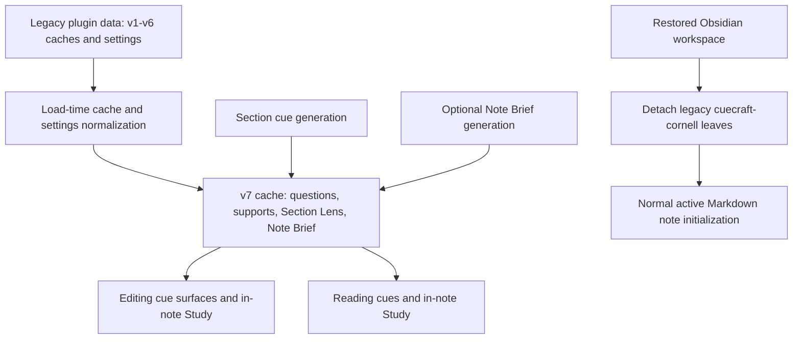

# Remove Cornell View and Legacy Review Metadata - Plan

## Goal Capsule

| Field | Value |
|---|---|
| Objective | Remove the dedicated Cornell View, cue confidence/rationale, and legacy whole-note Summary/Learning Objective without losing the native study loop, current review artifacts, editor presentations, or usable cached cue data. |
| Product authority | The session-settled decisions in this plan, then `docs/ideation/2026-07-30-cornell-view-removal-ideation.html`, then the shipped in-note Study contract in `docs/plans/2026-08-15-1450-feat-in-note-study-mode-plan.md`. |
| Scope | Provider and generation contracts, cache and settings migration, Obsidian view/command cleanup, settings and CSS pruning, shared editor primitive extraction, tests, and current documentation. |
| Execution profile | One atomic implementation phase on one feature branch and one pull request. The data contract, UI removal, and retained editor behavior should land together so no intermediate commit is treated as a releasable state. |
| Stop conditions | Stop if implementation would require deleting questions, keywords, Section Lens, Note Brief, section errors, or unrelated user settings; changing the retained Editing View `cornell` card behavior; or weakening Editing/Reading in-note Study. |
| Tail ownership | The implementation workflow owns branch creation, verification, commit, push, pull request creation, and CI follow-through under the repository's Git workflow. |
| Open blockers | None. Restored legacy workspace leaves have a required cleanup behavior below and do not require a product decision. |

---

## Product Contract

### Summary

CueCraft will have one study destination: the active note in Editing or Reading view. The dedicated Cornell pane and its appearance controls disappear. Cue generation will produce questions, keyword supports, Section Lens, and Note Brief only; model-reported confidence, rationale, whole-note Summary, and Learning Objective leave the live and persisted contracts.

Existing data remains useful after upgrade. A cache migration removes only retired metadata while preserving generated cues and current review artifacts, and a settings migration carries an existing Summary/Note Brief prompt customization forward as the Note Brief prompt customization.

### Problem Frame

In-note Study now supplies the important retrieval loop that formerly justified a separate Cornell destination. Keeping the old pane duplicates navigation, settings, styling, and lifecycle code. Confidence is model self-report used only for a low-confidence warning, while the legacy whole-note Summary and Learning Objective duplicate the structured Note Brief. Removing only the visible pane would leave obsolete provider calls, cache fields, settings, and tests behind; this work removes those contracts end to end while protecting the shared editor code that happens to use Cornell card terminology.

### Key Decisions

- **Remove the dedicated Cornell View instead of redirecting it to Study.** (session-settled: user-directed — chosen over retaining an alternate destination now that the in-note study loop is shipped.) Governs R1-R3.
- **Remove confidence and rationale from generation through persistence.** (session-settled: user-directed — chosen over keeping dormant model self-report after removing its warning UI.) Governs R7-R9.
- **Remove whole-note Summary and Learning Objective instead of keeping a hidden fallback.** (session-settled: user-directed — chosen over generating or storing a fallback when Note Brief is hidden or unavailable.) Governs R10-R12.
- **Preserve current study artifacts and existing usable cache content.** (session-settled: user-approved — chosen over clearing caches or forcing regeneration during the removal.) Governs R4, R5, R13-R15.
- **Keep the Editing View's `cornell` cue-card presentation.** (session-settled: user-approved — it is an editor display option, not the dedicated Cornell View.) Governs R5, R6, R16.

### Requirements

**Dedicated view removal**

- R1. CueCraft no longer registers or opens a `cuecraft-cornell` ItemView and no longer exposes the `open-cornell-view` command, dedicated-view activation, target selection, or refresh paths. The current Study ribbon and its `toggleStudyForActiveView` path remain available in Editing and Reading.
- R2. After an upgraded workspace restores, any legacy `cuecraft-cornell` leaves are removed without redirecting to another view, starting Study, closing unrelated leaves, or throwing an error.
- R3. CueCraft settings no longer contain a Cornell View navigation card, subpage, display mode, style preset, cue-column preset, cue accent, border, compact-support, or mobile-fold control.

**Retained study and presentation behavior**

- R4. Editing and Reading continue to display existing and newly generated questions, keyword supports, Section Lens, and Note Brief and continue to support the shipped in-note Study lifecycle.
- R5. `editorCueDisplay: "cornell"` remains a supported Editing View option and retains its fixed classic cue-card presentation, Section Lens, question/support visibility and collapse behavior, failure presentation, Study reveal control, cue font size, and custom width behavior.
- R6. Shared cue-support limiting, editor hook title/density helpers, cue layout primitives, and error styling survive even when their current module or CSS ownership is disentangled from the deleted view.

**Confidence and rationale removal**

- R7. Cue provider schemas and prompts no longer request, require, normalize, validate, repair, or return confidence or rationale.
- R8. Runtime cue results, editor/reading payloads, cached sections, and DOM output no longer contain confidence or rationale fields or `data-confidence` presentation state.
- R9. Former low-confidence cues become ordinary usable cues after migration; independent generation errors remain distinguishable and continue through the retained non-Cornell recovery paths.

**Whole-note fallback removal**

- R10. Provider runtimes no longer expose or call a legacy Summary-generation method, and Summary/Learning Objective schemas, prompts, repair logic, timing logs, progress/success copy, and generation branches are removed.
- R11. Note generation consists of section cue generation plus optional Note Brief generation. Cancellation, partial results, refresh, and progress totals remain correct whether Note Brief is supported, hidden, absent, successful, or failed.
- R12. Hiding Note Brief changes only its display. It neither triggers nor exposes a whole-note Summary or Learning Objective fallback.

**Compatibility and documentation**

- R13. Valid v1-v6 caches migrate to schema v7 without provider calls. Migration removes section confidence/rationale, top-level whole-note Summary, and `outline.learningObjective`, while preserving section identity/order, headings, hashes, line numbers, questions, keywords, Section Lens, errors, Note Brief, generation metadata, and any existing `outline.keyThemes`.
- R14. Settings migration introduces `noteBriefInstructionsOverride`; the new key wins when both keys exist, otherwise a normalized legacy `summaryInstructionsOverride` value is copied forward. The old prompt key, `autoSummary`, and all Cornell-pane-only keys are removed on the next persisted save while editor settings remain intact.
- R15. Cache and settings migrations are idempotent, mixed cache maps retain unrecognized entries exactly as today, and a note or section literally named “Summary” is treated as content rather than retired metadata.
- R16. Current user-facing docs describe in-note Study and the retained generated artifacts. Dated plans, ideation, designs, reports, brainstorms, and historical progress entries remain historical rather than being rewritten.

### Key Flows

- F1. Generate current review artifacts
  - **Trigger:** The learner generates or refreshes cues for a note.
  - **Steps:** CueCraft generates section questions, supports, and Section Lens, then generates Note Brief when the provider supports it. It records current progress and does not make a Summary request.
  - **Outcome:** Editing, Reading, and in-note Study receive the current artifacts with no retired metadata.
  - **Covers:** R4, R7-R12.
- F2. Upgrade stored data
  - **Trigger:** CueCraft loads plugin data containing v1-v6 caches and legacy settings.
  - **Steps:** The loader migrates recognized caches to v7, strips only retired fields, carries the legacy review-prompt customization into the Note Brief key when needed, removes obsolete setting keys, and persists the normalized result.
  - **Outcome:** Existing cues and current review artifacts work immediately without regeneration.
  - **Covers:** R4, R9, R13-R15.
- F3. Restore a workspace containing the old view
  - **Trigger:** Obsidian restores a saved layout with one or more `cuecraft-cornell` leaves after the plugin upgrade.
  - **Steps:** Once layout restoration is ready, CueCraft removes only those legacy leaves and continues normal active-note setup.
  - **Outcome:** No unknown/broken view remains and Study does not start implicitly.
  - **Covers:** R1, R2.
- F4. Keep the editor's Cornell card
  - **Trigger:** The learner selects or already has `editorCueDisplay: "cornell"` and opens a note with cached cues.
  - **Steps:** The editor renders the fixed classic card using retained shared helpers, layout, failure, collapse, and Study behavior.
  - **Outcome:** Removing the separate pane causes no visual or interaction regression in this editor display.
  - **Covers:** R4-R6, R9.

### Acceptance Examples

- AE1. **Covers R1, R3.** Given the upgraded plugin is loaded, when commands and CueCraft settings are inspected, then no dedicated Cornell command, view registration, navigation card, subpage, or pane appearance setting exists.
- AE2. **Covers R2.** Given a saved workspace where a legacy Cornell leaf is active, backgrounded, or the only leaf, when the upgraded plugin reaches layout-ready, then every legacy leaf is removed without an exception, unrelated leaf loss, redirect, or automatically started Study session.
- AE3. **Covers R7-R9.** Given a v6 low-confidence cue with a rationale and no generation error, when it is migrated and rendered, then its question, supports, and Section Lens remain, confidence/rationale are absent, no warning appears, and the cue is treated as usable.
- AE4. **Covers R9.** Given a cached section with a generation error, when it is migrated and rendered, then the error remains distinguishable and its retained retry/regeneration behavior is not converted into a normal cue.
- AE5. **Covers R10-R12.** Given a provider that supports Note Brief, when a note is generated with Note Brief display either on or off, then CueCraft makes no Summary call, generates/caches Note Brief normally, and reports accurate completion/cancellation progress.
- AE6. **Covers R11, R12.** Given a provider without Note Brief support or a failed Note Brief request, when section generation completes, then partial/current cue results remain valid and no Summary/Learning Objective fallback is generated or displayed.
- AE7. **Covers R13, R15.** Given a rich v6 cache including questions, keywords, Section Lens, Note Brief, an error, metadata, `outline.keyThemes`, retired metadata, and a section named “Summary,” when it loads, then the v7 result compares equal for every retained field and omits only the retired fields.
- AE8. **Covers R13-R15.** Given v1-v5 caches and an unrecognized cache in the same map, when migration runs twice, then recognized entries become stable valid v7 caches and the unrecognized entry remains retained as before.
- AE9. **Covers R14.** Given only a custom legacy `summaryInstructionsOverride`, when settings load, then the same normalized text appears in the Note Brief prompt setting and the old key is absent from the persisted data; when both keys exist, the new key wins.
- AE10. **Covers R5, R6.** Given Editing View uses the `cornell` card, when the upgraded plugin renders valid and failed cues and enters Study, then the classic card, cue font/custom width, Section Lens, question/support collapse controls, failure state, and reveal control behave as before.
- AE11. **Covers R4, R16.** Given existing cached current artifacts, when the learner opens Editing and Reading and enters in-note Study, then all current artifacts and controls work and current docs describe that behavior without presenting the removed pane or metadata as available.

### Scope Boundaries

- “Summary” in this plan means only the retired top-level whole-note Summary. Section Lens summary/takeaway state, `showRailSummary`, cue-section collapse key `summary`, Note Brief overview/cards, `StudyAreaRunSummary`, and Markdown content or headings named “Summary” stay intact.
- The retained Editing View option may continue to use `cornell` in its setting value and editor-card CSS names. Completion is not defined as deleting every textual occurrence of “Cornell”; it is defined as removing the dedicated view and pane-only behavior.
- Note Brief and Section Lens generation, display toggles, cache fields, and refresh behavior remain in scope only for regression protection and the prompt-setting rename.
- Question generation, support-term generation, stale detection, per-section regeneration, Reading visibility, Study session behavior, and exports do not gain new features in this work.
- Historical artifacts are not rewritten. Root `data.json` is ignored local development state and must not be edited or used as a migration fixture.
- No one-time release announcement, cache downgrade support, or later cleanup deadline for the legacy view-type constant is required in this slice.

### Dependencies and Assumptions

- The in-note Study work in `docs/plans/2026-08-15-1450-feat-in-note-study-mode-plan.md` is already shipped and is the capability replacement for the removed destination.
- Obsidian's `Workspace.detachLeavesOfType` is available after layout restoration and is the narrowest cleanup for saved `cuecraft-cornell` leaves.
- Zod object parsing strips unknown object keys, but migration still changes the schema version explicitly so the persisted contract and tests document the removal.
- The ignored root `data.json` is not production migration input; committed test fixtures should model legacy data.

### Sources & Research

- `docs/ideation/2026-07-30-cornell-view-removal-ideation.html` establishes “remove the view, keep the study loop.” Its earlier suggestion to preserve confidence/rationale is superseded by the session-settled decision to remove them.
- `docs/plans/2026-08-15-1450-feat-in-note-study-mode-plan.md` defines the shipped native Study behavior that this work must preserve.
- `docs/reports/2026-08-09-cornell-view-specific-features.html` inventories the old pane's review and repair capabilities.
- Repository research found no project `docs/solutions/` corpus; current code, tests, and the decisions above are authoritative.

Product Contract preservation: restructured with explicit migration and restored-workspace behavior; session decisions supersede the origin document only for confidence/rationale retention and the whole-note fallback.

---

## Planning Contract

### Key Technical Decisions

- KTD1. **Make cache v7 the explicit compatibility boundary.** Remove the retired fields from the current Zod/cache/build types and apply a final v1-v6 canonicalization that changes the version and lets the current schema strip retired object keys. Preserve `outline.keyThemes` if present rather than deleting the entire outline object. Test retained fields structurally, migration idempotence, and mixed-map behavior. Supports R13-R15.
- KTD2. **Retire provider capabilities, not just their call sites.** Remove confidence/rationale from single and batch structured-output schemas, protected prompt contracts, repair prompts, parsed outputs, and cue types. Remove Summary input/output schemas and the mandatory runtime `generateSummary` method. Keep `generateNoteBrief?` as the only note-level generation capability. Supports R7-R12.
- KTD3. **Rename the shared review prompt around its surviving owner.** Replace `summary-instructions.ts` and `summaryInstructionsOverride` with Note Brief-named equivalents, rewrite the default policy to describe Note Brief only, and migrate legacy customized text with new-key-wins precedence. This preserves user intent without retaining a false Summary contract. Supports R10-R14.
- KTD4. **Treat restored view cleanup as migration, not navigation.** Do not register a placeholder ItemView or redirect the old command. Keep only a legacy view-type string for an `onLayoutReady` `detachLeavesOfType` cleanup, then perform the normal active-file initialization. Unit tests cover active, background, multiple, and only-leaf layouts. Supports R1, R2.
- KTD5. **Delete dedicated model code while keeping single-consumer seams with their editor owners.** Remove `cornell-view.ts` and the Cornell model/picker/takeaway/reveal code. Keep the three-term support presentation with `cue-extension.ts`, move the hook-title/density utilities into `editor-hook-rail.ts`, and avoid standalone helper modules for those single-consumer paths. Retain or minimally simplify cue font/width and fixed classic editor style helpers. Supports R4-R6.
- KTD6. **Use a CSS ownership allowlist.** Remove selectors emitted only by the ItemView, its toolbar/grid/note body/summary/hook layout, style presets, accent/mobile settings, low-confidence state, and dedicated thumbnails. Retain selectors emitted by `cue-extension.ts` for `.cuecraft-editor-cornell-card`, its `.cuecraft-cornell-*` descendants, cue font/custom width, Section Lens/collapse/Study state, and failed cues. Supports R3-R6, R8, R9.
- KTD7. **Persist normalized settings even when no other migration fires.** Track removal/rename changes alongside cache and credential migration changes so load immediately saves the canonical settings object. Explicitly delete old raw keys because the current `Object.assign` load would otherwise preserve and re-save them. Supports R3, R14, R15.
- KTD8. **Update tests semantically, not with a broad name purge.** Delete dedicated-pane suites and assertions, move retained helper coverage to editor-focused suites, and distinguish the retired whole-note Summary from Section Lens summary/collapse behavior. Supports every requirement while protecting R4-R6.

### High-Level Technical Design



### Implementation Constraints

- Do not start a development server.
- Do not mutate Markdown, erase a cache wholesale, or call a provider during migration.
- Do not replace the removed view with an automatic Study redirect.
- Do not remove any code or CSS solely because its identifier contains `cornell` or `summary`; confirm its emitting/consuming surface first.
- Do not weaken strict validation for the retained question, keywords, Section Lens, or Note Brief fields.
- Keep failed-cue errors independent from removed quality metadata.
- Do not touch ignored local plugin state such as root `data.json`.
- Preserve the repository's existing style and avoid a general cue-rendering refactor.

### Sequencing

1. Slim generated/provider contracts and rename the Note Brief prompt customization so downstream runtime types have one current shape.
2. Add cache v7 and canonical settings migrations against that shape.
3. Remove the ItemView, commands, pane settings, dedicated models, and pane-only CSS while extracting shared editor helpers.
4. Update current docs and run focused, full, lint, and bundle verification plus manual upgrade/UI checks.

### Risks and Mitigations

- **Restored unknown view:** removing registration before layout cleanup could strand an error tab. Use layout-ready legacy-leaf detachment and test active/background/only-leaf cases.
- **Silent setting re-persistence:** `Object.assign` currently carries unknown raw keys. Explicit deletion plus a settings-changed save signal prevents obsolete keys from surviving indefinitely.
- **Shared-name collateral damage:** editor cards and Section Lens reuse Cornell/Summary names. Drive deletion from imports and DOM emitters, with retained-selector and retained-behavior tests.
- **Legacy cache data loss:** a broad removal of `outline` or sections could drop non-retired values. Use rich fixtures and compare the complete retained projection before and after migration.
- **Generation progress drift:** removing a provider stage can leave stale totals or notices. Test success, cancellation, no-question, unsupported-Note-Brief, and Note-Brief-failure paths.
- **Provider repair mismatch:** removing fields from only the primary prompt leaves retry prompts incompatible. Assert both structured-object and text/repair requests use the new contracts.

---

## Implementation Units

### U1. Slim Generation and Provider Contracts

- **Goal:** Make Cue + Section Lens + Note Brief the complete generated contract and preserve Note Brief prompt customization under its own name.
- **Requirements:** R7-R12, R14; F1; AE3-AE6, AE9; KTD2, KTD3.
- **Dependencies:** None.
- **Files:** `src/schemas.ts`, `src/cue-provider.ts`, `src/byok-cuecraft-adapter.ts`, `src/local-cli-cue-batch.ts`, `src/generator.ts`, `src/cue-generation.ts`, `src/main.ts`, `src/summary-instructions.ts` (replace with a Note Brief-named module), `tests/schemas.test.ts`, `tests/byok-cuecraft-adapter.test.ts`, `tests/local-cli-cue-batch.test.ts`, `tests/generator.test.ts`, `tests/provider-factory.test.ts`, and prompt-instruction tests.
- **Approach:** Remove confidence coercion/schema/output fields and every single/batch prompt or repair requirement. Remove Summary schemas, prompt builders, generation helpers, runtime method, options branch, timing/success copy, and result fields. Rename the surviving prompt policy and adapter setting to Note Brief terminology. Keep Section Lens strict fields and the optional Note Brief capability unchanged. Recompute generation results/progress around sections plus Note Brief only.
- **Test Scenarios:**
  - Single and batch providers accept and repair the retained cue contract without confidence/rationale.
  - Text and structured providers generate Note Brief with the renamed customization and never receive Summary instructions or schema.
  - Success, cancellation between batches, no usable questions, unsupported Note Brief, Note Brief failure, and refresh return accurate progress and partial results with no Summary call.
  - Provider factory runtimes compile and expose no `generateSummary` method.
- **Verification:** Run the U1-focused schema, adapter, local CLI, generator, provider factory, cue-generation, and Note Brief instruction suites before continuing.

### U2. Migrate Cache and Settings Without Data Loss

- **Goal:** Convert recognized stored data to the smaller canonical contract on load and persist it exactly once without requiring regeneration.
- **Requirements:** R3, R8, R9, R13-R15; F2; AE3, AE4, AE7-AE9; KTD1, KTD3, KTD7.
- **Dependencies:** U1.
- **Files:** `src/cache.ts`, `src/main.ts`, `src/settings.ts`, `tests/cache.test.ts`, `tests/plugin-data-migration.test.ts`, `tests/settings.test.ts`, and committed legacy-data fixtures where useful.
- **Approach:** Bump the cache schema to v7, remove retired current fields, and ensure every v1-v6 path canonicalizes to the v7 schema. Preserve the complete retained projection including optional key themes and errors. Add `noteBriefInstructionsOverride`, migrate the old prompt value only when the new key is absent, explicitly delete `summaryInstructionsOverride`, `autoSummary`, and pane-only settings keys, and include this normalization in the load-time changed/save decision. Do not read or modify root `data.json`.
- **Test Scenarios:**
  - A rich v6 cache loses only retired fields, needs zero provider calls, and immediately renders retained data.
  - v1-v5 inputs end at valid v7, repeated migration is identical, invalid/unrecognized map entries remain retained, and a section named “Summary” survives.
  - Legacy-only prompt customization migrates; new-key-only and both-key inputs preserve the new key; obsolete Cornell settings are absent after save; `editorCueDisplay`, cue font, and custom width survive.
  - Plugin load persists settings-only normalization even when credentials and caches need no migration.
- **Verification:** Run cache, plugin-data migration, and settings suites, and inspect serialized v7 fixtures for the exact retained field set.

### U3. Remove the Dedicated View While Preserving Editor Surfaces

- **Goal:** Delete every dedicated Cornell pane entry point and implementation while keeping native Study, Editing/Reading cues, shared helpers, and the editor's Cornell card intact.
- **Requirements:** R1-R6, R8, R9, R16; F3, F4; AE1-AE4, AE10, AE11; KTD4-KTD6, KTD8.
- **Dependencies:** U1, U2.
- **Files:** `src/main.ts`, `src/cornell-view.ts` (delete), `src/cornell.ts` (delete after retaining editor support logic with its consumer), `src/short-form-hook.ts` (remove after moving editor title/density logic to its consumer), `src/editor-hook-rail.ts`, `src/cue-extension.ts`, `src/appearance-thumbnail-controls.ts`, `src/settings-summaries.ts`, `src/settings.ts`, `src/cornell-display.ts` (delete), `src/cornell-accent.ts` (delete if no retained consumer), `src/cornell-style.ts` and `src/cornell-layout.ts` (retain only editor-owned behavior or simplify), `styles.css`, and the corresponding Cornell/editor/settings/CSS/integration tests.
- **Approach:** Remove view registration, open/activate/build/refresh methods, command, dedicated settings route/card/controls, and their call sites while preserving the current Study ribbon, header/review/toggle entry points, and `toggleStudyForActiveView`. On layout-ready, detach legacy view leaves before normal active-file initialization without starting Study. Keep the three-term support logic in `cue-extension.ts`, move the hook title/density logic into `editor-hook-rail.ts`, and do not create standalone modules for those single-consumer seams. Remove dedicated Cornell per-cue retry controls while preserving the existing `regenerate-section` and `regenerate-stale-sections` commands. Delete dedicated model, picker, reveal, takeaway, hook-summary, view-display, and appearance code. Build a selector ownership matrix from actual DOM emitters, delete pane-only and confidence selectors, and retain the fixed editor card, cue layout/font/custom width, collapse, Study, Note Brief, Section Lens, and failure selectors.
- **Test Scenarios:**
  - Plugin integration exposes no Cornell view or command and cleans restored active/background/multiple/only legacy leaves safely.
  - Editing and Reading render migrated and new cues, and the preserved Study ribbon starts and exits Study through the existing toggle path.
  - Editor `cornell` display still renders valid and failed cards with Section Lens, supports, collapse controls, font/custom width, and Study reveal state.
  - Failed cues remain recoverable through the existing section and stale-section regeneration commands after dedicated per-cue retry controls are removed.
  - Thumbnail/settings tests retain only editor and cue-font controls; CSS tests prove pane-only/confidence rules are gone and the editor allowlist remains effective.
- **Verification:** Run cue-extension, editor-hook, reading-cues, editor-refresh, study-session/area/integration, appearance-thumbnail, settings, Cornell-style/layout portions that remain, and CSS suites.

### U4. Align Current Documentation and Run Release Gates

- **Goal:** Make current product guidance and metadata match the smaller surface, then prove the removal is complete without historical rewrites or regressions.
- **Requirements:** R4-R16; AE11; KTD8.
- **Dependencies:** U1-U3.
- **Files:** `README.md`, `manifest.json`, current-state sections of `docs/CueCraft-Progress.md`, `docs/byok-extraction.md` if its rendering boundary needs neutral wording, and short historical-status banners in `docs/CueCraft-MVP-Scope.md` / `docs/CueCraft-v1-User-Stories.md` if they remain linked from current docs.
- **Approach:** Describe question/support/Section Lens/Note Brief generation, in-note Study, and the retained Editing card without promising a dedicated pane, confidence, whole-note Summary, or Learning Objective. Append a current-state removal entry rather than rewriting old progress history. Mark early MVP/user-story documents as historical baselines or unlink them from current guidance; leave dated artifacts unchanged. Run targeted static ownership checks, the full automated suite, and manual upgrade/Obsidian QA.
- **Test Scenarios:**
  - Current docs and manifest contain no claims that the removed surface or metadata is available.
  - Historical dated artifacts remain unchanged, and early undated specs are clearly labeled historical if retained.
  - Static searches find retired symbols only in explicit legacy migration constants/tests and find the retained editor Cornell identifiers where expected.
- **Verification:** Complete every gate in the Verification Contract and record manual QA results in the pull request.

---

## Verification Contract

### Automated Gates

Run focused checks during each unit, then run the complete gates from the repository root:

```bash
bun run typecheck
bun run test -- tests/cache.test.ts tests/schemas.test.ts tests/generator.test.ts tests/byok-cuecraft-adapter.test.ts tests/local-cli-cue-batch.test.ts tests/plugin-data-migration.test.ts tests/cue-extension.test.ts tests/reading-cues.test.ts tests/settings.test.ts tests/settings-css.test.ts tests/study-plugin-integration.test.ts
bun run test
bun run lint
bun run build
```

Use targeted searches as ownership assertions, not generic word bans:

```bash
rg -n "CornellView|VIEW_TYPE_CORNELL|open-cornell-view|generateSummary|summaryOutputSchema|summaryGenerationSchema|learningObjective|data-confidence" src tests
rg -n "confidence|rationale" src tests
rg -n "editorCueDisplay|cuecraft-editor-cornell-card|cuecraft-cornell-cue|cueFontSize|editorCueCustomWidthPx" src tests styles.css
rg -n "sectionLens|noteBrief|showRailSummary|StudyAreaRunSummary" src tests
```

- The first two searches may match only explicit legacy input-key/view-type migration constants and their migration tests; they must not match current schemas, prompts, runtime results, DOM rendering, or settings UI.
- The retained searches must continue to find editor Cornell card, current review artifacts, and unrelated Section Lens/run-summary behavior.
- No `release:validate` script exists; `bun run build` is the production bundle gate.

### Manual QA

1. Load a vault copy with committed-equivalent rich v6 plugin data. Confirm questions, keywords, Section Lens, Note Brief, errors, visibility, collapse state, and metadata work immediately with no provider request; inspect the next saved data and confirm only retired fields/settings disappeared.
2. Restore layouts where a legacy Cornell leaf is active, backgrounded, duplicated, and the only leaf. Confirm no broken pane or exception, no unrelated leaf loss, and no automatically started Study session.
3. Generate and refresh a multi-section note with Note Brief display on, then off. Confirm Section Lens and Note Brief generation/cache behavior is unchanged, no legacy fallback appears, and completion/cancellation progress is accurate.
4. In Editing View, select the retained Cornell card, resize it, change cue font size, collapse/expand Section Lens/question/supports, exercise a failed cue, and enter/exit Study. Compare the retained presentation and interactions to the pre-removal behavior.
5. In Reading View, confirm existing cues, Section Lens, Note Brief, error presentation, per-note visibility, and in-note Study still work.
6. Inspect CueCraft commands and settings to confirm there is no Cornell pane entry or pane-specific appearance configuration.

### Review Focus

- Cache migration should be reviewed for exact retained-field preservation and idempotence.
- CSS and helper deletion should be reviewed against the editor DOM emitter allowlist.
- Provider prompts should be reviewed on both initial and repair paths.
- Settings load should be reviewed for precedence and guaranteed persistence of normalized keys.

---

## Definition of Done

- D1. R1-R16 and AE1-AE11 are satisfied with no launch-blocking open question.
- D2. `src/cornell-view.ts` and all dedicated model/navigation/settings code are gone; restored legacy leaves are cleaned safely.
- D3. Current provider, generation, runtime, DOM, and cache contracts contain no confidence/rationale or whole-note Summary/Learning Objective behavior.
- D4. v1-v6 caches and legacy settings migrate idempotently without regeneration or loss of questions, keywords, Section Lens, Note Brief, errors, current metadata, or editor preferences.
- D5. Editing/Reading in-note Study and the Editing View `cornell` card pass automated and manual regression checks, including failure and custom-width/font behavior.
- D6. Retired pane/confidence CSS is gone and retained editor/Section Lens/Note Brief/error CSS is demonstrably still used.
- D7. README, manifest metadata, and current progress guidance describe the resulting product; historical artifacts remain historical.
- D8. Focused tests, full tests, typecheck, lint, and production build pass.
- D9. The diff contains no abandoned compatibility shim, placeholder view, unused imports, stale tests, or experimental cleanup code from rejected approaches.
- D10. Work is committed on a `codex/` feature branch, pushed, and opened as one focused pull request with the plan artifact included and manual QA recorded.

---

## Appendix

### Expected Ownership Boundary

| Remove | Preserve |
|---|---|
| Dedicated `ItemView`, registration, command, activation, file picker, pane toolbar/grid/body/summary, retry controls, view refresh hooks | In-note Study controller and Editing/Reading adapters |
| Cue confidence/rationale schemas, prompts, runtime/cache fields, DOM attributes, low-confidence warning styles | Questions, keyword supports, Section Lens, cached errors and failure styling |
| Whole-note Summary/Learning Objective schemas, provider call, cache fields, fallback rendering, `autoSummary` | Structured Note Brief generation/cache/display and its migrated prompt customization |
| Cornell pane navigation/settings card, display/style/accent/border/compact/mobile settings and thumbnails | `editorCueDisplay: "cornell"`, cue font size, editor custom width, editor display thumbnails |
| Pane-only Cornell model, short-form summary, style variants, and CSS | Shared support limiting, editor hook title/density, fixed classic editor-card selectors and layout helpers |

### Recommended Landing Strategy

- Branch: `codex/remove-cornell-view-legacy-metadata`, based on `main`.
- PR shape: one implementation phase and one pull request because the provider, cache, settings, and UI contracts should change atomically.
- Commit shape within the branch may follow U1-U4, but only the fully verified branch is release-ready.
