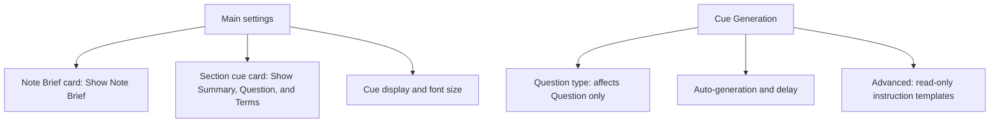
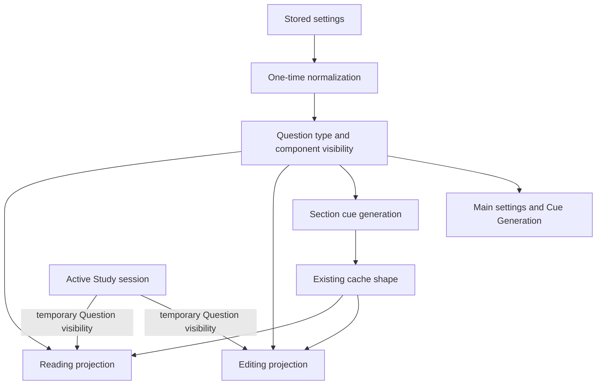
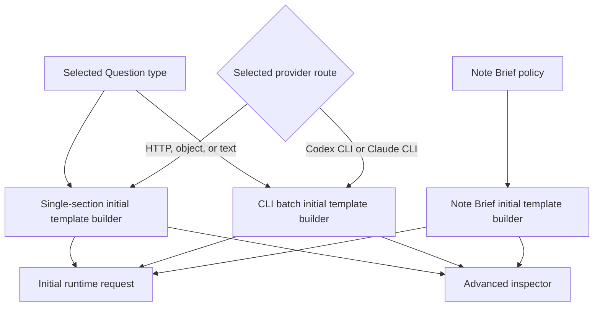

# Artifact-Matched CueCraft Settings - Plan

## Goal Capsule

- **Objective:** Make every CueCraft setting understandable by organizing controls around the generated components visible in a note and by separating appearance from generation behavior.
- **Product authority:** The confirmed brainstorm decisions govern product behavior. `docs/CueCraft-Glossary.md` governs user-facing vocabulary.
- **Execution profile:** Two phases with four dependency-ordered implementation units.
- **Stop conditions:** Stop if a shared instruction builder cannot produce the initial runtime template shown in Advanced, or if global visibility would break Study mode's required Question interaction.
- **Tail ownership:** Implementation owns settings migration, generation routing, Editing and Reading presentation parity, automated verification, documentation alignment, and the repository PR workflow.
- **Open blockers:** None.

---

## Product Contract

### Summary

CueCraft settings will mirror the artifacts visible in a note.
The implementation will consolidate the persisted settings model, route Editing and Reading presentation through it, and centralize initial-generation templates so Advanced and runtime behavior share one instruction authority.

### Problem Frame

CueCraft currently exposes generation concepts such as preset, density, question style, cue supports, and system prompts without showing how they combine.
Several controls overlap, some labels do not correspond to anything visible in the note, and editable prompt fields compete with standard settings for authority.

The retired Cornell View leaves Editing View as an obsolete settings category.
Appearance controls are also split between Editing and Reading behavior even though both surfaces show the same generated components.

### Key Decisions

- **Use artifact cards on the main page.** (session-settled: user-directed — chosen over a plain settings list or in-note controls: miniature artifacts make each control's visible target immediately recognizable.) Governs R1-R6.
- **Separate appearance from generation.** (session-settled: user-directed — chosen over the Editing View taxonomy: Cornell View is gone and appearance is no longer specific to one note mode.) Governs R1, R6-R8.
- **Replace overlapping question controls with Question type.** (session-settled: user-directed — chosen over preserving preset, density, and question style: one control maps directly to the visible Question and prevents conflicting combinations.) Governs R9-R12.
- **Make instruction templates read-only.** (session-settled: user-directed — chosen over editable advanced prompts: most users need to inspect CueCraft's authority model rather than replace it.) Governs R15-R19.
- **Use one visibility configuration across note modes.** (session-settled: user-directed — chosen over separate Editing and Reading choices: the same component names should have the same visibility everywhere.) Governs R3-R5.
- **Discard legacy custom prompt overrides.** (session-settled: user-directed — chosen over preserving or exporting them: CueCraft-owned defaults create one unambiguous instruction authority.) Governs R19.
- **Scope Question type to direct Question guidance.** (session-settled: user-approved — chosen over byte-for-byte invariance for downstream Note Brief output: Note Brief still consumes generated Questions as source material.) Governs R10, R20.
- **Keep Study mode functional when ordinary components are hidden.** (session-settled: user-approved — chosen over disabling Study or mutating saved visibility: an active session temporarily reveals its required Question interaction.) Governs R24.
- **Remove the per-section tone picker.** (session-settled: user-approved — chosen over retaining a second Question-generation authority: section regeneration should use the global Question type.) Governs R25.
- **Keep Reading presentation inline.** (session-settled: user-approved — chosen over extending editor layout choices into Reading mode: that would expand this settings simplification into a presentation redesign.) Governs R26.

### Settings Structure

### Requirements

**Main settings and appearance**

- R1. The main settings page must contain all controls that change the presentation or visibility of generated content and must not expose an Editing View destination.
- R2. The main page must present miniature Note Brief and Section cue cards that use the same titles and hierarchy as the generated artifacts in a note.
- R3. The Note Brief card must provide a `Show Note Brief` control for the whole-note artifact and must identify Core idea, Review first, and Self-test as fixed parts without separate controls.
- R4. The Section cue card must provide controls labeled `Show Summary`, `Show Question`, and `Show Terms` beside their matching component titles.
- R5. Note Brief, Summary, Question, and Terms visibility choices must apply identically in Editing and Reading modes.
- R6. Cue display and cue font size must live on the main page as appearance controls outside the generated-artifact cards.
- R7. Visibility and shared font changes must refresh every open Editing and Reading presentation without regenerating content; Cue display changes must refresh every open Editing presentation.
- R8. Hiding Note Brief, Summary, Question, or Terms must not suppress generation of that artifact or remove its cached content.

**Question generation**

- R9. Cue Generation must replace Cue preset, Cue density, and Question style with one control labeled `Question type`.
- R10. Question type guidance must apply only to Question; Summary, Terms, and Note Brief instructions must not receive it.
- R11. Question type must offer Conceptual question, Direct recall, Exam practice, Vocabulary check, and Socratic reasoning, with Conceptual question as the default.
- R12. Each Question type must provide one coherent instruction rather than composing independent style and depth instructions.
- R13. Terms must always be generated for Note Brief input, exports, and future display changes; `Generate cue supports` must be removed.
- R14. Existing legacy question settings must migrate to the nearest Question type, with conflicting or unrecognized combinations falling back to Conceptual question.

**Instruction inspection**

- R15. Cue Generation must contain a collapsed `Advanced` section below ordinary generation controls.
- R16. Advanced must expose separate read-only templates titled `Section cue instructions` and `Note Brief instructions`.
- R17. Section cue instructions must show the exact assembled policy, selected Question type guidance, Summary/Question/Terms contract, and placeholders for section and note context.
- R18. Note Brief instructions must show the exact assembled policy, overview and three-card contract, and placeholders for full-note and successful-section-cue inputs.
- R19. Advanced must contain no prompt editor, save action, or custom-instruction reset; existing custom prompt overrides must be discarded in favor of CueCraft defaults.
- R20. Changing Question type must immediately update the read-only Section cue template and mark generated Question content as changed for the existing regeneration handoff.
- R27. Question type helper copy must explain the selected type, state that the choice guides newly generated or regenerated Questions only, does not directly guide Summary, Terms, or Note Brief, and does not rewrite cached Questions until regeneration.
- R28. Appearance helper copy must state that Cue display changes Editing layout only, while cue font size applies in Editing and Reading.
- R29. Each read-only instruction template must have a programmatic label matching its visible `Section cue instructions` or `Note Brief instructions` title.

**Generation behavior**

- R21. Cue Generation must retain auto-generation and auto-generation delay as controls that affect when CueCraft creates Note Brief and section cue artifacts.
- R22. Generation copy must name the affected artifacts instead of referring only to generic cues or review artifacts.

**Migration and retained behavior**

- R23. Legacy visibility must migrate from valid Editing component values first, then only the component-specific fallbacks in KTD1, and finally canonical defaults; `renderInReadingMode` must not map to any component flag.
- R24. Summary, Question, and Terms may all be hidden during ordinary review, while active Study temporarily renders Question without changing saved visibility.
- R25. Per-section regeneration must use the global Question type and must not offer a separate tone or preset picker.
- R26. Cue display must affect Editing presentation only, while Reading presentation remains inline.

### Key Flows

- F1. Configure visible artifacts
  - **Trigger:** The user changes a visibility control on the main settings page.
  - **Steps:** CueCraft saves the global choice and refreshes open Editing and Reading presentations.
  - **Outcome:** The matching Note Brief, Summary, Question, or Terms component appears or disappears without provider work or cache loss.
  - **Covered by:** R1-R8.

- F2. Change Question type
  - **Trigger:** The user selects a different Question type under Cue Generation.
  - **Steps:** CueCraft saves the choice, refreshes the read-only Section cue template, and uses the existing regeneration handoff for cached content.
  - **Outcome:** Newly generated Questions follow one coherent type while other visible components retain their CueCraft-owned behavior.
  - **Covered by:** R9-R12, R20.

- F3. Inspect generation instructions
  - **Trigger:** The user expands Advanced under Cue Generation.
  - **Steps:** CueCraft shows separate exact instruction templates for section cues and Note Brief with source placeholders.
  - **Outcome:** The user can inspect what guides each artifact without gaining a second, conflicting customization path.
  - **Covered by:** R15-R19.

- F4. Run automatic generation
  - **Trigger:** Auto-generation runs after its configured delay.
  - **Steps:** CueCraft generates section Summary, Question, and Terms artifacts, then generates Note Brief from the bounded note source and successful section outputs.
  - **Outcome:** Cached content is complete regardless of which components are currently visible.
  - **Covered by:** R8, R13, R21-R22.

- F5. Upgrade legacy settings
  - **Trigger:** CueCraft loads settings saved before the artifact-matched model.
  - **Steps:** CueCraft derives one Question type and one visibility value per component, discards custom prompt overrides, removes obsolete keys, and persists the normalized settings once.
  - **Outcome:** The new controls have deterministic values and legacy controls cannot continue influencing generation or presentation.
  - **Covered by:** R14, R19, R23.

- F6. Start Study with ordinary Section cues hidden
  - **Trigger:** The user starts Study while Summary, Question, and Terms are hidden.
  - **Steps:** CueCraft temporarily renders Question and the reveal interaction on the active Study surface without saving new visibility values.
  - **Outcome:** Study remains usable, and leaving Study restores the all-hidden ordinary presentation.
  - **Covered by:** R24.

### Acceptance Examples

- AE1. **Covers R1-R6, R28.** Given the user opens CueCraft settings, when the main page renders, then it shows Note Brief and Section cue artifact cards plus cue display and font controls with their mode scope explained, and it does not show an Editing View destination.
- AE2. **Covers R3-R5.** Given a visibility choice changes on either artifact card, when the user views the note in Editing or Reading mode, then the same matching component visibility applies in both modes.
- AE3. **Covers R7-R8.** Given generated content is cached, when the user hides and later shows a component, then the component returns without regeneration and with its prior content intact.
- AE4. **Covers R9-R12.** Given Question type is Exam practice, when CueCraft generates a section cue, then the Question uses exam-style wording while Summary, Terms, and Note Brief retain their normal contracts.
- AE5. **Covers R11-R12.** Given each available Question type, when the read-only Section cue template is inspected, then it contains one type-specific instruction and no separate preset, density, or question-style instruction.
- AE6. **Covers R13.** Given Show Terms is off, when CueCraft generates and exports content, then Terms remain available to Note Brief and exports while staying hidden in Editing and Reading modes.
- AE7. **Covers R15-R18, R29.** Given Advanced is collapsed by default, when the user expands it, then two separately titled and programmatically labeled exact instruction templates appear with placeholders instead of active-note source text.
- AE8. **Covers R19.** Given stored custom prompt overrides from an earlier version, when the upgraded settings load, then CueCraft uses its current default policies and exposes no editable legacy prompt text.
- AE9. **Covers R20.** Given the user changes Question type, when the Section cue template refreshes, then it reflects the new type before any provider request occurs.
- AE10. **Covers R21-R22.** Given auto-generation is enabled, when its delay elapses, then the interface describes and performs generation for section cues and Note Brief rather than describing only generic cues.
- AE11. **Covers R14, R19, R23.** Given valid, missing, conflicting, or malformed legacy settings, when CueCraft upgrades them, then the documented precedence produces one canonical state and no obsolete key remains persisted.
- AE12. **Covers R8, R24.** Given Summary, Question, and Terms are all hidden, when ordinary Editing or Reading presentation renders, then no empty Section cue shell appears and all cached fields remain intact.
- AE13. **Covers R24.** Given all Section cue components are hidden, when Study starts and later exits, then Question is available during Study and the all-hidden saved state returns afterward.
- AE14. **Covers R9-R12, R25.** Given a global Question type, when the user regenerates one section, then CueCraft uses that type without presenting a second tone or preset choice.
- AE15. **Covers R6, R26.** Given the user changes Cue display, when both note modes refresh, then Editing adopts the selected layout and Reading remains inline.
- AE16. **Covers R20, R27.** Given the user views Question type, when the selector renders or its value changes, then helper copy explains the selected type, its Question-only scope, and that cached content changes only after regeneration.

### Scope Boundaries

- Per-note visibility overrides and in-note settings controls are outside this change.
- Separate Editing and Reading visibility configurations are removed rather than renamed.
- Editable custom prompts, prompt recipes, conflict linting, and custom prompt management are outside this change.
- The inspector does not include the active note's source text or a complete provider request payload.
- Conditional repair instructions and provider transport metadata are outside the inspector.
- Cache fingerprints, selective invalidation, and vault-wide regeneration after a Question type change are deferred.
- Renaming the persisted cache `preset` metadata field is outside this change.
- This change does not redesign the generated Note Brief or Section cue artifacts beyond keeping settings previews aligned with their existing visible titles and hierarchy.
- Reading mode does not adopt Editing cue layouts.

### Dependencies and Assumptions

- Note Brief generation continues to consume a bounded full-note source plus successful section Questions and Terms.
- Core idea, Review first, and Self-test remain the user-facing names for the three fixed Note Brief cards even though provider contracts may use different internal field names.
- The artifact cards are settings controls, not live previews of an active note.
- Note Brief output may vary indirectly after a Question type change because generated Questions remain part of its source material.

### Sources

- `docs/CueCraft-Glossary.md` — canonical user-facing terminology and legacy-language replacements.
- `src/settings.ts` — current Cue Generation, Editing View, visibility, and automation controls.
- `src/cue-generation.ts` — current density, question-style, and Terms guidance.
- `src/byok-cuecraft-adapter.ts` — section cue instruction assembly and protected artifact contracts.
- `src/review-artifact-prompts.ts` — Note Brief output contract and source composition.
- `src/generator.ts` — section-to-Note-Brief generation flow.
- `docs/plans/2026-08-08-001-feat-separate-cue-review-instructions-plan.md` — prior editable-instruction design superseded by this Product Contract where the scopes overlap.

---

## Planning Contract

Product Contract preservation: changed R10 to distinguish direct instruction scope from indirect Note Brief variation; added R23-R26 and AE11-AE15 from the confirmed implementation synthesis.

### Key Technical Decisions

- KTD1. **Persist one canonical component-visibility model.** (session-settled: user-approved — chosen over merging the legacy Reading master toggle into every component: existing Editing component choices are the closest match for the new artifact controls.) Add `showSummary`, `showQuestion`, and `showTerms` beside `showNoteBrief`. Normalize once during plugin-data load and delete the replaced visibility keys before persistence. This decision governs R3-R5, R8, R23-R24.

  | Canonical field | Primary legacy source | Fallback | Default |
  | --- | --- | --- | --- |
  | `showSummary` | valid `showRailSummary` | valid `showSectionLens` | `true` |
  | `showQuestion` | valid `showRailQuestions` | none | `true` |
  | `showTerms` | valid `showRailSupportTerms` | valid `generateKeywords` | `true` |
  | `showNoteBrief` | valid `showNoteBrief` | none | current default |

  `renderInReadingMode` is removed without mapping it to the component flags. This prevents an old Reading-only preference from hiding Editing content after the model becomes global.

- KTD2. **Use one Question type registry from persistence through generation.** (session-settled: user-directed — chosen over retaining preset, density, and style as independent inputs: one typed registry prevents prompt and UI combinations from drifting.) The registry owns IDs, labels, descriptions, guidance, validation, defaults, and legacy migration. Generation inputs and per-section regeneration carry only the resolved Question type. This decision governs R9-R14, R20, R25, R27.

  | Legacy non-default signal | Candidate Question type |
  | --- | --- |
  | `cuePreset: exam-prep` or `questionStyle: exam` | Exam practice |
  | `cuePreset: vocabulary` | Vocabulary check |
  | `cuePreset: minimal` or `cueDensity: 1` | Direct recall |
  | `questionStyle: socratic` | Socratic reasoning |
  | No non-default signal, including `cueDensity: 3` alone | Conceptual question |

  Matching signals produce their shared candidate. Distinct candidates, invalid values, or unrecognized combinations fall back to Conceptual question per R14. After migration, CueCraft removes `cuePreset`, `cueDensity`, and `questionStyle` from saved settings.

- KTD3. **Make Terms an invariant output and visibility-only setting.** Remove `generateKeywords` from generation options and prompt branching. Keep the existing required two-to-five keyword schema, cache fields, Note Brief input, and export behavior. This avoids a cache migration and governs R8, R13, and R23.

- KTD4. **Build inspected templates with the production prompt composers.** (session-settled: user-approved — chosen over a provider-neutral paraphrase: the inspector should show the selected provider's exact initial-generation template.) Export pure CueCraft-owned builders for the single-section, CLI batch, and Note Brief initial templates. Every CLI Section cue request, including one-section and stale-section regeneration, uses the batch builder so the provider-selected Advanced template stays exact. Runtime calls and Advanced use the same builders with different source values. Repair suffixes and transport schemas stay on their existing runtime paths per the scope boundary. This decision governs R15-R20, R25, R29.

- KTD5. **Project one visibility state into both note modes with a Study exception.** (session-settled: user-approved — chosen over forcing one ordinary component to remain visible: users may hide all Section cue content while Study retains its required interaction.) Ordinary Editing and Reading rendering consume the canonical flags and omit empty Section cue containers. Active Study supplies a temporary Question override without mutating settings. This decision governs R5, R7-R8, R24, and R26.

- KTD6. **Retain cache schema version 7 and legacy metadata shape.** Write the resolved Question type into the existing opaque `preset` metadata field for newly generated caches. Do not rename that field or fingerprint generation policy in this change. This keeps existing caches readable and confines compatibility work to plugin settings. This decision governs R7-R8, R20, and the cache scope boundaries.

- KTD7. **Reuse the settings-close regeneration handoff.** Question type changes mark the existing in-memory content-dirty flag before persistence. Closing settings offers full regeneration only for the active cached note. Appearance changes, disclosure changes, and instruction inspection do not mark content dirty. This decision governs R7, R20-R21.

- KTD8. **Extend the existing settings components without introducing a new settings framework.** (session-settled: user-directed — chosen over plain settings rows or in-note controls: the main page should use miniature artifact cards that resemble the generated content.) Keep navigation, persistence orchestration, and artifact-card DOM assembly in the settings tab. Reuse the existing thumbnail renderer for Cue display and Cue font size. Use native controls, scoped helper copy, an accessible disclosure, and programmatically labeled instruction fields. This decision governs R1-R6, R15-R19, and R27-R29.

### High-Level Technical Design

The builders own the exact initial template text and placeholder locations. Runtime supplies bounded source values, while Advanced supplies visible placeholder tokens.

### System-Wide Impact

- **Settings persistence:** The stored settings shape removes overlapping generation controls, editable prompt overrides, and mode-specific visibility keys.
- **Generation:** Single, batch, manual, automatic, and study-area entry points carry one Question type and always request Terms.
- **Provider adapters:** Initial prompts share exported builders; existing schema validation and repair behavior remain intact.
- **Presentation:** Editing and Reading use the same component flags. Study remains a transient projection over saved appearance.
- **Caching and export:** Cached artifact fields remain unchanged. Hidden Terms continue to feed Note Brief and exports.
- **Documentation:** `docs/CueCraft-Glossary.md` remains the wording authority and must describe Cue display as an Editing layout.

### Risks and Mitigations

| Risk | Mitigation |
| --- | --- |
| Legacy settings produce surprising visibility | Cover valid, missing, malformed, and conflicting states with a migration table and persistence assertions. |
| Advanced drifts from runtime instructions | Require both paths to call the same pure builder and compare fixture-substituted output in route tests. |
| CLI batch behavior diverges from single-section providers | Keep separate route-aware builders under one Question type registry and test Codex CLI and Claude CLI paths. |
| All-hidden visibility creates empty cards | Resolve visibility before DOM creation and test ordinary Editing and Reading output with every component disabled. |
| Study becomes unusable when Question is hidden | Test the temporary Study override in both note modes and verify Exit restores saved visibility. |
| Appearance changes trigger unnecessary provider work | Separate content-dirty callbacks from cross-surface refresh callbacks and assert provider work is absent. |
| Removing custom overrides leaves stale authority code | Search for legacy fields, editable-envelope copy, reset actions, and override resolvers after the behavioral tests pass. |

### Sequencing

1. Establish the canonical settings and migration boundary before changing runtime consumers.
2. Move generation and inspection onto shared instruction builders before replacing the Cue Generation UI.
3. Project global visibility through Editing, Reading, and Study before moving appearance controls to the main page.
4. Complete the artifact-card UI after its persistence, generation, and rendering inputs are stable.

---

## Implementation Units

### Phase 1. Establish one generation and persistence authority

### U1. Normalize canonical settings and legacy data

- **Goal:** Replace overlapping persisted controls with one Question type and one visibility value per generated component.
- **Requirements:** R3-R5, R9, R11-R14, R19, R23-R24; F5; AE8, AE11-AE13; KTD1-KTD3.
- **Dependencies:** None.
- **Files:** `src/cue-generation.ts`, `src/settings.ts`, `src/main.ts`, `tests/cue-generation.test.ts`, `tests/settings.test.ts`, `tests/plugin-data-migration.test.ts`.
- **Approach:**
  1. Define the Question type registry and pure legacy resolver in `src/cue-generation.ts` per KTD2.
  2. Replace the persisted settings fields with the canonical generation and visibility fields from KTD1.
  3. Normalize raw plugin data before assigning runtime settings, then remove every replaced key and custom instruction override from the saved record.
  4. Preserve all-off component visibility and persist one normalized settings update when migration changes stored data.
- **Execution note:** Add migration characterization cases before replacing the current loader logic.
- **Patterns to follow:** Use the existing pure normalizers in `src/auto-generation-delay.ts` and the obsolete-key cleanup in `loadPluginData()`.
- **Test scenarios:**
  1. Covers AE11. Load the current default legacy combination and assert it becomes Conceptual question.
  2. Covers AE11. Load each compatible exam, vocabulary, direct-recall, and Socratic signal combination and assert the expected Question type.
  3. Covers AE11. Load conflicting, malformed, and unrecognized generation values and assert Conceptual question.
  4. Covers AE11. Load valid Editing visibility values that disagree with Reading values and assert the KTD1 precedence.
  5. Load missing or malformed Editing values and assert the Reading fallback or canonical default is used.
  6. Covers AE12. Load all three valid Editing component flags as false and assert migration preserves all-off.
  7. Load stored custom prompt text and assert both overrides are removed without being copied elsewhere.
  8. Save migrated data and assert no legacy generation, prompt, Reading-master, or mode-specific visibility key remains.
- **Verification:** The runtime settings object contains one Question type, four artifact visibility flags, and no legacy instruction authority.

### U2. Share generation instructions across runtime and inspection

- **Goal:** Make every Section cue generation route use one Question type and invariant Terms, while Section cue and Note Brief routes use the same initial templates exposed by Advanced for their respective artifacts.
- **Requirements:** R9-R20, R22, R25, R27, R29; F2-F5; AE4-AE9, AE14, AE16; KTD2-KTD4, KTD6-KTD7.
- **Dependencies:** U1.
- **Files:** `src/cue-instructions.ts`, `src/note-brief-instructions.ts`, `src/review-artifact-prompts.ts`, `src/cue-provider.ts`, `src/generator.ts`, `src/byok-cuecraft-adapter.ts`, `src/local-cli-cue-batch.ts`, `src/main.ts`, `tests/cue-instructions.test.ts`, `tests/note-brief-instructions.test.ts`, `tests/review-artifact-prompts.test.ts`, `tests/generator.test.ts`, `tests/byok-cuecraft-adapter.test.ts`, `tests/local-cli-cue-batch.test.ts`, `tests/export.test.ts`.
- **Approach:**
  1. Expand the artifact instruction modules into pure initial-template builders per KTD4.
  2. Replace preset, density, style, and keyword options in provider inputs and generator entry points with the resolved Question type.
  3. Remove editable-policy envelopes and override resolution while retaining CueCraft-owned source boundaries, schemas, validation, and repair behavior.
  4. Make every CLI Section cue path use the batch builder, including one-item manual and stale regeneration, and use the global Question type without the legacy tone modal.
  5. Keep cache construction backward-compatible per KTD6 and use the existing dirty handoff per KTD7.
- **Execution note:** Preserve route-level characterization coverage before consolidating prompt builders; prompt drift is the primary regression risk.
- **Patterns to follow:** Keep the existing object/text/repair separation in `src/byok-cuecraft-adapter.ts` and the existing Note Brief source composition in `src/review-artifact-prompts.ts`.
- **Test scenarios:**
  1. Covers AE4. Generate with Exam practice and assert its guidance appears only in the Question instruction portion while Summary, Terms, and Note Brief contracts remain unchanged.
  2. Covers AE5. For every Question type, assert one coherent guidance sentence and no preset, density, style, or conditional keyword guidance.
  3. Covers AE6. Hide Terms in settings, generate and export a note, and assert two-to-five Terms still reach cache, Note Brief input, and export.
  4. Covers AE7. For object and text providers, replace inspector placeholders with fixture source and assert the inspected single-section template equals the initial runtime prompt.
  5. Covers AE7. Repeat the template comparison for Codex CLI and Claude CLI batch routes with section-count and section-list placeholders.
  6. Covers AE7. Compare the inspected Note Brief template with the initial runtime prompt using fixture note and Section cue source.
  7. Exercise invalid text responses and assert the existing repair path retains its schema and retry behavior without appearing in the initial-template inspector.
  8. Covers AE8. Wrap a provider with migrated settings and assert no stored custom prompt affects any route.
  9. Covers AE9. Change Question type and assert the initial template changes before a provider request while the content-dirty handoff is marked once.
  10. Covers AE14. Regenerate one section and assert the global Question type is forwarded with no tone-selection step.
  11. Accept and decline the settings-close regeneration handoff and assert the existing active-note behavior remains unchanged.
  12. With a CLI provider selected, regenerate one section and a stale section set and assert both use the inspected batch template, including a one-item batch.
- **Verification:** Single, batch, Note Brief, manual, automatic, and study-area generation routes use the canonical builders and pass their route-focused tests.

### Phase 2. Align presentation and settings with visible artifacts

### U3. Apply global visibility to Editing, Reading, and Study

- **Goal:** Make component visibility consistent across ordinary note modes without breaking Study.
- **Requirements:** R3-R8, R24, R26; F1, F6; AE2-AE3, AE12-AE13, AE15; KTD1, KTD5.
- **Dependencies:** U1-U2.
- **Files:** `src/cue-extension.ts`, `src/reading-cues.ts`, `src/main.ts`, `tests/cue-extension.test.ts`, `tests/reading-cues.test.ts`, `tests/editor-cue-refresh.test.ts`, `tests/study-plugin-integration.test.ts`.
- **Approach:**
  1. Pass the canonical visibility fields into both projection pipelines and include them in Reading memo invalidation.
  2. Give Reading rendering the same independent Summary, Question, and Terms decisions already supported by editor cards.
  3. Suppress ordinary Section cue DOM when no component or error state is visible.
  4. Apply the active Study override from KTD5 in both note modes without persisting it.
  5. Keep Cue display layout selection scoped to Editing while invalidating Reading memo state and rerendering every open preview-mode Markdown leaf for shared visibility and font changes.
- **Patterns to follow:** Reuse `CueLineData` filtering and the current Reading Study visibility override rather than adding a second Study state.
- **Test scenarios:**
  1. Covers AE2. Toggle each component independently and assert identical visibility in ordinary Editing and Reading.
  2. Covers AE3. Hide and show each component and assert cached text returns without generation.
  3. Covers AE12. Hide Summary, Question, and Terms and assert neither ordinary mode creates an empty Section cue element.
  4. Preserve generation-error markers when ordinary content components are hidden.
  5. Covers AE13. Start Study from all-off state in Editing, use the Question reveal interaction, exit, and assert all-off returns.
  6. Covers AE13. Repeat the temporary Question behavior in Reading without mutating saved settings.
  7. Toggle visibility while Reading memoization is warm and assert the next render reflects the new flags.
  8. Covers AE15. Change Cue display and assert Editing changes layout while Reading remains inline.
  9. Change shared visibility or font with active and inactive Reading panes open and assert both rerender immediately.
- **Verification:** Both note modes render the same saved component selection, and Study retains its temporary functional projection.

### U4. Rebuild settings around artifact cards and Advanced inspection

- **Goal:** Make each setting visibly map to Note Brief, Summary, Question, or Terms while separating appearance from generation.
- **Requirements:** R1-R7, R9, R11, R15-R22, R26-R29; F1-F3; AE1-AE2, AE5, AE7, AE9-AE10, AE15-AE16; KTD4, KTD7-KTD8.
- **Dependencies:** U1-U3.
- **Files:** `src/settings.ts`, `src/appearance-thumbnail-controls.ts`, `src/settings-summaries.ts` (delete if unused), `styles.css`, `docs/CueCraft-Glossary.md`, `tests/settings.test.ts`, `tests/settings-css.test.ts`, `tests/appearance-thumbnail-controls.test.ts`.
- **Approach:**
  1. Remove the Editing View destination and render the retained appearance thumbnails on the main page.
  2. Add non-interactive miniature Note Brief and Section cue containers with native controls named after their matching components.
  3. Replace the overlapping Cue Generation controls with the registry-backed Question type selector, a dynamic selected-type description, fixed Question-only scope and regeneration-timing helper copy, and retained automation controls with artifact-specific copy.
  4. Add a collapsed Advanced disclosure with route-aware, read-only, programmatically labeled Section cue and Note Brief templates from U2.
  5. Separate cross-surface appearance refresh from the content-dirty callback so only Question type changes offer regeneration.
  6. Add appearance helper copy that distinguishes Editing-only Cue display from the cross-mode font setting, and keep the glossary aligned.
- **Patterns to follow:** Reuse `renderAppearanceThumbnailGroup()`, settings navigation keyboard behavior, native Obsidian `Setting` controls, and the current responsive settings CSS.
- **Test scenarios:**
  1. Covers AE1. Render the main page and assert Note Brief and Section cue cards, Cue display, and Cue font size are present while Editing View navigation is absent.
  2. Assert the cards are presentation groups rather than click targets and each visibility control has a unique accessible name.
  3. Toggle each card control with keyboard input and assert save plus both-surface refresh occur without marking content dirty.
  4. Render Cue Generation and assert Question type plus automation remain while preset, density, style, cue supports, and editable prompt controls are absent.
  5. Covers AE7. Assert Advanced is collapsed by default, uses an accessible disclosure state, and exposes two selectable read-only template fields whose programmatic labels match their visible titles after expansion.
  6. Switch between a non-CLI and CLI provider and assert Section cue instructions select the matching single or batch template while Note Brief instructions remain separately titled.
  7. Covers AE9. Change Question type and assert the visible Section cue template and settings summary update before the regeneration handoff.
  8. Expand or collapse Advanced and assert no save, provider work, or regeneration handoff occurs.
  9. Render the settings page at narrow width and assert artifact cards, thumbnails, labels, and read-only templates remain usable without horizontal clipping.
  10. Search rendered copy and the glossary for retired user-facing terms outside the designated legacy translation table.
  11. Covers AE16. Change each Question type and assert its registry description updates immediately while fixed helper copy names Question-only scope and regeneration timing; assert appearance helper copy distinguishes the mode scope of Cue display and cue font size.
- **Verification:** Settings tests and CSS contract tests prove the artifact mapping, accessibility, responsive layout, and separation of appearance from generation.

---

## Verification Contract

| Gate | Units | Done signal |
| --- | --- | --- |
| `bun test tests/cue-generation.test.ts tests/plugin-data-migration.test.ts tests/settings.test.ts` | U1, U4 | Canonical defaults, migrations, labels, callbacks, and accessibility contracts pass. |
| `bun test tests/cue-instructions.test.ts tests/note-brief-instructions.test.ts tests/review-artifact-prompts.test.ts tests/byok-cuecraft-adapter.test.ts tests/local-cli-cue-batch.test.ts tests/generator.test.ts tests/export.test.ts` | U2 | Initial templates match runtime routes, Terms stay invariant, and generation entry points use Question type. |
| `bun test tests/cue-extension.test.ts tests/reading-cues.test.ts tests/editor-cue-refresh.test.ts tests/study-plugin-integration.test.ts` | U3 | Global visibility, all-off rendering, Study overrides, and mode-specific layout behavior pass. |
| `bun run typecheck` | U1-U4 | TypeScript accepts the canonical settings, provider inputs, and rendering payloads. |
| `bun run lint` | U1-U4 | No obsolete imports, settings helpers, or prompt-authority paths remain. |
| `bun run test` | U1-U4 | The complete Vitest suite passes with existing provider, cache, export, and Study behavior intact. |
| `bun run build` | U1-U4 | The production Obsidian plugin bundle builds successfully. |
| Manual Obsidian review | U3-U4 | Main settings, Cue Generation, Advanced, Editing, Reading, and Study match the artifact vocabulary and confirmed flows. |
| Repository search | U1-U4 | No active UI copy or runtime branch uses retired preset, density, cue-support, editable-system-prompt, or Editing View settings terminology. |

---

## Definition of Done

- The Product Contract is satisfied without a launch-blocking open question.
- U1-U4 meet their traced requirements, acceptance examples, and verification outcomes.
- Main settings use miniature Note Brief and Section cue cards with global visibility controls.
- Cue Generation contains one Question type control, artifact-specific automation copy, and two read-only initial instruction templates under Advanced.
- Editing and Reading honor the same saved component visibility, while active Study can temporarily render Question.
- Every Section cue generation route requests Terms and uses canonical Question type guidance without legacy prompt overrides; Note Brief generation uses its separate builder and consumes successful Section cue Questions and Terms.
- Legacy settings migrate deterministically, obsolete keys are removed, and existing cache data remains readable.
- Focused tests, typecheck, lint, the full test suite, and the production build pass.
- Manual Obsidian review covers the main page, Cue Generation, both note modes, and Study.
- The final diff contains no abandoned experiments, unused legacy helpers, or unrelated cleanup.
