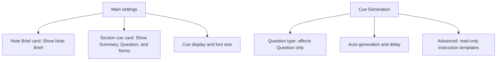

# Artifact-Matched CueCraft Settings - Plan

## Goal Capsule

- **Objective:** Make every CueCraft setting understandable by organizing controls around the generated components visible in a note and by separating appearance from generation behavior.
- **Product authority:** The confirmed brainstorm decisions govern product behavior. `docs/CueCraft-Glossary.md` governs user-facing vocabulary.
- **Open blockers:** None.

---

## Product Contract

### Summary

CueCraft settings will mirror the artifacts visible in a note.
The main settings page will use miniature Note Brief and Section cue cards for global appearance controls, while Cue Generation will own Question generation, automation, and read-only instruction inspection.

### Problem Frame

CueCraft currently exposes generation concepts such as preset, density, question style, cue supports, and system prompts without showing how they combine.
Several controls overlap, some labels do not correspond to anything visible in the note, and editable prompt fields compete with standard settings for authority.

The retired Cornell View leaves Editing View as an obsolete settings category.
Appearance controls are also split between Editing and Reading behavior even though both surfaces show the same generated components.

### Key Decisions

- **Use artifact cards on the main page.** (session-settled: user-directed — chosen over a plain settings list or in-note controls: miniature artifacts make each control's visible target immediately recognizable.) Governs R1-R6.
- **Separate appearance from generation.** (session-settled: user-directed — chosen over the Editing View taxonomy: Cornell View is gone and appearance is no longer specific to one note mode.) Governs R1, R6-R8.
- **Replace overlapping question controls with Question type.** (session-settled: user-directed — chosen over preserving preset, density, and question style: one control maps directly to the visible Question and prevents conflicting combinations.) Governs R9-R12.
- **Make instruction templates read-only.** (session-settled: user-directed — chosen over editable advanced prompts: most users need to inspect CueCraft's authority model rather than replace it.) Governs R15-R19.
- **Use one visibility configuration across note modes.** (session-settled: user-directed — chosen over separate Editing and Reading choices: the same component names should have the same visibility everywhere.) Governs R3-R5.
- **Discard legacy custom prompt overrides.** (session-settled: user-directed — chosen over preserving or exporting them: CueCraft-owned defaults create one unambiguous instruction authority.) Governs R19.

### Settings Structure

### Requirements

**Main settings and appearance**

- R1. The main settings page must contain all controls that change the presentation or visibility of generated content and must not expose an Editing View destination.
- R2. The main page must present miniature Note Brief and Section cue cards that use the same titles and hierarchy as the generated artifacts in a note.
- R3. The Note Brief card must provide a `Show Note Brief` control for the whole-note artifact and must identify Core idea, Review first, and Self-test as fixed parts without separate controls.
- R4. The Section cue card must provide controls labeled `Show Summary`, `Show Question`, and `Show Terms` beside their matching component titles.
- R5. Note Brief, Summary, Question, and Terms visibility choices must apply identically in Editing and Reading modes.
- R6. Cue display and cue font size must live on the main page as appearance controls outside the generated-artifact cards.
- R7. Visibility and appearance changes must update the note presentation without regenerating content.
- R8. Hiding Note Brief, Summary, Question, or Terms must not suppress generation of that artifact or remove its cached content.

**Question generation**

- R9. Cue Generation must replace Cue preset, Cue density, and Question style with one control labeled `Question type`.
- R10. Question type must affect only the visible Question; it must not change Summary, Terms, Note Brief, Core idea, Review first, or Self-test content.
- R11. Question type must offer Conceptual question, Direct recall, Exam practice, Vocabulary check, and Socratic reasoning, with Conceptual question as the default.
- R12. Each Question type must provide one coherent instruction rather than composing independent style and depth instructions.
- R13. Terms must always be generated for Note Brief input, exports, and future display changes; `Generate cue supports` must be removed.
- R14. Existing legacy question settings must migrate to the nearest Question type, with conflicting or unrecognized combinations falling back to Conceptual question.

**Instruction inspection**

- R15. Cue Generation must contain a collapsed `Advanced` section below ordinary generation controls.
- R16. Advanced must expose separate read-only templates titled `Section cue instructions` and `Note Brief instructions`.
- R17. Section cue instructions must show the exact assembled policy, selected Question type guidance, Summary/Question/Terms contract, and placeholders for section and note context.
- R18. Note Brief instructions must show the exact assembled policy, overview and three-card contract, and placeholders for full-note and successful-section-cue inputs.
- R19. Advanced must contain no prompt editor, save action, or custom-instruction reset; existing custom prompt overrides must be discarded in favor of CueCraft defaults.
- R20. Changing Question type must immediately update the read-only Section cue template and mark generated Question content as changed for the existing regeneration handoff.

**Generation behavior**

- R21. Cue Generation must retain auto-generation and auto-generation delay as controls that affect when CueCraft creates Note Brief and section cue artifacts.
- R22. Generation copy must name the affected artifacts instead of referring only to generic cues or review artifacts.

### Key Flows

- F1. Configure visible artifacts
  - **Trigger:** The user changes a visibility control on the main settings page.
  - **Steps:** CueCraft saves the global choice and refreshes open Editing and Reading presentations.
  - **Outcome:** The matching Note Brief, Summary, Question, or Terms component appears or disappears without provider work or cache loss.
  - **Covered by:** R1-R8.

- F2. Change Question type
  - **Trigger:** The user selects a different Question type under Cue Generation.
  - **Steps:** CueCraft saves the choice, refreshes the read-only Section cue template, and uses the existing regeneration handoff for cached content.
  - **Outcome:** Newly generated Questions follow one coherent type while other visible components retain their CueCraft-owned behavior.
  - **Covered by:** R9-R12, R20.

- F3. Inspect generation instructions
  - **Trigger:** The user expands Advanced under Cue Generation.
  - **Steps:** CueCraft shows separate exact instruction templates for section cues and Note Brief with source placeholders.
  - **Outcome:** The user can inspect what guides each artifact without gaining a second, conflicting customization path.
  - **Covered by:** R15-R19.

- F4. Run automatic generation
  - **Trigger:** Auto-generation runs after its configured delay.
  - **Steps:** CueCraft generates section Summary, Question, and Terms artifacts, then generates Note Brief from the bounded note source and successful section outputs.
  - **Outcome:** Cached content is complete regardless of which components are currently visible.
  - **Covered by:** R8, R13, R21-R22.

### Acceptance Examples

- AE1. **Covers R1-R6.** Given the user opens CueCraft settings, when the main page renders, then it shows Note Brief and Section cue artifact cards plus cue display and font controls, and it does not show an Editing View destination.
- AE2. **Covers R3-R5.** Given a visibility choice changes on either artifact card, when the user views the note in Editing or Reading mode, then the same matching component visibility applies in both modes.
- AE3. **Covers R7-R8.** Given generated content is cached, when the user hides and later shows a component, then the component returns without regeneration and with its prior content intact.
- AE4. **Covers R9-R12.** Given Question type is Exam practice, when CueCraft generates a section cue, then the Question uses exam-style wording while Summary, Terms, and Note Brief retain their normal contracts.
- AE5. **Covers R11-R12.** Given each available Question type, when the read-only Section cue template is inspected, then it contains one type-specific instruction and no separate preset, density, or question-style instruction.
- AE6. **Covers R13.** Given Show Terms is off, when CueCraft generates and exports content, then Terms remain available to Note Brief and exports while staying hidden in Editing and Reading modes.
- AE7. **Covers R15-R18.** Given Advanced is collapsed by default, when the user expands it, then two separately titled exact instruction templates appear with placeholders instead of active-note source text.
- AE8. **Covers R19.** Given stored custom prompt overrides from an earlier version, when the upgraded settings load, then CueCraft uses its current default policies and exposes no editable legacy prompt text.
- AE9. **Covers R20.** Given the user changes Question type, when the Section cue template refreshes, then it reflects the new type before any provider request occurs.
- AE10. **Covers R21-R22.** Given auto-generation is enabled, when its delay elapses, then the interface describes and performs generation for section cues and Note Brief rather than describing only generic cues.

### Scope Boundaries

- Per-note visibility overrides and in-note settings controls are outside this change.
- Separate Editing and Reading visibility configurations are removed rather than renamed.
- Editable custom prompts, prompt recipes, conflict linting, and custom prompt management are outside this change.
- The inspector does not include the active note's source text or a complete provider request payload.
- This change does not redesign the generated Note Brief or Section cue artifacts beyond keeping settings previews aligned with their existing visible titles and hierarchy.

### Dependencies and Assumptions

- Note Brief generation continues to consume a bounded full-note source plus successful section Questions and Terms.
- Core idea, Review first, and Self-test remain the user-facing names for the three fixed Note Brief cards even though provider contracts may use different internal field names.
- The artifact cards are settings controls, not live previews of an active note.

### Sources

- `docs/CueCraft-Glossary.md` — canonical user-facing terminology and legacy-language replacements.
- `src/settings.ts` — current Cue Generation, Editing View, visibility, and automation controls.
- `src/cue-generation.ts` — current density, question-style, and Terms guidance.
- `src/byok-cuecraft-adapter.ts` — section cue instruction assembly and protected artifact contracts.
- `src/review-artifact-prompts.ts` — Note Brief output contract and source composition.
- `src/generator.ts` — section-to-Note-Brief generation flow.
- `docs/plans/2026-08-08-001-feat-separate-cue-review-instructions-plan.md` — prior editable-instruction design superseded by this Product Contract where the scopes overlap.
