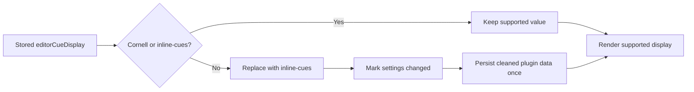

# Remove Hidden Editor Modes - Plan

## Goal Capsule

- **Objective:** Remove the retired `collapsed-tabs`, `active-section-composer`, and `hook-minimap` editor display modes from the supported settings contract, production renderers, previews, styles, and tests.
- **Authority:** The user explicitly approved removing these hidden modes and their compatibility surface because the plugin has no other users.
- **Execution profile:** One implementation phase on one feature branch and one pull request.
- **Stop conditions:** Stop if a proposed deletion removes Cornell gutter/layout behavior, inline Section cues, Study Mode interaction, width controls, or another currently visible feature.
- **Tail ownership:** The LFG pipeline owns implementation, verification, simplification, review fixes, publication, pull-request creation, and CI follow-through.

## Product Contract

### Summary

The editor display setting will support only Cornell and inline Section cues. Stored values for the three retired modes will be treated as invalid, replaced with `inline-cues`, and persisted through the existing plugin-data cleanup path. The implementation and test suite will no longer carry renderer models, DOM branches, previews, CSS, or behavioral coverage for modes users cannot select.

### Problem Frame

The settings UI hides three editor modes, but the option contract, persisted-setting validator, production renderer, preview renderer, stylesheet, and test suite still implement them. Keeping that dormant surface preserves complexity across settings loading, CodeMirror decoration state, CSS, and tests without providing a user-facing capability.

### Requirements

**Supported display contract**

- R1. `EditorCueDisplay` and `EDITOR_CUE_DISPLAY_OPTIONS` support only `cornell` and `inline-cues`.
- R2. The appearance thumbnail control presents both supported displays without a hidden-option filter.
- R3. Cornell and inline display behavior, placement, visibility settings, width behavior, and Study Mode integration remain unchanged.

**Stored setting cleanup**

- R4. Loading `collapsed-tabs`, `active-section-composer`, or `hook-minimap` replaces the stored value with `inline-cues` at runtime.
- R5. The normalized `inline-cues` value is persisted once through the existing plugin-data save path.
- R6. Any other malformed `editorCueDisplay` value continues to fall back to `inline-cues` and is persisted as cleaned data.

**Implementation removal**

- R7. Delete the production model and renderer branches used only by the three retired modes, including current/upcoming cursor state that no supported display consumes.
- R8. Delete preview markup, preview helpers, runtime CSS, responsive variants, and width rules used only by the three retired modes.
- R9. Delete or reconcile tests so they cover the two supported displays and the migration boundary rather than the retired behavior.
- R10. Update the active manual editor-display evaluation checklist so it instructs maintainers to test only Cornell and inline cues.

### Acceptance Examples

- AE1. Given saved settings with `editorCueDisplay: "collapsed-tabs"`, when plugin data loads, then runtime settings and the single persisted cleanup payload both contain `editorCueDisplay: "inline-cues"`.
- AE2. The same result as AE1 occurs for `active-section-composer` and `hook-minimap`.
- AE3. Given saved settings with `editorCueDisplay: "cornell"`, when plugin data loads, then Cornell remains selected and the display value does not cause a cleanup save.
- AE4. Given the appearance settings UI, when editor display thumbnails are built, then their IDs exactly match `EDITOR_CUE_DISPLAY_OPTIONS`: Cornell and inline cues.
- AE5. Given a note with generated cues, when Cornell is selected, then cues remain gutter cards with the existing layout, collapse, width, and Study Mode behavior; when inline cues are selected, then cues remain body widgets below headings.
- AE6. Searching production TypeScript and `styles.css` for the three retired IDs returns no matches after implementation.

### Key Decisions

- **Remove retired modes instead of retaining a compatibility facade.** `session-settled: user-approved — chosen over continued legacy compatibility because the plugin has no other users.` Governs R1-R10.
- **Normalize removed stored values to the existing default, `inline-cues`, and save the cleanup.** `session-settled: user-approved — chosen over preserving or silently accepting retired values.` Governs R4-R6.

### Scope Boundaries

- Preserve Cornell's generic CodeMirror gutter, page-shift, spacer, width-grip, disclosure, and responsive infrastructure.
- Preserve inline cue rendering and all generic cue content helpers shared with Cornell.
- Do not rename surviving `editor-hook` classes, modules, layout APIs, or tests solely because their names originated with the retired prototypes.
- Do not alter unrelated legacy provider, cache, question, category, or workspace migrations.
- Do not rewrite historical plans or ideation documents that accurately record the retired behavior.
- Do not add a compatibility allowlist or explicit production list of retired values.

## Planning Contract

### Key Technical Decisions

- KTD1. **Use the existing validator/default load path as the migration boundary.** Reducing `isEditorCueDisplay()` to two supported values makes the retired strings invalid; `loadPluginData()` will set `settingsChanged` when it replaces any invalid value so the existing persistence gate saves the cleanup. Supports R1 and R4-R6.
- KTD2. **Delete the retired renderer model as one ownership unit.** `src/editor-hook-rail.ts` and its test suite exist only for the removed modes; the small visibility-options shape still needed by Cornell and inline rendering will live directly in `src/cue-extension.ts`. Supports R3, R7, and R9.
- KTD3. **Retain shared Cornell infrastructure by producer reachability.** CSS and TypeScript emitted or consumed by Cornell remain even when their names contain `editor-hook`; only selectors and helpers whose DOM producers disappear are deleted. Supports R3, R7, and R8.
- KTD4. **Keep migration strings only at test and historical boundaries.** Production code will not enumerate the retired values. Their names remain in table-driven migration/validation fixtures and historical documentation so the cleanup contract stays explicit without preserving implementation branches. Supports R4-R6 and R9.

### Assumptions

- No external consumer imports the plugin's internal editor display types or renderer helpers.
- There are no installed copies whose retired display preference must remain functional; the user explicitly confirmed there are no other users.
- Existing tests accurately identify Cornell-only gutter behavior and inline-only body-widget behavior.
- Historical documentation is evidence, not an active compatibility contract.

### Sources and Research

- `src/editor-cue-display.ts` owns the display union, options, default, and validator.
- `src/main.ts` owns plugin-data normalization and conditional persistence; its current invalid-display fallback does not mark settings as changed.
- `src/cue-extension.ts` owns supported Cornell/inline rendering plus the retired mode branches and cursor-state machinery.
- `src/editor-hook-rail.ts` is imported only by the retired renderer path in `src/cue-extension.ts`.
- `src/appearance-thumbnail-controls.ts` hides the retired modes from settings while still rendering unreachable previews for them.
- `styles.css` contains isolated preview/runtime selectors for the three retired modes plus shared Cornell gutter/layout selectors that must remain.
- `tests/plugin-data-migration.test.ts`, `tests/settings.test.ts`, `tests/appearance-thumbnail-controls.test.ts`, and `tests/cue-extension.test.ts` are the owning suites for migration, validation, previews, and rendering.
- `docs/evaluation/inline-editor-hook-rails.md` is active manual-test guidance and still lists retired modes, so it must be narrowed to the two supported displays rather than treated as historical documentation.
- `docs/plans/2026-08-16-2358-test-remove-obsolete-tests-plan.md` explicitly deferred this production removal until saved values could be migrated.
- Git history includes the established pattern for removing other unused editor displays while retaining current Cornell and inline behavior.
- No `docs/solutions/` corpus or `CONCEPTS.md` exists, so no institutional learning changes this plan.

### System-Wide Impact

- **Settings load:** Invalid values become `inline-cues`, now with persistence rather than only in-memory fallback.
- **Settings UI:** Thumbnail choices derive directly from the two authoritative display options.
- **Editor rendering:** Cornell remains in the gutter and inline cues remain body widgets; retired mode state, card modeling, and DOM disappear.
- **Styling:** Shared Cornell gutter/layout rules remain; selectors with no remaining producer are deleted.
- **Tests:** Behavioral ownership shifts from dormant implementations to the supported display contract and persisted cleanup boundary.

### Risks and Mitigations

- **Risk:** Deleting broadly named `editor-hook` infrastructure could break Cornell. **Mitigation:** Delete by actual producer/consumer reachability, retain Cornell render and CSS assertions, and run focused editor tests.
- **Risk:** Normalizing invalid values without setting `settingsChanged` would leave retired values on disk. **Mitigation:** Assert both runtime settings and the exact persisted payload for each retired string, including a single save call.
- **Risk:** Simplifying render signatures could orphan call sites or weaken placement behavior. **Mitigation:** Typecheck and retain explicit Cornell-gutter and inline-widget tests.
- **Risk:** CSS selectors could remain after their producers are deleted. **Mitigation:** Run a production-source/style search for all three retired IDs and inspect the final diff.

## Implementation Units

### U1. Contract and persisted-setting migration

- **Goal:** Reduce the supported display contract to Cornell and inline cues and persist cleanup of retired or malformed values.
- **Requirements:** R1, R2, R4-R6; AE1-AE4; KTD1 and KTD4.
- **Dependencies:** None.
- **Files:** Modify `src/editor-cue-display.ts`, `src/main.ts`, `src/appearance-thumbnail-controls.ts`, `tests/settings.test.ts`, `tests/plugin-data-migration.test.ts`, and `tests/appearance-thumbnail-controls.test.ts`.
- **Approach:** Remove the three retired union members and option records. Replace the thumbnail filter with a direct mapping of the authoritative options and remove unreachable preview switch branches/helpers. In plugin-data loading, mark settings changed whenever `editorCueDisplay` fails the reduced validator before assigning the default. Add table-driven runtime-and-persistence coverage for each retired string and keep malformed-value coverage at the validator/load boundary.
- **Patterns to follow:** Use the existing `DEFAULT_EDITOR_CUE_DISPLAY`, `isEditorCueDisplay()`, settings merge, and `persistPluginData()` flow rather than adding a one-off migration version or retired-value list.
- **Test scenarios:**
  - Each retired stored string becomes `inline-cues` in memory, causes exactly one save, and appears as `inline-cues` in the saved payload.
  - Cornell and inline values remain valid and available.
  - Retired strings and unrelated malformed values fail validation.
  - Thumbnail IDs exactly match the reduced options array and both remaining scenes render.
- **Verification:** Run the focused settings, plugin-data migration, and thumbnail suites; run typecheck after signature/union narrowing.

### U2. Retired renderer, model, and stylesheet removal

- **Goal:** Delete all production rendering and presentation code owned only by the retired modes while preserving Cornell and inline behavior.
- **Requirements:** R3, R7-R10; AE5-AE6; KTD2-KTD4.
- **Dependencies:** U1.
- **Files:** Delete `src/editor-hook-rail.ts` and `tests/editor-hook-rail.test.ts`; modify `src/cue-extension.ts`, `tests/cue-extension.test.ts`, `styles.css`, and `docs/evaluation/inline-editor-hook-rails.md`.
- **Approach:** Remove the hook-card model imports and retired renderer branch; move only the supported visibility options shape into `cue-extension.ts`. Remove cursor-derived active/upcoming state, selection-only gutter rebuilding, retired index/tone/state plumbing, and Cornell `data-state` output that no surviving selector or behavior consumes. Keep Cornell gutter markers and layout behavior and inline widget decorations. Delete preview/runtime/responsive CSS selectors whose DOM producers were retired, while preserving shared sectioned cue, disclosure, summary, Cornell, inline, gutter, page-shift, spacer, and reduced-motion rules. Remove dormant behavior tests and retain or sharpen supported placement and rendering assertions. Rewrite the active evaluation checklist around Cornell and inline cues, removing retired-mode instructions while retaining applicable safety, visibility, theme, width, and interaction checks.
- **Patterns to follow:** Use the established split where `buildCueGutterMarkers()` owns Cornell and `buildCueWidgetDecorations()` owns inline cues. Let TypeScript union exhaustiveness expose missed retired branches.
- **Test scenarios:**
  - Cornell cues still render in the gutter with expected card classes, visibility settings, collapse controls, width grip, layout, and Study Mode behavior.
  - Inline cues still render beneath headings and do not use the Cornell gutter.
  - Cursor selection changes no longer drive retired current/upcoming state, while supported decorations remain stable.
  - No production TypeScript or stylesheet occurrence of the three retired IDs remains.
  - Deleted model/test imports leave no typecheck, lint, or build errors.
  - The manual evaluation checklist names only supported display modes and checks their actual placement and layout behavior.
- **Verification:** Run the focused cue-extension suite, full test suite, typecheck, lint, build, retired-ID search, and final diff inspection.

## Verification Contract

| Gate | Scope | Done signal |
|---|---|---|
| `bun run test -- tests/plugin-data-migration.test.ts tests/settings.test.ts tests/appearance-thumbnail-controls.test.ts tests/cue-extension.test.ts` | U1-U2 | Migration, validation, preview, and supported renderer suites pass. |
| `bun run test` | U1-U2 | The complete Vitest suite passes after retired behavior suites/cases are removed. |
| `bun run typecheck` | U1-U2 | TypeScript accepts the reduced display union and simplified renderer signatures. |
| `bun run lint` | U1-U2 | No unused imports, unreachable helpers, or lint failures remain. |
| `bun run build` | U1-U2 | The production plugin bundle builds successfully. |
| `rg -n "collapsed-tabs|active-section-composer|hook-minimap" src styles.css` | U2 | The command returns no matches. |
| Repository diff inspection | U1-U2 | The diff contains only the plan, active evaluation checklist, and the production/test/style files named above; shared Cornell and inline infrastructure remains. |

## Definition of Done

- R1-R10, AE1-AE6, U1, and U2 are satisfied.
- Only Cornell and inline cues are valid and selectable editor displays.
- Each retired stored value is normalized to `inline-cues` and persisted once.
- `src/editor-hook-rail.ts` and its test suite are deleted.
- No retired renderer, preview, CSS, or cursor-state branch remains.
- Cornell gutter/layout/width/Study behavior and inline body-widget behavior remain covered and pass.
- Focused tests, full tests, typecheck, lint, build, retired-ID search, and diff inspection pass.
- The implementation and plan are committed on `codex/remove-hidden-editor-modes`, pushed, and opened as one pull request.
