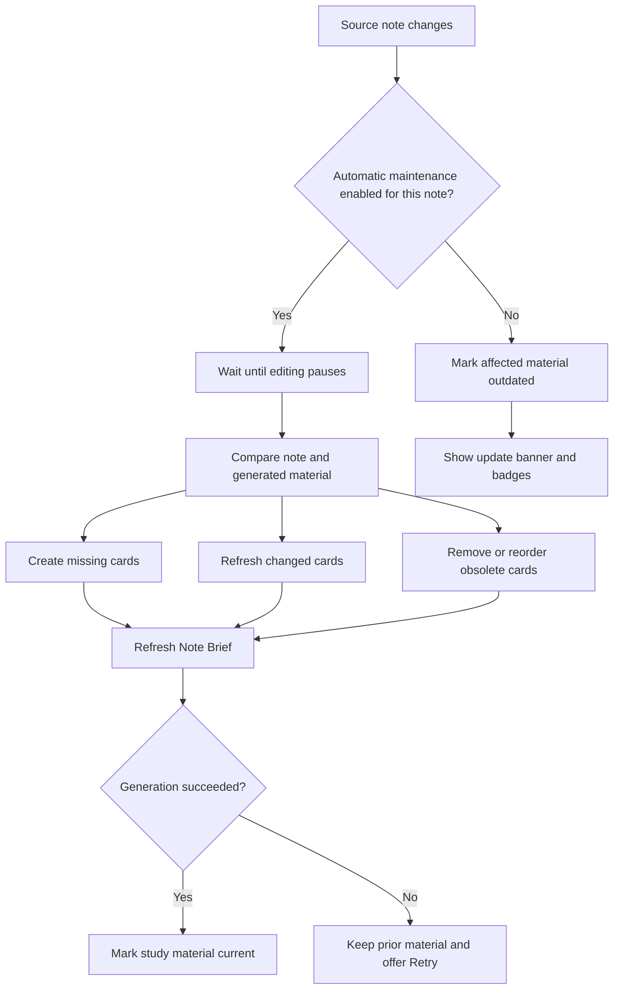

# CueCraft Automatic Study Material Maintenance - Plan

## Goal Capsule

- **Objective:** Give CueCraft one understandable automation model that keeps selected study material current and makes coverage and freshness visible.
- **Product authority:** This plan owns automatic maintenance, scope, freshness, and stale-state behavior. The vocabulary and Settings redesign remains governed by `docs/ideation/2026-08-17-cuecraft-vocabulary-review.html` and is surrounding release work rather than active scope here.
- **Open blockers:** None. Planning may choose implementation and migration mechanics without changing the product behavior below.

---

## Product Contract

### Summary

Users define automatically maintained notes through non-overlapping folders or one mutually exclusive Entire vault scope.
CueCraft incrementally keeps enabled scopes current and clearly identifies automation coverage and outdated study material everywhere else.

### Problem Frame

The current product exposes global automatic generation and folder-specific maintenance as separate concepts.
The same note can appear eligible through more than one path, so users cannot readily tell which notes will invoke a provider after editing.

The observed problem in current use is uncertainty about coverage and freshness rather than a lack of generation commands.
Users need to know whether the active note is maintained and which generated cards no longer match their source sections.

### Key Decisions

- **Use selected scopes as the only automation authority** (session-settled: user-directed — chosen over a global saved-note switch and implicit maintenance of previously generated notes: explicit scope makes coverage understandable). Governs R1-R4.
- **Separate initial catch-up from ongoing maintenance** (session-settled: user-approved — chosen over immediate generation when a scope is added: broad provider usage should require an explicit action). Governs R5-R7.
- **Maintain generated material incrementally after editing pauses** (session-settled: user-directed — chosen over missing-only generation and update-on-leave: changed source content should become current without regenerating unchanged cards). Governs R8-R14.
- **Use persistent, contextual freshness signals** (session-settled: user-directed — chosen over a temporary Obsidian notice and a banner-only warning: users need to identify both the note-level problem and affected cards). Governs R15-R20.
- **Keep visibility independent from maintenance** (session-settled: user-approved — chosen over treating hidden generated material as an automation opt-out: presentation controls should not create hidden scope exceptions). Governs R21-R22.
- **Preserve existing material when generation fails** (session-settled: user-directed — chosen over hiding content or reporting failure only in a temporary notice: outdated material can remain useful when its status is explicit). Governs R23-R24.

<!-- ce-section: work-relationships -->
### How This Work Fits Together

This plan owns the automation and freshness model that the broader vocabulary release needs in order to label Settings accurately.

- **Shares a release with:** The vocabulary, Settings information architecture, introduction copy, glossary, command, notice, manifest, and README changes governed by `docs/ideation/2026-08-17-cuecraft-vocabulary-review.html`.
- **Enables:** A combined implementation plan that can replace “Study Areas” and the competing global automatic-generation control with one user-facing system.
- **Can be reviewed independently of:** Internal identifier renaming, which is not required to deliver the user-facing vocabulary or behavior.

### Requirements

**Scope and eligibility**

- R1. Automatic maintenance has one source of truth: the enabled entries under **Folders & automatic updates**.
- R2. The scope list contains either one **Entire vault** entry or one or more folder entries, never both.
- R3. Parent and descendant folder entries cannot overlap; users express narrower exceptions through explicit note or folder exclusions.
- R4. Notes outside enabled entries, notes under paused entries, and excluded notes never invoke automatic generation.

**Catch-up and consent**

- R5. Adding a folder or Entire vault performs a read-only scan that reports missing, outdated, ready, excluded, and failed work without invoking a provider.
- R6. **Bring study material up to date** explicitly generates missing Note Briefs and section study cards and refreshes outdated material for eligible notes in the selected entry.
- R7. Every newly added scope starts with **Update automatically** off; enabling it governs later edits and does not launch catch-up.

**Incremental maintenance**

- R8. An enabled entry schedules maintenance after editing has remained quiet for the configured delay, resetting that delay when more edits arrive.
- R9. A new eligible note receives a Note Brief and one section study card for each eligible headed section.
- R10. A newly added section receives a section study card and causes the Note Brief to refresh.
- R11. An edited section causes only its section study card and the Note Brief to refresh.
- R12. A deleted section removes its obsolete cached card and causes the Note Brief to refresh.
- R13. Reordered sections reconcile card order and cause the Note Brief to refresh without changing unaffected card content.
- R14. Unchanged sections preserve their existing cards, and changing a provider, model, or generation instructions does not by itself make existing material outdated.

**Freshness and coverage**

- R15. The active-note status indicator distinguishes automatic maintenance from manual maintenance and reports whether generated material is current, outdated, updating, or failed.
- R16. An outdated note shows a persistent view-wide banner below the note header in Editing and Reading views when automatic maintenance is inactive or an automatic update has failed.
- R17. The outdated banner offers **Update study material**, while a failed update offers **Retry update**.
- R18. Each affected section study card shows an **Outdated** badge, and the Note Brief shows the same badge whenever any note-level source change has not been incorporated.
- R19. Dismissing the banner suppresses it only for the current source revision; the next source change makes it eligible to appear again.
- R20. Updating the study material removes the banner and outdated badges only after the resulting Note Brief and affected cards are current.

**Visibility and exclusions**

- R21. Note-level generated-material visibility, component visibility, card collapse state, and Study Mode reveal state never change automatic-maintenance eligibility.
- R22. Explicit exclusions are the only per-note or nested-folder opt-out within an enabled scope.

**Failure behavior**

- R23. Failed generation preserves the last available Note Brief and section study cards rather than hiding or discarding them.
- R24. A failed automatic update leaves affected material marked outdated and retains an actionable retry state until the update succeeds or the source changes again.

**Source safety**

- R25. Scanning, catch-up, maintenance, failure recovery, and freshness presentation never modify source Markdown.

### Key Flows

- F1. Add and catch up a scope
  - **Trigger:** A user adds a folder or Entire vault under **Folders & automatic updates**.
  - **Steps:** CueCraft scans without provider calls, reports the work by freshness state, and waits for the user to choose **Bring study material up to date**.
  - **Outcome:** Catch-up establishes current study material while ongoing maintenance remains off.
  - **Covers:** R2-R7.

- F2. Maintain an enabled note
  - **Trigger:** Source content changes in a note covered by an enabled entry.
  - **Steps:** CueCraft waits for the editing delay, updates only affected section cards, reconciles deleted or reordered sections, and refreshes the Note Brief.
  - **Outcome:** The note returns to current without replacing unchanged cards.
  - **Covers:** R8-R14.

- F3. Assist a manual update
  - **Trigger:** Generated study material becomes outdated while maintenance is inactive for the note.
  - **Steps:** CueCraft marks affected material, shows the view-wide banner, and lets the user update or dismiss the banner for the current revision.
  - **Outcome:** The stale state remains legible without invoking the provider automatically.
  - **Covers:** R15-R22.

- F4. Recover from an automatic failure
  - **Trigger:** Provider work fails during automatic maintenance.
  - **Steps:** CueCraft retains the previous material, marks the affected content outdated, and offers **Retry update**.
  - **Outcome:** The user keeps usable context and a durable recovery path.
  - **Covers:** R23-R24.

### Acceptance Examples

- AE1. Adding a folder
  - **Covers R5-R7.**
  - **Given:** A folder contains notes with missing and outdated study material.
  - **When:** The user adds the folder.
  - **Then:** CueCraft reports the counts without invoking a provider, and **Update automatically** remains off.

- AE2. Running explicit catch-up
  - **Covers R5-R6.**
  - **Given:** A selected folder contains missing Note Briefs, missing section cards, and outdated cards.
  - **When:** The user chooses **Bring study material up to date**.
  - **Then:** CueCraft generates missing material and refreshes outdated material across the folder.

- AE3. Adding a section under automatic maintenance
  - **Covers R8, R10, R14.**
  - **Given:** A current note belongs to an enabled folder.
  - **When:** The user adds a headed section and editing pauses.
  - **Then:** CueCraft generates the new section card, refreshes the Note Brief, and preserves every unchanged card.

- AE4. Editing one existing section
  - **Covers R8, R11, R14.**
  - **Given:** A current note has several section cards.
  - **When:** The user changes one section and editing pauses.
  - **Then:** CueCraft refreshes that card and the Note Brief without regenerating the other cards.

- AE5. Deleting or reordering sections
  - **Covers R12-R14.**
  - **Given:** A current note has cards for all eligible sections.
  - **When:** The user deletes one section or changes section order.
  - **Then:** CueCraft reconciles the cards and refreshes the Note Brief without changing unaffected card content.

- AE6. Editing while maintenance is inactive
  - **Covers R15-R20.**
  - **Given:** A note has generated material and is outside enabled scope, excluded, or covered by a paused entry.
  - **When:** Its source changes.
  - **Then:** CueCraft invokes no provider, shows the view-wide banner, and marks the affected card and Note Brief outdated.

- AE7. Dismissing an outdated banner
  - **Covers R19.**
  - **Given:** An outdated note shows the banner.
  - **When:** The user dismisses it and continues viewing the same source revision.
  - **Then:** The banner stays dismissed, but another source change makes it appear again.

- AE8. Hiding maintained material
  - **Covers R21-R22.**
  - **Given:** A note belongs to an enabled scope.
  - **When:** The user hides its generated material or disables Recall question visibility.
  - **Then:** CueCraft continues maintaining the hidden generated material unless the note is explicitly excluded.

- AE9. Selecting Entire vault
  - **Covers R2-R4, R22.**
  - **Given:** No folder entries exist.
  - **When:** The user adds Entire vault and excludes Templates.
  - **Then:** CueCraft can maintain eligible notes outside Templates, and Settings prevents adding a separate folder entry.

- AE10. Recovering from failure
  - **Covers R16-R18, R23-R24.**
  - **Given:** Automatic maintenance starts for an edited note.
  - **When:** Provider generation fails.
  - **Then:** Previous material remains visible with outdated badges and the banner offers **Retry update**.

### Success Criteria

- A user viewing a note can tell whether automatic maintenance is active without opening Settings.
- A user can identify which Note Brief or section cards are outdated without comparing source text manually.
- Adding a scope or leaving its toggle off never causes an unconfirmed provider call.
- Routine maintenance never regenerates unchanged section cards.
- Source Markdown remains unchanged across every automation and recovery flow covered by R25.

### Scope Boundaries

- The broader vocabulary rollout, Settings reordering, introduction copy, glossary rewrite, commands, notices, README, and manifest changes remain governed by `docs/ideation/2026-08-17-cuecraft-vocabulary-review.html` and will be planned with this contract for the same release.
- Internal identifier, persisted-key, cache-field, and filename renaming is not required unless planning finds it necessary to satisfy this contract.
- Provider, model, and generation-instruction changes do not trigger automatic regeneration of existing material.
- Per-card maintenance toggles and overlapping scope precedence rules are not part of the model.

### Dependencies and Assumptions

- Automatic generation requires a configured provider and retains existing provider concurrency and rate-limit controls.
- Folder and Entire vault scans can classify notes as missing, outdated, ready, excluded, or failed before provider work begins.
- Existing source-section comparison remains authoritative for deciding which cards need provider work.

### Sources and Research

- `docs/ideation/2026-08-17-cuecraft-vocabulary-review.html` — approved vocabulary direction and the requirement to resolve automation before relabeling Settings.
- `docs/plans/2026-08-17-1317-docs-prune-glossary-terms-plan.md` — first-release baseline for current persisted data and vocabulary.
- `src/main.ts` — current global and selected-scope scheduling paths, stale refresh, status behavior, and note visibility.
- `src/study-area.ts` — current folder scope, exclusions, pause state, and Entire vault behavior.
- `src/status.ts` — current freshness-only status model.
- `src/visibility.ts` — current note-level generated-material visibility model.
