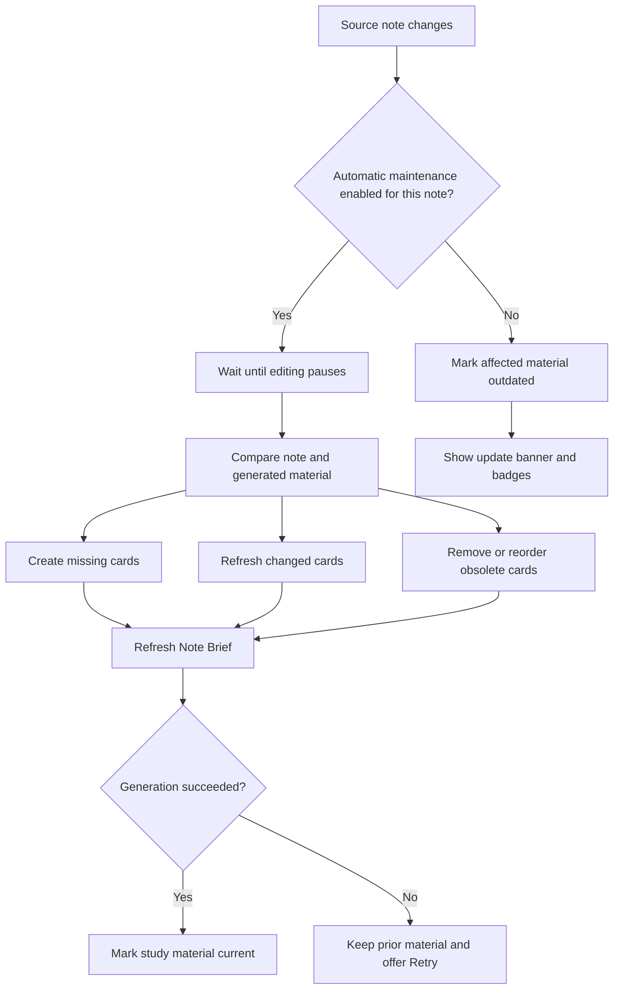
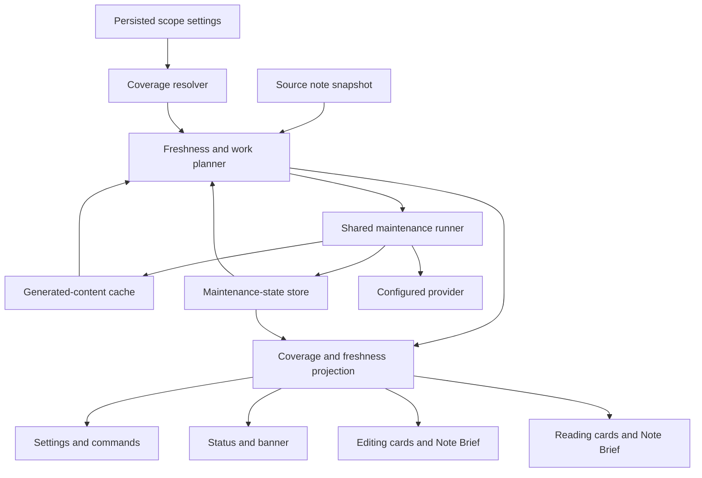
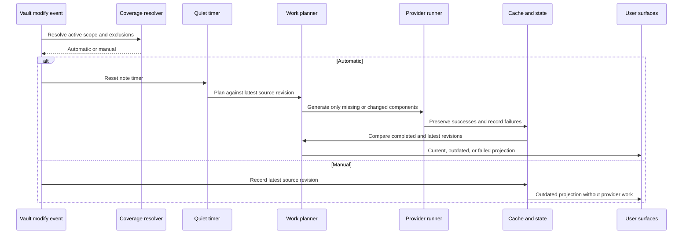
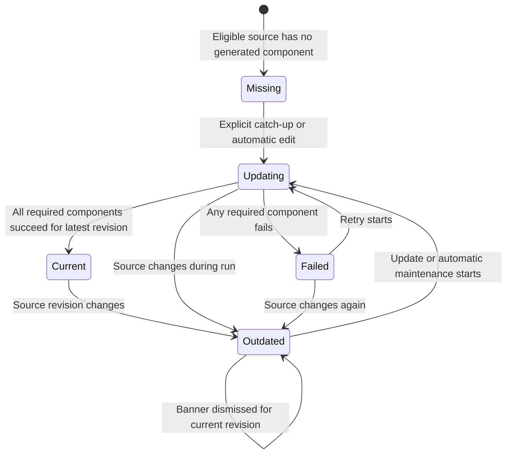
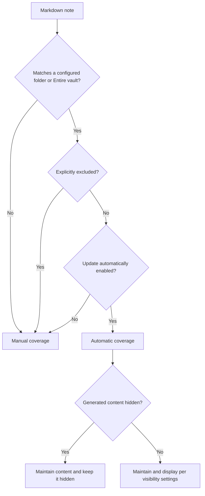
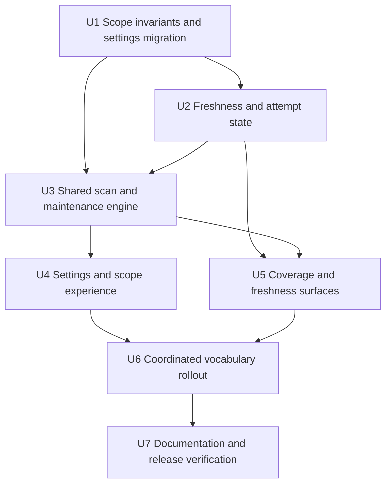

# CueCraft Vocabulary and Automatic Maintenance - Plan

## Goal Capsule

- **Objective:** Ship one release in which CueCraft uses plain study vocabulary and one understandable system for keeping selected study material current.
- **Authority:** R1-R25 govern automation and override conflicting automation concepts in `docs/ideation/2026-08-17-cuecraft-vocabulary-review.html`; R26 binds that slideshow as the authority for user-facing vocabulary and Settings structure.
- **Execution profile:** Deep, cross-cutting implementation across persisted state, scheduling, generation, Editing and Reading surfaces, Settings, commands, exports, documentation, and release metadata.
- **Stop conditions:** Stop if implementation would modify source Markdown, enable automatic provider work without explicit scope consent, invoke provider work without an enabled scope or an explicit catch-up, update, Retry, or command action, weaken an R1-R25 qualifier, or require a new product decision not represented below.
- **Tail ownership:** The release includes code, tests, user documentation, metadata, and production-build verification as one coherent vocabulary and behavior change.

---

## Product Contract

### Summary

Implement the automatic-maintenance Product Contract and the approved vocabulary system as one release.
CueCraft will use one scope model, one freshness model, and one user-facing language from setup through study.

### Problem Frame

The current product exposes global automatic generation and folder-specific maintenance as separate concepts.
The same note can appear eligible through more than one path, so users cannot readily tell which notes will invoke a provider after editing.

The interface also requires users to decode terms such as “Section cue,” “Study Area,” and “Study aids” before they understand the visible objects or controls.
The observed problem in current use is uncertainty about coverage and freshness, compounded by inconsistent vocabulary across Settings, commands, notices, exports, and documentation.

### Key Decisions

- **Use selected scopes as the only automation authority** (session-settled: user-directed — chosen over a global saved-note switch and implicit maintenance of previously generated notes: explicit scope makes coverage understandable). Governs R1-R4.
- **Separate initial catch-up from ongoing maintenance** (session-settled: user-approved — chosen over immediate generation when a scope is added: broad provider usage should require an explicit action). Governs R5-R7.
- **Maintain generated material incrementally after editing pauses** (session-settled: user-directed — chosen over missing-only generation and update-on-leave: changed source content should become current without regenerating unchanged cards). Governs R8-R14.
- **Use persistent, contextual freshness signals** (session-settled: user-directed — chosen over a temporary Obsidian notice and a banner-only warning: users need to identify both the note-level problem and affected cards). Governs R15-R20.
- **Keep visibility independent from maintenance** (session-settled: user-approved — chosen over treating hidden generated material as an automation opt-out: presentation controls should not create hidden scope exceptions). Governs R21-R22.
- **Preserve existing material when generation fails** (session-settled: user-directed — chosen over hiding content or reporting failure only in a temporary notice: outdated material can remain useful when its status is explicit). Governs R23-R24.
- **Ship automation and vocabulary as one release** (session-settled: user-directed — chosen over implementing automation now and postponing the approved vocabulary deck: Settings must describe the behavior users actually receive). Governs R26.
- **Defer the Exclusions editor** (session-settled: user-directed — chosen to simplify Managed folders for the initial release: persisted exclusions remain honored, but Settings does not expose controls to add or remove them). Governs R22 and U4.

<!-- ce-section: work-relationships -->
### How This Work Fits Together

The automatic-maintenance contract makes **Managed folders** truthful.
The vocabulary authority makes the same product model legible everywhere a learner encounters it.

- **Automation authority:** R1-R25 replace the slideshow's earlier “Off / Notes already generated / Selected folders / Entire vault” sketch.
- **Vocabulary authority:** R26 binds the complete coordinated pass rather than isolated copy edits.
- **Implementation freedom:** Internal identifiers may retain terms such as `StudyArea`, `cue`, `question`, and `keywords` when they are not user-facing and do not weaken the contract.

### Requirements

**Scope and eligibility**

- R1. Automatic maintenance has one source of truth: the enabled entries under **Managed folders**.
- R2. The scope list contains either one **Entire vault** entry or one or more folder entries, never both.
- R3. Parent and descendant folder entries cannot overlap; persisted note or folder exclusions remain honored as narrower exceptions.
- R4. Notes outside enabled entries, notes under paused entries, and excluded notes never invoke automatic generation.

**Catch-up and consent**

- R5. Adding a folder or Entire vault performs a read-only scan that reports missing, outdated, ready, excluded, and failed work without invoking a provider.
- R6. **Bring study material up to date** explicitly generates missing Note Briefs and section study cards and refreshes outdated material for eligible notes in the selected entry.
- R7. Every newly added scope starts with **Update automatically** off; enabling it governs later edits and does not launch catch-up.

**Incremental maintenance**

- R8. An enabled entry schedules maintenance after editing has remained quiet for the configured delay, resetting that delay when more edits arrive.
- R9. A newly created Markdown note covered by an enabled, unpaused scope and not explicitly excluded receives a Note Brief and one section study card for each eligible headed section.
- R10. A newly added section receives a section study card and causes the Note Brief to refresh.
- R11. An edited section causes only its section study card and the Note Brief to refresh.
- R12. A deleted section removes its obsolete cached card and causes the Note Brief to refresh; deleting the final eligible section also removes the obsolete Note Brief and clears component attempt state because no generated material remains.
- R13. Reordered sections reconcile card order and cause the Note Brief to refresh without changing unaffected card content.
- R14. Unchanged sections preserve their existing cards, and changing a provider, model, or generation instructions does not by itself make existing material outdated.

**Freshness and coverage**

- R15. The active-note status indicator reports whether coverage is automatic or manual and, when generated material exists or automatic generation is pending, whether it is current, outdated, updating, or failed. A manual note with no generated material reports manual coverage without a stale-material banner or freshness badge.
- R16. An outdated note shows a persistent view-wide banner below the note header in Editing and Reading views when automatic maintenance is inactive or an automatic update has failed.
- R17. The outdated banner offers **Update study material**, while a failed update offers **Retry update**.
- R18. Each affected section study card shows an **Outdated** badge, and the Note Brief shows the same badge whenever any note-level source change has not been incorporated.
- R19. Dismissing the banner suppresses it only for the current source revision; the next source change makes it eligible to appear again.
- R20. Updating the study material removes the banner and outdated badges only after the resulting Note Brief and affected cards are current.

**Visibility and exclusions**

- R21. Note-level generated-material visibility, component visibility, card collapse state, and Study Mode reveal state never change automatic-maintenance eligibility.
- R22. Persisted explicit exclusions remain honored as per-note or nested-folder opt-outs, but their Settings editor is deferred from this release.

**Failure behavior**

- R23. Failed generation preserves the last available Note Brief and section study cards rather than hiding or discarding them.
- R24. A failed automatic update leaves affected material marked outdated and retains an actionable retry state until the update succeeds or the source changes again.

**Source safety**

- R25. Scanning, catch-up, maintenance, failure recovery, and freshness presentation never modify source Markdown.

**Vocabulary and information architecture**

- R26. The release adopts the vocabulary and Settings model in `docs/ideation/2026-08-17-cuecraft-vocabulary-review.html` across user-facing Settings, commands, notices, exports, visible instruction text, accessibility labels, README, manifest, package metadata, and glossary; automation behavior in that slideshow defers to R1-R25.

### Key Flows

- F1. Add and catch up a scope
  - **Trigger:** A user adds a folder or Entire vault under **Managed folders**.
  - **Steps:** CueCraft scans without provider calls, reports the work by freshness state, and waits for the user to choose **Bring study material up to date**.
  - **Outcome:** Catch-up establishes current study material while ongoing maintenance remains off.
  - **Covers:** R2-R7.

- F2. Maintain an enabled note
  - **Trigger:** Source content changes in a note covered by an enabled entry.
  - **Steps:** CueCraft waits for the editing delay, updates only affected section cards, reconciles deleted or reordered sections, and refreshes the Note Brief.
  - **Outcome:** The note returns to current without replacing unchanged cards.
  - **Covers:** R8-R14.

- F3. Assist a manual update
  - **Trigger:** Generated study material becomes outdated while maintenance is inactive for the note.
  - **Steps:** CueCraft marks affected material, shows the view-wide banner, and lets the user update or dismiss the banner for the current revision.
  - **Outcome:** The stale state remains legible without invoking the provider automatically.
  - **Covers:** R15-R22.

- F4. Recover from an automatic failure
  - **Trigger:** Provider work fails during automatic maintenance.
  - **Steps:** CueCraft retains the previous material, marks the affected content outdated, and offers **Retry update**.
  - **Outcome:** The user keeps usable context and a durable recovery path.
  - **Covers:** R16-R18, R23-R24.

- F5. Move through one vocabulary system
  - **Trigger:** A learner configures CueCraft, generates material, studies a note, invokes a command, or reads documentation.
  - **Steps:** Each surface uses Note Brief, section study card, Summary, Recall question, Key terms, Generation, Managed folders, and Content shown in notes according to the vocabulary authority.
  - **Outcome:** The learner can understand the product without translating obsolete interface nouns.
  - **Covers:** R26.

### Acceptance Examples

- AE1. Adding a folder
  - **Covers R5-R7.**
  - **Given:** A folder contains notes with missing and outdated study material.
  - **When:** The user adds the folder.
  - **Then:** CueCraft reports the counts without invoking a provider, and **Update automatically** remains off.

- AE2. Running explicit catch-up
  - **Covers R5-R6.**
  - **Given:** A selected folder contains missing Note Briefs, missing section cards, and outdated cards.
  - **When:** The user chooses **Bring study material up to date**.
  - **Then:** CueCraft generates missing material and refreshes outdated material across the folder.

- AE3. Adding a section under automatic maintenance
  - **Covers R8, R10, R14.**
  - **Given:** A current note belongs to an enabled folder.
  - **When:** The user adds a headed section and editing pauses.
  - **Then:** CueCraft generates the new section card, refreshes the Note Brief, and preserves every unchanged card.

- AE4. Editing one existing section
  - **Covers R8, R11, R14.**
  - **Given:** A current note has several section cards.
  - **When:** The user changes one section and editing pauses.
  - **Then:** CueCraft refreshes that card and the Note Brief without regenerating the other cards.

- AE5. Deleting or reordering sections
  - **Covers R12-R14.**
  - **Given:** A current note has cards for all eligible sections.
  - **When:** The user deletes one section or changes section order.
  - **Then:** CueCraft reconciles the cards and refreshes the Note Brief without changing unaffected card content.

- AE6. Editing while maintenance is inactive
  - **Covers R4, R15-R20.**
  - **Given:** A note has generated material and is outside enabled scope, excluded, or covered by a paused entry.
  - **When:** Its source changes.
  - **Then:** CueCraft invokes no provider, shows the view-wide banner, and marks the affected card and Note Brief outdated.

- AE7. Dismissing an outdated banner
  - **Covers R19.**
  - **Given:** An outdated note shows the banner.
  - **When:** The user dismisses it and continues viewing the same source revision.
  - **Then:** The banner stays dismissed, but another source change makes it appear again.

- AE8. Hiding maintained material
  - **Covers R21-R22.**
  - **Given:** A note belongs to an enabled scope.
  - **When:** The user hides its generated material or disables Recall question visibility.
  - **Then:** CueCraft continues maintaining the hidden generated material unless the note is explicitly excluded.

- AE9. Selecting Entire vault
  - **Covers R2-R4, R22.**
  - **Given:** No folder entries exist.
  - **When:** An existing Entire vault scope already excludes Templates.
  - **Then:** CueCraft can maintain eligible notes outside Templates, and Settings prevents adding a separate folder entry.

- AE10. Recovering from failure
  - **Covers R16-R18, R23-R24.**
  - **Given:** Automatic maintenance starts for an edited note.
  - **When:** Provider generation fails.
  - **Then:** Previous material remains visible with outdated badges and the banner offers **Retry update**.

- AE11. Encountering the same concepts across surfaces
  - **Covers F5 / R26.**
  - **Given:** A learner moves between Settings, note content, commands, exports, and documentation.
  - **When:** CueCraft names generated material or its controls.
  - **Then:** The learner sees the approved vocabulary and no current user-facing surface teaches the superseded terms.

### Success Criteria

- A user viewing a note can tell whether automatic maintenance is active without opening Settings.
- A user can identify which Note Brief or section cards are outdated without comparing source text manually.
- Adding a scope or leaving its toggle off never causes an unconfirmed provider call.
- Routine maintenance never regenerates unchanged section cards.
- Source Markdown remains unchanged across every automation and recovery flow covered by R25.
- Current user-facing surfaces use the approved vocabulary consistently, and the Settings introduction explains value, setup, and Markdown safety without enumerating providers.

### Scope Boundaries

- CueCraft remains the plugin name for this release.
- R1-R25 supersede the slideshow's earlier “Notes already generated” automation option; that option is not implemented.
- Internal identifiers, persisted keys, CSS classes, schema keys, and filenames may retain `cue`, `question`, `keywords`, or `studyArea` when users do not encounter them and changing them adds no behavioral value.
- Historical ideation and planning artifacts remain historical records and are not terminology-swept.
- Provider, model, and generation-instruction changes do not trigger automatic regeneration of existing material.
- Per-card maintenance toggles and overlapping scope precedence rules are not part of the model.

#### Deferred to Follow-Up Work

- A documented agent, MCP, or integration API for scope management, freshness queries, update, or retry is deferred until CueCraft has an integration surface.
- Renaming internal domain types may follow later if current terminology causes implementation defects; it is not required for this release.

### Dependencies and Assumptions

- Automatic generation requires a configured provider and retains existing provider concurrency and rate-limit controls.
- Folder and Entire vault scans can classify component work before provider work begins.
- Existing section content hashes remain authoritative for section-card freshness.
- Note Brief freshness uses a separate source revision that includes the note title and Markdown content but excludes provider, model, and instruction configuration.
- The existing first-release baseline permits removing the development-era global automatic-generation setting without translating it into a new scope.

### Sources and Research

- `docs/ideation/2026-08-17-cuecraft-vocabulary-review.html` — approved vocabulary, Settings information architecture, introduction, glossary model, and coordinated-surface requirement.
- `docs/plans/2026-08-17-1317-docs-prune-glossary-terms-plan.md` — first-release baseline for current persisted data and vocabulary.
- `src/main.ts` — current duplicate scheduling paths, provider orchestration, generation lifecycle, persistence, commands, status, and view refreshes.
- `src/study-area.ts` — current folder scope, exclusions, readiness planning, pause state, and Entire vault behavior.
- `src/cache.ts` — current section freshness, incremental work selection, reconciliation, and cache persistence.
- `src/settings.ts` — current Settings information architecture, scope controls, visibility controls, and user-facing copy.
- `src/cue-extension.ts` and `src/reading-cues.ts` — separate Editing and Reading rendering seams.
- No `docs/solutions/` learning corpus or `CONCEPTS.md` exists in this repository; local code, tests, and the two product authorities are the available institutional evidence.
- External research was skipped because the repository already contains direct implementation and test patterns for each affected layer.

---

## Planning Contract

**Product Contract preservation:** changed: R26 — binds the user-approved vocabulary slideshow into the combined release plan; R1-R25 are unchanged.

### Key Technical Decisions

- KTD1. **Retain the existing scope data shape and remove the global authority.** Keep `StudyArea` and `studyAreas` as internal persisted concepts, remove `autoGenerateOnSave` from the active settings schema, and never translate it into Entire vault (session-settled: user-approved — chosen over migrating the legacy global switch into an Entire vault scope: automatic coverage must remain explicit and conservative). Covers R1-R7.
- KTD2. **Quarantine invalid legacy scopes without enabling work.** Reuse the existing path and exclusion primitives, add one invariant validator for Entire vault and parent/descendant conflicts, retain valid entries in the active scope list, and persist conflicting legacy paths as disabled recovery records that the coverage resolver ignores until the user corrects them. Covers R2-R7, R22.
- KTD3. **Treat visibility as presentation state only.** Remove hidden-state inputs from scan, coverage, and scheduling, and do not translate previously hidden notes into exclusions (session-settled: user-approved — chosen over preserving hidden-note opt-outs through migration: visibility must not create an invisible automation rule). Covers R4, R21-R22.
- KTD4. **Separate last-good content from attempt state and commit them together.** Keep successful generated content in the cache and introduce a persisted per-note maintenance-state map for the latest source revision, Note Brief revision, affected components, failures, retry state, and banner-dismissed revision. Cache changes and their matching state transition use one serialized plugin-data write, and load-time reconciliation falls back to outdated when revisions disagree. Failed attempts never replace successful cards. Covers R15-R24.
- KTD5. **Use source-derived revisions for freshness.** Keep section content hashes for card freshness and derive the Note Brief revision from note title plus Markdown content; configuration changes remain outside both revision calculations. Covers R10-R14, R18-R20.
- KTD6. **Route every maintenance entry point through one planner and runner.** Scope catch-up, automatic maintenance, banner update, Retry, and command actions share readiness classification, component work planning, generation, reconciliation, and outcome projection. The DOM and Settings handlers remain thin adapters. Covers R5-R25.
- KTD7. **Coordinate one in-flight run per note, bound aggregate provider work, and reject stale completions.** Use one per-note quiet timer and single-flight coordinator across catch-up, automatic maintenance, active-note update, Retry, and commands, then admit provider work through one global capacity-one scheduler so different notes cannot bypass the existing aggregate limit; section concurrency remains bounded inside the admitted run. Coalesce equivalent work for the same revision, queue one follow-up for the latest revision, re-read source before work begins, and never let an older completion mark newer source current. Every run also captures a per-note lifecycle epoch and path; rename, move, or deletion increments the epoch, and completion discards output when the epoch, current path, file existence, or automatic-coverage authorization no longer matches. Covers R8-R14, R20, R23-R24.
- KTD8. **Project coverage and freshness independently.** Derive coverage as automatic or manual from scopes and derive freshness as current, outdated, updating, or failed from cache plus maintenance state; project missing required material as outdated for automatic coverage, while a manual note with no generated material has no freshness projection. Hidden presentation never replaces either dimension. Covers R15-R22.
- KTD9. **Apply vocabulary at the user boundary.** Update visible labels, export names, prompt-inspection prose, accessibility text, documentation, and metadata while retaining stable command IDs and internal schema keys unless a behavioral unit requires a change (session-settled: user-approved — chosen over renaming internal identifiers with the visible vocabulary: the release should avoid non-user-facing churn). Covers R26.
- KTD10. **Defer an integration API but keep action parity.** Settings, banners, commands, Editing, and Reading invoke shared operations and observe the same state transitions; no speculative agent or MCP surface is added. Covers R5-R26.

### High-Level Technical Design

#### Component and data flow

Generated content remains the last successful output.
The maintenance-state store records what the current source needs and what the latest attempt did.

#### Edit-to-maintenance sequence

#### Freshness lifecycle

Banner dismissal changes presentation for one revision; it does not change freshness.

#### Scope and coverage decision

### Sequencing

Foundation units establish conservative scope and durable state before UI work consumes them.
The vocabulary pass follows the behavior-bearing surfaces so final text describes settled behavior rather than intermediate concepts.

### System-Wide Impact

- **Persisted data:** Plugin data gains per-note maintenance state. Rename and delete events must move or remove that state with visibility and cache-related records.
- **Provider usage:** Removing hidden-state eligibility prevents presentation controls from suppressing expected automation, while scope migration must never create Entire vault or enable a paused scope.
- **Concurrency:** Edit bursts and provider work can overlap. Revision checks and pending-note rescheduling prevent an old result from clearing a newer stale state.
- **Rendering:** Editing and Reading use separate rendering systems but consume one projection so banner, badge, failure, and dismissal behavior remain equivalent.
- **Commands and exports:** Stable command IDs remain compatible while visible command names, notices, export headings, and output filenames adopt the new vocabulary.
- **Documentation:** README, manifest, package metadata, glossary, and visible instruction templates become part of the same interface contract as Settings.

### Risks and Mitigations

- **Ambiguous legacy scopes:** Existing invalid Entire vault/folder or parent/child combinations cannot remain in the active scope list safely. Quarantine conflicting paths as disabled recovery records and show the exact conflict with correction actions rather than choosing precedence.
- **In-flight source changes:** Provider results may arrive after another edit. Compare source revisions before clearing freshness and reschedule the latest revision.
- **Partial provider failure:** A failed card or Note Brief can otherwise overwrite useful content or falsely mark a note ready. Merge only successful outputs and record failed components separately.
- **Large scope scans:** Entire vault scans can be expensive even without provider calls. Reuse current vault enumeration and cached reads, keep scan work cancellable at the UI boundary, and avoid generating during scan.
- **View anchoring:** Obsidian Editing and Reading DOM lifecycles differ. Reuse existing view refresh hooks, ensure one banner host per view, and clean up hosts when files or modes change.
- **Vocabulary drift:** Prompt schema keys and internal identifiers legitimately retain old technical names. Audit user-facing surfaces separately and document intentional internal matches instead of performing an unsafe global replacement.

---

## Implementation Units

### U1. Enforce one conservative scope model

- **Goal:** Make configured folders or Entire vault the only automatic-maintenance authority without inventing coverage during data loading.
- **Requirements:** R1-R7, R21-R22; F1; AE1, AE8, AE9; KTD1-KTD3.
- **Dependencies:** None.
- **Files:** `src/study-area.ts`, `src/settings.ts`, `src/persisted-settings.ts`, `src/main.ts`, `tests/study-area.test.ts`, `tests/plugin-data-loading.test.ts`.
- **Approach:**
  1. Extend the existing path primitives with a pure scope-invariant validator for Entire vault and parent/descendant conflicts.
  2. Remove the global automatic-generation field from current defaults, parsing, summaries, scheduling, and active settings persistence without translating it into a scope.
  3. Preserve valid configured scopes, default newly created scopes to paused, and move ambiguous stored combinations into disabled recovery records outside active coverage resolution.
  4. Remove hidden state from scope matching and readiness classification while retaining explicit exclusions as the only nested opt-out.
- **Execution note:** Start with characterization coverage for current scope loading and matching, then change the schema and eligibility rules.
- **Patterns to follow:** `normalizeVaultPath`, `isDescendantPath`, `isExcludedPath`, `loadStudyAreas`, and allowlist-based parsing in `parsePersistedCueCraftSettings`.
- **Test scenarios:**
  1. Covers AE1. Adding a folder with mixed readiness performs no provider work and creates the entry with automatic updates off.
  2. Covers AE9. Entire vault prevents folder additions, and folder entries prevent Entire vault.
  3. A parent folder prevents a descendant entry and a descendant entry prevents its parent.
  4. A note and a nested folder exclusion both resolve to manual coverage inside an enabled scope.
  5. Covers AE8. Hiding generated material does not change scope matching, scan eligibility, or automatic coverage.
  6. Loading a legacy global true value does not create Entire vault or enable provider work.
  7. Loading invalid overlapping scopes keeps the active scope list valid, invokes no provider, and preserves each conflicting path in a disabled recovery record.
- **Verification:** Current persisted settings normalize to one unambiguous scope authority, and no load or scope-creation path invokes a provider.

### U2. Model component freshness and maintenance attempts

- **Goal:** Represent current, outdated, failed, dismissed, and retryable state without replacing last-good generated material.
- **Requirements:** R5-R6, R10-R14, R15-R24; F2-F4; AE3-AE7, AE10; KTD4-KTD5.
- **Dependencies:** U1.
- **Files:** `src/cache.ts`, `src/main.ts`, `src/study-material-state.ts`, `tests/cache.test.ts`, `tests/study-material-state.test.ts`, `tests/plugin-data-loading.test.ts`.
- **Approach:**
  1. Add a pure source-revision and component-freshness model that combines existing section hashes with a note-level revision.
  2. Persist maintenance state separately from last-good generated output, but write cache changes and their matching state transition in one serialized plugin-data commit.
  3. Reconcile cache/state revision mismatches conservatively on load; preserve legacy section cards from existing hashes and mark a legacy Note Brief outdated until its first successful refresh records a source revision.
  4. Extend readiness planning to distinguish missing Note Briefs, missing cards, outdated components, failures, ready notes, and explicit exclusions.
  5. Move and remove path-keyed maintenance state on note rename and deletion.
  6. Treat zero eligible sections as a terminal reconciliation: remove obsolete section cards and the Note Brief, clear component failure and dismissal state, and report no generated material rather than outdated.
- **Execution note:** Implement the state reducer and serialization test-first before wiring provider work into it.
- **Patterns to follow:** `NoteCache`, `sectionIdsNeedingGeneration`, `reconcileCacheSections`, `CacheStore`, `VisibilityStore`, and serialized writes through `persistPluginData`.
- **Test scenarios:**
  1. An unchanged cache and matching Note Brief revision classify every component as current.
  2. A changed section marks only its card and the Note Brief outdated.
  3. Added, deleted, and reordered sections mark the Note Brief outdated while preserving unaffected card content.
  4. A title or whole-note-only source change marks the Note Brief outdated without marking unchanged section cards outdated.
  5. A provider, model, question style, or instruction change does not alter source revisions.
  6. A failed attempt retains the prior card and Note Brief, records affected components, and exposes Retry.
  7. Dismissing the banner stores the current source revision; the next source revision clears the dismissal match.
  8. Plugin restart, note rename, and note deletion preserve or clean maintenance state consistently.
  9. A legacy cache preserves its generated cards, derives card freshness from existing hashes, and reports its Note Brief outdated until refreshed.
  10. A simulated cache/state revision mismatch loads as outdated without discarding last-good content.
  11. Deleting the final eligible section from an automatic or manual note removes generated material and clears attempt and dismissal state without leaving an outdated terminal state.
- **Verification:** Cache content remains the last successful output while the companion state precisely describes work needed for the latest source.

### U3. Consolidate scan, catch-up, and automatic maintenance

- **Goal:** Use one revision-safe operation path for explicit catch-up, automatic maintenance, active-note update, Retry, and commands.
- **Requirements:** R4-R14, R17, R20, R23-R25; F1-F4; AE2-AE6, AE10; KTD6-KTD7, KTD10.
- **Dependencies:** U1, U2.
- **Files:** `src/main.ts`, `src/generator.ts`, `src/study-area.ts`, `src/study-material-maintenance.ts`, `src/auto-generation-delay.ts`, `tests/study-area.test.ts`, `tests/auto-generation-delay.test.ts`, `tests/study-plugin-integration.test.ts`, `tests/generator.test.ts`.
- **Approach:**
  1. Extract shared readiness planning and result reconciliation from the current global and Study Area handlers.
  2. Replace both timer maps with one per-note quiet scheduler and single-flight coordinator that resolves coverage again before running; route admitted work through one global capacity-one provider scheduler, retaining section concurrency only inside that run.
  3. Keep scope scans read-only and create the provider only after an explicit catch-up, update, Retry, or eligible automatic run begins.
  4. Generate only missing or changed section cards, always refresh the Note Brief for any note-level revision change, and reconcile deletion or order without regenerating unchanged cards. Make Note Brief generation return a discriminated success, skipped, canceled, or failed outcome, including an error for failures, so the runner can preserve last-good output and persist component-specific Retry state.
  5. Route Markdown create, rename/move, and deletion events through the shared planner. Every run captures the note lifecycle epoch and path; rename or move increments the epoch, transfers path-keyed records, and replans against destination coverage, while deletion increments the epoch and removes queued work and persisted state.
  6. Merge successful components, retain prior output for failures, compare completed and latest revisions, and reschedule edits that arrive during another run.
  7. Preserve the note's existing generated-material visibility after catch-up, maintenance, update, Retry, and command operations.
- **Execution note:** Drive the refactor from integration tests that assert provider-call counts and source revisions, not private method structure.
- **Patterns to follow:** `planStudyAreaGeneration`, `scheduleAutoGenerationTimer`, `generateSectionCueBatch`, `generateNoteBriefForSections`, and `reconcileCacheSections`.
- **Test scenarios:**
  1. Covers AE2. Explicit catch-up generates every missing component and refreshes every outdated component in the selected entry.
  2. Covers AE3. Adding a section after the quiet delay generates one card, refreshes the Note Brief, and preserves unchanged cards.
  3. Covers AE4. Editing one section produces one section-card provider call plus a Note Brief refresh.
  4. Covers AE5. Deleting or reordering sections makes no unaffected section-card provider calls but refreshes the Note Brief.
  5. Additional edits reset the quiet timer and produce one run against the latest revision.
  6. Outside, paused, and excluded notes invoke no automatic provider work; an explicit manual update can invoke the provider, and a hidden automatically covered note still does.
  7. Enabling automatic updates does not launch catch-up for already missing or outdated material.
  8. An edit during a provider run cannot let the older completion mark the newer source current; the latest revision remains pending and is retried.
  9. A partial failure preserves old material, marks only affected components failed or outdated, and leaves the Note Brief outdated until it succeeds.
  10. Every operation reads source Markdown and leaves the vault file content unchanged.
  11. Concurrent actions for one source revision share one in-flight run; a newer revision queues exactly one follow-up run.
  12. Creating a Markdown note covered by an enabled, unpaused scope and not explicitly excluded schedules its initial material, while renaming or moving a note transfers state and applies destination coverage.
  13. A hidden eligible note remains hidden after catch-up, automatic maintenance, active-note update, Retry, and command generation.
  14. Renaming, moving, or deleting a note during an in-flight run prevents the old completion from writing old-path state, recreating deleted state, or marking a now-excluded or manual destination current.
  15. Automatic work for two different notes never exceeds the global provider scheduler's capacity, while section concurrency remains bounded inside the active run.
  16. Note Brief success, skipped, canceled, and failed outcomes reconcile distinctly; only failure records an error and Retry state, and none overwrites last-good content incorrectly.
- **Verification:** All provider-incurring entry points share one work plan and lifecycle, with no duplicate scheduling and no stale completion clearing newer work.

### U4. Rebuild Settings around generation, scope, and visibility

- **Goal:** Make the main Settings page describe what CueCraft creates, which notes stay current, and which generated content appears.
- **Requirements:** R1-R8, R21-R22, R26; F1, F5; AE1-AE2, AE8-AE9, AE11; KTD1-KTD3, KTD6, KTD9.
- **Dependencies:** U1, U3.
- **Files:** `src/settings.ts`, `src/main.ts`, `styles.css`, `tests/settings.test.ts`, `tests/settings-css.test.ts`, `tests/study-area.test.ts`.
- **Approach:**
  1. Use the approved introduction and Settings order: AI model, Generation, Managed folders, Content shown in notes, Appearance, and Study Mode.
  2. Keep Recall question style and visible instruction templates under Generation; move the quiet-delay control into Managed folders with the automation controls.
  3. Present mutually exclusive Entire vault or folder entries, readiness counts, **Bring study material up to date**, and per-entry **Update automatically**.
  4. Keep persisted exclusions active in coverage resolution, but do not render the Exclusions editor in this release.
  5. Show invalid legacy paths as recovery-only rows that name the Entire vault, parent, or descendant conflict and offer a direct remove-conflicting-entry action; keep each recovery row disabled and excluded from coverage until its named conflicting path is removed.
  6. Define initial, scanning, running, success, partial-failure, and failure states for scan, catch-up, update, and Retry controls; disable duplicate activation, announce state changes, and refresh counts and note surfaces from the shared outcome. During scanning, replace the scan action with a named **Cancel scan** control; cancellation discards partial counts, leaves the scope paused, and returns the row to **Scan again**.
  7. Keep scanning available before provider setup. When no provider and model are ready, disable **Bring study material up to date**, **Update study material**, and **Retry update**, and show an inline **Configure AI model** action that opens AI model settings; restore generation actions when setup becomes ready.
  8. Make scope creation scan-only, automatic updates off by default, and hidden-material descriptions presentation-only.
- **Patterns to follow:** Existing subpage navigation cards, `renderStudyAreaRow`, `previewStudyArea`, and thumbnail-backed appearance controls.
- **Test scenarios:**
  1. The home page renders the approved introduction without provider brand enumeration.
  2. Navigation renders the approved order, titles, and task-focused descriptions.
  3. Adding a scope displays scan counts and never invokes catch-up or toggles automatic updates on.
  4. **Bring study material up to date** invokes the shared explicit operation for missing, outdated, and failed work.
  5. Toggling **Update automatically** affects future edits only.
  6. Entire vault, folder overlap, removal, and paused states remain legible and keyboard accessible.
  7. Visibility controls use Note Brief, Section card, summary, recall question, and key terms language and do not imply generation eligibility.
  8. Settings renders no Exclusions editor and does not alter persisted exclusions.
  9. Invalid legacy scope rows identify the conflicting entry and remain disabled until the user removes a conflicting path.
  10. Repeated activation while a scan, catch-up, update, or Retry is running does not start duplicate work; completion and partial failure refresh counts and actions.
  11. Cancelling a scan discards partial counts, keeps the scope paused, and exposes **Scan again** without invoking a provider.
  12. Before provider setup, scans remain available while generation actions are disabled and **Configure AI model** opens the setup surface; actions restore when setup becomes ready.
- **Verification:** A user can determine setup, generation style, coverage, visibility, appearance, and Study Mode from the Settings map without encountering the superseded product model.

### U5. Add persistent coverage and freshness surfaces

- **Goal:** Show automatic/manual coverage and component freshness consistently in status, banners, Note Briefs, and section study cards.
- **Requirements:** R15-R24; F3-F4; AE6-AE8, AE10; KTD4, KTD6, KTD8, KTD10.
- **Dependencies:** U2, U3.
- **Files:** `src/status.ts`, `src/main.ts`, `src/study-material-banner.ts`, `src/cue-extension.ts`, `src/reading-cues.ts`, `src/visibility.ts`, `styles.css`, `tests/status-label.test.ts`, `tests/visibility.test.ts`, `tests/editor-cue-refresh.test.ts`, `tests/cue-extension.test.ts`, `tests/reading-cues.test.ts`, `tests/study-plugin-integration.test.ts`.
- **Approach:**
  1. Replace freshness-only status with a persistent, primary coverage and freshness projection. Provider setup appears when generation is unavailable, generation progress maps to updating, and Study Mode and visibility remain adjacent independent actions; none replaces the coverage/freshness result.
  2. Add one view-wide banner host below the note header in Editing and Reading with update, Retry, dismiss, and cleanup behavior driven by shared state.
  3. Pass component freshness into both rendering paths and add **Outdated** badges to affected cards and the Note Brief.
  4. Keep maintenance status visible even when generated content or individual components are hidden.
  5. Use semantic status or alert roles and live announcements for outdated, updating, current, and failed transitions; keep focus stable after update, Retry, and dismiss actions in both views.
- **Execution note:** Build the projection and DOM renderers from pure state tests, then add Editing/Reading integration coverage.
- **Patterns to follow:** `updateStatusForFile`, `renderCuesInView`, `renderReadingCues`, `renderNoteBriefElement`, `buildCueLineData`, and existing Study control host cleanup.
- **Test scenarios:**
  1. Status renders automatic/manual crossed with current/outdated/updating/failed without using hidden as a freshness state.
  2. Covers AE6. A cached manual note edited in either view shows the update banner, the Note Brief badge, and only affected card badges.
  3. An uncached manual note does not show a stale-material banner merely because it lacks generated material.
  4. Covers AE7. Dismissal hides the banner for one revision in both views, while the next source change restores it.
  5. Covers AE8. Hidden generated content remains eligible for maintenance, and its note-level coverage/freshness status remains available.
  6. Covers AE10. Automatic failure preserves old content, displays failed/outdated state, and routes Retry through the shared runner.
  7. A pre-existing stale note in an enabled scope shows status and badges without launching catch-up merely because automation was enabled.
  8. Banner and badges clear only when the latest Note Brief and all affected cards are current.
  9. Switching files, modes, or closing a view removes duplicate or orphaned banner hosts and listeners.
  10. Keyboard and screen-reader interaction announces update progress and failure, exposes named update, Retry, and dismiss controls, and preserves focus after each action.
  11. An automatically covered note with missing required material projects as outdated until generation starts, while a manual note with no generated material shows manual coverage without freshness, a stale banner, or badges.
  12. Provider setup, Study Mode, and visibility actions remain available without replacing the primary coverage/freshness projection; active generation uses the updating state.
- **Verification:** Editing and Reading expose the same coverage, freshness, dismissal, and recovery outcomes for the same note state.

### U6. Apply the approved vocabulary across product surfaces

- **Goal:** Replace superseded user-facing terms everywhere outside documentation while keeping stable internal protocols intact.
- **Requirements:** R26; F5; AE11; KTD9-KTD10.
- **Dependencies:** U4, U5.
- **Files:** `src/main.ts`, `src/settings.ts`, `src/status.ts`, `src/visibility.ts`, `src/study-area.ts`, `src/editor-cue-display.ts`, `src/cornell-layout.ts`, `src/cue-extension.ts`, `src/reading-cues.ts`, `src/cue-instructions.ts`, `src/study-material-instructions.ts`, `src/note-brief-instructions.ts`, `src/local-cli-cue-batch.ts`, `src/export.ts`, `tests/settings.test.ts`, `tests/status-label.test.ts`, `tests/notice.test.ts`, `tests/visibility.test.ts`, `tests/appearance-thumbnail-controls.test.ts`, `tests/cornell-layout.test.ts`, `tests/cue-extension.test.ts`, `tests/reading-cues.test.ts`, `tests/cue-instructions.test.ts`, `tests/study-material-instructions.test.ts`, `tests/local-cli-cue-batch.test.ts`, `tests/export.test.ts`, `tests/study-plugin-integration.test.ts`.
- **Approach:**
  1. Introduce **Section study card** at first mention and use **Section card** in nearby controls; use **Recall question** and **Key terms** for visible card parts.
  2. Rename visible generation, scope, display, command, notice, status, accessibility, tooltip, appearance, Study Mode, export, and instruction-inspection language according to the vocabulary authority.
  3. Update export headings and filenames to the new learner-facing terms while leaving structured fields such as `question` and `keywords` intact.
  4. Preserve command IDs, CSS hooks, persisted keys, provider schemas, and prompt response keys unless an earlier unit explicitly changes them.
- **Execution note:** Use a terminology inventory before editing and a second inventory after tests so an intentional internal match cannot hide a remaining user-facing string.
- **Patterns to follow:** Existing centralized option labels, notice formatting, command registration, export path helpers, and read-only instruction-template rendering.
- **Test scenarios:**
  1. Covers AE11. Commands, notices, tooltips, aria labels, status copy, and visible cards use the approved terms.
  2. Settings and appearance labels use Generation, Managed folders, Content shown in notes, Section card layout, and study text language.
  3. Visible instruction templates describe section study cards, recall questions, and key terms while returning the existing structured keys expected by providers.
  4. Markdown and Anki exports use approved headings, notices, and output filenames and never overwrite the source note.
  5. Stable command IDs and current persisted/schema keys remain unchanged where the change is copy-only.
  6. Study Mode temporarily reveals a recall question without changing saved content-visibility settings or maintenance eligibility.
- **Verification:** A scoped terminology audit finds no superseded term in current user-facing source or tests, and documented internal matches remain behaviorally justified.

### U7. Align documentation, metadata, and release verification

- **Goal:** Make onboarding, product metadata, glossary, and release checks describe the same behavior and vocabulary as the shipped plugin.
- **Requirements:** R25-R26; F5; AE11; KTD9.
- **Dependencies:** U6.
- **Files:** `README.md`, `manifest.json`, `package.json`, `docs/CueCraft-Glossary.md`.
- **Approach:**
  1. Rewrite the README and metadata descriptions around active-recall study material, Note Briefs, section study cards, and source-Markdown safety.
  2. Replace the glossary's exception-heavy vocabulary specification with the approved Note → Note Brief + Section study cards model and a compact definition of automatic updates.
  3. Document automatic/manual coverage, visibility independence, outdated state, Retry behavior, and provider-call consent at user-relevant depth without advertising the deferred Exclusions editor.
  4. Keep historical ideation and plan documents unchanged and distinguish intentional internal terminology from current user-facing copy during the final audit.
- **Patterns to follow:** Current README command/verification section, manifest description conventions, and the Mermaid concept map in `docs/CueCraft-Glossary.md`.
- **Test scenarios:** Test expectation: none — this unit changes documentation and metadata; terminology, JSON validation, production build, and manual rendered-document review provide the evidence.
- **Verification:** README, manifest, package metadata, glossary, and the built plugin all present one current vocabulary and repeat the source-safety promise accurately.

---

## Verification Contract

| Gate | Applies to | Evidence required |
|---|---|---|
| Focused Vitest suites | U1-U6 | Each unit's named test files pass with the new behavior and vocabulary assertions. |
| Full repository check with `bun run check` | U1-U7 | Lint, TypeScript compilation, production build, typecheck, and the full Vitest suite pass together. |
| Scope and provider-call audit | U1, U3, U4 | Tests prove scan-only creation, automatic-update defaults, exclusions, quiet-delay coalescing, no automatic provider calls outside enabled scopes, and provider calls outside those scopes only after an explicit update, Retry, or command action. |
| Revision and failure audit | U2, U3, U5 | Tests prove stale completions cannot clear newer work and failed attempts preserve last-good material with Retry. |
| Editing and Reading parity | U5 | The same note state produces equivalent banner, badge, dismissal, update, and retry outcomes in both views. |
| Source-safety audit | U3, U6, U7 | Integration and export tests compare source Markdown before and after every provider-incurring action. |
| User-facing terminology audit | U4, U6, U7 | Search current user-facing sources, tests, and built output for superseded terms; classify remaining internal or historical matches explicitly. |
| Manual Obsidian smoke review | U4-U7 | Review Settings navigation, Entire vault/folder scopes, automatic/manual status, banners, badges, hidden material, Study Mode, commands, and Reading/Editing mode switches in a test vault. |

---

## Definition of Done

- R1-R26 are implemented without weakening qualifiers, and F1-F5 complete with the stated outcomes.
- AE1-AE11 have automated or explicitly manual evidence in the owning implementation units.
- The global automatic-generation authority is absent from active settings and scheduling.
- Valid scopes remain unambiguous; new and repaired scopes cannot enable provider work without consent.
- Missing, outdated, ready, excluded, and failed work is classified before provider creation.
- New, edited, deleted, and reordered sections preserve unaffected cards and refresh the Note Brief for the latest source revision.
- Failed updates retain last-good material, persist actionable Retry state, and cannot clear freshness for newer edits.
- Status, banners, Note Briefs, and section cards agree across Editing and Reading, including hidden-content states.
- Settings, commands, notices, exports, accessibility text, visible instructions, README, manifest, package metadata, and glossary use the approved vocabulary.
- Source Markdown remains byte-for-byte unchanged by scanning, generation, maintenance, retry, rendering, and export workflows.
- `bun run check`, the terminology audit, and the manual Obsidian smoke review pass.
- Abandoned experimental code, duplicate scheduling paths, obsolete visible copy, and implementation-only dead ends introduced during this work are removed from the final diff.
