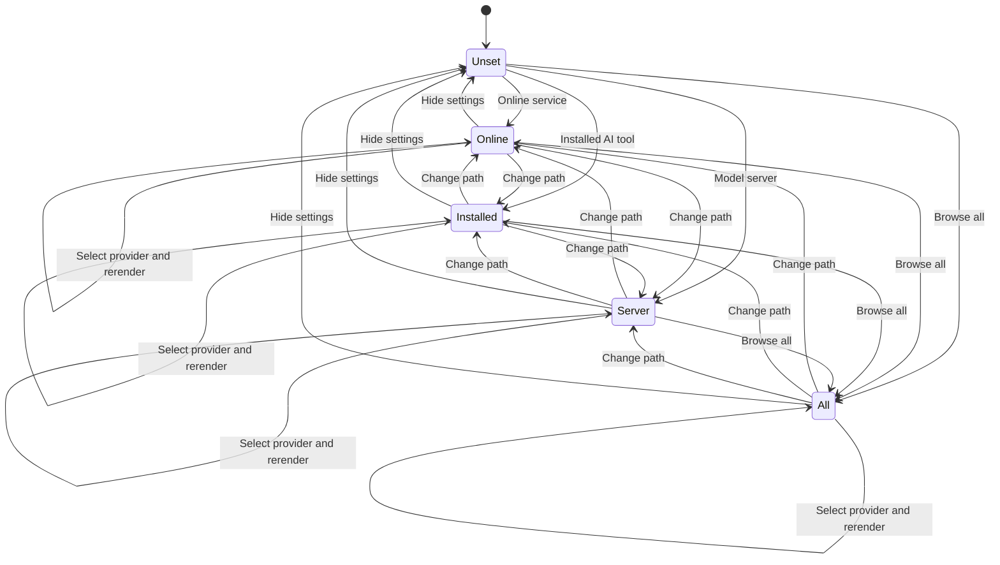
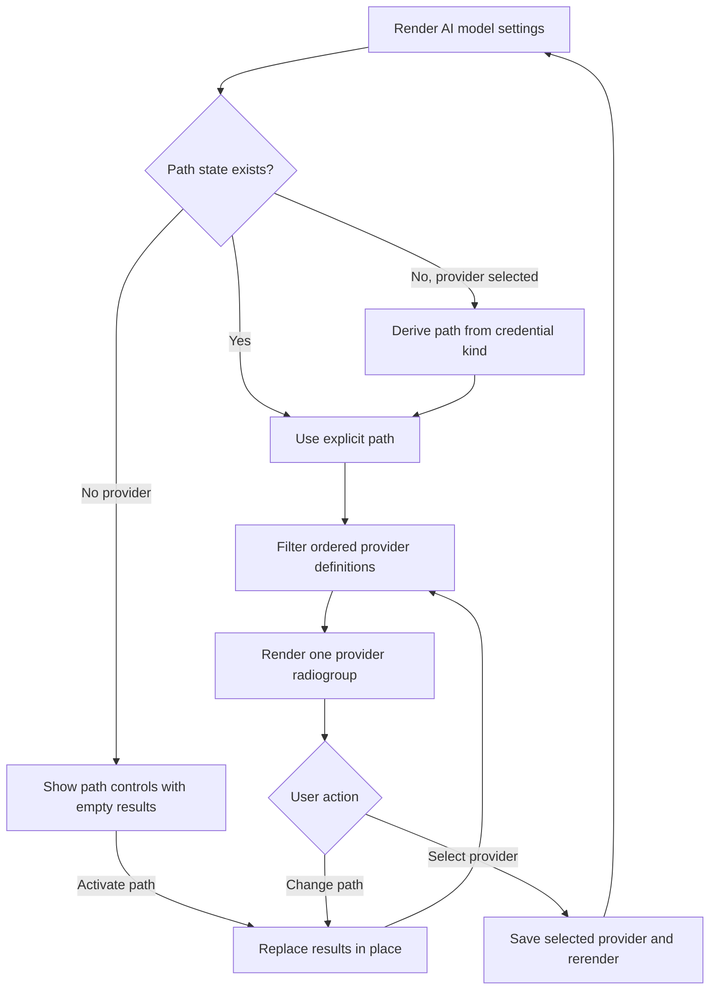

# Guided Connection Paths - Plan

## Goal Capsule

- **Objective:** New FirstRecall users can identify a feasible AI connection method without scanning 15 equivalent provider brands, while every provider and the existing setup workflow remain available.
- **Means:** Add three plain-language connection-path controls and a Browse all control that filter the existing provider definitions by credential contract (KTD1).
- **Authority:** Product Contract requirements govern user behavior. Key Technical Decisions govern implementation. Implementation Units must cite both.
- **Execution profile:** One bounded settings-UI feature with automated behavior, accessibility, CSS, and regression verification.
- **Stop conditions:** Stop if the implementation makes any provider unreachable, persists path state, changes persisted provider configuration outside the existing provider-selection save behavior, loses unsaved setup input during path browsing, or weakens the existing provider radiogroup semantics.
- **Tail ownership:** The LFG caller owns commit, push, PR update, and CI follow-through after implementation and review.

---

## Product Contract

### Summary

Replace the flat provider wall with three equal-weight connection paths: Online service, Installed AI tool, and Model server.
Each path reveals its complete provider subset, while Browse all providers reveals the full stable catalog.

### Problem Frame

The AI model settings currently show 15 visually equivalent providers before users learn what each option requires.
New AI users may recognize a product name but not know whether FirstRecall needs a separate API key, an installed command, or a running model server.

### Key Decisions

- **Use guided connection paths.** (session-settled: user-approved — chosen over the flat 15-provider grid: the equivalent brand wall overwhelms new AI users.) Governs R1-R3.
- **Use equal-weight plain-language paths plus Browse all.** (session-settled: user-approved — chosen over fixed Cloud / CLI / Local sections: technical labels and fixed ordering can imply expertise or recommendation.) Governs R1-R3, R8.
- **Keep every provider reachable without a default vendor.** (session-settled: user-approved — chosen over a recommended-provider subset: provider preferences and prerequisites differ by user.) Governs R2-R4.

### Requirements

**Connection-path catalog**

- R1. The clean-install provider chooser presents three equally weighted native controls with exact label and description pairs: **Online service** — “Connect with a provider API key.”; **Installed AI tool** — “Use Codex CLI or Claude CLI already installed and signed in.”; and **Model server** — “Connect to a running Ollama or LM Studio server.” The existing storage notice uses path-neutral copy: “When a provider requires an API key, FirstRecall stores it securely in Obsidian's Secret Storage.”
- R2. Each path reveals every matching provider in the stable order returned by the existing provider metadata.
- R3. A separate Browse all providers control reveals all supported providers in the same stable order.
- R4. Revealing or changing a path must not select a provider, persist settings, or recommend a vendor.

**Selection and setup continuity**

- R5. When a provider is already selected, opening AI model settings initially reveals that provider's matching path and checked provider radio.
- R6. Changing the visible path preserves the selected provider, setup panel and its existing provider-name heading, performance controls, focus on the activating path control, and unsaved setup input. The named setup panel remains visually separate from the browsed provider results so the active connection stays clear when its radio is filtered out.
- R7. Selecting a visible provider retains the current save-and-rerender behavior and preserves the user's explicit path choice through that rerender.

**Accessibility and responsive behavior**

- R8. Every path control exposes expanded state and controls one shared provider-results region; exactly one path or Browse all is expanded after activation.
- R9. The page renders at most one visible provider radiogroup and preserves each provider's checked state, accessible label, icon semantics, and activation behavior.
- R10. The path controls and provider choices use three columns on wide settings pages, two columns at the existing tablet breakpoint, and one column at the existing narrow breakpoint.

**Regression boundaries**

- R11. Existing credential, model, connection-test, performance, and provider-specific API-key-help behavior remain unchanged after provider selection.
- R12. The implementation branch includes the selected ideation artifact at `docs/ideation/2026-08-24-provider-configuration-ideation.html` for product-decision traceability.

### Acceptance Examples

- AE1. **Clean install.** Covers R1, R3, R4, R8, R9. Given no selected provider, when the user opens AI model settings, then three collapsed path controls and Browse all are visible, no provider radio or setup panel is present, and settings remain unchanged.
- AE2. **Online service path.** Covers R2, R4, R8, R9. Given the clean-install chooser, when the user activates Online service, then the shared results region contains the 11 API-key providers in metadata order and no provider is selected.
- AE3. **Returning user.** Covers R5, R11. Given a selected provider from any credential contract, when the user opens AI model settings, then its matching path is expanded, its provider radio is checked, and its existing setup and performance UI are visible.
- AE4. **Browse without disrupting setup.** Covers R6, R8. Given a selected cloud provider with unsaved text in its API-key input, when the user activates another path, then focus remains on that control and the selected provider panel and unsaved text remain intact.
- AE5. **Select from Browse all.** Covers R3, R7, R11. Given Browse all is expanded, when the user selects a provider, then FirstRecall saves that provider once, rerenders the matching setup panel, and keeps Browse all expanded.

### Scope Boundaries

#### Deferred to Follow-Up Work

- Provider prerequisite passports and billing/privacy comparison labels.
- Configured-connections management and separate Use now switching.
- Separating provider configuration from activation.
- Provider-aware setup checklists and automatic model handoff.
- Automatic endpoint or command availability detection.
- Full arrow-key radio navigation for provider cards.

---

## Planning Contract

### Key Technical Decisions

- KTD1. **Derive connection paths from `credentialKind`.** Filter `byokProviderDefinitions()` by `api-key`, `command`, or `url` so the existing exhaustive metadata remains the only classification source. (session-settled: user-approved — chosen over a second route/category field and fixed Cloud / CLI / Local sections: duplicated classification can drift, while technical section labels do not serve novice comprehension.) Implements R1-R3.
- KTD2. **Keep the active path as ephemeral settings-tab state.** Initialize it from the selected provider only while unset, preserve explicit path choices through `display()` calls, and clear it in `hide()`. Do not add persisted settings. Implements R4-R7.
- KTD3. **Refresh one shared results region in place.** Path activation updates control state and repopulates only the provider-results element. It must not call the full settings `display()` path. Implements R6, R8, R9.
- KTD4. **Use native path buttons and preserve the existing provider radiogroup.** Path controls change catalog visibility, not provider selection. The provider cards retain their current radio roles and selection behavior. Implements R4, R8, R9.

### Assumptions

- A selected provider's setup and performance UI remain visible when the user browses a different path, even if no visible provider radio is checked.
- Activating the already-expanded path is idempotent and does not collapse the provider catalog.
- Browse all providers is visually separate from the three equal-weight path cards but participates in the same mutually exclusive expanded state.
- Existing Tab and Enter/Space provider-card behavior remains in scope; new arrow-key handling is deferred.

### High-Level Technical Design

The path state controls only catalog visibility.
Provider selection remains the persisted state that controls generation and the setup panel.

The render path derives an initial path only when no explicit path exists.
All later path changes replace one catalog instance.

### Risks & Dependencies

- **Unsaved input loss:** A full settings rerender during path activation would discard the pending API-key value. KTD3 prevents this and AE4 verifies it.
- **Misleading path copy:** Installed AI tools may use online services, and editable model-server URLs are not guaranteed to be on-device. Path descriptions must state prerequisites without promising privacy or offline behavior.
- **State ambiguity:** The visible filter can differ from the active provider. Tests must distinguish path expanded state from provider checked state.
- **Icon duplication:** Rendering hidden copies of every provider group would duplicate SVG catalogs and gradient IDs. KTD3 requires one rendered results region.
- **Dependency:** Provider grouping relies on the exhaustive `credentialKind` union in `src/byok-provider-metadata.ts` and the stable order of `byokProviderDefinitions()`.

---

## Implementation Units

### U1. Add guided path state and accessible provider filtering

- **Goal:** Replace the immediate flat catalog with accessible, non-persisted connection paths while preserving provider selection and setup behavior.
- **Requirements:** R1-R9, R11; covers AE1-AE5.
- **Dependencies:** None.
- **Files:**
  - `src/settings.ts`
  - `tests/settings.test.ts`
- **Approach:**
  1. Add settings-tab path state with the initialization and reset behavior owned by KTD2.
  2. Render the three path controls and Browse all around one shared results region per KTD3 and KTD4. Use the exact prerequisite descriptions and path-neutral storage notice from R1 without promising privacy or offline behavior.
  3. Filter the ordered provider definitions per KTD1 and reuse the current provider-card renderer and selection path.
  4. Update existing setup-link and icon tests to reveal the required catalog before selecting or counting providers.
- **Execution note:** Start with failing settings tests for the clean-install, path-filter, returning-provider, and unsaved-input continuity cases.
- **Patterns to follow:** `renderProviderPicker()`, `selectProvider()`, `renderProviderIcon()`, `firstRecallSelectedProvider()`, and existing Obsidian DOM helpers in `src/settings.ts`.
- **Test scenarios:**
  1. Covers AE1. A clean install renders the exact three path label/description pairs and path-neutral storage notice from R1, plus Browse all with collapsed ARIA state, zero provider radios, no selected provider, and no setup panel.
  2. Covers AE2. Each path renders the exact provider IDs and order for `api-key`, `command`, and `url`; Browse all renders all 15 in metadata order.
  3. Revealing any path performs no settings save and changes no selected provider.
  4. Covers AE3. One representative selected provider from each credential kind initializes the correct expanded path, checked radio, setup panel, and performance section.
  5. Covers AE4. Changing paths preserves the activating button's focus, the selected provider, the setup DOM and provider-name heading, a typed but unsaved API-key value, and the existing performance section with its current control state, including when the visible path excludes the selected provider.
  6. Reactivating the current path is idempotent and leaves one visible provider radiogroup.
  7. Covers AE5. Selecting a provider from a path and from Browse all saves once, rerenders the matching setup panel, and preserves the explicit path.
  8. Every path control references the same existing results-region ID; exactly one path or Browse all is expanded after activation.
  9. Existing provider icon, gradient-ID, credential, model, connection-test, API-key-help, and performance assertions remain valid through the new entry path.
- **Verification:** The settings tests prove every path, state transition, ARIA relationship, selection handoff, and preserved setup seam without changing persisted settings types.

### U2. Style equal-weight paths and preserve responsive layout

- **Goal:** Make the three connection paths visually equal and responsive while keeping Browse all secondary and provider cards unchanged.
- **Requirements:** R1, R3, R10-R12.
- **Dependencies:** U1.
- **Files:**
  - `styles.css`
  - `tests/settings-css.test.ts`
  - `docs/ideation/2026-08-24-provider-configuration-ideation.html`
  - `docs/plans/2026-08-24-1328-feat-guided-connection-paths-plan.md`
- **Approach:**
  1. Add a dedicated three-column path grid and path-card states using existing Obsidian theme tokens.
  2. Keep Browse all outside the equal-weight card grid and preserve current provider-grid rules.
  3. Extend the existing 700px and 420px media queries so both grids collapse to two and one columns.
  4. Include the ideation and plan artifacts in the implementation branch.
- **Patterns to follow:** Existing provider-card border, focus-visible, theme-token, and responsive-grid rules in `styles.css`.
- **Test scenarios:**
  1. The path grid declares three equal columns and uses no recommended/default visual treatment.
  2. The path grid changes to two columns at 700px and one column at 420px.
  3. Provider cards keep their existing three/two/one-column responsive behavior.
  4. Active and focus-visible path states use theme tokens and remain distinct without altering provider selected-state rules.
- **Verification:** CSS tests pin the equal desktop columns, responsive breakpoints, and separation between path and provider grids; repository artifacts are present in the diff.

---

## Verification Contract

| Gate | Command or check | Proves |
|---|---|---|
| Focused behavior | `npm test -- --run tests/settings.test.ts tests/settings-css.test.ts tests/byok-provider-metadata.test.ts` | Path behavior, existing metadata classification, responsive CSS, API-key links, and provider regressions. |
| Full repository | `bun run check` | Lint, build, type checking, and the complete test suite. |
| Diff hygiene | `git diff --check` | No whitespace or patch-format defects. |
| Manual Obsidian handoff check | Open AI model settings in wide and narrow layouts; exercise each path, Browse all, provider selection, and setup entry. This is non-blocking when the execution host cannot run Obsidian. | Real theme rendering, focus behavior, responsive layout, and setup continuity outside JSDOM; otherwise produces explicit handoff instructions. |
| Browser-pipeline check | Run the repository's applicable browser-test skill and record any host limitation. | Confirms whether an affected browser surface exists and captures any testability gap. |

---

## Definition of Done

- U1 is complete when all connection paths and Browse all expose the correct providers, preserve catalog and setup state, and pass focused settings tests.
- U2 is complete when path cards are equal-weight and responsive, CSS tests pass, and both planning artifacts are included.
- Every provider remains reachable in stable metadata order.
- Revealing a path never saves settings or selects a provider.
- Existing provider setup, API-key help, model, test, and performance behavior passes regression coverage.
- `bun run check` and `git diff --check` pass.
- Automated gates are required for completion. Real Obsidian evidence is recorded when the host supports it; otherwise the handoff includes the manual check and documents the limitation. The browser-pipeline result records applicability but does not substitute for the Obsidian check.
- The final diff contains no abandoned experiments, duplicate provider classification, hidden provider catalogs, or unrelated cleanup.
